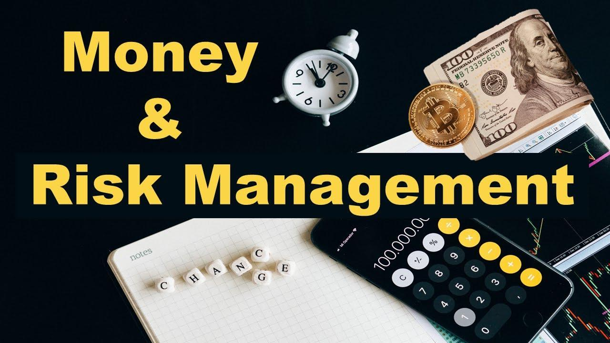

## Table of Contents

## What is money management and why is it important for beginners?

Money management is about how you handle your money. It includes making a budget, saving money, spending money wisely, and investing. Good money management helps you make sure you have enough money for the things you need and want, now and in the future. It's like taking care of your money so it can take care of you.

For beginners, money management is very important because it helps you learn good habits early. If you start managing your money well from the beginning, you can avoid problems like debt and not having enough money when you need it. It also helps you feel more in control and less worried about money. By learning to manage your money, you set yourself up for a more secure and happy life.

## How can beginners start practicing basic risk management with their finances?

Beginners can start practicing basic risk management with their finances by first understanding what risks they might face. This could be things like losing a job, unexpected expenses like medical bills, or even making bad investments. Once they know what risks they might face, they can start planning how to handle these risks. One simple way is to build an emergency fund. This is money set aside that can be used if something unexpected happens. Having even a small amount of money saved up can make a big difference when you need it.

Another way to manage risk is to be careful with investments. Beginners should start with safe investments like a savings account or a certificate of deposit (CD). These don't offer big returns, but they are very safe. As you learn more, you can slowly start to invest in things that might offer more reward but also come with more risk, like stocks or mutual funds. It's also important to spread out your investments, which is called diversification. This means not putting all your money in one place, so if one investment does badly, you won't lose everything.

By taking these steps, beginners can start to protect themselves from financial risks. It's all about being prepared and making smart choices with your money. As you get more comfortable and knowledgeable, you can adjust your risk management strategies to fit your needs and goals better.

## What are the common financial risks that individuals face, and how can they be mitigated?

Common financial risks that individuals face include losing a job, having unexpected expenses like medical bills, and losing money on investments. Losing a job can be a big problem because it means you stop getting a regular paycheck, which can make it hard to pay for things you need. Unexpected expenses, like a car breaking down or a health issue, can also be a big problem because they can cost a lot of money and come out of nowhere. Finally, if you invest money, there's always a chance you could lose some or all of it, especially if you put it all in one place or in something very risky.

To mitigate these risks, having an emergency fund is a good idea. This is money you save up and keep aside for unexpected problems. Even a small emergency fund can help you cover costs if you lose your job or have a surprise expense. For investments, it's smart to start with safe options like a savings account or a certificate of deposit (CD). As you learn more, you can slowly invest in other things, but always spread out your money across different investments. This is called diversification, and it helps because if one investment loses money, you won't lose everything. By taking these steps, you can better handle the common financial risks you might face.

## How does diversification help in managing financial risk?

Diversification helps in managing financial risk by spreading your money across different types of investments. Instead of putting all your money into one thing, like one company's stock, you spread it out. This way, if one investment loses money, you won't lose everything because your other investments might still be doing well. It's like not putting all your eggs in one basket. If you drop the basket, you won't lose all your eggs.

For example, if you invest in stocks, bonds, and real estate, and the stock market goes down, your bonds and real estate might still be okay. This can help balance out your losses. Diversification doesn't guarantee you won't lose money, but it can make it less likely that you'll lose a lot all at once. By spreading your investments, you give yourself a better chance of having some money left even if one part of your investments does badly.

## What are the principles of effective money management for intermediate investors?

For intermediate investors, effective money management involves balancing risk and reward while keeping a clear focus on their financial goals. This means understanding that investments can go up and down, and being okay with some risk if it means the chance of [earning](/wiki/earning-announcement) more money. Intermediate investors should keep learning about different types of investments, like stocks, bonds, and real estate, and how they work. They should also think about their own comfort with risk, called their risk tolerance, and make sure their investments match this. It's important to regularly check and adjust their investments to make sure they are still on track to meet their goals.

Another key part of money management for intermediate investors is to keep a diversified portfolio. This means spreading money across different types of investments to reduce risk. If one investment does badly, others might do well and balance it out. Intermediate investors should also think about taxes and how they affect their investments. They might want to use tax-advantaged accounts like IRAs or 401(k)s to save money on taxes. By keeping a balanced approach and staying informed, intermediate investors can manage their money effectively and work towards their financial goals.

## How can someone assess their risk tolerance and adjust their investment strategy accordingly?

To assess your risk tolerance, you need to think about how you feel about losing money and how much risk you're okay with. One way to do this is by asking yourself some questions. For example, how would you feel if your investments lost 20% of their value in a year? Would you be able to sleep at night, or would you be too worried? Another question is, how long do you plan to keep your money invested? If you need the money soon, you might not want to take big risks. You can also take online quizzes that help figure out your risk tolerance. These quizzes ask you about your age, how much money you have, and how you feel about risk.

Once you know your risk tolerance, you can adjust your investment strategy to match it. If you're okay with a lot of risk, you might put more money into stocks, which can go up and down a lot but can also make you more money over time. If you don't like risk, you might choose safer investments like bonds or savings accounts. It's also important to keep your investments spread out, which is called diversification. This means not putting all your money in one place, so if one investment does badly, you won't lose everything. As you get older or your life changes, your risk tolerance might change too, so it's good to check it every now and then and adjust your investments if you need to.

## What advanced strategies exist for managing investment portfolios to minimize risk?

Advanced strategies for managing investment portfolios to minimize risk include using asset allocation and rebalancing. Asset allocation means deciding how much of your money to put into different types of investments, like stocks, bonds, and real estate. The idea is to spread your money out so that if one type of investment does badly, the others might do well and balance it out. Rebalancing is when you check your investments every so often and adjust them to make sure they still match your plan. If one type of investment has grown a lot, you might sell some of it and buy more of another type to keep your portfolio balanced.

Another strategy is using hedging, which is like buying insurance for your investments. Hedging means you make an investment that will go up if your main investment goes down. For example, you might buy options or futures that will make money if the stock market goes down. This can help protect your portfolio from big losses. Also, using stop-loss orders can help manage risk. A stop-loss order is a way to tell your broker to sell an investment if it drops to a certain price, so you don't lose too much money. By using these strategies, you can better manage the risks in your investment portfolio and protect your money.

## How do financial derivatives like options and futures play a role in risk management?

Financial derivatives like options and futures can be used to manage risk by acting as a kind of insurance for your investments. An option gives you the right, but not the obligation, to buy or sell an asset at a set price before a certain date. If you own a stock and you're worried it might go down in value, you can buy a put option. This option lets you sell the stock at the set price even if the market price drops lower. This way, you limit how much you could lose. Futures, on the other hand, are agreements to buy or sell an asset at a set price on a future date. If you're worried about the price of something you need going up, you can use a futures contract to lock in a price now, so you know what you'll pay later.

Using options and futures can help you manage risk, but they can be complicated and have their own risks. It's important to understand how they work before you use them. If you're not careful, you could end up losing money on the derivatives themselves. But if you use them the right way, they can protect your investments from big losses. For example, if you have a lot of money in stocks, you might use options to protect against a market crash. Or if you're a farmer, you might use futures to make sure you get a good price for your crops, no matter what happens to the market. By using these tools wisely, you can feel more secure about your financial future.

## What are the latest trends in algorithmic risk management and how can they benefit expert investors?

The latest trends in algorithmic risk management involve using computers and math to make better investment choices. One big trend is [machine learning](/wiki/machine-learning), which is when computers learn from data to make predictions about the future. This can help expert investors by figuring out patterns in the market that people might miss. Another trend is using big data, which means looking at a lot of information from different places to understand risks better. By using these tools, expert investors can make smarter decisions about where to put their money and how to protect it from losing value.

These trends can really help expert investors in a few ways. First, they can use algorithms to watch the market all the time and react quickly to changes, which is hard for people to do. This means they can buy or sell investments at the best times to make more money or avoid losing money. Second, these tools can help them see risks that are hard to notice, like small changes in the market that could lead to big problems later. By understanding these risks better, expert investors can adjust their plans to keep their money safe. Overall, algorithmic risk management gives expert investors powerful tools to manage their portfolios better and make more informed decisions.

## How can experts use leverage responsibly to enhance their money management strategies?

Leverage means borrowing money to invest more than you have. Experts can use leverage responsibly by understanding how it works and being careful with it. They should only use leverage when they know the risks and have a plan for how to pay back the money they borrow. For example, if an expert wants to buy more stocks than they can afford with their own money, they might borrow money to do it. But they need to be sure they can pay back the loan even if the stocks go down in value. This means having a safety net, like extra savings or other investments, to cover the loan if things go wrong.

Using leverage can help experts make more money if their investments do well, but it can also make them lose more if things go badly. So, it's important for experts to use leverage in a way that fits their overall money management plan. They should spread out their investments, so they're not putting all their borrowed money into one thing. And they should always keep an eye on their investments and be ready to change their plans if the market changes. By using leverage carefully and thoughtfully, experts can try to grow their money while still keeping risks under control.

## What are the ethical considerations in risk management that experts should be aware of?

Experts in risk management need to think about ethics, which means doing the right thing. One big ethical issue is being honest and clear with clients. If experts are managing money for other people, they should tell them about all the risks and not hide anything. They should also make sure they are not taking too much risk just to make more money for themselves. It's important to put the client's needs first and not do anything that could hurt them, even if it might help the expert make more money.

Another ethical consideration is fairness. Experts should treat everyone the same and not favor some clients over others. They should also think about how their actions might affect the whole market or society. For example, if they use a lot of leverage and it goes wrong, it could cause big problems for everyone. So, they need to be careful and think about the bigger picture. By keeping these ethical issues in mind, experts can manage risk in a way that is fair and good for everyone.

## How can seasoned investors predict and prepare for systemic financial risks?

Seasoned investors can predict and prepare for systemic financial risks by paying close attention to the big picture of the economy. They look at things like interest rates, how much debt people and governments have, and how well the economy is doing overall. They also keep an eye on what other big investors are doing and listen to what experts are saying about the future. By understanding these big trends, seasoned investors can guess when a big problem might be coming. They might see signs like banks being too risky or the housing market getting too expensive, which could lead to a crash.

To prepare for these risks, seasoned investors make sure their investments are spread out, so they're not all in one place. This is called diversification, and it helps because if one part of the market crashes, they won't lose everything. They also keep some money in safe places, like savings accounts or bonds, so they have cash to use if things get bad. Another thing they do is plan for different situations. They think about what they would do if the market goes down a lot and have a plan ready. By being ready and flexible, seasoned investors can protect their money even when big problems hit the whole financial system.

## References & Further Reading

[1]: Bergstra, J., Bardenet, R., Bengio, Y., & Kégl, B. (2011). ["Algorithms for Hyper-Parameter Optimization."](https://papers.nips.cc/paper/4443-algorithms-for-hyper-parameter-optimization) Advances in Neural Information Processing Systems 24.

[2]: ["Advances in Financial Machine Learning"](https://www.amazon.com/Advances-Financial-Machine-Learning-Marcos/dp/1119482089) by Marcos Lopez de Prado

[3]: ["Evidence-Based Technical Analysis: Applying the Scientific Method and Statistical Inference to Trading Signals"](https://www.amazon.com/Evidence-Based-Technical-Analysis-Scientific-Statistical/dp/0470008741) by David Aronson

[4]: ["Machine Learning for Algorithmic Trading"](https://github.com/PacktPublishing/Machine-Learning-for-Algorithmic-Trading-Second-Edition) by Stefan Jansen

[5]: ["Quantitative Trading: How to Build Your Own Algorithmic Trading Business"](https://books.google.com/books/about/Quantitative_Trading.html?id=j70yEAAAQBAJ) by Ernest P. Chan