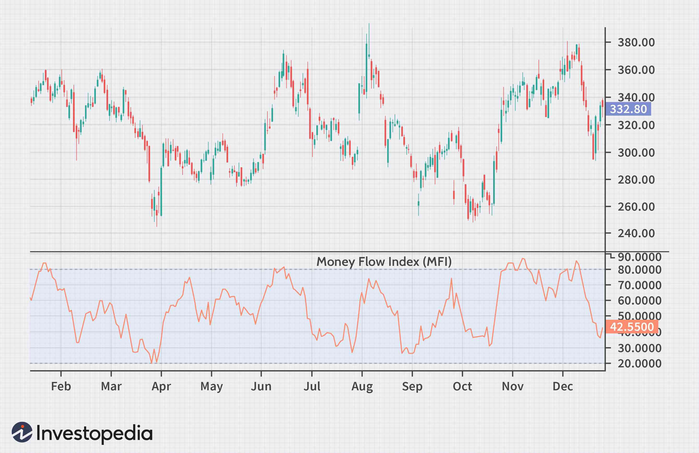

The Money Flow Index (MFI) serves as a crucial technical indicator in financial markets, helping traders and analysts assess buying and selling pressures with enhanced accuracy. Unlike other momentum indicators that primarily focus on price, the MFI uniquely incorporates both price and volume data, offering a more holistic view of market dynamics. This dual consideration allows the MFI to provide insights into the intensity of trade activities, which can often foreshadow critical market shifts.

This article examines the MFI's value in algorithmic trading, emphasizing its distinct applications and advantages as a financial indicator. In algorithmic trading, the precision of indicators is paramount. By accounting for volume alongside price, the MFI equips traders with more nuanced insights, which can significantly enhance trading strategies. 



The discussion will include the fundamental aspects of the MFI: its definitions, the methodologies involved in its computation, and the interpretations of its signals. The role of the MFI in automated trading systems will also be explored. Its ability to detect overbought or oversold conditions, alongside divergences with price movements, makes it an essential tool for algorithmic traders aiming to optimize entry and exit points in the market.

Understanding the nuances of the MFI also involves comparing it to related indicators. Such comparisons are critical for traders determining their optimal strategy, particularly in systems that integrate multiple technical indicators. The potential for incorporating the MFI into complex trading algorithms will be highlighted, showcasing how its integration can bolster the responsiveness of trading systems to market developments.

In summary, the MFI stands out as a versatile and informative tool that, through its incorporation of volume data, offers traders an enhanced perspective on market behavior, thereby aiding in making more informed trading decisions.

## Table of Contents

## What is the Money Flow Index (MFI)?

The Money Flow Index (MFI) is a technical analysis tool designed to provide insights into buying and selling pressures in financial markets. This volume-weighted oscillator resembles the Relative Strength Index (RSI) and operates within a range from 0 to 100. Unlike the RSI, the MFI integrates both price and volume data, making it a potentially more robust indicator for analyzing market dynamics.

Developed in the early 1980s by Gene Quong and Avrum Soudack, the MFI is widely utilized in both short-term swing trading and long-term investment strategies. The indicator helps traders identify potential overbought or oversold conditions, with MFI values above 80 typically signaling overbought market conditions, and values below 20 indicating oversold conditions. However, it is important to note that these threshold values can vary depending on market conditions and individual trading strategies.

One of the key features of the MFI is its ability to detect divergences between the indicator and price movements. Divergence occurs when the direction of the MFI contradicts the price trend – for example, when prices reach new highs, but the MFI forms lower highs. Such divergences can serve as potential indicators of forthcoming market reversals, enabling traders to adjust their positions accordingly.

The MFI can be an invaluable tool in the trader's toolkit, offering insights into market pressures and potential turning points. Integrating the MFI into one's trading strategy may enhance decision-making by providing a more comprehensive view of market conditions. Nevertheless, it is commonly used in conjunction with other technical analysis tools to increase the reliability of trading signals.

## Calculating the Money Flow Index

The Money Flow Index (MFI) is computed using a systematic approach that involves several key steps. First, the Typical Price (TP) is determined, which serves as a foundational element of the MFI calculation. The Typical Price is calculated as the average of the high, low, and close prices for the given period:

$$
TP = \frac{\text{High} + \text{Low} + \text{Close}}{3}
$$

Once the Typical Price is established, Raw Money Flow (RMF) is calculated by multiplying the Typical Price by the corresponding period’s [volume](/wiki/volume-trading-strategy):

$$
RMF = TP \times \text{Volume}
$$

The next step involves categorizing the money flow into Positive Money Flow (PMF) and Negative Money Flow (NMF). This differentiation is based on comparing each period’s Typical Price with the previous period’s Typical Price. If the Typical Price is higher than the previous period, the RMF is classified as Positive Money Flow. Conversely, if the Typical Price is lower, the RMF is considered Negative Money Flow.

To compute the Money Flow Index, the Money Flow Ratio (MFR) is calculated by summing Positive and Negative Money Flows over a specified period, usually 14 days:

$$
MFR = \frac{\text{Sum of Positive Money Flow over } n \text{ periods}}{\text{Sum of Negative Money Flow over } n \text{ periods}}
$$

Finally, the Money Flow Index is derived from the Money Flow Ratio using the formula:

$$
MFI = 100 - \frac{100}{1 + MFR}
$$

These computations are typically integrated into trading software and platforms, allowing traders to automate the process and quickly evaluate market conditions based on the MFI. Using programming languages like Python, this process can be scripted for more efficient calculations, facilitating the rapid analysis needed in [algorithmic trading](/wiki/algorithmic-trading) environments. Here’s an example of how the MFI could be implemented in Python:

```python
def calculate_mfi(high, low, close, volume, period=14):
    typical_price = (high + low + close) / 3
    raw_money_flow = typical_price * volume

    positive_flow = 0
    negative_flow = 0

    for i in range(1, len(typical_price)):
        if typical_price[i] > typical_price[i - 1]:  
            positive_flow += raw_money_flow[i]
        else: 
            negative_flow += raw_money_flow[i]

    money_flow_ratio = positive_flow / negative_flow
    mfi = 100 - (100 / (1 + money_flow_ratio))
    return mfi
```

This automated process aids traders by seamlessly integrating MFI calculations into their trading systems, allowing for timely analysis and decision-making.

## Interpreting the Money Flow Index

The Money Flow Index (MFI) offers valuable insights into market conditions through its assessment of buying and selling pressures. A high MFI, typically above 80, indicates strong buying pressure or an overbought market, which can signal potential trend reversals to the downside. This suggests that the price may have temporarily peaked, and traders should be cautious of a possible decline. Conversely, a low MFI, typically below 20, implies strong selling pressure or an oversold market. This situation could signal a potential upside trend reversal, suggesting that the price might rebound.

A critical aspect of interpreting the MFI is identifying divergences between the indicator and the actual price movement. For instance, when the price makes higher highs, but the MFI records lower highs, it may serve as an early warning sign of an impending market reversal. This divergence indicates that although prices are rising, the underlying buying pressure is weakening, potentially leading to a price downturn.

Traders can use MFI signals to strategically time their entry and [exit](/wiki/exit-strategy) points in the market. By recognizing overbought or oversold conditions and potential divergences, traders can optimize their strategies to maximize potential profits. The MFI's ability to incorporate volume data provides a more nuanced perspective than price-only indicators, enabling traders to make more informed decisions.

## MFI in Algorithmic Trading

In algorithmic trading, the Money Flow Index (MFI) serves as a critical component for developing sophisticated automated trading strategies. Its integration of volume with price data offers traders a dual perspective that enhances the overall analysis of market conditions. This dual perspective allows algorithms to detect potential market shifts more effectively than price-based indicators alone.

The MFI provides volume-based insights that reveal the intensity of buying and selling pressures, offering additional context that is crucial for formulating robust trading strategies. These insights are particularly valuable in algorithmic trading, where responsiveness to subtle market dynamics can significantly influence the success of a trading strategy.

One way to utilize the MFI in algorithmic trading is by integrating it into algorithmic models alongside other technical indicators. By doing so, traders can leverage the strengths of multiple indicators to improve prediction accuracy. For instance, combining the MFI with trend-following indicators like moving averages can help in confirming trade signals, thereby reducing the risk of false signals.

To automate the use of the MFI, traders can incorporate it into their trading algorithms using programming languages such as Python. An example of a simple implementation is using the `pandas` and `numpy` libraries to calculate the MFI and incorporate it into trading decisions. Here is a basic Python script outline for calculating the MFI:

```python
import pandas as pd
import numpy as np

def calculate_typical_price(data):
    return (data['High'] + data['Low'] + data['Close']) / 3

def calculate_money_flow_index(data, period=14):
    typical_price = calculate_typical_price(data)
    money_flow = typical_price * data['Volume']
    positive_flow = np.where(typical_price > typical_price.shift(1), money_flow, 0)
    negative_flow = np.where(typical_price < typical_price.shift(1), money_flow, 0)

    positive_mf_sum = positive_flow.rolling(window=period).sum()
    negative_mf_sum = negative_flow.rolling(window=period).sum()

    money_flow_ratio = positive_mf_sum / negative_mf_sum
    mfi = 100 - (100 / (1 + money_flow_ratio))

    return mfi

# Example of usage
data = pd.DataFrame({
    'High': [values],
    'Low': [values],
    'Close': [values],
    'Volume': [values]
})
data['MFI'] = calculate_money_flow_index(data)
```

In summary, the MFI's volume-inclusive approach provides a more comprehensive understanding of market activities when used in algorithmic trading. By coupling the MFI with other indicators, traders can enhance the accuracy and responsiveness of their automated trading strategies, ultimately leading to more informed and potentially profitable trading decisions.

## Comparing MFI with RSI

The Money Flow Index (MFI) and Relative Strength Index (RSI) are both [momentum](/wiki/momentum) oscillators used to assess the strength and direction of price movements in financial markets. However, they have fundamental differences which can affect their utility and application in trading strategies.

A primary distinction between the two indicators is the inclusion of volume data in the MFI. The formula for MFI integrates price information with volume, thereby providing a volume-weighted measure of momentum. Conversely, RSI is solely based on price movements, measuring the magnitude of recent price changes to evaluate overbought or oversold conditions.

The calculation of RSI is straightforward, determined by the formula:

$$
\text{RSI} = 100 - \left( \frac{100}{1 + RS} \right)
$$

where RS (Relative Strength) is the average of 'n' days' up closes divided by the average of 'n' days' down closes. This computation focuses only on price, potentially overlooking the market's trading volume, a limitation addressed by the MFI.

The formula for MFI includes the Typical Price and Money Flow:

$$
\text{Typical Price} = \frac{\text{High} + \text{Low} + \text{Close}}{3}
$$

$$
\text{Money Flow} = \text{Typical Price} \times \text{Volume}
$$

The MFI is then calculated in a manner similar to RSI, but accounting for the positive and negative money flows derived from volume data, which helps in assessing the intensity behind price movements.

Proponents of the MFI suggest it provides timelier signals because incorporating volume offers insight into the reliability of price movements. For instance, high trading volume can confirm a trend's strength, whereas low volume may suggest potential reversals or weakening trends.

Ultimately, understanding the differences between MFI and RSI is crucial for traders to determine which indicator aligns best with their trading strategies. MFI may be preferable in strategies where volume plays a critical role, offering a more nuanced view of market dynamics. On the other hand, RSI could be sufficient in scenarios where price movements alone are deemed adequate for decision-making. By analyzing the relationship between price and volume through the MFI, traders often gain additional insights they might miss using RSI alone.

## Limitations of the Money Flow Index

Despite its strengths, the Money Flow Index (MFI) is not without limitations, particularly in its susceptibility to generating false signals in volatile markets. The inherent challenge lies in the indicator's sensitivity to rapid price changes and volume spikes, which can often lead to misleading buying or selling signals. In such environments, traders might experience instances where the MFI suggests either overbought or oversold conditions, yet the market continues to move contrary to these signals.

Standalone use of the MFI is not recommended. It is best utilized alongside other technical analysis tools to provide corroborative signals that enhance decision-making accuracy. By employing a combination of indicators, traders can filter out noise and minimize the impact of potential false signals. For instance, pairing the MFI with indicators like the Relative Strength Index (RSI) or moving averages can offer a more validated perspective on market conditions.

Moreover, the MFI is not foolproof in predicting market reversals. Divergences between price movement and the MFI do not always translate into actual price changes. Price-MFI divergence might suggest a potential reversal, but such occurrences may not always result in the expected market behavior. Thus, relying solely on divergence as a trading signal might lead to suboptimal trading outcomes.

Therefore, implementing rigorous risk management and validation processes becomes crucial when using the MFI in trading strategies. Traders should consider using stop-loss orders and position-sizing strategies to manage their exposure effectively. Additionally, [backtesting](/wiki/backtesting) strategies that include the MFI with historical data can help identify the conditions under which the indicator performs optimally and when it might be prone to errors.

In summary, while the MFI is a valuable tool for incorporating volume into price analysis, its limitations necessitate a cautious approach. By combining it with other analytical methods and robust risk management techniques, traders can utilize the MFI more effectively while mitigating potential drawbacks.

## Conclusion

The Money Flow Index (MFI) emerges as a vital tool for traders looking to make well-informed decisions in financial markets. By encompassing both price and volume data, the MFI provides a comprehensive perspective on market dynamics that goes beyond price movements alone. This integration allows traders to gain better insights into the underlying forces of buying and selling pressures, thus offering a more holistic view of market activities.

However, despite its valuable contributions, the MFI should not be solely relied upon for trading decision-making. Its true efficacy is realized when used in conjunction with other technical analysis instruments. Leveraging the strengths of various indicators can help build a robust trading strategy and mitigate the likelihood of false signals. For instance, pairing MFI with momentum indicators such as the Relative Strength Index (RSI) or moving averages could enhance the reliability of the insights provided.

Continued learning and experimentation play a crucial role in refining the application of MFI and other indicators. As financial markets evolve and increase in complexity, traders who persistently engage with a diverse set of analytical tools and techniques stand a greater chance of achieving desired trading outcomes. Regularly revising and testing trading strategies using historical data can further aid in understanding how MFI interacts with market behaviors, enhancing its applicability in various trading scenarios. 

Therefore, the integration of MFI into a broader analytical framework, coupled with continuous education and strategy modification, can significantly boost the effectiveness of trading operations.

## References & Further Reading

[1]: ["Technical Analysis of the Financial Markets: A Comprehensive Guide to Trading Methods and Applications"](https://drive.google.com/file/d/1OcDrGakDhaejT7J7xGEE3HHKy7xmrafy/preview) by John J. Murphy

[2]: "Relative Strength Index: Divergence, Convergence, and Its Calculations" available on [Investopedia](https://www.investopedia.com/top-cds-today-dec-19-2024-rate-leaders-are-still-available-but-act-fast-8764707)

[3]: ["Algorithmic Trading: Winning Strategies and Their Rationale"](https://www.wiley.com/en-us/Algorithmic+Trading%3A+Winning+Strategies+and+Their+Rationale-p-9781118460146) by Ernest P. Chan

[4]: ["The New Trading for a Living: Psychology, Discipline, Trading Tools and Systems, Risk Control, Trade Management"](https://www.amazon.com/New-Trading-Living-Psychology-Discipline/dp/1118443926) by Dr. Alexander Elder

[5]: ["Encyclopedia of Chart Patterns"](https://www.amazon.com/Encyclopedia-Chart-Patterns-Wiley-Trading/dp/1119739683) by Thomas Bulkowski

[6]: Wong, W. K., & Kok, K. L. (2009). "Examining the Profitability of Technical Analysis in the Foreign Exchange Market." Applied Economics Letters, 16(9), 877-882. 

[7]: ["Quantitative Technical Analysis: An integrated approach to trading system development and trading management"](https://books.google.com/books/about/Quantitative_Technical_Analysis.html?id=LTJJngEACAAJ) by Howard B. Bandy