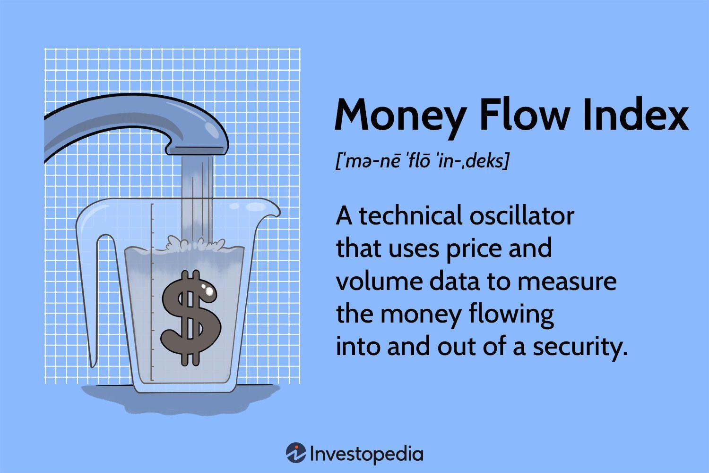

## Table of Contents

## What is the Money Flow Index (MFI) and what does it measure?

The Money Flow Index (MFI) is a technical indicator that traders and investors use to understand how money is moving in and out of a stock or other financial asset. It's kind of like a thermometer for the buying and selling pressure. The MFI is calculated using both the price and the volume of the asset, which makes it different from other indicators that might only look at price.

The MFI measures the strength of money flowing into and out of a security over a specific period, usually 14 days. It gives a number between 0 and 100. If the MFI is above 80, it might mean the asset is being overbought, which could suggest that a price drop is coming soon. If it's below 20, it might mean the asset is oversold, hinting that the price might go up soon. By watching the MFI, investors can make better guesses about when to buy or sell.

## How is the Money Flow Index calculated?

To calculate the Money Flow Index (MFI), you first need to find the typical price for each day. The typical price is the average of the high, low, and closing prices for that day. Next, you multiply this typical price by the volume traded on that day to get the raw money flow. If the typical price today is higher than yesterday's typical price, it's considered positive money flow. If it's lower, it's negative money flow.

After figuring out the positive and negative money flows over a set period, usually 14 days, you add up all the positive money flows to get the positive money flow sum and all the negative money flows for the negative money flow sum. Then, you use these sums to find the money ratio by dividing the positive money flow sum by the negative money flow sum. Finally, you plug the money ratio into a formula to get the MFI: MFI = 100 - (100 / (1 + Money Ratio)). This gives you a number between 0 and 100, which tells you about the buying and selling pressure on the asset.

## What is the significance of the MFI in technical analysis?

The Money Flow Index (MFI) is an important tool in technical analysis because it helps traders and investors see how money is moving in and out of a stock or other asset. It's like a special gauge that tells you if people are buying a lot (which means money is flowing in) or selling a lot (which means money is flowing out). By looking at the MFI, you can get a sense of whether the asset is getting too expensive (overbought) or too cheap (oversold). This can help you decide if it's a good time to buy or sell.

The MFI is especially useful because it takes into account both the price and the [volume](/wiki/volume-trading-strategy) of the asset. This makes it different from other indicators that might only look at price changes. When the MFI is over 80, it might mean the asset is overbought and could drop in price soon. When it's below 20, it might mean the asset is oversold and could go up in price. By watching these levels, traders can make smarter decisions about when to get in or out of the market.

## Can you explain the difference between MFI and other momentum indicators like the RSI?

The Money Flow Index (MFI) and the Relative Strength Index (RSI) are both used to see if a stock is being bought too much or sold too much, but they look at different things. The MFI uses both the price of the stock and how many shares are being traded to figure out if money is flowing into or out of the stock. This makes it a bit different because it takes into account how much people are actually buying or selling, not just if the price is going up or down.

On the other hand, the RSI only looks at the price changes of the stock over time. It doesn't care about the volume of trades. So, if a stock's price goes up a lot but not many shares are being traded, the RSI might still say the stock is being bought a lot, but the MFI might tell a different story because it sees that not much money is actually moving. This can be really helpful for traders who want to see the whole picture before deciding to buy or sell.

## What are the common threshold levels for MFI, and what do they indicate?

The Money Flow Index (MFI) uses special numbers to help traders know when to buy or sell. The most common threshold levels for the MFI are 20 and 80. If the MFI goes above 80, it means the stock might be overbought. This means a lot of people have been buying it, and it might be a good time to sell because the price could go down soon. On the other hand, if the MFI drops below 20, it means the stock might be oversold. This means a lot of people have been selling it, and it might be a good time to buy because the price could go up soon.

These threshold levels help traders make smart choices. For example, if the MFI is over 80, a trader might think about selling their stock to avoid losing money if the price drops. If the MFI is under 20, a trader might see it as a chance to buy the stock at a lower price and make money when the price goes back up. By watching these levels, traders can get a better idea of when to make their moves in the market.

## How can the MFI be used to identify potential buy and sell signals?

The Money Flow Index (MFI) can help traders find good times to buy or sell a stock by looking at special numbers called threshold levels. If the MFI goes above 80, it means the stock might be overbought. This is a sign that a lot of people have been buying the stock, and it might be a good time to sell because the price could go down soon. On the other hand, if the MFI drops below 20, it means the stock might be oversold. This is a sign that a lot of people have been selling the stock, and it might be a good time to buy because the price could go up soon.

Another way to use the MFI is to look for something called divergence. This happens when the MFI and the stock's price are moving in different directions. For example, if the stock's price is going up but the MFI is going down, it might mean the stock is getting weaker and could be a good time to sell. If the stock's price is going down but the MFI is going up, it might mean the stock is getting stronger and could be a good time to buy. By watching these signs, traders can make smarter choices about when to buy or sell their stocks.

## What is divergence in the context of MFI, and how can traders use it?

Divergence in the context of the Money Flow Index (MFI) happens when the MFI and the stock's price are not moving in the same direction. For example, if the stock's price is going up but the MFI is going down, this is called bearish divergence. It means the stock might be getting weaker even though the price is rising. On the other hand, if the stock's price is going down but the MFI is going up, this is called bullish divergence. It means the stock might be getting stronger even though the price is falling.

Traders can use divergence to make better decisions about buying and selling stocks. If they see a bearish divergence, where the stock's price is going up but the MFI is going down, they might decide to sell their stock because it could mean the price will soon drop. If they see a bullish divergence, where the stock's price is going down but the MFI is going up, they might decide to buy the stock because it could mean the price will soon go up. By watching for these signs, traders can try to buy low and sell high, which is the key to making money in the stock market.

## Can you describe a basic trading strategy using the MFI?

A basic trading strategy using the Money Flow Index (MFI) involves watching for when the MFI goes above 80 or below 20. If the MFI goes above 80, it means the stock might be overbought. This is a good time to think about selling the stock because the price could go down soon. On the other hand, if the MFI drops below 20, it means the stock might be oversold. This is a good time to think about buying the stock because the price could go up soon. By using these levels, traders can make decisions based on whether the stock is being bought too much or sold too much.

Another way to use the MFI in a trading strategy is to look for something called divergence. This happens when the MFI and the stock's price are moving in different directions. For example, if the stock's price is going up but the MFI is going down, it's called bearish divergence. This might be a sign to sell the stock because it could mean the price will drop soon. If the stock's price is going down but the MFI is going up, it's called bullish divergence. This might be a sign to buy the stock because it could mean the price will go up soon. By watching for these signs, traders can try to buy low and sell high, which is the key to making money in the stock market.

## What are the limitations and potential pitfalls of using the MFI as a standalone indicator?

Using the Money Flow Index (MFI) by itself can be tricky because it doesn't tell the whole story. The MFI looks at both the price and the volume of a stock, but it can still give false signals. For example, if a stock's price goes up a lot because of some news, the MFI might say the stock is overbought, but the price could keep going up for a while. Also, the MFI might not work well for stocks that don't have a lot of trading volume because the numbers can be more jumpy and hard to trust.

Another problem with using the MFI alone is that it can miss important things happening in the market. The MFI doesn't look at other important signs like what the overall market is doing or what other stocks in the same industry are doing. If you only use the MFI, you might miss out on these bigger trends. That's why it's usually a good idea to use the MFI along with other tools and indicators to get a better picture of what's going on with a stock.

## How can the MFI be combined with other technical indicators to improve trading decisions?

The Money Flow Index (MFI) can be a really helpful tool for traders, but it works even better when you use it with other technical indicators. One common way to do this is by using the MFI with the Relative Strength Index (RSI). The RSI looks at how fast the price of a stock is changing, but it doesn't look at the volume like the MFI does. By using both, you can get a better idea of whether a stock is being bought too much or sold too much. If both the MFI and the RSI are showing that a stock is overbought or oversold, it can give you more confidence in your trading decisions.

Another good way to use the MFI with other indicators is by looking at moving averages. Moving averages smooth out the price of a stock over time, and they can help you see the overall trend. If the MFI shows that a stock is oversold and the price is below a key moving average, it might be a good time to buy. On the other hand, if the MFI shows that a stock is overbought and the price is above a key moving average, it might be a good time to sell. By combining the MFI with moving averages, you can get a clearer picture of when to make your moves in the market.

## What advanced techniques can be applied to enhance the effectiveness of an MFI-based strategy?

One advanced technique to make an MFI-based strategy work better is to use something called "multiple time frame analysis." This means looking at the MFI over different periods of time, like daily, weekly, and monthly. If the MFI shows that a stock is oversold on the daily chart and also on the weekly chart, it might be a stronger sign to buy. This can help you see if the stock is really being sold too much or if it's just a short-term thing. By checking the MFI on different time frames, you can make more sure and confident trading choices.

Another way to improve an MFI-based strategy is to use something called "volume profile." Volume profile shows where a lot of trading is happening at different price levels. If the MFI says a stock is oversold and the volume profile shows that a lot of trading happened at the current price, it might mean the stock is at a strong support level. This can give you more confidence to buy the stock. By combining the MFI with volume profile, you can see not just if a stock is being sold too much, but also if it's at a price where a lot of people are interested in buying or selling.

## Can you provide case studies or examples where the MFI strategy was successfully implemented?

In one example, a trader named Sarah used the MFI to make a good decision about buying a stock. She noticed that the MFI for a tech company's stock had dropped below 20, which meant the stock was oversold. At the same time, she saw that the stock's price was near a key support level where a lot of trading had happened before. Sarah decided to buy the stock, and a few days later, the price started to go up as more people began buying it. By using the MFI along with other signs, Sarah was able to buy the stock at a low price and make a profit when the price went up.

Another example is when a group of traders used the MFI to spot a good time to sell a stock. They saw that the MFI for a popular consumer goods company had gone above 80, which meant the stock was overbought. The traders also noticed that the stock's price was above a key moving average, which made them think the price might go down soon. They decided to sell their shares, and sure enough, the stock's price dropped a few days later as more people started selling. By watching the MFI and using it with other tools, the traders were able to sell the stock at a high price and avoid losing money when the price fell.

## What is the formula behind MFI?

The Money Flow Index (MFI) is a technical indicator that incorporates both price and volume data to assess buying and selling pressure, aiding traders in identifying potential overbought and oversold conditions in the market. Calculating the MFI involves several steps that start with determining the typical price for each period. The typical price is calculated as the average of the high, low, and close prices:

$$
\text{Typical Price} = \frac{\text{High} + \text{Low} + \text{Close}}{3}
$$

Once the typical price is determined, the raw money flow is computed by multiplying the typical price by the volume for that period:

$$
\text{Raw Money Flow} = \text{Typical Price} \times \text{Volume}
$$

Tracking positive and negative money flows is crucial for calculating the MFI. Positive money flow occurs when a typical price is higher than the previous period's typical price, while negative money flow happens when it is lower. Over a defined period, such as 14 days, the total positive and negative money flows are summed up.

To derive the Money Flow Ratio, divide the total positive money flow by the total negative money flow:

$$
\text{Money Flow Ratio} = \frac{\text{Total Positive Money Flow}}{\text{Total Negative Money Flow}}
$$

Using the Money Flow Ratio, the MFI is calculated with the following formula:

$$
\text{MFI} = 100 - \left( \frac{100}{1 + \text{Money Flow Ratio}} \right)
$$

This MFI value, which ranges between 0 and 100, provides insights into market conditions. When the MFI is above 80, it suggests the asset might be overbought, whereas an MFI below 20 indicates potential oversold conditions. This dynamic makes the MFI a valuable tool for crafting trading strategies that leverage market [momentum](/wiki/momentum) and volume data.

## References & Further Reading

[1]: ["The New Trading for a Living: Psychology, Discipline, Trading Tools and Systems, Risk Control, Trade Management"](https://www.amazon.com/New-Trading-Living-Psychology-Discipline/dp/1118443926) by Dr. Alexander Elder

[2]: Elder, A. (1993). ["Trading for a Living: Psychology, Trading Tactics, Money Management"](https://www.amazon.com/Trading-Living-Psychology-Tactics-Management/dp/0471592242). Wiley.

[3]: "Technical Analysis of the Financial Markets: A Comprehensive Guide to Trading Methods and Applications" by John J. Murphy

[4]: Kirkpatrick, C. D., & Dahlquist, J. R. (2010). ["Technical Analysis: The Complete Resource for Financial Market Technicians"](https://ptgmedia.pearsoncmg.com/images/9780134137049/samplepages/9780134137049.pdf). FT Press.

[5]: Achelis, S. B. (2001). ["Technical Analysis from A to Z"](https://books.google.com/books/about/Technical_Analysis_from_A_to_Z_2nd_Editi.html?id=XuiF-2eWHYUC). McGraw-Hill.