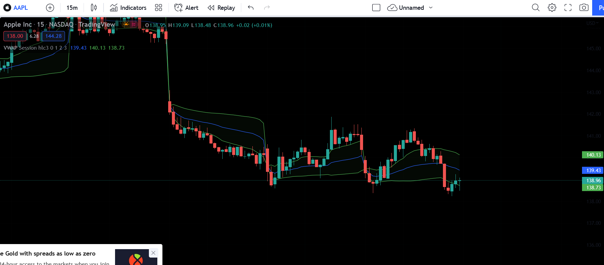

## Table of Contents

## What is money flow in trading?

Money flow in trading is a way to measure how much money is moving into or out of a stock. It helps traders understand if a stock is being bought or sold heavily. The idea is simple: if more money is flowing into a stock, it means more people are buying it, which can be a sign that the stock's price might go up. On the other hand, if more money is flowing out, it means more people are selling, which can be a sign that the price might go down.

To calculate money flow, traders look at the stock's price and the volume of shares traded. They multiply the average price of the stock during a certain period by the number of shares traded in that period. If the stock's price goes up and the volume is high, the money flow is positive. If the price goes down with high volume, the money flow is negative. This information helps traders make decisions about when to buy or sell a stock.

## How is money flow calculated in trading?

Money flow in trading is calculated by looking at the stock's price and the number of shares traded. To find the money flow for a specific period, traders first find the average price of the stock during that time. They do this by adding the highest price and the lowest price of the stock, then dividing by two. Next, they multiply this average price by the total number of shares that were traded in that period. This gives them the money flow for that time.

After calculating the money flow, traders compare it to the money flow of the previous period to see if it's positive or negative. If the current money flow is higher than the previous one, it's considered positive, meaning more money is flowing into the stock. This can suggest that the stock's price might go up. If the current money flow is lower than the previous one, it's negative, indicating more money is flowing out, which might mean the stock's price could go down. This simple calculation helps traders decide when to buy or sell a stock.

## Why is money flow important for traders?

Money flow is important for traders because it shows them where money is moving in the market. When traders see that a lot of money is going into a stock, it can mean that other people think the stock's price will go up. This can be a good sign for traders to buy the stock too. On the other hand, if a lot of money is leaving a stock, it might mean that people are selling it and the price could go down. Knowing this can help traders decide when to sell their shares to avoid losing money.

By looking at money flow, traders can also spot trends and make better decisions. For example, if money flow is positive for a long time, it might mean the stock is in a strong upward trend. Traders can use this information to hold onto their stocks longer or buy more. If money flow is negative for a while, it might be a warning sign to sell before the price drops too much. Overall, money flow helps traders understand market movements and make smarter trading choices.

## What is the difference between money flow and volume in trading?

Money flow and [volume](/wiki/volume-trading-strategy) are both important in trading, but they tell us different things. Volume is just the number of shares that people buy and sell in a certain time. It shows how many people are trading the stock, but it doesn't say anything about the price. If a lot of shares are traded, the volume is high, and if not many shares are traded, the volume is low. Volume helps traders see how active the market is for a stock.

Money flow, on the other hand, takes both the price and the volume into account. It's like a mix of how much people are buying or selling and at what price. To find money flow, you take the average price of the stock and multiply it by the volume. This tells you how much money is going into or out of the stock. If money flow is going up, it means more money is going into the stock, which can be a good sign. If it's going down, more money is leaving, which might be a bad sign. So, money flow gives traders a better idea of what might happen to the stock's price.

## How can money flow help in identifying market trends?

Money flow can help traders spot market trends by showing them where money is moving in the market. When money flow is going up over time, it means more money is going into a stock. This can be a sign that the stock's price might keep going up, which is called an upward trend. Traders can use this information to decide to buy the stock or hold onto it longer, hoping to make more money as the price rises.

On the other hand, if money flow is going down over time, it means more money is leaving the stock. This can be a sign of a downward trend, where the stock's price might keep falling. Traders can use this information to sell their shares before the price drops too much, helping them avoid losing money. By watching money flow, traders can get a better idea of what might happen next in the market and make smarter choices about when to buy or sell.

## What are the common indicators used to measure money flow?

Two common indicators used to measure money flow are the Money Flow Index (MFI) and the Chaikin Money Flow (CMF). The Money Flow Index looks at both price and volume to see how strong buying and selling pressure is. It's kind of like a thermometer for the stock market. If the MFI is over 80, it means the stock might be overbought, and if it's under 20, it might be oversold. This helps traders decide if it's a good time to buy or sell.

The Chaikin Money Flow, or CMF, also looks at price and volume but focuses on where the stock's price closes compared to its high and low for the day. If the stock closes near its high, the CMF goes up, showing more money is going into the stock. If it closes near its low, the CMF goes down, showing more money is leaving. Traders use the CMF to see if money is flowing into or out of a stock over time, helping them spot trends and make trading decisions.

## How does money flow impact stock prices?

Money flow impacts stock prices by showing where money is moving in the market. When more money is flowing into a stock, it means more people are buying it. This increased buying can push the stock's price up because there's more demand for the stock. If a lot of people want to buy a stock and there aren't enough shares to go around, the price goes up. So, when traders see positive money flow, they might think the stock's price will keep going up and decide to buy it too.

On the other hand, when more money is flowing out of a stock, it means more people are selling it. This increased selling can push the stock's price down because there's more supply of the stock than people wanting to buy it. If a lot of people are selling a stock and there aren't enough buyers, the price goes down. When traders see negative money flow, they might think the stock's price will keep going down and decide to sell their shares before they lose more money. By watching money flow, traders can get a better idea of what might happen to a stock's price and make smarter trading choices.

## Can money flow analysis predict market reversals?

Money flow analysis can help traders spot when a stock's price might start going the other way, which is called a market reversal. If a stock's price has been going up but the money flow starts to go down, it could mean that people are starting to sell the stock. This can be a warning sign that the price might soon start to fall. Traders watch for these changes in money flow to decide if it's time to sell their shares before the price drops.

On the other hand, if a stock's price has been going down but the money flow starts to go up, it could mean that people are starting to buy the stock again. This can be a sign that the price might soon start to rise. By looking at money flow, traders can get early warnings about when a stock's price might change direction, helping them make better decisions about when to buy or sell.

## What are the limitations of using money flow as a trading strategy?

Money flow can be a helpful tool for traders, but it has some limits. One big problem is that money flow looks at the past, not the future. Just because a lot of money is going into a stock now doesn't mean it will keep going up. The market can change quickly, and money flow can't predict those changes perfectly. Also, money flow doesn't tell you everything about why people are buying or selling a stock. There might be news or other things happening that money flow doesn't show.

Another limit is that money flow can be confusing if the market is moving a lot. Sometimes, the money flow might be going up, but the stock's price is going down, or the other way around. This can make it hard to know what to do. Plus, money flow works best when you use it with other tools like looking at the stock's price charts or reading news about the company. If you only use money flow, you might miss important information that could help you make better trading choices.

## How do institutional investors use money flow to influence markets?

Institutional investors, like big banks and investment funds, use money flow to see where the market is going. They watch money flow to find out which stocks people are buying a lot and which ones they are selling. When they see a lot of money going into a stock, they might decide to buy it too, hoping to make money as the price goes up. If they see money leaving a stock, they might sell their shares before the price drops too much. By doing this, they can make the market move in the direction they want because they have a lot of money to spend.

Sometimes, these big investors can even start a trend by buying or selling a lot of a certain stock. If they buy a lot of shares, it can make the money flow go up and push the stock's price higher. Other people might see this and start buying too, making the price go up even more. On the other hand, if they sell a lot of shares, it can make the money flow go down and push the price lower. This can make other people start selling too, making the price drop even more. So, by using money flow, institutional investors can have a big impact on the market.

## What advanced techniques can be used to refine money flow analysis?

One advanced technique to refine money flow analysis is to use multiple time frames. Instead of just looking at money flow for one day, traders can look at it over different periods like a week, a month, or even longer. By doing this, they can see if the money flow trend is strong and lasting, or if it's just a short-term change. This can help them make better decisions because they get a fuller picture of where the money is moving.

Another technique is to combine money flow with other technical indicators, like the Relative Strength Index (RSI) or moving averages. These tools can help traders understand the stock's price movements better. For example, if the money flow is going up but the RSI shows the stock is overbought, it might be a sign that the price could soon go down. By using these indicators together, traders can get more accurate signals about when to buy or sell a stock.

Lastly, traders can use advanced statistical methods to analyze money flow. Techniques like regression analysis or [machine learning](/wiki/machine-learning) can help find patterns in the data that are hard to see with just simple calculations. These methods can predict how money flow might affect stock prices in the future, giving traders a more scientific way to make their trading decisions. By using these advanced techniques, traders can refine their money flow analysis and improve their chances of making good trades.

## How can traders integrate money flow data with other technical analysis tools?

Traders can make their trading decisions better by using money flow data together with other technical analysis tools. One way to do this is by using the Money Flow Index (MFI) with the Relative Strength Index (RSI). The MFI looks at both price and volume to see if a stock is being bought or sold a lot. The RSI, on the other hand, just looks at the stock's price to see if it's being bought too much or sold too much. When traders see that both the MFI and RSI are high, it might mean the stock is overbought and could go down soon. If both are low, the stock might be oversold and could go up. By looking at both together, traders can get a clearer picture of what might happen next.

Another way to use money flow data with other tools is by combining it with moving averages. Moving averages smooth out the price data over time, helping traders see the overall trend of a stock. If the money flow is going up and the stock's price is above its moving average, it might mean the stock's price will keep going up. But if the money flow is going down and the price is below the moving average, it might mean the price will keep going down. By using money flow with moving averages, traders can see if the trend they are seeing is strong and likely to last. This can help them decide when to buy or sell a stock more confidently.

## How do you calculate the Money Flow Index?

Calculating the Money Flow Index (MFI) involves a systematic approach that begins with determining the typical price for a given security over a selected time frame. The typical price is computed as the average of the high, low, and close prices:

$$
\text{Typical Price} = \frac{\text{High} + \text{Low} + \text{Close}}{3}
$$

This typical price is then multiplied by the trading volume to derive the raw money flow, which serves as the fundamental component for further MFI calculations:

$$
\text{Raw Money Flow} = \text{Typical Price} \times \text{Volume}
$$

In the subsequent step, raw money flow is categorized into positive and negative money flows. If today’s typical price is greater than yesterday’s typical price, the resulting raw money flow is considered positive; otherwise, it is negative. This classification is critical for tracking the money flow over a specified period, usually 14 days. 

Once the positive and negative money flows over the chosen period are determined, the Money Flow Ratio is calculated by dividing the sum of the positive money flows by the sum of the negative money flows:

$$
\text{Money Flow Ratio} = \frac{\text{Positive Money Flow Sum}}{\text{Negative Money Flow Sum}}
$$

The Money Flow Index is then derived using the following formula:

$$
\text{MFI} = 100 - \left( \frac{100}{1 + \text{Money Flow Ratio}} \right)
$$

The MFI oscillates between 0 and 100, offering traders valuable insights into potential market conditions. An MFI reading above 80 suggests an overbought scenario, while a value below 20 indicates an oversold market. These insights assist traders in making informed decisions regarding potential entry and [exit](/wiki/exit-strategy) points, thereby enhancing the effectiveness of trading strategies. By understanding the construction and application of MFI, traders can better assess market dynamics and anticipate potential price movements.

## What is Backtesting and Optimization?

Backtesting involves the simulation of a trading strategy using historical data to evaluate its potential effectiveness and profitability. This process offers traders a critical perspective on the reliability of their Money Flow Index (MFI) strategies, uncovering both strengths and areas for improvement under varying market conditions. By replicating how a strategy would have performed in the past, traders can develop confidence in its application to real-time trading scenarios.

A comprehensive backtest requires meticulous attention to detail, ensuring that historical data is robust and accurate. The aim is to explore a wide range of market environments, enabling the identification of any latent weaknesses or overly optimistic predictions. Key performance metrics such as annualized return, Sharpe ratio, and drawdown are essential in assessing a strategy's risk and reward profile. The annualized return provides an overview of a strategy's long-term profitability, the Sharpe ratio quantifies risk-adjusted returns, and drawdown measures the strategy's potential losses from peak to trough.

For instance, the Sharpe ratio can be calculated as:

$$
\text{Sharpe Ratio} = \frac{E[R_p - R_f]}{\sigma_p}
$$

where $E[R_p - R_f]$ is the expected excess return of the portfolio over the risk-free rate, and $\sigma_p$ is the standard deviation of the portfolio's return. This metric provides a way to understand the return of an investment compared to its risk.

Moreover, refinement through iterative testing and optimization is crucial for maintaining the competitiveness of MFI-driven strategies. A single backtest is seldom sufficient; repeated simulations with different parameters, time frames, or market conditions are necessary to ensure robustness and adaptability. By continuously tweaking the strategy and considering market evolutions, traders can ensure that it remains effective and relevant.

Traders who achieve success are those who consistently revisit and refine their strategies, using insights from [backtesting](/wiki/backtesting) as feedback. They adapt their approaches according to shifting market dynamics, ensuring that their strategies are not only theoretically sound but also practical in the ever-evolving world of financial markets. This commitment to iterative development and adaptability distinguishes profitable trading strategies from their less effective counterparts.

## References & Further Reading

[1]: Chelley-Steeley, P. L. (2003). ["Equity Market Integration in the Asia-Pacific Region: A Smooth Transition Analysis."](https://www.sciencedirect.com/science/article/pii/S1057521904000250) Journal of Asian Economics.

[2]: Chande, T. (1994). ["The New Technical Trader: Boost Your Profit by Plugging into the Latest Indicators"](https://www.amazon.com/New-Technical-Trader-Plugging-Indicators/dp/0471597805) by Tushar Chande and Stanley Kroll.

[3]: Murphy, J. J. (1999). ["Technical Analysis of the Financial Markets: A Comprehensive Guide to Trading Methods and Applications."](https://archive.org/details/technicalanalysi0000murp) New York Institute of Finance.

[4]: Tharp, V. K. (1998). ["Trade Your Way to Financial Freedom."](https://www.amazon.com/Trade-Your-Way-Financial-Freedom/dp/007147871X) McGraw-Hill.

[5]: Harris, R. D. F., & Yilmaz, F. (2009). ["Volume and Price Dynamics in an Emerging Stock Market."](https://www.sciencedirect.com/science/article/abs/pii/S0378426609000521) European Journal of Finance.