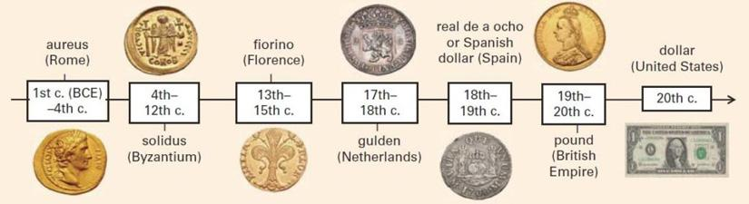

## Table of Contents

## What is money and why was it invented?

Money is something people use to buy things they need or want. It can be coins, paper bills, or even digital numbers on a screen. Long ago, people traded things directly, like giving a cow for some wheat. This was called bartering, but it was hard because you had to find someone who wanted what you had and had what you wanted. Money made this easier because now you could trade your cow for money and then use that money to buy wheat from anyone who was selling it.

Money was invented to solve the problems of bartering. It made trading simpler and faster. With money, people could buy what they needed without having to find someone who wanted to trade the exact thing they had. This also helped people save what they earned for later, which they couldn't do easily with cows or wheat. Over time, money became a way to measure how much things were worth and helped economies grow.

## How did money evolve from barter systems to modern currency?

Money started as a way to make trading easier than bartering. In the beginning, people used things like shells, beads, or even cattle as money. These were called commodity money because they had value on their own. As societies grew, people started using metals like gold and silver because they were easy to carry and hard to fake. They would shape these metals into coins, which made trading even simpler. Governments began to stamp these coins to show they were real, and this helped people trust the money more.

Over time, carrying heavy coins became a problem, so people started using paper money. This paper money was a promise from the government or a bank that you could trade it for gold or silver. This was called the gold standard. But as more people used paper money, it became the main way to buy things, and countries stopped using the gold standard. Today, we also use digital money, which is just numbers on a computer. You can use digital money to buy things online or even pay with your phone. Money has come a long way from trading cows to using apps on our phones, but it still helps us buy what we need and want.

## What are the different types of money that have existed throughout history?

Money started with things people found valuable, like shells, beads, and even cows. These were called commodity money because they had value on their own. As societies grew, people began using metals like gold and silver. They made these metals into coins, which were easier to [carry](/wiki/carry-trading) and use for trading. Governments started putting stamps on these coins to show they were real, and this made people trust the money more.

As time went on, people found that carrying heavy coins was hard, so they started using paper money. This paper was a promise that you could trade it for gold or silver. This was called the gold standard. Eventually, more and more people used paper money, and countries stopped using the gold standard. Today, we also use digital money, which is just numbers on a computer. You can use digital money to buy things online or even pay with your phone. Money has changed a lot over time, but it still helps us buy what we need and want.

## What is commodity money and what are some examples?

Commodity money is a type of money that has value on its own, not just because people agree it's worth something. It's something you can use or trade because it's useful or rare. People used commodity money a long time ago when they didn't have coins or paper money yet.

Some examples of commodity money are shells, beads, and even cows. People in different places used these things to buy and sell stuff. For example, in some places, people used cowrie shells to trade because they were pretty and hard to find. In other places, people traded cows because they were useful for farming and giving milk.

## What is fiat money and how does it differ from commodity money?

Fiat money is money that a government says is worth something, even though it's not made of anything valuable like gold or silver. It's just paper or coins that we use because the government says it's okay to use them to buy things. The value of fiat money comes from people believing in it and the government backing it up. Most of the money we use today, like dollars and euros, is fiat money.

Fiat money is different from commodity money because commodity money has value on its own. For example, if you use gold as money, the gold is worth something because it's rare and people want it. But with fiat money, the paper or coin itself isn't worth much; it's only worth what the government says it is. So, while commodity money has value because of what it's made of, fiat money has value because people trust the government and the economy.

## What are the characteristics of good money?

Good money needs to be something that people trust and can use easily. It should be hard to fake so people know it's real. It also needs to be easy to carry around, so you can use it to buy things without it being too heavy or taking up too much space. Good money should also be something that lasts a long time, so you can keep it without it breaking or wearing out.

Another important thing about good money is that it should be easy to divide into smaller amounts. This way, you can use it to buy things that cost less than a whole piece of money. It should also be something that a lot of people agree is worth something, so you can use it to buy things from anyone, not just one person. This makes trading and buying things much easier for everyone.

## How is money created in modern economies?

In modern economies, money is created mostly by banks. When banks give out loans, they create new money. Imagine someone wants to buy a house and goes to the bank for a loan. The bank gives them the money, but this money wasn't sitting in a vault somewhere. Instead, the bank just adds numbers to the person's account. This new money can then be used to buy the house. So, every time a bank gives a loan, it's like they're making new money out of thin air.

Governments also play a part in creating money. They do this through central banks, like the Federal Reserve in the United States. Central banks can print new paper money or mint new coins. They also control something called the money supply, which means they can decide how much money is in the economy. Sometimes, they add more money to help the economy grow, and other times they take money away to stop prices from going up too fast. So, both banks and governments work together to make sure there's enough money for everyone to use.

## What role do central banks play in the creation and regulation of money?

Central banks are really important for making and controlling money. They can print new paper money and make new coins. But that's not all they do. Central banks also control how much money is in the whole economy. They do this by changing interest rates, which is how much it costs to borrow money. If they want more money in the economy, they might lower interest rates so people borrow more. If they want less money, they might raise interest rates so people borrow less.

Besides making and controlling money, central banks also keep the economy stable. They watch over banks to make sure they're not doing anything risky that could cause problems. If the economy is doing badly, central banks can step in to help. They might buy things like government bonds to put more money into the economy. On the other hand, if the economy is doing too well and prices are going up too fast, they might take money out to slow things down. So, central banks are like the guardians of the economy, making sure everything works smoothly.

## What is the difference between M0, M1, M2, and M3 money supply?

Money supply is all the money that's out there in the economy. It's divided into different groups called M0, M1, M2, and M3. M0 is the most basic kind of money supply. It's just the physical money, like coins and paper bills, that people can hold in their hands. M1 includes M0, but it also adds in money that's in checking accounts, which people can use easily to buy things. So, M1 is a bit bigger than M0 because it includes more types of money.

M2 is even bigger than M1. It includes everything in M1, plus money in savings accounts and some types of short-term investments that people can turn into cash pretty quickly. M2 is a good way to see how much money people have that they can use or spend without too much trouble. M3 is the biggest group and includes everything in M2, plus other types of investments that might take a bit longer to turn into cash. M3 gives a really broad picture of all the money in the economy, but not all countries use it anymore because it can be hard to measure accurately.

## How do commercial banks contribute to money creation through fractional reserve banking?

Commercial banks help create money through something called fractional reserve banking. When you put money into a bank, the bank doesn't keep all of it. They keep just a small part, called a reserve, and lend out the rest. For example, if you put $100 in the bank and they keep 10% as a reserve, they'll have $10 in reserve and can lend out $90. When they lend out that $90, it becomes new money because the person who gets the loan can spend it. So, from your original $100, the bank created an extra $90 in the economy.

This process keeps going. The person who borrowed the $90 might spend it, and that money could end up in another bank. That bank will also keep a small part as a reserve and lend out the rest. So, the original $100 you put in the bank can lead to a lot more money being created as it moves from one bank to another. This is how commercial banks help grow the money supply in the economy through fractional reserve banking.

## What are digital currencies and how do they fit into the history and types of money?

Digital currencies are a new kind of money that exists only on computers and the internet. They are different from traditional money like coins and paper bills because you can't touch them. Instead, they are just numbers on a screen. The most famous digital currency is Bitcoin, but there are many others like Ethereum and Litecoin. People use digital currencies to buy things online or even in some stores that accept them. They work through something called blockchain, which is like a big, public record book that keeps track of all the transactions.

Digital currencies fit into the history and types of money as the latest step in how money has changed over time. Money started as things like shells and cows, which people used to trade directly. Then, it evolved into coins made of metals like gold and silver, and later into paper money. Paper money was backed by gold at first, but now most money is fiat money, which has value because the government says so. Digital currencies are the next step because they don't need a government to back them up. They are created and managed by computer networks and the people who use them. So, digital currencies are a new way to think about money, showing how it keeps changing to fit what people need.

## What are the potential future developments in money creation and types of money?

In the future, money might change even more because of new technology. One big change could be more use of digital currencies like Bitcoin. These don't need banks or governments to work. They use a special system called blockchain to keep track of who owns what. More people might start using these digital currencies for everyday things like buying groceries or paying bills. Also, central banks might start their own digital currencies. These would be like the money we use now but in a digital form, making it easier to use and keep track of.

Another possible change is that money could become even more connected to technology. We might see more use of things like smart contracts, which are like digital agreements that happen automatically when certain things are true. This could make buying and selling things faster and safer. Also, as more things become digital, money might be used in new ways we can't even think of yet. It's hard to say exactly what will happen, but one thing is for sure: money will keep changing to fit the needs of people and the world around them.

## References & Further Reading

[1]: Bergstra, J., Bardenet, R., Bengio, Y., & Kégl, B. (2011). ["Algorithms for Hyper-Parameter Optimization."](https://dl.acm.org/doi/10.5555/2986459.2986743) Advances in Neural Information Processing Systems 24.

[2]: ["Advances in Financial Machine Learning"](https://www.amazon.com/Advances-Financial-Machine-Learning-Marcos/dp/1119482089) by Marcos Lopez de Prado

[3]: ["Evidence-Based Technical Analysis: Applying the Scientific Method and Statistical Inference to Trading Signals"](https://www.amazon.com/Evidence-Based-Technical-Analysis-Scientific-Statistical/dp/0470008741) by David Aronson

[4]: ["Machine Learning for Algorithmic Trading"](https://github.com/PacktPublishing/Machine-Learning-for-Algorithmic-Trading-Second-Edition) by Stefan Jansen

[5]: ["Quantitative Trading: How to Build Your Own Algorithmic Trading Business"](https://books.google.com/books/about/Quantitative_Trading.html?id=j70yEAAAQBAJ) by Ernest P. Chan

[6]: Krugman, P., & Obstfeld, M. (2005). ["International Economics: Theory and Policy."](https://www.pearson.com/se/Nordics-Higher-Education/subject-catalogue/economics/International-Economics-Theory-and-Policy-Krugman.html) Addison-Wesley. 

[7]: Nakamoto, S. (2008). ["Bitcoin: A Peer-to-Peer Electronic Cash System."](https://nakamotoinstitute.org/library/bitcoin/) 

[8]: Hull, J. C. (2018). ["Options, Futures, and Other Derivatives."](https://www.semanticscholar.org/paper/Options%2C-Futures%2C-and-Other-Derivatives-Hull/89bdee500c8623864fc9eb7a471546aa713acc44) Pearson Education.

[9]: Friedman, M. (1969). ["The Optimum Quantity of Money and Other Essays."](https://www.jstor.org/stable/1991093) Aldine Publishing Company. 

[10]: Keynes, J. M. (1936). ["The General Theory of Employment, Interest and Money."](https://www.files.ethz.ch/isn/125515/1366_KeynesTheoryofEmployment.pdf) Palgrave Macmillan UK.