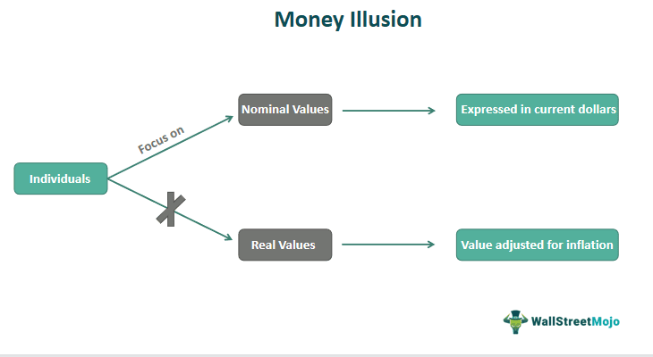

The complex relationships between economic theories, inflation, and automated trading strategies necessitate a thorough analysis. Central to understanding these dynamics is the concept of money illusion, which describes the tendency of individuals to evaluate their financial circumstances in nominal rather than real terms. This illusion can significantly influence financial decision-making processes, particularly by distorting our perception of purchasing power and wealth.

A comprehension of money illusion is vital for investors, economists, and policymakers because it can cause individuals to misconstrue the true value of their financial assets, particularly during periods of inflation. For example, an increase in nominal wages might be interpreted as an increase in wealth, even though inflation may be eroding the real value of those gains. This misperception can lead to suboptimal economic decisions at both the microeconomic and macroeconomic levels.



Furthermore, in the context of rapidly advancing algorithmic trading technologies, there is an urgent need to consider how money illusion might affect trading strategies. Algorithmic trading, which often relies on high-speed data analysis and automated decision-making, could potentially be swayed by market behaviors influenced by money illusion. Misinterpretations of nominal versus real value in market data could lead to unforeseen volatility and risk.

This article examines the concept of money illusion, explores its economic implications, and investigates its potential influence on algorithmic trading. Through understanding these interactions, we aim to provide insights that could inform more robust trading strategies and financial decisions.

## Table of Contents

## Defining Money Illusion

Money illusion is an economic concept that emerged to describe the tendency of individuals to assess their income and financial situations in nominal terms rather than in terms of real value, which accounts for inflation. This phenomenon can have significant implications for financial decision-making, as it affects how people perceive their purchasing power. The term 'money illusion' was prominently discussed by economists such as Irving Fisher and John Maynard Keynes, who highlighted its potential to distort economic behavior and decision-making processes.

Fisher, in particular, emphasized how money illusion can lead individuals to misunderstand changes in their economic environment. For example, when wages increase nominally but inflation is rising at an equivalent or faster rate, individuals may perceive themselves as wealthier due to the higher nominal income. However, their real purchasing power may remain unchanged or even decline. This can lead to poor financial decisions, such as increased spending based on perceived income growth when, in reality, there has been no substantial increase in economic capability.

The key triggers of money illusion often stem from a lack of financial literacy and understanding of inflation's role in eroding money's real value. This misunderstanding is exacerbated in economies where inflation is not well-publicized or accounted for in personal and policy-level financial planning. Individuals may, therefore, make decisions based on the face value of currency without considering the broader economic indicators that impact true economic standing.

In mathematical terms, money illusion can be understood through the formula for real income:

$$
\text{Real Income} = \frac{\text{Nominal Income}}{(1 + \text{Inflation Rate})}
$$

This formula highlights the importance of adjusting nominal figures to obtain a realistic view of economic status, emphasizing that nominal increases do not inherently translate into increased real wealth.

Efforts to mitigate money illusion involve enhancing financial education, ensuring individuals understand not only the concept of inflation but also its practical effects on their economic decisions. This understanding allows for a shift from nominal to real assessment in financial planning, fostering more informed and rational economic behavior.

## Historical Context and Theory

The concept of "money illusion" was first introduced by American economist Irving Fisher in his work during the early 20th century. Fisher's articulation of money illusion centered on individuals' tendency to focus on nominal monetary values rather than their real, inflation-adjusted value. This inclination can cause economic [agents](/wiki/agents) to overlook the eroding effects of inflation on purchasing power, potentially leading to suboptimal financial decisions.

The theory gained significant traction with the emergence of Keynesian economics. John Maynard Keynes acknowledged the concept of money illusion in his discussion of wage and price rigidities. According to Keynesian theory, money illusion can cause workers to accept nominal wage increases that fail to keep pace with inflation, thus diminishing their real income. Similarly, employers might maintain or increase nominal prices without considering the real value, contributing to economic imbalances and potential market inefficiencies.

Behavioral economics has further expanded the exploration of money illusion, framing it as a cognitive bias that influences economic behavior. Behavioral economists study how psychological and emotional factors can cause individuals to make financial decisions that deviate from the rational actor model typically assumed in classical economics. For instance, decisions such as purchasing goods during inflationary periods without adjusting the perceived value align with the behavioral interpretation of money illusion. These insights provide a deeper understanding of why money illusion persists in economic behavior, despite increasing awareness and education regarding inflation metrics and real value assessments.

The historical development and theoretical exploration of money illusion have underscored its persistent influence on modern financial markets. By understanding its origins with Fisher, its integration into Keynesian economics, and its examination through behavioral economics, we gain valuable insights into how perception and cognitive biases shape economic decisions and market dynamics. Recognizing this illusion's ongoing impact is essential for crafting effective economic policies and strategies in today's complex financial landscape.

## Impact of Inflation on Perception

Inflation significantly alters the way individuals perceive their monetary wealth and economic stability. This phenomenon is largely due to the concept of money illusion, which causes people to focus on nominal values rather than real values that account for inflation. When inflation occurs, the general price level of goods and services rises, decreasing the purchasing power of money. However, if wages rise in nominal terms but do not outpace inflation, individuals might inaccurately perceive an increase in real wealth, influencing financial decisions and overall economic behavior.

For instance, consider an employee who receives a 3% nominal wage increase during a period where inflation is at 3%. Despite the increase in salary, the employee's purchasing power remains unchanged, as the cost of goods and services has risen proportionally. This scenario demonstrates money illusion, where the employee may feel financially more secure or wealthier due to the nominal wage increase, even though their real income has not improved. Such perceptions can lead to misguided financial decisions, underestimating the true costs associated with maintaining their previous standard of living.

Real-world examples emphasize how widespread the effect of money illusion can be on economic stability. During periods of high inflation, even substantial nominal wage increases can fail to match inflation rates, yet individuals often view these increases positively. This optimistic perception can translate into spending behaviors that do not reflect their actual economic situation, potentially leading to overconsumption and inadequate savings.

From a macroeconomic perspective, these skewed perceptions of wealth due to inflation and money illusion can complicate economic policymaking. If a substantial portion of the population experiences money illusion, it may impact aggregate demand in the economy. Policymakers need to account for this when designing economic policies, especially those involving wage regulations and inflation targeting.

In summary, inflation fundamentally impacts our perception of monetary wealth by inducing money illusion. This discrepancy between nominal and real values can lead to inaccurate assessments of economic conditions, influencing spending and saving behaviors in both individuals and the broader economy. Understanding this psychological bias is essential for making informed financial decisions and for policymakers aiming to stabilize economic growth in fluctuating inflationary environments.

## Algorithmic Trading and Market Behavior

Algorithmic trading, which relies heavily on sophisticated computer algorithms to execute trades at high speed and frequency, is an integral part of modern financial markets. These algorithms are primarily data-driven; they analyze vast amounts of financial data to identify trading opportunities and make split-second decisions. However, the effectiveness of these algorithms can be significantly influenced by market perceptions, including phenomena such as money illusion.

Money illusion can lead investors to misinterpret nominal changes in income or prices as changes in real value. When a sizeable portion of the market is affected by such misperceptions, it can result in market [volatility](/wiki/volatility-trading-strategies) and unexpected price movements. For instance, a nominal price increase, perceived incorrectly as an increase in real value, could trigger a series of buy-orders by algorithms that do not account for inflation, potentially inflating asset bubbles. This volatility presents both challenges and opportunities for [algorithmic trading](/wiki/algorithmic-trading).

For algorithmic trading strategies to effectively manage and exploit such market behaviors, it is crucial to incorporate an understanding of money illusion into their design. Analyzing trading patterns that may be distorted by money illusion can help enhance these strategies. By identifying conditions under which money illusion is likely to affect trader behavior, algorithms can be fine-tuned to adjust their trading signals accordingly.

For example, if historical data suggest that certain macroeconomic announcements consistently lead to market reactions driven by money illusion, algorithms could be programmed to either capitalize on these predictable patterns or mitigate risks associated with them. This could involve adjusting parameters such as the timing of trades or employing hedging strategies during periods of expected volatility due to money illusion.

Moreover, advances in [machine learning](/wiki/machine-learning) and [artificial intelligence](/wiki/ai-artificial-intelligence) can be leveraged to detect and respond to money illusion by training models on historical instances of its occurrence. By integrating such models into trading algorithms, traders can anticipate and react to shifts in market sentiment more effectively, potentially improving both returns and risk management.

In summary, while algorithmic trading is inherently quantitative and data-focused, it should not overlook psychological and perceptual elements like money illusion that can impact market behavior. By incorporating insights into how these perceptions affect market dynamics, traders can refine their algorithms to navigate financial markets more adeptly, thereby enhancing their overall performance.

## Strategies to Mitigate Money Illusion

Improving financial literacy and education is essential to mitigate the effects of money illusion in both personal finance and broader economic arenas. At its core, financial literacy involves understanding the difference between nominal and real values to make informed economic decisions. This understanding allows individuals to perceive their true purchasing power accurately, avoiding the pitfalls of nominal thinking exacerbated by inflation.

One key strategy to counteract money illusion is emphasizing the importance of incorporating real values over nominal figures in financial assessments. This involves adjusting nominal income and prices for inflation to reflect true economic value. The formula for converting nominal values to real values is:

$$
\text{Real Value} = \frac{\text{Nominal Value}}{1 + \text{Inflation Rate}}
$$

By routinely applying this conversion, individuals and businesses can better understand the real implications of their financial situations, making more stable and informed decisions.

For algorithmic trading strategies, which rely heavily on computational models to make investment decisions, it is critical to integrate considerations for psychological biases like money illusion. One approach is to incorporate inflation-adjusted data into trading algorithms, ensuring that the trading strategies consider not just raw, nominal data but also account for underlying economic realities.

Algorithmic trading systems can also benefit from sentiment analysis to gauge market perceptions closely. By analyzing news articles, social media feeds, and financial reports for language indicative of money illusion, trading algorithms can anticipate potential market misperceptions and adjust strategies accordingly. Here is a basic example of how sentiment analysis could be implemented in Python using libraries like `TextBlob`:

```python
from textblob import TextBlob

def analyze_sentiment(text):
    analysis = TextBlob(text)
    if analysis.sentiment.polarity > 0:
        return "Positive"
    elif analysis.sentiment.polarity == 0:
        return "Neutral"
    else:
        return "Negative"

market_report = "The market has seen a nominal increase, but inflation is not accounted for."
sentiment = analyze_sentiment(market_report)
print(f"Market sentiment based on report: {sentiment}")
```

This sentiment-driven approach allows algorithms to detect potential deviations in market behavior due to collective biases and adjust trading strategies to mitigate risks effectively.

In conclusion, mitigating money illusion involves enhancing financial education to focus on real values and adapting algorithmic trading to consider psychological biases. This dual approach fosters more rational financial decision-making and robust investment strategies.

## Conclusion

Money illusion remains a pervasive issue that affects economic decision-making both on an individual and a macroeconomic level. Individuals who focus on nominal rather than real terms may make misguided financial choices, such as underestimating the long-term impact of inflation on purchasing power. This cognitive bias has broader implications for economic theories, impacting how wage and price adjustments are perceived in the market. Recognizing the existence and effects of money illusion is crucial to adopting informed economic and investment strategies. By adjusting for this illusion, individuals and institutions can enhance financial decision-making processes and reduce susceptibility to inflation-related misperceptions.

The rapidly evolving landscape of finance, particularly with the integration of algorithmic trading strategies, underscores the importance of understanding money illusion. Algorithms that fail to account for inflation perception and nominal biases may generate suboptimal trading outcomes. Discovering and incorporating metrics that mitigate the effects of money illusion could lead to more resilient strategies. For instance, integrating inflation-adjusted metrics into algorithmic models can provide a more accurate representation of economic conditions, thereby reducing the risk posed by market volatility due to collective perceptual biases.

To exploit this understanding, financial systems could benefit from algorithms that routinely adjust for inflation, employing techniques such as:

```python
def real_value(nominal_value, inflation_rate, time_period):
    return nominal_value / ((1 + inflation_rate) ** time_period)
```

This Python function computes the real value of money factoring in inflation over a given time period, thus enabling a more accurate assessment of economic performance.

In summary, by deepening our understanding of money illusion and inflation perception, the future of finance can be better navigated. Enhanced algorithmic strategies that integrate these concepts will likely yield more robust and efficient financial systems, reducing the distortions caused by cognitive biases and leading to greater economic stability.

## References & Further Reading

[1]: Fisher, I. (1928). ["The Money Illusion."](https://archive.org/details/in.ernet.dli.2015.25405) Adelphi Company.

[2]: Keynes, J. M. (1936). ["The General Theory of Employment, Interest, and Money."](https://www.files.ethz.ch/isn/125515/1366_KeynesTheoryofEmployment.pdf) Palgrave Macmillan.

[3]: Shiller, R. J. (1997). ["Why Do People Dislike Inflation?"](https://www.nber.org/papers/w5539) National Bureau of Economic Research Working Paper No. 5539.

[4]: Thaler, R. H. (1997). ["Irving Fisher: Pioneer on Price and Wealth Behavior."](https://psycnet.apa.org/record/2008-03730-000) Journal of Economic Perspectives.

[5]: Kahneman, D., & Tversky, A. (1979). ["Prospect Theory: An Analysis of Decision under Risk."](https://www.jstor.org/stable/1914185) Econometrica. 

[6]: Barberis, N., & Huang, M. (2001). ["Mental Accounting, Loss Aversion, and Individual Stock Returns."](https://www.nber.org/papers/w8190) The Journal of Finance.

[7]: Gabaix, X., & Laibson, D. (2006). ["The Dynamics of Bias and Financial Markets."](https://pages.stern.nyu.edu/~xgabaix/papers/shrouded.pdf) American Economic Review.

[8]: Lopez de Prado, M. (2018). ["Advances in Financial Machine Learning."](https://www.amazon.com/Advances-Financial-Machine-Learning-Marcos/dp/1119482089) Wiley.