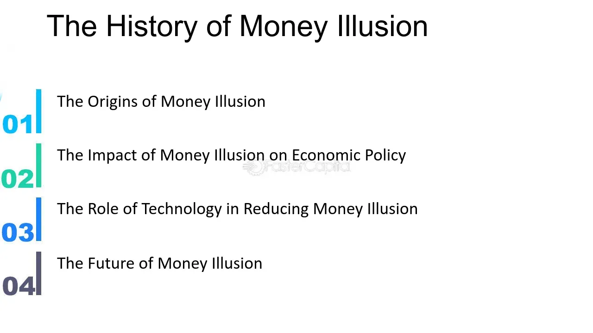

## Table of Contents

## What is money illusion?

Money illusion is when people get confused by the face value of money and don't think about what it can actually buy. For example, if you get a 5% raise at work, you might feel richer. But if prices for things you buy every day also go up by 5%, you're not really better off. Your money seems like more, but it doesn't buy any more than before.

This can affect how people make decisions about money. They might save less or spend more because they think they have more money, even if their real buying power hasn't changed. Economists worry about money illusion because it can lead to bad choices, like not asking for a bigger raise when prices are going up, or thinking you can afford things you really can't.

## How does money illusion affect everyday financial decisions?

Money illusion can make everyday financial decisions tricky. When people see their salary go up, they might feel like they can spend more. But if prices for things like food and gas are also going up, their money doesn't go as far as they think. They might buy more stuff or go out to eat more often because they think they're richer, but really, they're not. This can lead to spending too much and not saving enough for the future.

It also affects how people think about saving and investing. If someone sees their savings account balance growing, they might feel good about it. But if inflation is high, the money in the account is actually losing value over time. People might not realize this and think they're doing well financially when they're not. This can lead to not investing in things that could grow their money faster than inflation, like stocks or real estate.

## What are some historical examples of money illusion?

One big example of money illusion happened during the hyperinflation in Germany in the 1920s. People got paid more money, but prices for everything went up so fast that their money couldn't buy as much as before. They kept thinking they were getting richer because their paychecks were bigger, but really, they were getting poorer. They didn't understand that the value of money was going down quickly, so they spent their money fast before it lost even more value.

Another example was during the dot-com bubble in the late 1990s and early 2000s. People saw stock prices going up and thought they were getting richer. They didn't realize that the prices were going up because of hype, not because the companies were worth more. When the bubble burst, many people lost a lot of money because they thought their stocks were worth more than they really were. They were fooled by the numbers on their stock statements and didn't see the bigger picture.

## Who first coined the term 'money illusion' and in what context?

The term 'money illusion' was first used by an economist named Irving Fisher in the early 1900s. He wrote about it in his book called "The Money Illusion," which came out in 1928. Fisher wanted to explain why people sometimes make bad choices with money because they focus too much on the numbers and not enough on what those numbers can actually buy.

Fisher was worried that people were getting tricked by the way money seemed to be worth more or less, without thinking about inflation or how prices were changing. He thought that understanding money illusion could help people make better decisions about saving, spending, and investing. His ideas are still important today because they help us see how we can be fooled by money and make smarter choices.

## How has the concept of money illusion evolved over time?

The idea of money illusion started with Irving Fisher in the 1920s. He saw that people were getting tricked by the numbers on their money, without thinking about how much things cost. Back then, Fisher was worried about how this could make people spend too much or save too little. He thought if people understood money illusion, they could make better choices with their money.

Over time, the concept of money illusion has grown and changed. Economists have looked at how it affects things like wages, prices, and even whole economies. They've found that money illusion can make people think they're richer or poorer than they really are, which can lead to big mistakes in spending and saving. Nowadays, people study money illusion to help explain why economies can go up and down and to help people make smarter financial decisions in a world where prices and money values keep changing.

## What are the psychological underpinnings of money illusion?

Money illusion happens because of how our brains work. We tend to focus on the numbers we see, like the amount of money in our bank account or our paycheck, instead of thinking about what that money can actually buy. This is called nominal thinking. Our brains like to take shortcuts, and it's easier to look at the numbers than to figure out how those numbers change with inflation or price changes. This can trick us into thinking we're doing better or worse financially than we really are.

Another part of this is how we feel about gains and losses. When we see our money go up, even if it's just because of inflation, we feel good and might spend more. But if we see it go down, even if prices are just staying the same, we feel bad and might save more. This is called loss aversion. Our emotions play a big role in how we handle money, and money illusion can make us feel richer or poorer than we really are, which can lead to bad decisions.

## Can you provide case studies where money illusion significantly impacted economies?

In the 1920s, Germany went through a time called hyperinflation. This means prices for everything went up really fast. People got paid more money, but it didn't matter because the money was worth less and less. They thought they were getting richer because their paychecks were bigger, but really, they couldn't buy as much as before. This is a big example of money illusion. People spent their money quickly because they knew it would be worth even less the next day. This made the inflation even worse, and it hurt the whole economy.

Another case was in the United States during the 1970s. There was a lot of inflation, and people's wages went up. But the prices for things like food and gas went up even faster. Many people thought they were doing better because they were getting paid more, but they didn't realize that their money wasn't buying as much. This led to people spending more and saving less, thinking they had more money than they really did. It caused problems in the economy because people weren't saving enough, and businesses had a hard time planning for the future with prices changing so much.

## How do different economic theories explain money illusion?

Different economic theories explain money illusion in their own ways. In classical economics, they think people should be smart about money and understand that inflation changes what money can buy. But they see that money illusion happens because people sometimes don't think about inflation and focus too much on the numbers they see. They say it's a mistake that can lead to bad choices, like spending too much or saving too little.

Behavioral economics looks at how people really act with money, not just how they should act. They say money illusion happens because our brains take shortcuts and we feel emotions about money. We might feel rich when our paycheck goes up, even if prices go up too. Behavioral economists study these feelings and shortcuts to help explain why money illusion happens and how it can affect the whole economy.

Keynesian economics also talks about money illusion, especially when it comes to wages and prices. They think money illusion can make people happier with small raises in pay, even if prices go up too. This can keep the economy going because people spend more, but it can also cause problems if inflation gets out of control. Keynesians use money illusion to help explain why economies can be stable or unstable.

## What methods are used to measure the prevalence of money illusion in populations?

To figure out how common money illusion is, researchers often use surveys and experiments. They ask people questions about money and how they make choices with it. For example, they might show people different situations where money goes up but prices go up too, and see if people think they are richer or not. They also might ask people about their feelings and thoughts about money to see if they focus more on the numbers or what those numbers can buy.

Another way to measure money illusion is by looking at real-life data. Economists can study how people spend and save money when inflation changes. If people spend more or save less when their money goes up, even if prices go up too, that might be a sign of money illusion. By looking at big groups of people and how they act with money, researchers can see how widespread money illusion might be in a population.

## How can individuals and policymakers mitigate the effects of money illusion?

To help people avoid money illusion, they need to focus on what their money can actually buy, not just the numbers they see. This means looking at how much things cost now compared to before, and thinking about inflation. If someone gets a raise, they should check if prices have gone up too. Saving and investing wisely is also important. People should think about putting their money into things that can grow faster than inflation, like stocks or real estate, instead of just keeping it in a savings account where it might lose value over time.

Policymakers can help by making information about inflation and prices easy to understand and find. They can use clear messages to remind people to think about what their money can buy, not just how much they have. They can also set up rules and systems that help keep inflation under control, so people don't get tricked by money illusion. By doing these things, both individuals and policymakers can work together to make better financial choices and keep the economy stable.

## What are the criticisms or limitations of the money illusion concept?

Some people say the idea of money illusion is too simple. They think it doesn't explain everything about how people make choices with money. People might make bad choices for many reasons, not just because they're fooled by the numbers. Also, some say that money illusion might not be as big a problem as economists think. People might be smarter about money than we give them credit for, and they might understand inflation and prices better than we think.

Another criticism is that the idea of money illusion can be hard to test. It's tough to know for sure if someone is making a choice because of money illusion or for some other reason. When researchers do experiments or surveys, they have to guess what people are thinking, and that's not always easy. So, while money illusion might be a useful idea to think about, it's not perfect and there are still a lot of questions about how much it really affects people's choices.

## How does money illusion intersect with other economic phenomena such as inflation and wage negotiations?

Money illusion can make people think they're doing better when they get a raise, even if prices for things they buy are going up too. This can affect how people act during wage negotiations. If someone gets a 3% raise but inflation is also 3%, they're not really getting more money. But if they focus on the bigger number on their paycheck, they might feel happy with the raise and not ask for more. This can keep wages from going up enough to keep up with inflation, which can hurt workers over time.

Inflation and money illusion also work together in other ways. When prices go up, people might spend their money faster because they think it's worth less. This can make inflation even worse because more spending can push prices up even more. If people understand money illusion, they might save more or ask for bigger raises to keep up with inflation. But if they don't, they might make choices that make the economy less stable.

## What is Money Illusion?

Money illusion is an economic concept that emerged to describe the tendency of individuals to assess their income and financial situations in nominal terms rather than in terms of real value, which accounts for inflation. This phenomenon can have significant implications for financial decision-making, as it affects how people perceive their purchasing power. The term 'money illusion' was prominently discussed by economists such as Irving Fisher and John Maynard Keynes, who highlighted its potential to distort economic behavior and decision-making processes.

Fisher, in particular, emphasized how money illusion can lead individuals to misunderstand changes in their economic environment. For example, when wages increase nominally but inflation is rising at an equivalent or faster rate, individuals may perceive themselves as wealthier due to the higher nominal income. However, their real purchasing power may remain unchanged or even decline. This can lead to poor financial decisions, such as increased spending based on perceived income growth when, in reality, there has been no substantial increase in economic capability.

The key triggers of money illusion often stem from a lack of financial literacy and understanding of inflation's role in eroding money's real value. This misunderstanding is exacerbated in economies where inflation is not well-publicized or accounted for in personal and policy-level financial planning. Individuals may, therefore, make decisions based on the face value of currency without considering the broader economic indicators that impact true economic standing.

In mathematical terms, money illusion can be understood through the formula for real income:

$$
\text{Real Income} = \frac{\text{Nominal Income}}{(1 + \text{Inflation Rate})}
$$

This formula highlights the importance of adjusting nominal figures to obtain a realistic view of economic status, emphasizing that nominal increases do not inherently translate into increased real wealth.

Efforts to mitigate money illusion involve enhancing financial education, ensuring individuals understand not only the concept of inflation but also its practical effects on their economic decisions. This understanding allows for a shift from nominal to real assessment in financial planning, fostering more informed and rational economic behavior.

## What are strategies to mitigate money illusion?

Improving financial literacy and education is essential to mitigate the effects of money illusion in both personal finance and broader economic arenas. At its core, financial literacy involves understanding the difference between nominal and real values to make informed economic decisions. This understanding allows individuals to perceive their true purchasing power accurately, avoiding the pitfalls of nominal thinking exacerbated by inflation.

One key strategy to counteract money illusion is emphasizing the importance of incorporating real values over nominal figures in financial assessments. This involves adjusting nominal income and prices for inflation to reflect true economic value. The formula for converting nominal values to real values is:

$$
\text{Real Value} = \frac{\text{Nominal Value}}{1 + \text{Inflation Rate}}
$$

By routinely applying this conversion, individuals and businesses can better understand the real implications of their financial situations, making more stable and informed decisions.

For algorithmic trading strategies, which rely heavily on computational models to make investment decisions, it is critical to integrate considerations for psychological biases like money illusion. One approach is to incorporate inflation-adjusted data into trading algorithms, ensuring that the trading strategies consider not just raw, nominal data but also account for underlying economic realities.

Algorithmic trading systems can also benefit from sentiment analysis to gauge market perceptions closely. By analyzing news articles, social media feeds, and financial reports for language indicative of money illusion, trading algorithms can anticipate potential market misperceptions and adjust strategies accordingly. Here is a basic example of how sentiment analysis could be implemented in Python using libraries like `TextBlob`:

```python
from textblob import TextBlob

def analyze_sentiment(text):
    analysis = TextBlob(text)
    if analysis.sentiment.polarity > 0:
        return "Positive"
    elif analysis.sentiment.polarity == 0:
        return "Neutral"
    else:
        return "Negative"

market_report = "The market has seen a nominal increase, but inflation is not accounted for."
sentiment = analyze_sentiment(market_report)
print(f"Market sentiment based on report: {sentiment}")
```

This sentiment-driven approach allows algorithms to detect potential deviations in market behavior due to collective biases and adjust trading strategies to mitigate risks effectively.

In conclusion, mitigating money illusion involves enhancing financial education to focus on real values and adapting algorithmic trading to consider psychological biases. This dual approach fosters more rational financial decision-making and robust investment strategies.

## References & Further Reading

[1]: Fisher, I. (1928). ["The Money Illusion."](https://archive.org/details/in.ernet.dli.2015.25405) Adelphi Company.

[2]: Keynes, J. M. (1936). ["The General Theory of Employment, Interest, and Money."](https://www.files.ethz.ch/isn/125515/1366_KeynesTheoryofEmployment.pdf) Palgrave Macmillan.

[3]: Shiller, R. J. (1997). ["Why Do People Dislike Inflation?"](https://www.nber.org/papers/w5539) National Bureau of Economic Research Working Paper No. 5539.

[4]: Thaler, R. H. (1997). ["Irving Fisher: Pioneer on Price and Wealth Behavior."](https://psycnet.apa.org/record/2008-03730-000) Journal of Economic Perspectives.

[5]: Kahneman, D., & Tversky, A. (1979). ["Prospect Theory: An Analysis of Decision under Risk."](https://www.jstor.org/stable/1914185) Econometrica. 

[6]: Barberis, N., & Huang, M. (2001). ["Mental Accounting, Loss Aversion, and Individual Stock Returns."](https://www.nber.org/papers/w8190) The Journal of Finance.

[7]: Gabaix, X., & Laibson, D. (2006). ["The Dynamics of Bias and Financial Markets."](https://pages.stern.nyu.edu/~xgabaix/papers/shrouded.pdf) American Economic Review.

[8]: Lopez de Prado, M. (2018). ["Advances in Financial Machine Learning."](https://www.amazon.com/Advances-Financial-Machine-Learning-Marcos/dp/1119482089) Wiley.