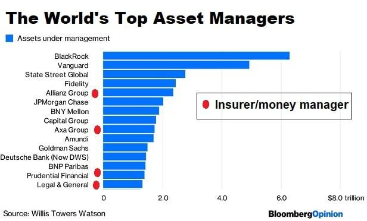

In the ever-evolving financial landscape, effective management of assets and money is crucial for both individual and organizational prosperity. This article explores the interconnected areas of financial management, asset management, money management, and algorithmic trading. By examining these components, we aim to uncover how they collectively enhance financial returns and mitigate risks. The dynamic nature of modern finance necessitates adapting to innovative trading technologies and strategic asset management practices.

Financial management serves as the backbone of economic stability, involving strategic planning and the implementation of financial activities. Asset management focuses on optimizing investment portfolios to achieve specific financial goals. Money management constitutes the discipline required to balance income and expenditures while fostering savings and investments. Finally, algorithmic trading represents a technological advancement reshaping market dynamics through automation and analytical precision.

Understanding the synergy between these disciplines can lead to optimized financial strategies that capitalize on opportunities while mitigating inherent risks. This comprehensive overview underscores the importance of embracing technology and strategic acumen in navigating the complexities of the financial landscape. Through this fusion of traditional and modern techniques, substantial improvements in financial outcomes can be realized, paving the way for enhanced market transparency, accuracy, and efficiency.

## Table of Contents

## Understanding Financial Management

Financial management is a critical component of both individual and corporate financial success, encompassing the strategic planning, organizing, directing, and controlling of financial activities. This multifaceted field includes budgeting, spending, and saving, all aimed at maximizing organizational profitability and ensuring financial health.

Budgeting serves as the cornerstone of financial management, requiring the allocation of resources in a manner that aligns with the strategic objectives of the organization or individual. A well-constructed budget acts as a roadmap, guiding financial decisions and helping to prevent overspending. It involves estimating revenues and expenses over a specified future period, thereby setting financial targets and establishing performance metrics.

Effective resource allocation is another pivotal aspect of financial management. This process entails determining the optimal distribution of financial resources among various competing projects or departments. The goal is to ensure the highest possible return on investment (ROI). Key to this is a thorough understanding of the financial metrics and market conditions that influence decision-making. For instance, the Capital Asset Pricing Model (CAPM) may be used to assess the expected return of an investment, calculated as:

$$
\text{Expected Return} = R_f + \beta \times (R_m - R_f)
$$

Where $R_f$ is the risk-free rate, $\beta$ is the beta of the investment, and $R_m$ is the expected market return.

Strategic financial management also involves continuous monitoring and evaluation of financial performance. This requires regular financial audits to ensure transparency and compliance with regulatory standards. Financial managers must adapt to changing market dynamics and economic conditions, making adjustments to financial strategies to safeguard and enhance financial health.

In conclusion, financial management is essential to achieving and maintaining financial stability and success. Through effective budgeting and resource allocation, both individuals and corporations can optimize their financial strategies to achieve their desired outcomes.

## Role of Asset Managers

Asset managers play a critical role in managing investments to achieve specified financial goals for their clients. They apply their expertise to select and manage a diversified portfolio comprising various asset classes, such as stocks, bonds, and real estate. This selection process involves a thorough analysis of each asset’s potential to contribute to the overall investment objectives. By carefully crafting a portfolio, asset managers strive to optimize returns while managing risk to ensure alignment with the client’s financial aspirations.

The responsibility of asset managers extends to continuously assessing financial markets. This involves monitoring economic indicators, corporate performance, and global events that may influence market conditions. Based on this analysis, they adjust portfolios to align with current market trends and the specific objectives of their clients. This dynamic approach helps in capturing potential growth opportunities while mitigating exposure to adverse market movements.

Furthermore, asset managers ensure that the composition of asset portfolios adheres to the clients' risk tolerances and investment horizons. They apply risk management strategies to balance the trade-off between risk and return, tailoring investment strategies to meet the unique needs of each client. This might involve periodic rebalancing of the portfolio to maintain the desired level of risk exposure or adjusting the investment strategy to react to changing market conditions or client preferences.

Asset managers exert a significant influence on investment decisions and contribute to financial security by utilizing their knowledge and insights. Their ability to interpret market signals and anticipate future trends can significantly enhance the quality of investment choices, ultimately leading to better financial outcomes. This expertise not only assures clients of more informed decisions but also builds trust in the sustainable growth and stability of their investments.

In summary, asset managers serve as pivotal figures in the financial markets by expertly managing investments to achieve financial goals, adapting portfolios to market conditions, and aligning strategies with client-specific risk profiles. Their work significantly impacts investment outcomes, fostering financial security and informed decision-making.

## Money Management Techniques

Effective money management is essential for individuals and organizations seeking to maintain financial stability and achieve growth. It involves balancing income, savings, spending, and investing in a way that optimizes financial health and prevents future financial pitfalls. At its core, effective money management adheres to several critical principles, including disciplined budgeting, strategic investing, and regular financial audits.

Disciplined budgeting serves as the foundation of successful money management. By establishing a budget, individuals and organizations can track income and expenses precisely, identify areas for potential savings, and plan for future financial needs. This process involves categorizing expenses, setting spending limits based on income, and adjusting these as financial circumstances evolve. A simple budgeting formula can be expressed as:

$$
\text{Net Income} = \text{Total Income} - \text{Total Expenses}
$$

Strategic investing is another pillar of money management, guiding where and how to allocate surplus funds to generate returns. This principle involves assessing risk tolerance, investment horizon, and financial goals to create a diversified portfolio that mitigates risk while aiming for optimal returns. Strategic investing requires a thorough understanding of financial markets and investment tools such as stocks, bonds, mutual funds, and real estate. The practice of dollar-cost averaging, where investments are made at regular intervals regardless of market conditions, is a popular method for reducing the emotional impact of market [volatility](/wiki/volatility-trading-strategies).

Regular financial audits and reviews of one's financial position are crucial to ensure adherence to budgeting and investment strategies. These audits involve evaluating current financial statements, comparing them with historical data, and making necessary adjustments to achieve financial goals. This practice helps in identifying unproductive assets or financial commitments that may need reevaluation.

In recent years, personal finance apps have revolutionized money management by providing users with easy-to-use tools to track their finances, set budgets, and gain insights into their spending habits. These apps, such as Mint, YNAB (You Need A Budget), and PocketGuard, offer features like expense categorization, alerts for unusual spending, and integrated financial goal setting. By utilizing these digital tools, users can streamline their financial management processes and gain real-time insights into their financial status.

Adopting robust money management techniques offers numerous advantages. Firstly, it reduces the likelihood of falling into debt traps by promoting prudent financial habits and fostering a clear understanding of one's financial situation. Secondly, these techniques contribute to long-term financial stability by ensuring that income is not outpaced by expenses and that savings and investments are consistently monitored and optimized. Lastly, effective money management enables individuals and companies to respond to economic changes with agility, safeguard against unforeseen expenses, and plan for major life events such as retirement or business expansion.

In conclusion, the adoption of effective money management strategies, bolstered by technological tools, empowers individuals and organizations to secure their financial futures. By balancing income, expenditures, and investments through disciplined practices, long-term financial objectives become attainable and manageable.

## Algorithmic Trading: Transforming Money Management

Algorithmic trading, commonly referred to as algo trading, is a method of executing trades using pre-set instructions that account for variables such as timing, price, and [volume](/wiki/volume-trading-strategy). The primary advantage of [algorithmic trading](/wiki/algorithmic-trading) is that it significantly enhances trading speed and accuracy. By automating the trading process, it reduces human error and minimizes the emotional biases that often influence trading decisions. The use of algorithms allows for the rapid execution of trades, which is crucial in markets where prices can change in fractions of a second.

The integration of [artificial intelligence](/wiki/ai-artificial-intelligence) (AI) and [machine learning](/wiki/machine-learning) into algorithmic trading further optimizes both tactical and strategic execution. These technologies enable systems to learn from historical data and adjust trading strategies dynamically. Machine learning algorithms can identify patterns and trends that are not immediately obvious to human analysts, allowing for more informed trading decisions. For instance, neural networks and natural language processing can be employed to predict stock price movements by analyzing large datasets, including market sentiment, news articles, and economic indicators.

Algorithmic trading represents a considerable shift in market dynamics, fostering more efficient and [quantitative trading](/wiki/quantitative-trading) methods. Traditional trading requires manual input and extensive analysis by human traders, which can be time-consuming and prone to error. In contrast, algorithmic trading systems can process vast amounts of data quickly, executing trades at optimal prices while adhering to defined risk parameters. This transformation has democratized access to sophisticated trading strategies, enabling both institutional investors and individual traders to participate in markets previously dominated by large financial entities.

The potential of algorithmic trading to revolutionize traditional money management practices is significant. By leveraging data-driven insights and automation, traders can achieve better risk management and portfolio optimization. For example, by assessing historical volatility and asset correlation, algorithms can construct diversified portfolios that minimize risk while maximizing returns. Furthermore, algorithmic trading can introduce greater market [liquidity](/wiki/liquidity-risk-premium) and transparency, as the continuous buying and selling activities facilitate tighter bid-ask spreads.

In conclusion, algorithmic trading is a powerful tool that is redefining the landscape of money management. Its ability to enhance trading precision, speed, and decision-making without the influence of human emotions provides a compelling case for its integration into modern financial strategies.

## Benefits and Challenges of Algo Trading

Algorithmic trading, often referred to as algo trading, facilitates the precise and swift execution of trades by leveraging sophisticated algorithms. This method significantly benefits asset management by optimizing trade execution, thereby reducing market impact and improving the efficiency of the trading process.

One of the primary advantages of algo trading is its ability to execute trades at high speeds, far surpassing human capabilities. By automating the trading process, algo trading reduces the likelihood of human error and eliminates emotional biases that can adversely affect trading decisions. The integration of artificial intelligence (AI) and machine learning further enhances the decision-making process in algo trading. These technologies allow for the continuous analysis of market data, enabling the adjustment of trading strategies in real-time to capitalize on market opportunities.

However, the adoption of algo trading is not without challenges. One significant concern is the need for robust data security. As trading strategies are often proprietary and highly sensitive, protecting this data from breaches is critical. Additionally, algorithmic systems require regular updates to remain effective in dynamic market conditions. This need for constant maintenance and development can be resource-intensive, requiring substantial investment in technology and skilled personnel.

Navigating the complex landscape of financial regulations presents another challenge. Algo trading systems must adhere to stringent regulatory requirements to ensure fair and transparent trading practices. Compliance with these regulations necessitates comprehensive monitoring and auditing of trading activities to prevent market manipulation and ensure the integrity of the financial markets.

The balance between technological innovation and secure, compliant practices is paramount. Algo trading systems must be designed to maximize efficiency while safeguarding against potential risks. Strategies to achieve this balance include implementing robust security protocols, maintaining transparent operations, and engaging in continuous regulatory compliance.

In maximizing the advantages of algo trading, stakeholders should focus on leveraging the speed and accuracy that automation brings while addressing the accompanying risks. By doing so, both asset managers and individual investors can harness the transformative potential of algorithmic trading to achieve enhanced financial outcomes.

## Conclusion

The integration of asset management, money management, and algorithmic trading significantly reshapes the financial services landscape. These elements, when harmonized effectively, promise to enhance the strategic framework of financial operations for both institutional and individual investors. Modern trading technologies such as algorithmic trading offer substantial benefits. They facilitate rapid execution of trades, minimize the impact of human error, and eliminate emotional bias, thereby fostering a more disciplined financial environment. 

However, the implementation of these technologies necessitates careful adherence to regulatory frameworks to ensure market stability and security. The dynamic nature of financial regulations, coupled with the sophistication of trading algorithms, demands continuous updates and a vigilant approach to data security.

Asset managers and individual investors are poised to reap significant rewards from these innovations. The strategic enhancements provided by advanced trading technologies can lead to improved decision-making processes, promoting higher levels of financial security and performance. They are instrumental in developing portfolios that are better aligned with market trends and investor risk profiles, ultimately leading to optimized financial outcomes.

Moreover, these advancements contribute to improved market transparency, accuracy, and efficiency. Real-time data analytics and execution capabilities offer clearer insights into market dynamics, equipping stakeholders with the information needed to navigate complex financial environments.

The future of financial management appears promising as technology and strategy increasingly intertwine. The potential for enhanced returns is coupled with an elevated emphasis on compliance and ethical practice, paving the way for a robust financial ecosystem that aligns with both modern technological capabilities and traditional financial goals.

## References & Further Reading

[1]: Bergstra, J., Bardenet, R., Bengio, Y., & Kégl, B. (2011). ["Algorithms for Hyper-Parameter Optimization."](https://papers.nips.cc/paper/4443-algorithms-for-hyper-parameter-optimization) Advances in Neural Information Processing Systems 24.

[2]: ["Advances in Financial Machine Learning"](https://www.amazon.com/Advances-Financial-Machine-Learning-Marcos/dp/1119482089) by Marcos Lopez de Prado

[3]: ["Evidence-Based Technical Analysis: Applying the Scientific Method and Statistical Inference to Trading Signals"](https://www.amazon.com/Evidence-Based-Technical-Analysis-Scientific-Statistical/dp/0470008741) by David Aronson

[4]: ["Machine Learning for Algorithmic Trading"](https://github.com/stefan-jansen/machine-learning-for-trading) by Stefan Jansen

[5]: ["Quantitative Trading: How to Build Your Own Algorithmic Trading Business"](https://www.amazon.com/Quantitative-Trading-Build-Algorithmic-Business/dp/1119800064) by Ernest P. Chan