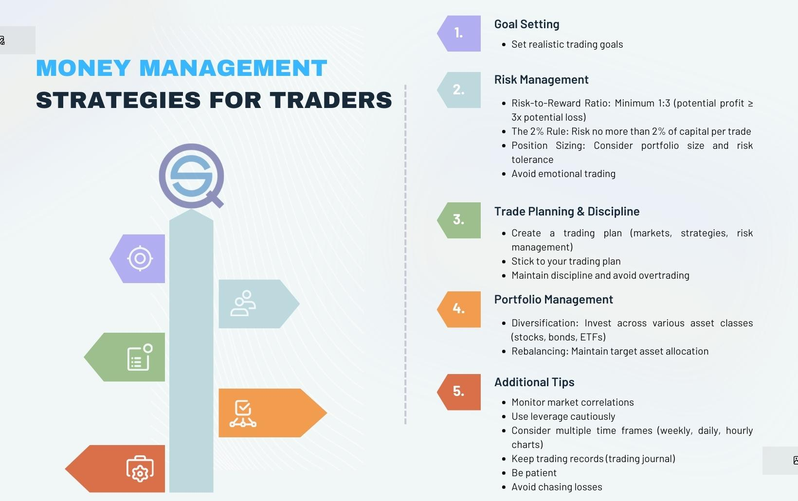

## Table of Contents

## What is money management in trading?

Money management in trading is about how you handle your money when you buy and sell things like stocks or currencies. It's important because it helps you decide how much money to use for each trade, so you don't lose all your money if things go wrong. Good money management means setting rules for yourself, like only using a small part of your money for each trade, so you can keep trading even if you lose sometimes.

One key part of money management is setting stop-loss orders. A stop-loss order is like a safety net that automatically sells your investment if it drops to a certain price, to stop you from losing too much money. Another part is knowing how much you can afford to lose, which is called risk management. By figuring out how much you can lose without hurting your overall money situation, you can make smarter choices about which trades to make and how much money to put into them.

## Why is money management important for traders?

Money management is really important for traders because it helps them keep their money safe while they try to make more money. When you trade, you can win some and lose some. If you don't manage your money well, you might lose a lot on just one bad trade. By using good money management, traders can decide how much money to use for each trade. This way, they can keep trading even if they lose sometimes, without losing all their money.

Another reason money management is important is that it helps traders stay calm and make better decisions. When you know you have a plan for your money, you don't get too worried about losing it all. This means you can think more clearly about which trades to make. Good money management also includes setting stop-loss orders, which are like safety nets that stop you from losing too much on one trade. By managing your money well, you can trade longer and have a better chance of making money over time.

## What are the basic principles of money management in trading?

The first basic principle of money management in trading is to never risk too much money on a single trade. Traders should only use a small part of their total money for each trade, often around 1% to 2%. This way, if they lose on that trade, they still have most of their money left to keep trading. It's like not putting all your eggs in one basket. By sticking to this rule, traders can handle losses better and keep trading without going broke.

Another important principle is to use stop-loss orders. A stop-loss order is a tool that automatically sells your investment if it drops to a certain price. This helps limit how much money you can lose on one trade. It's like having a safety net that catches you if you fall. By setting stop-loss orders, traders can protect their money and avoid big losses. Together with not risking too much money per trade, using stop-loss orders helps traders manage their money well and stay in the game longer.

Lastly, knowing your risk level is key. This means figuring out how much money you can afford to lose without hurting your overall money situation. Traders should only use money they can afford to lose for trading. This helps them make smarter choices about which trades to make and how much money to put into them. By understanding their risk level, traders can trade with more confidence and avoid making risky decisions that could lead to big losses.

## How can beginners start implementing money management strategies?

Beginners can start implementing money management strategies by first figuring out how much money they can afford to lose. They should only use money they don't need for important things like bills or food. Once they know this, they can set a rule to only use a small part of their money for each trade, like 1% or 2%. This means if they have $1,000 to trade with, they should not use more than $10 to $20 on any single trade. This helps them keep most of their money safe, even if they lose on a trade.

Next, beginners should learn how to use stop-loss orders. A stop-loss order is a tool that automatically sells a trade if it starts losing too much money. For example, if they buy a stock for $50, they can set a stop-loss order at $45. This means if the stock drops to $45, it will sell automatically, so they don't lose more than $5. By using stop-loss orders, beginners can protect their money and avoid big losses. They can practice setting stop-loss orders on a demo account before using real money, which helps them get comfortable with this important tool.

## What is the difference between risk management and money management in trading?

Risk management and money management in trading are both important, but they focus on different things. Risk management is about figuring out how much money you can lose on a trade and deciding if it's worth it. It's like looking at the weather before you go out - you want to know if it's safe or if you might get caught in a storm. In trading, risk management means setting rules for yourself, like only risking a small amount of money on each trade, and using tools like stop-loss orders to limit your losses. It's all about keeping your trading safe and making sure you don't lose too much money on any single trade.

Money management, on the other hand, is about how you handle your overall money when you trade. It's like planning your budget - you decide how much money to spend on different things. In trading, money management means deciding how much of your total money to use for trading, and then how to split that money up for different trades. It includes things like deciding to only use a small part of your money for each trade, usually around 1% to 2%. Money management helps you make sure you have enough money to keep trading, even if you lose sometimes. Both risk management and money management are key to being a successful trader, but they work together to keep your money safe and help you make smart trading choices.

## What are some common money management mistakes traders make?

One common money management mistake traders make is not setting stop-loss orders. Stop-loss orders are like safety nets that automatically sell a trade if it starts losing too much money. Without them, a trader can lose a lot on just one bad trade. It's like not wearing a seatbelt in a car; if something goes wrong, you could get hurt badly. By not using stop-loss orders, traders risk losing more money than they can afford, which can make them stop trading altogether.

Another mistake is risking too much money on a single trade. Traders should only use a small part of their money for each trade, usually around 1% to 2%. But some traders get too excited or too sure about a trade and use too much money. It's like betting all your money on one roll of the dice. If they lose, they might not have enough money left to keep trading. This can lead to big losses and even losing all their money.

Lastly, some traders don't have a clear plan for their money. They might use money they need for important things like bills or food to trade. This is risky because if they lose, they could be in big trouble. Good money management means only using money you can afford to lose and having a plan for how to use it. Without a clear plan, traders can make bad decisions and end up losing more money than they should.

## How does position sizing impact money management?

Position sizing is about deciding how much money to use for each trade. It's a big part of money management because it helps you control how much you can lose. If you use too much money on one trade, you could lose a lot if things go wrong. But if you use just a little bit, like 1% or 2% of your total money, you can still keep trading even if you lose sometimes. This way, you don't risk losing everything on one bad trade.

Good position sizing means you can trade longer and have more chances to make money. It's like not putting all your eggs in one basket. By only using a small part of your money for each trade, you can handle losses better and stay in the game. This helps you stay calm and make smarter choices about which trades to make. In the end, good position sizing is key to keeping your money safe and making money over time.

## What are advanced money management techniques used by experienced traders?

Experienced traders often use a technique called the Kelly Criterion to figure out how much money to use for each trade. The Kelly Criterion is a math formula that helps traders decide the best amount of money to risk, based on how likely they think a trade will work out and how much money they could make or lose. It's like a smart way to bet, where you use more money when you're pretty sure you'll win, but not too much that you could lose everything if you're wrong. By using the Kelly Criterion, experienced traders can make more money over time while keeping their losses small.

Another advanced technique is using multiple accounts or strategies to spread out their risk. Instead of putting all their money into one trading account, experienced traders might use different accounts for different kinds of trades or strategies. This way, if one type of trade goes bad, they still have money in other accounts to keep trading. It's like having different baskets for your eggs, so if one basket falls, you don't lose all your eggs. By spreading out their money and using different strategies, experienced traders can handle losses better and have a better chance of making money over time.

## How can leverage affect money management strategies?

Leverage is like borrowing money to trade with more than you have. It can make your wins bigger, but it can also make your losses bigger. If you use too much leverage, you could lose a lot of money very quickly. So, when you use leverage, you need to be very careful with your money management. You should use less money for each trade than you would without leverage, maybe even less than 1% of your money. This way, if you lose, you won't lose everything.

Experienced traders know that leverage can be a powerful tool, but it needs to be used wisely. They might use less leverage than what's available to them, to keep their risk small. They also set tighter stop-loss orders to limit how much they can lose on each trade. By being careful with leverage and using good money management, traders can still try to make more money, but without risking too much. It's all about finding the right balance between using leverage to grow your money and keeping your losses small.

## What role does diversification play in money management?

Diversification is like not putting all your eggs in one basket. It means spreading your money across different types of trades or investments. When you diversify, you're not betting everything on just one thing. If one trade goes bad, you still have money in other trades that might do well. This helps you lose less money overall and gives you more chances to make money. By diversifying, you can handle ups and downs in the market better and keep your money safer.

Experienced traders use diversification to manage their money well. They might trade different kinds of stocks, currencies, or even use different trading strategies. This way, if one part of their trading plan doesn't work out, they can still make money from other parts. Diversification helps them keep their losses small and their gains steady over time. It's a key part of good money management because it helps traders stay in the game longer and have a better shot at making money in the long run.

## How can traders use stop-loss orders as part of their money management?

Traders use stop-loss orders as a key part of their money management to protect their money. A stop-loss order is like a safety net that automatically sells a trade if it starts losing too much money. For example, if a trader buys a stock for $50, they can set a stop-loss order at $45. This means if the stock drops to $45, it will sell automatically, so the trader doesn't lose more than $5. By using stop-loss orders, traders can limit their losses on each trade and keep more of their money safe.

Setting stop-loss orders helps traders stay calm and make better decisions. When traders know they have a safety net in place, they don't worry as much about losing all their money on one bad trade. This helps them think more clearly about which trades to make and how much money to use for each trade. By using stop-loss orders as part of their money management, traders can trade longer and have a better chance of making money over time.

## What are the psychological aspects of money management in trading?

The psychological aspects of money management in trading are really important. When traders manage their money well, it helps them feel less stressed and more confident. They know they have a plan to protect their money, so they don't get too worried about losing it all on one bad trade. This makes it easier for them to stay calm and make smart decisions about which trades to make. Good money management can also help traders avoid getting too excited or too sure about a trade, which can lead to risky decisions and big losses.

On the other hand, bad money management can make traders feel scared and unsure. If they risk too much money on a single trade or don't use stop-loss orders, they might lose a lot and feel like they can't keep trading. This can lead to fear and stress, which can make them make even worse decisions. By understanding the psychological side of money management, traders can take steps to stay calm, think clearly, and trade better over time.

## What are the key money management strategies in algo trading?

Algorithmic trading necessitates robust money management strategies to warrant success and sustain profitability. Key strategies integral to this process include diversification, setting risk-to-reward ratios, determining position sizing, efficient leverage management, and the deployment of stop-loss orders.

**Diversification** is a fundamental tactic aimed at reducing risk by spreading investments across a variety of assets. By ensuring that the trading portfolio is not overly concentrated in a single asset or market, the adverse impact of a poorly performing trade can be mitigated. This strategic allocation minimizes the portfolio's volatility and stabilizes returns over time.

**Risk-to-Reward Ratio** is a critical concept used to evaluate the expected returns of a trade against its anticipated risk. This ratio is calculated by dividing the potential profit by the potential loss. For example, a risk-to-reward ratio of 1:3 implies that the trader expects to earn three times the potential loss on a trade. Setting a favorable risk-to-reward ratio assists in determining exit points, ensuring that traders only engage in trades where the potential rewards significantly outweigh the risks.

**Position Sizing** involves calculating the optimal amount of capital to invest in a trade relative to the size of the trader's account and their risk tolerance. Proper position sizing can be achieved using the formula:

$$
\text{Position Size} = \frac{\text{Risk per Trade}}{\text{Trade Risk}}
$$

where Risk per Trade is a percentage of total capital that the trader is willing to risk, and Trade Risk is the difference between the entry price and the stop-loss price. This ensures that a series of unsuccessful trades do not deplete the trader's capital.

**Leverage Management** is essential in algo trading, as leverage can magnify both gains and losses. Traders must manage leverage judiciously to amplify returns without exposing themselves to potentially catastrophic losses. Proper leverage management often involves setting firm leverage limits and monitoring exposure to ensure it remains within predefined bounds.

**Stop-Loss Orders** are automated instructions to close a trade when it reaches a certain loss threshold, thereby preventing further capital erosion. This is particularly crucial in algo trading, as it ensures that trades are terminated promptly without waiting for manual intervention, preserving capital in volatile market conditions. Stop-loss levels should be set carefully, based on volatility measures and risk assessments, to avoid premature exits due to normal price fluctuations.

Integrating these key money management strategies within [algorithmic trading](/wiki/algorithmic-trading) protocols enhances the consistency and reliability of trade outcomes, ultimately supporting a trader's financial objectives.

## References & Further Reading

[1]: Bergstra, J., Bardenet, R., Bengio, Y., & Kégl, B. (2011). ["Algorithms for Hyper-Parameter Optimization."](https://papers.nips.cc/paper/4443-algorithms-for-hyper-parameter-optimization) Advances in Neural Information Processing Systems 24.

[2]: ["Advances in Financial Machine Learning"](https://www.amazon.com/Advances-Financial-Machine-Learning-Marcos/dp/1119482089) by Marcos Lopez de Prado

[3]: ["Evidence-Based Technical Analysis: Applying the Scientific Method and Statistical Inference to Trading Signals"](https://www.amazon.com/Evidence-Based-Technical-Analysis-Scientific-Statistical/dp/0470008741) by David Aronson

[4]: ["Machine Learning for Algorithmic Trading"](https://github.com/stefan-jansen/machine-learning-for-trading) by Stefan Jansen

[5]: ["Quantitative Trading: How to Build Your Own Algorithmic Trading Business"](https://books.google.com/books/about/Quantitative_Trading.html?id=j70yEAAAQBAJ) by Ernest P. Chan