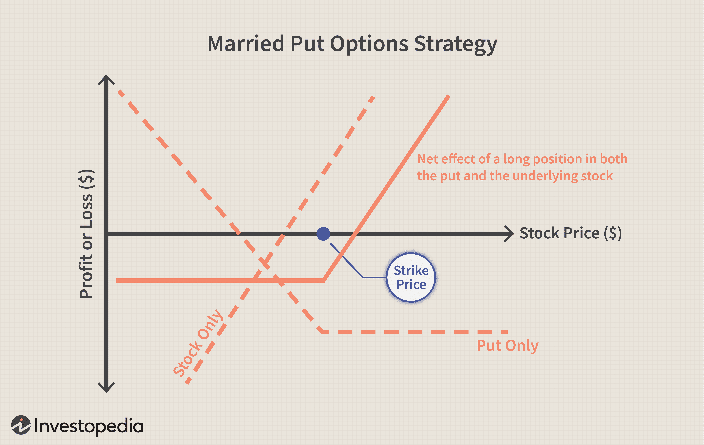

In trading, managing financial resources is pivotal to a trader's success. The rise of algorithmic trading (algo trading) has transformed traditional money management principles, integrating technology and precision into trading processes. Algo trading involves the use of computer algorithms to execute trades at speeds and frequencies that are impossible for human traders.

With financial markets becoming increasingly complex, understanding and implementing effective money management strategies tailored for algo trading has become essential for traders. These strategies not only help control risk and protect capital but also ensure that trading decisions are supported by robust financial frameworks. This article aims to explore these strategies, offering valuable insights for both novice and seasoned traders.



By comprehending these strategies, traders can navigate financial markets with greater confidence and precision, adapting to the evolving trading landscape while leveraging technological advancements. Effective money management in algorithmic trading incorporates elements such as risk mitigation, capital allocation, and strategic automation, ensuring that trades are executed efficiently and profitably.

## Table of Contents

## Understanding Algorithmic Trading

Algorithmic trading, often referred to as algo trading, involves the use of computer programs to execute trades upon fulfilling specific criteria related to timing, price, and quantity. These criteria are defined within the algorithms that automate trading processes, aiming to achieve optimal execution and improved efficiency over manual trading methods.

One of the primary advantages of algorithmic trading is its precision in execution. Algorithms can monitor multiple market conditions in real time, executing trades at the exact moment predetermined criteria are met. This level of precision significantly reduces slippage, a common issue in manual trading where the executed trade price diverges from the intended price. 

Additionally, algorithmic trading minimizes human error, a crucial [factor](/wiki/factor-investing) in fast-paced financial markets. Human traders are susceptible to emotional biases and fatigue, which can lead to inconsistent decision-making. Algorithms, devoid of emotions, execute trades based solely on the set rules, ensuring a consistent approach to trading strategies.

The ability of algorithmic systems to process vast amounts of information swiftly is another significant advantage. Financial markets generate huge volumes of data continuously. Algorithms can analyze this data across multiple securities and time frames more rapidly than a human could, identifying and acting on trading opportunities almost instantaneously.

Despite these advantages, [algorithmic trading](/wiki/algorithmic-trading) is not without its challenges. A primary concern is the dependency on technology, which means that any failure in the technological infrastructure can have serious repercussions on trading activities. This includes hardware malfunctions, software bugs, and internet connectivity issues, all of which could impact the ability to trade effectively.

Furthermore, there is a substantial need for high initial capital investment. Developing robust trading algorithms requires sophisticated software, powerful computers, and extensive data for [backtesting](/wiki/backtesting), all of which contribute to the cost barrier for many traders. This investment, while potentially leading to more effective trading systems, necessitates a careful evaluation of expected returns against the upfront costs.

In summary, algorithmic trading offers significant benefits in terms of precision, efficiency, and data processing capabilities. However, traders must also contend with technological dependencies and the need for significant capital investment to unlock these benefits.

## The Importance of Money Management in Trading

Effective money management is a cornerstone of successful trading, serving to control risk, protect capital, and maximize profits. By employing sound financial strategies, traders can mitigate the uncertainties inherent in the markets and maintain a stable trajectory towards their investment objectives. This is particularly critical in algorithmic trading, where the velocity and [volume](/wiki/volume-trading-strategy) of transactions can amplify both gains and losses.

Without a robust money management framework, traders expose themselves to considerable financial risk, irrespective of the potential efficacy of their trading strategies. This could lead to substantial losses that erode capital swiftly. To prevent this, traders should implement a set of rules that govern entry and [exit](/wiki/exit-strategy) points, position sizing, and risk limits.

In the context of algorithmic trading, these money management principles must be seamlessly integrated into the trading algorithms themselves. By embedding financial parameters directly within the algorithms, traders can ensure that automated decisions remain aligned with their risk tolerance and financial goals. This integration serves as a safeguard against market [volatility](/wiki/volatility-trading-strategies), offering a structured approach that balances opportunity with security.

A well-defined money management strategy might include setting a maximum percentage of capital to risk per trade, defining stop-loss levels, and determining position sizes based on the trader's overall equity and risk appetite. For example, a trader might decide to risk only 2% of their total capital on any given trade. If their account balance is $100,000, the potential loss on a trade should not exceed $2,000. 

```python
# Example of calculating position size using risk percentage
def calculate_position_size(account_balance, risk_percentage, stop_loss_amount):
    risk_amount = account_balance * (risk_percentage / 100)
    position_size = risk_amount / stop_loss_amount
    return position_size

account_balance = 100000  # in dollars
risk_percentage = 2  # risk percentage per trade
stop_loss_amount = 50  # in dollars per unit

position_size = calculate_position_size(account_balance, risk_percentage, stop_loss_amount)
print(f"Position size: {position_size} units")
```

By coding money management rules directly into the trading system, traders can remove emotional biases and ensure consistent application of their strategies. Additionally, this approach allows for ongoing monitoring and adjustment, meaning that strategies can be refined as market conditions evolve, thereby preserving the integrity and profitability of the investment portfolio.

## Key Money Management Strategies in Algo Trading

Algorithmic trading necessitates robust money management strategies to warrant success and sustain profitability. Key strategies integral to this process include diversification, setting risk-to-reward ratios, determining position sizing, efficient leverage management, and the deployment of stop-loss orders.

**Diversification** is a fundamental tactic aimed at reducing risk by spreading investments across a variety of assets. By ensuring that the trading portfolio is not overly concentrated in a single asset or market, the adverse impact of a poorly performing trade can be mitigated. This strategic allocation minimizes the portfolio's volatility and stabilizes returns over time.

**Risk-to-Reward Ratio** is a critical concept used to evaluate the expected returns of a trade against its anticipated risk. This ratio is calculated by dividing the potential profit by the potential loss. For example, a risk-to-reward ratio of 1:3 implies that the trader expects to earn three times the potential loss on a trade. Setting a favorable risk-to-reward ratio assists in determining exit points, ensuring that traders only engage in trades where the potential rewards significantly outweigh the risks.

**Position Sizing** involves calculating the optimal amount of capital to invest in a trade relative to the size of the trader's account and their risk tolerance. Proper position sizing can be achieved using the formula:

$$
\text{Position Size} = \frac{\text{Risk per Trade}}{\text{Trade Risk}}
$$

where Risk per Trade is a percentage of total capital that the trader is willing to risk, and Trade Risk is the difference between the entry price and the stop-loss price. This ensures that a series of unsuccessful trades do not deplete the trader's capital.

**Leverage Management** is essential in algo trading, as leverage can magnify both gains and losses. Traders must manage leverage judiciously to amplify returns without exposing themselves to potentially catastrophic losses. Proper leverage management often involves setting firm leverage limits and monitoring exposure to ensure it remains within predefined bounds.

**Stop-Loss Orders** are automated instructions to close a trade when it reaches a certain loss threshold, thereby preventing further capital erosion. This is particularly crucial in algo trading, as it ensures that trades are terminated promptly without waiting for manual intervention, preserving capital in volatile market conditions. Stop-loss levels should be set carefully, based on volatility measures and risk assessments, to avoid premature exits due to normal price fluctuations.

Integrating these key money management strategies within algorithmic trading protocols enhances the consistency and reliability of trade outcomes, ultimately supporting a trader's financial objectives.

## Advanced Methods: Integrating Quantitative Analysis

Quantitative analysis plays a crucial role in enhancing algorithmic trading strategies by employing mathematical models to articulate, implement, and evaluate trading opportunities. Through quantitative models, traders can assess and confirm risk-adjusted strategies, aiming to optimize returns while maintaining a stringent focus on risk management. One fundamental approach involves using statistical techniques to forecast asset price movements and identify market inefficiencies. These analytical methods help traders achieve a systematic approach to decision-making, free from emotional biases.

The integration of quantitative techniques typically extends to sophisticated methodologies such as time-series analysis, regression models, and [machine learning](/wiki/machine-learning) algorithms. For instance, traders might employ linear regression to model the relationship between different financial variables and future asset prices. Machine learning algorithms, such as support vector machines or neural networks, allow for pattern recognition in vast datasets, identifying trading signals that might be imperceptible through traditional methods.

A key element of quantitative analysis is backtesting. By applying trading models to historical data, traders can understand potential risks and rewards and refine their strategies. Backtesting provides valuable insights into the model’s performance over time, identifying periods of drawdown and potential areas for improvement. For example, a trader might use the following Python snippet to backtest a simple moving average crossover strategy:

```python
import pandas as pd

def backtest_strategy(data, short_window, long_window):
    signals = pd.DataFrame(index=data.index)
    signals['price'] = data['Close']
    signals['short_mavg'] = data['Close'].rolling(window=short_window, min_periods=1).mean()
    signals['long_mavg'] = data['Close'].rolling(window=long_window, min_periods=1).mean()
    signals['signal'] = 0.0
    signals['signal'][short_window:] = np.where(signals['short_mavg'][short_window:] > signals['long_mavg'][short_window:], 1.0, 0.0)
    signals['positions'] = signals['signal'].diff()

    return signals

# Example usage
# data = pd.read_csv('historical_stock_prices.csv')
# strategy_signals = backtest_strategy(data, short_window=40, long_window=100)
```

Backtesting results guide traders in refining model parameters and improving strategy performance. It also assists in stress-testing strategies under various market conditions to evaluate robustness and adaptability. This quantitative vigilance is indispensable as it equips traders with the predictive foresight needed to respond proactively to future market dynamics.

Through the rigorous application of quantitative analysis, algorithmic traders can transform raw market data into actionable insights and build models that not only seek superior returns but also align with comprehensive risk management frameworks. This quantitative underpinning is imperative for traders who operate in today's data-driven financial markets.

## Integrating Money Management with Algorithmic Trading Systems

Integrating money management strategies into algorithmic trading systems enhances the consistency and precision of trade execution. By coding these strategies directly into algorithms, traders can ensure that decision-making is systematic and not subject to human emotions, which often lead to impulsive or reluctant trading decisions. Automation in this context allows trades to be executed based on predefined rules and risk management guidelines without hesitation or deviation.

One of the primary advantages of automating money management is the ability to adhere strictly to discipline and strategy parameters. For example, position sizing, which determines the amount capitalized in each trade depending on account size and risk tolerance, can be systematically calculated and executed using algorithms. The following Python snippet illustrates how position sizing might be programmed:

```python
def calculate_position_size(account_balance, risk_per_trade, stop_loss_amount):
    # Calculate the dollar amount at risk per trade
    risk_amount = account_balance * risk_per_trade
    # Calculate the position size
    position_size = risk_amount / stop_loss_amount
    return position_size

# Example usage
account_balance = 100000  # Total account balance
risk_per_trade = 0.01     # Risk 1% per trade
stop_loss_amount = 500     # Amount risked per trade
position_size = calculate_position_size(account_balance, risk_per_trade, stop_loss_amount)
print(f"Position size: {position_size}")
```

Moreover, regular updates and testing of these algorithms are crucial for maintaining their effectiveness across different market conditions. This continual refinement process, known as backtesting, involves running algorithms on historical data to gauge their performance and adjust as necessary. Backtesting ensures that the algorithm's approach aligns with current market dynamics and that any flaws or biases are identified before actual capital is deployed.

Another key aspect of integrating money management with algorithmic systems is the use of stop-loss orders. These are automated instructions attached to trades that trigger an exit once the trade reaches a specified loss level, thereby preemptively managing risk and preventing excessive losses. Implementing stop-loss orders within an algorithm contributes to disciplined trading, as illustrated below:

```python
def place_stop_loss_order(entry_price, stop_loss_percent):
    stop_loss_price = entry_price * (1 - stop_loss_percent)
    return stop_loss_price

# Example usage
entry_price = 1500     # Entry price of the asset
stop_loss_percent = 0.02  # 2% stop loss
stop_loss_price = place_stop_loss_order(entry_price, stop_loss_percent)
print(f"Stop loss price: {stop_loss_price}")
```

Ultimately, the integration of money management strategies with algorithmic trading systems signifies a transformative approach, leveraging the precision and consistency of automated systems to maintain robust financial discipline. This mechanization not only removes emotional biases from trading but also fosters an adaptive trading environment where strategies evolve with shifting market landscapes.

## Conclusion

Algorithmic trading offers a range of opportunities for traders to enhance their efficiency and effectiveness in financial markets. However, the integration of sophisticated money management strategies is crucial to sustainable success in this domain. By harnessing the power of technology, traders can improve their profitability while effectively managing risk.

Effective money management remains a cornerstone for successful trading. This involves not only managing risks and capital allocation but ensuring that these principles are seamlessly integrated within algorithmic systems. By doing so, traders can maintain a consistent trading strategy that is impervious to emotional biases and distractions.

Technological advancements provide traders with unprecedented tools to optimize their strategies. These advancements can automate execution, enhance risk management, and integrate sophisticated quantitative analyses. Yet, the potential of these tools can only be fully realized when they are combined with robust money management principles.

Continual learning and adaptation are crucial. The financial markets are in constant flux, affected by shifting economic indicators, geopolitical events, and technological innovations. Traders must remain vigilant, continuously updating their strategies and systems to adapt to changing market conditions. This requires ongoing research, backtesting, and refinement of their trading algorithms.

In conclusion, while algorithmic trading offers immense possibilities for traders, the key to leveraging these opportunities lies in the disciplined application of sound money management strategies. Traders must not only embrace technology but also remain committed to evolving their approaches in response to the dynamic nature of financial markets. By doing so, they position themselves to capitalize on opportunities while ensuring long-term profitability and risk mitigation.

## References & Further Reading

[1]: Bergstra, J., Bardenet, R., Bengio, Y., & Kégl, B. (2011). ["Algorithms for Hyper-Parameter Optimization."](https://papers.nips.cc/paper/4443-algorithms-for-hyper-parameter-optimization) Advances in Neural Information Processing Systems 24.

[2]: ["Advances in Financial Machine Learning"](https://www.amazon.com/Advances-Financial-Machine-Learning-Marcos/dp/1119482089) by Marcos Lopez de Prado

[3]: ["Evidence-Based Technical Analysis: Applying the Scientific Method and Statistical Inference to Trading Signals"](https://www.amazon.com/Evidence-Based-Technical-Analysis-Scientific-Statistical/dp/0470008741) by David Aronson

[4]: ["Machine Learning for Algorithmic Trading"](https://github.com/stefan-jansen/machine-learning-for-trading) by Stefan Jansen

[5]: ["Quantitative Trading: How to Build Your Own Algorithmic Trading Business"](https://books.google.com/books/about/Quantitative_Trading.html?id=j70yEAAAQBAJ) by Ernest P. Chan