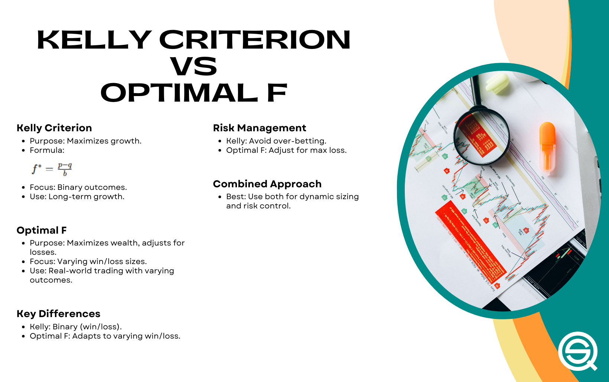

## Table of Contents

## What is the Kelly Criterion and why is it important for money management?

The Kelly Criterion is a formula used to figure out how much money you should bet or invest to make the most money over time while keeping risk low. It was created by a guy named John L. Kelly Jr. in the 1950s. The formula looks at how likely you are to win and how much you could win or lose. It tells you the best part of your money to use so you can grow your money the fastest without risking too much.

The Kelly Criterion is important for money management because it helps you avoid betting too much and losing everything. If you bet too little, you might not make as much money as you could. But if you bet too much, you could lose a lot quickly. The Kelly Criterion finds a balance, so you can keep betting or investing over a long time. This way, you can slowly grow your money without taking big risks that could wipe you out.

## How does the Kelly Criterion formula work?

The Kelly Criterion formula helps you decide how much to bet or invest by using simple math. The formula is: f* = (bp - q) / b, where f* is the fraction of your money you should bet, b is the net odds you get on your bet (like if you bet $1 and win $2, b would be 1), p is the chance of winning, and q is the chance of losing, which is just 1 minus p. So if you have a 50% chance of winning (p = 0.5) and you get your money back plus an extra dollar for every dollar you bet (b = 1), then q would be 0.5 (1 - p). Plugging these into the formula, f* = (1 * 0.5 - 0.5) / 1 = 0. This means you should bet none of your money because the bet isn't worth it.

Using the Kelly Criterion can help you grow your money over time without risking too much. If you follow the formula, it tells you the best amount to bet so you can keep betting for a long time. This is important because betting too much can make you lose everything quickly, and betting too little might not grow your money fast enough. The Kelly Criterion finds the sweet spot so you can keep playing the game and slowly increase your money without taking big risks.

## Can you provide a simple example of how to apply the Kelly Criterion in betting?

Imagine you're betting on a coin flip where you have a 50% chance of winning (p = 0.5). If you bet $1 and win, you get your $1 back plus another $1, so the net odds are 1 (b = 1). The chance of losing is also 50% (q = 0.5). Using the Kelly Criterion formula, f* = (bp - q) / b, you plug in the numbers: f* = (1 * 0.5 - 0.5) / 1 = 0. This means you should bet none of your money because the bet isn't worth it.

Now, let's say the odds change, and for every $1 you bet, you can win $2 if you're right, so the net odds are now 1 (b = 1). The chance of winning is still 50% (p = 0.5), and the chance of losing is still 50% (q = 0.5). Using the Kelly Criterion formula again, f* = (1 * 0.5 - 0.5) / 1 = 0. This still means you should bet none of your money because even with better odds, the bet isn't worth it. The Kelly Criterion helps you see that in both cases, betting on a fair coin flip isn't a good way to grow your money over time.

## What are the benefits of using the Kelly Criterion in investment decisions?

Using the Kelly Criterion in investment decisions can help you make smart choices about how much money to put into different investments. It tells you the best amount to invest based on how likely you are to make money and how much you could win or lose. This way, you can grow your money over time without risking too much. If you follow the Kelly Criterion, you won't bet too much and lose everything, and you won't bet too little and miss out on growing your money as fast as you could.

Another benefit is that the Kelly Criterion helps you keep investing for a long time. It finds a balance so you can keep putting money into good investments without taking big risks that could wipe you out. This is important because investing is about making money slowly over many years, not trying to get rich quick. By using the Kelly Criterion, you can make steady progress and build your wealth safely.

## What are the potential risks and limitations of the Kelly Criterion?

One big risk of using the Kelly Criterion is that it can be too aggressive. It tells you to bet a lot of your money when the odds are good, but this can be scary if you're not ready to lose a big part of your money. If you get the chances of winning wrong or the odds change, you could lose a lot of money quickly. This is why some people use a smaller version of the Kelly Criterion, like betting half of what it says, to be safer.

Another limitation is that the Kelly Criterion needs you to know the exact chances of winning and the exact odds. In real life, it's hard to know these numbers for sure. If you guess wrong, the Kelly Criterion might tell you to bet too much or too little. Also, it doesn't think about how you feel about risk. Some people might not want to bet as much as the Kelly Criterion says, even if the math says it's the best way to grow their money.

## How does the Kelly Criterion differ from other money management strategies?

The Kelly Criterion is different from other money management strategies because it tells you exactly how much of your money to bet or invest based on math. Other strategies might tell you to bet a fixed amount, like always betting 2% of your money no matter what. The Kelly Criterion looks at how likely you are to win and how much you could win or lose, and then it gives you a special number for how much to bet. This way, it can help you grow your money faster than just betting the same amount every time.

But the Kelly Criterion can be more risky than other strategies because it sometimes tells you to bet a lot of your money. Other strategies might be safer because they don't change how much you bet based on the odds. For example, if you always bet 2% of your money, you won't lose too much even if you lose a bet. The Kelly Criterion might tell you to bet 20% of your money if the odds are really good, which can be scary. So, while the Kelly Criterion can help you make more money over time, it might also make you more nervous about losing a big part of your money.

## What is the fractional Kelly strategy and when should it be used?

The fractional Kelly strategy is a way to use the Kelly Criterion but bet less than what it tells you. Instead of betting the full amount the Kelly Criterion says, you bet a smaller part of it, like half or a quarter. This makes the strategy safer because you're not risking as much money at once. It's good for people who don't want to take big risks but still want to use the Kelly Criterion to help them decide how much to bet.

You should use the fractional Kelly strategy if you're worried about losing a lot of money quickly. Even though the full Kelly Criterion can help you grow your money faster, it can also be risky. By using a smaller part of what the Kelly Criterion says, you can still make good choices about how much to bet, but you won't lose as much if you're wrong. This is a good choice for people who want to be careful with their money and keep betting or investing for a long time.

## How can the Kelly Criterion be adjusted for multiple simultaneous bets or investments?

When you want to use the Kelly Criterion for more than one bet or investment at the same time, you need to think about how they might affect each other. If you bet on a lot of things that could all go wrong at the same time, it's riskier than betting on things that don't depend on each other. To adjust the Kelly Criterion for this, you can use something called the "multi-Kelly" approach. This means you figure out the Kelly bet for each thing you're betting on, and then you add them up, but you make sure the total isn't more than 100% of your money. This way, you can spread your bets around without betting too much overall.

For example, if you have three bets and the Kelly Criterion says you should bet 10% on the first one, 15% on the second one, and 20% on the third one, you would add them up to get 45%. If you're using the full Kelly Criterion, you would bet 45% of your money across all three bets. But if you want to be safer, you might use a fractional Kelly strategy and bet half of that, so you'd bet 22.5% of your money in total. This way, you're still using the Kelly Criterion to help you decide how much to bet, but you're spreading your bets around and being careful not to bet too much at once.

## What historical examples demonstrate the successful application of the Kelly Criterion?

One famous example of the Kelly Criterion being used successfully is by Ed Thorp, a math professor who used it to make a lot of money in the stock market and at casinos. In the 1960s, Thorp used the Kelly Criterion to figure out how much to bet when he played blackjack and other casino games. He wrote a book called "Beat the Dealer" that explained how he used math to win at blackjack. Thorp also started a [hedge fund](/wiki/hedge-fund-trading-strategies) where he used the Kelly Criterion to decide how much to invest in different stocks. His fund did really well, and he showed that the Kelly Criterion could help people make smart choices about betting and investing.

Another example is the story of Bill Benter, who used the Kelly Criterion to win big at horse racing. In the 1980s, Benter moved to Hong Kong and started using computers and math to bet on horse races. He used the Kelly Criterion to figure out how much to bet on each race, and it helped him make a lot of money. Benter's betting system was so good that he made over a billion dollars from horse racing. His success showed that the Kelly Criterion could work well in different kinds of betting, not just in casinos or the stock market.

## How can one calculate the optimal bet size using the Kelly Criterion in a real-world scenario?

To calculate the optimal bet size using the Kelly Criterion in a real-world scenario, you need to know two things: how likely you are to win, and what the odds are if you do win. Let's say you're betting on a soccer game, and you think your team has a 60% chance of winning (p = 0.6). If you bet $1 and your team wins, you get your $1 back plus $1.50, so the net odds are 1.5 (b = 1.5). The chance of losing is 40% (q = 0.4). Using the Kelly Criterion formula, f* = (bp - q) / b, you plug in the numbers: f* = (1.5 * 0.6 - 0.4) / 1.5 = 0.2. This means you should bet 20% of your money on this bet.

In real life, it's hard to know the exact chances of winning and the exact odds. You might need to guess or use information from experts to get close to the right numbers. If you're not sure about the chances or the odds, you might want to use a smaller part of the Kelly Criterion, like betting half of what it says. This way, you can still make good choices about how much to bet, but you won't lose as much if you're wrong. Remember, the Kelly Criterion is a tool to help you make smart choices about betting or investing, but it's not perfect, and you should always think about how much risk you're comfortable with.

## What advanced mathematical concepts underpin the Kelly Criterion and how do they affect its application?

The Kelly Criterion is based on some big math ideas, like information theory and probability. Information theory is about how much you can learn from something, and it was created by a guy named Claude Shannon. The Kelly Criterion uses this idea to figure out how much to bet based on how much you know about the chances of winning. Probability is about how likely something is to happen, and the Kelly Criterion uses this to help you make the best bet. These math ideas help the Kelly Criterion find the best way to grow your money over time without taking too much risk.

Even though the Kelly Criterion uses these big math ideas, you don't need to know all about them to use it. You just need to know the chances of winning and the odds of the bet. But understanding these ideas can help you see why the Kelly Criterion works the way it does. For example, if you know more about probability, you can guess the chances of winning better, and that can help you make better bets. And if you understand information theory, you can see how the Kelly Criterion uses what you know to help you bet smarter. So, while you don't need to be a math expert to use the Kelly Criterion, knowing more about these ideas can make you better at using it.

## How can the Kelly Criterion be integrated into algorithmic trading systems?

The Kelly Criterion can be integrated into algorithmic trading systems to help decide how much to invest in different trades. In an algorithmic trading system, you can use the Kelly Criterion formula to figure out the best amount to bet based on the chances of making money and the possible gains or losses. You would need to input the probability of a trade being successful and the expected return if it succeeds. The system would then calculate the optimal fraction of your money to put into each trade, helping you to grow your money over time while keeping risk low. This can be done automatically by the trading algorithm, making it easier to manage many trades at once without having to do the math by hand.

However, integrating the Kelly Criterion into algorithmic trading systems requires careful consideration of the risks and limitations. Since the Kelly Criterion can suggest betting a large part of your money when the odds are good, it might be too risky for some traders. To manage this, you could use a fractional Kelly strategy, where you bet less than the full amount suggested by the formula. Also, the system needs to accurately estimate the probabilities and expected returns, which can be hard in real markets where things change quickly. By adjusting the Kelly Criterion to fit these challenges, you can use it to make smarter trading decisions and help your algorithmic trading system work better.

## What is the Kelly Formula and how does it work?

The Kelly Formula serves as a powerful mathematical tool to determine optimal bet sizes by considering the probability of success alongside the payout ratio. Initially conceived for the telecommunications sector, it swiftly found its relevance within gambling and investing, predominantly due to its adeptness in managing risk and optimizing capital utilization. 

The formula calculates the proportion of capital to place in a particular bet, which is expressed as:

$$
f^* = \frac{bp - q}{b}
$$

Where:
- $f^*$ represents the fraction of the total portfolio to wager,
- $b$ is the odds received on the wager (net odds),
- $p$ is the probability of success,
- $q$ is the probability of failure (where $q = 1 - p$).

Understanding these components is essential for the successful application of the Kelly criterion in [algorithmic trading](/wiki/algorithmic-trading). The odds ($b$) must be accurately gauged to reflect real market or game conditions, and the probabilities ($p$ and $q$) have to be estimated realistically based on historical data or predictive modeling. In contexts involving financial markets, these probabilities might be derived from complex statistical or [machine learning](/wiki/machine-learning) models that predict price movements or the likelihood of particular trading strategies succeeding.

The beauty of the Kelly Formula lies in its theoretical rigor, offering a balance between risk and growth by maximizing the expected logarithm of wealth, thus aiming to avoid over-leveraging—a common pitfall in trading. It systematically guides traders in not just deciding whether to invest but precisely how much of their portfolio should be allocated, thereby streamlining decision-making processes in trading algorithms.

In practical terms, implementing the Kelly formula requires robust data analytics capabilities. Here is a basic implementation using Python:

```python
def calculate_kelly_fraction(odds, prob_success):
    prob_failure = 1 - prob_success
    return (odds * prob_success - prob_failure) / odds

# Example usage:
odds = 2.0   # example odds; reflect net odds
prob_success = 0.6   # example probability of success

kelly_fraction = calculate_kelly_fraction(odds, prob_success)
print(f"Optimal fraction of capital to wager: {kelly_fraction:.2f}")
```

This code snippet computes the optimal fraction of capital to invest based on given odds and probability of success. It's crucial for traders employing this strategy to continuously update these parameters to match the evolving market data, ensuring that the calculated optimal wager remains aligned with actual conditions. This mathematical grounding allows the Kelly Formula to provide a practical framework within algorithmic trading environments, aligning with disciplined risk management while promoting long-term growth.

## What is the Role of Kelly Formula in Algorithmic Trading?

Algorithmic trading utilizes computer algorithms to execute trades based on predetermined criteria such as timing, price, and [volume](/wiki/volume-trading-strategy). Integrating the Kelly Formula into these systems enhances their function by offering a method for dynamic position sizing, which can significantly influence the success and efficiency of trading strategies. The Kelly Formula's primary objective is to maximize the geometric growth rate of capital by adjusting the size of each position based on the calculated probability of success for each trade. This integration is particularly useful in market environments characterized by high [volatility](/wiki/volatility-trading-strategies) and unpredictability.

The methodology behind incorporating the Kelly Formula involves calculating the optimal fraction of capital to allocate to each trade using the formula: 

$$
f^* = \frac{bp - q}{b}
$$

where $f^*$ is the fraction of the portfolio to wager, $b$ represents the odds received on the wager, $p$ is the probability of success, and $q$ equals the probability of failure. By consistently adjusting position sizes according to these calculations, algorithmic trading systems can optimize profitability while simultaneously mitigating risks.

For example, consider a trading algorithm designed for high-frequency trading in the foreign exchange market. By estimating the probability of success for each trade alongside the respective odds, the algorithm integrates the Kelly Formula to determine position sizes dynamically. This helps prevent over-leveraging in uncertain conditions while ensuring that favorable trades receive appropriate investment. 

In practice, market data feeds into the algorithm, which employs statistical models to estimate probabilities and potential returns. The Kelly Formula then calculates the optimal bet size, effectively marrying risk assessment with strategic execution. The advantage is twofold: the system adapts to changing market conditions, and it benefits from a disciplined approach to risk management inherent in the formula's structure.

Algorithmic trading strategies employing the Kelly Formula have been observed in various asset classes, including equities, commodities, and foreign exchange. The adaptability of the formula to different market conditions further demonstrates its utility. In scenarios where precise probability estimates are challenging, some traders might opt for a fractional Kelly strategy, which scales down the aggressiveness of the trades to match risk tolerance more closely, thus ensuring a more conservative approach without disregarding the formula's core principles.

In conclusion, the integration of the Kelly Formula into algorithmic trading provides a structured method for determining position sizes, which enhances both the profitability and risk management of trading strategies. By aligning position sizing with calculated probabilities of success, trading algorithms become more robust, particularly in volatile market conditions.

## References & Further Reading

[1]: Thorp, E. O. (1997). ["The Kelly Criterion in Blackjack, Sports Betting, and the Stock Market."](http://www.eecs.harvard.edu/cs286r/courses/fall12/papers/Thorpe_KellyCriterion2007.pdf) Proceedings of the 10th International Conference on Gambling and Risk-Taking.

[2]: MacLean, L. C., Thorp, E. O., & Ziemba, W. T. (2011). ["The Kelly Capital Growth Investment Criterion: Theory and Practice."](https://papers.ssrn.com/sol3/papers.cfm?abstract_id=1797366) Cambridge University Press.

[3]: Kelly, J. L. (1956). ["A New Interpretation of Information Rate."](https://www.princeton.edu/~wbialek/rome/refs/kelly_56.pdf) Bell System Technical Journal, 35(4), 917-926.

[4]: Poundstone, W. (2010). ["Fortune's Formula: The Untold Story of the Scientific Betting System That Beats the Casinos and Wall Street."](https://www.amazon.com/Fortunes-Formula-Scientific-Betting-Casinos/dp/0809045990) Hill and Wang.

[5]: Vance, C. (2020). ["The Kelly Criterion Across Different Betting Styles and Strengths."](https://theory.stanford.edu/~blynn/pr/kelly.html) SSRN Electronic Journal.

[6]: ["The Intelligent Asset Allocator: How to Build Your Portfolio to Maximize Returns and Minimize Risk"](https://www.amazon.com/Intelligent-Asset-Allocator-Portfolio-Maximize/dp/1260026647) by William J. Bernstein.

[7]: Luenberger, D. G. (1998). ["Investment Science."](https://books.google.com/books/about/Investment_Science.html?id=sG5-tABm8vkC) Oxford University Press.