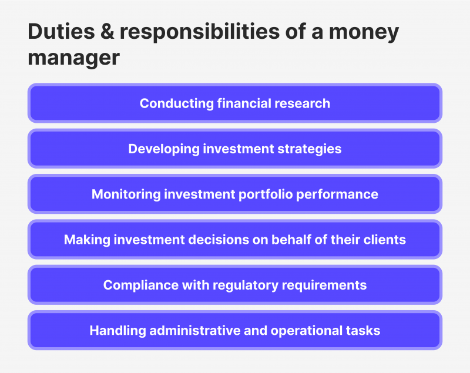

## Table of Contents

## What is a money manager?

A money manager is a person or a company that helps people manage their money. They give advice on how to invest money, save money, and spend money wisely. People hire money managers because they want help making their money grow or because they do not have time to manage their money themselves.

Money managers work with different types of investments like stocks, bonds, and mutual funds. They create a plan based on what the person wants and how much risk they are willing to take. The goal is to make the person's money grow over time while keeping it safe.

## What are the primary roles of a money manager?

A money manager's main job is to help people make smart choices with their money. They look at what their clients want and how much risk they can handle. Then, they make a plan to invest the money in things like stocks, bonds, or mutual funds. The goal is to grow the money over time while keeping it as safe as possible. They keep an eye on the investments and make changes if needed to make sure the plan stays on track.

Another important role of a money manager is to give advice on saving and spending. They help their clients set up budgets and find ways to save more money. They also give tips on how to spend money wisely. This helps their clients reach their financial goals, like buying a house or saving for retirement. By doing all these things, money managers help people feel more secure about their money and their future.

## What qualifications are needed to become a money manager?

To become a money manager, you usually need a good education. Most money managers have at least a bachelor's degree in finance, economics, business, or a related field. Some even go on to get a master's degree, like an MBA, to learn more about managing money. It's also important to get a license to work as a money manager. In the United States, you need to pass exams like the Series 65 or Series 66 to become a licensed investment advisor.

Experience is also key to becoming a good money manager. Many start their careers in entry-level jobs at banks, investment firms, or financial planning companies. They work their way up by learning from more experienced managers and gaining practical skills. Some money managers also get certifications like the Certified Financial Planner (CFP) or Chartered Financial Analyst (CFA) to show they know a lot about managing money. These qualifications help them build trust with clients and do a better job.

## How does a money manager help in financial planning?

A money manager helps in financial planning by making a plan that fits what you want and how much risk you can handle. They look at your money and your goals, like saving for a house or retirement. Then, they suggest ways to invest your money in things like stocks, bonds, or mutual funds. The goal is to make your money grow over time while keeping it safe. They keep watching your investments and change the plan if needed to make sure you stay on track.

They also give advice on saving and spending. A money manager can help you set up a budget and find ways to save more money. They give tips on how to spend money wisely, so you can reach your financial goals faster. By doing all these things, a money manager helps you feel more secure about your money and your future. They take away the stress of managing money by doing it for you, so you can focus on other things.

## What are the typical responsibilities of a money manager in a day-to-day context?

In a day-to-day context, a money manager starts by checking on the investments they manage. They look at the stock market, news, and other things that might affect the investments. If something big happens, like a company doing really well or really badly, they might need to make quick changes to the investments. They also talk to their clients to see if anything has changed in their lives that might affect their money goals. This could be things like getting a new job, having a baby, or planning to buy a house.

Besides managing investments, a money manager also spends time giving advice on saving and spending. They might help a client make a budget or find ways to save more money. They talk to clients about their spending habits and suggest ways to spend money more wisely. A big part of their day is also spent on paperwork and reports. They need to keep track of everything they do and make sure it's all legal and follows the rules. By doing all these things, a money manager helps their clients feel more secure about their money and their future.

## How do money managers handle risk management?

Money managers handle risk management by first understanding how much risk their clients are willing to take. They talk to their clients to find out what they want and how much they can handle if things go wrong. Then, they make a plan to spread out the money in different investments. This is called diversification. By putting money into different things like stocks, bonds, and mutual funds, they lower the chance that all the money will be lost if one investment does badly.

Money managers also keep watching the investments all the time. They check the news and the market to see if anything might affect the investments. If they see a big risk coming, they might change the investments to keep the money safe. They also use tools and math to guess how much risk there is in different investments. This helps them make smart choices to protect their clients' money and help it grow over time.

## What is the average compensation for a money manager?

The average compensation for a money manager can vary a lot based on things like where they work, how much experience they have, and how well they do their job. In the United States, a money manager might make around $100,000 to $150,000 a year. But some money managers who work at big firms or have a lot of clients can make a lot more, sometimes over $200,000 a year.

Besides their salary, money managers often get bonuses based on how well the investments they manage do. These bonuses can be a big part of their total pay. So, if they help their clients make a lot of money, they can earn a lot more too. This makes the job both challenging and rewarding because their pay can go up and down with the market.

## How does performance impact a money manager's compensation?

Performance has a big impact on a money manager's compensation. If a money manager helps their clients make a lot of money, they can get big bonuses. These bonuses can be a large part of their total pay. So, if the investments they manage do well, the money manager can earn a lot more than just their salary. This makes their job both exciting and risky because their pay can change a lot based on how the market does.

Money managers usually have goals set by their company or clients. If they meet or beat these goals, they get rewarded with more money. But if the investments do badly, their bonuses might be smaller or they might not get one at all. This system pushes money managers to work hard and make smart choices to help their clients' money grow, but it also means their pay can go up and down with the market.

## What advanced strategies do expert money managers employ?

Expert money managers use advanced strategies to help their clients' money grow. One strategy is called "hedging." This means they use special investments to protect against big losses. For example, if they think the stock market might go down, they might buy something that will go up if the market goes down. This helps keep the clients' money safe even when things are not going well. Another strategy is "tactical asset allocation." This means they change the mix of investments based on what is happening in the market. If they see a good chance to make money in a certain area, they might put more money there for a while.

Another advanced strategy is "quantitative analysis." This means using math and computers to find the best investments. Money managers look at a lot of data to see patterns and make smart choices. They might use special computer programs to help them decide where to put the money. This can help them find good investments that other people might miss. By using these advanced strategies, expert money managers can help their clients' money grow faster and stay safer.

## How do money managers adapt to different economic cycles?

Money managers need to change their plans based on what is happening in the economy. When the economy is doing well, they might put more money into stocks because they can grow a lot. They look for companies that are doing well and likely to keep doing well. But they also keep some money in safer places like bonds, just in case things change. They watch the news and the market all the time to make quick changes if they need to.

When the economy is not doing so well, money managers might move more money into safer investments like bonds or cash. They might also look for special chances to buy stocks that are now cheaper because of the bad economy. They use strategies like hedging to protect the money from big losses. By understanding the economic cycles and making smart changes, money managers help keep their clients' money safe and growing, no matter what is happening in the world.

## What ethical considerations must money managers be aware of?

Money managers need to think about ethics a lot. They have to be honest and fair with their clients. This means they should always tell the truth about how the investments are doing and not hide any bad news. They also need to make sure they are not taking too much money for themselves. If they get a bonus for doing well, it should be fair and not hurt the clients. They must follow all the rules and laws about managing money, so they don't get in trouble and lose their license.

Another big part of being ethical is putting the clients' needs first. Money managers should not make choices just to make more money for themselves. They need to think about what is best for the client's money and future. This means they should not take big risks just to try to make a quick profit. They also need to keep their clients' information private and safe. By doing all these things, money managers can build trust with their clients and help them feel secure about their money.

## How do money managers use technology and data analytics in their work?

Money managers use technology and data analytics a lot to do their job better. They use special computer programs to look at a lot of information about the market and the economy. These programs help them find patterns and make smart choices about where to put the money. For example, they might use data to see which companies are doing well and likely to keep doing well. This helps them pick the best investments for their clients.

They also use technology to keep track of all the investments and make quick changes if they need to. If something big happens in the market, like a company doing really well or really badly, they can use their computers to see it right away and decide what to do. This helps them protect their clients' money and make it grow faster. By using technology and data, money managers can do their job better and help their clients feel more secure about their money.

## References & Further Reading

[1]: Bergstra, J., Bardenet, R., Bengio, Y., & Kégl, B. (2011). ["Algorithms for Hyper-Parameter Optimization."](https://proceedings.neurips.cc/paper/2011/file/86e8f7ab32cfd12577bc2619bc635690-Paper.pdf) Advances in Neural Information Processing Systems 24.

[2]: ["Advances in Financial Machine Learning"](https://www.amazon.com/Advances-Financial-Machine-Learning-Marcos/dp/1119482089) by Marcos Lopez de Prado

[3]: ["Evidence-Based Technical Analysis: Applying the Scientific Method and Statistical Inference to Trading Signals"](https://www.amazon.com/Evidence-Based-Technical-Analysis-Scientific-Statistical/dp/0470008741) by David Aronson

[4]: ["Machine Learning for Algorithmic Trading"](https://github.com/stefan-jansen/machine-learning-for-trading) by Stefan Jansen

[5]: ["Quantitative Trading: How to Build Your Own Algorithmic Trading Business"](https://www.amazon.com/Quantitative-Trading-Build-Algorithmic-Business/dp/1119800064) by Ernest P. Chan

[6]: Nanex, "Flash Crash Analysis," Nanex Research, [Flash Crash Analysis](http://www.nanex.net/FlashCrashFinal/FlashCrashAnalysis_Theory.html).

[7]: Aldridge, I. (2009). ["High-Frequency Trading: A Practical Guide to Algorithmic Strategies and Trading Systems"](https://www.ahmetbeyefendi.com/wp-content/uploads/2020/07/High-Frequency-Trading-Irene-Aldridge.pdf). Wiley.

[8]: Kissell, R. (2013). ["The Science of Algorithmic Trading and Portfolio Management"](https://www.sciencedirect.com/book/9780124016897/the-science-of-algorithmic-trading-and-portfolio-management). Academic Press.