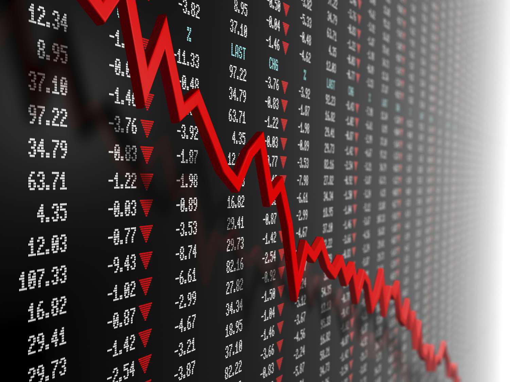

Money market funds are highly regarded in the financial sector for their stability and liquidity, often perceived to be as secure as cash. These funds primarily invest in short-term, high-quality debt securities and aim to maintain a stable net asset value (NAV) of $1 per share. However, there have been rare instances where the NAV of a money market fund has fallen below $1, a situation known as "breaking the buck." This event is concerning for investors who expect these funds to offer protection against market volatility and preserve capital.

Breaking the buck is not a common occurrence, but when it happens, it can lead to significant disruptions in the financial markets. Factors contributing to this phenomenon can include adverse economic conditions, mismanagement, or investments in riskier assets. Understanding the causes and implications of breaking the buck is essential for assessing the vulnerabilities within financial markets and for maintaining the trust of investors in these instruments.



This article explores the causes behind breaking the buck, examines its impact on investor confidence, and discusses the advent of algorithmic trading within money market funds as a means of risk management. In doing so, it sheds light on the intricate dynamics that govern these seemingly secure financial instruments.

## Table of Contents

## What is Breaking the Buck?

Breaking the buck is a term used to describe the situation where the net asset value (NAV) of a money market fund falls below $1 per share. Typically, money market funds are perceived as safe investment vehicles, with the goal of maintaining a stable NAV of $1. These funds are designed to offer investors liquidity, stability, and modest income, often investing in short-term, high-quality debt instruments like Treasury bills and commercial paper.

When a money market fund breaks the buck, it signifies that the market value of its assets has declined sufficiently to reduce the NAV below the intended level. This occurrence is alarming to investors, as it challenges the perception of money market funds as nearly risk-free. The drop in NAV indicates that the investments made by the fund have lost value, potentially due to adverse economic conditions or poor investment decisions.

Understanding the mechanisms that lead to breaking the buck is essential for comprehending the vulnerabilities within financial markets. Several factors could contribute to this situation, including a decline in the creditworthiness of the securities held by the fund, interest rate changes, or liquidity issues during financial crises. These factors can undermine the fund's ability to maintain its NAV, exposing it to market risks that might not be immediately apparent to investors.

This understanding underscores the importance of assessing the risk associated with money market funds, despite their reputation for safety. For investors, recognizing the possibility of breaking the buck is crucial for managing expectations and evaluating the risk-return profile of their portfolio. Ultimately, grasping these dynamics highlights key vulnerabilities in financial markets, emphasizing the need for vigilant monitoring and risk management strategies.

## The History of Breaking the Buck

The phenomenon known as "breaking the buck" represents a critical departure from the expected stability of money market funds, traditionally perceived as a secure financial instrument akin to cash. These funds aim to maintain a stable net asset value (NAV) of $1 per share. However, on rare occasions, the NAV falls below this threshold, causing substantial unease among investors.

The first prominent instance of a money market fund breaking the buck occurred in 1994 with the Community Bankers U.S. Government Money Market Fund. This fund liquidated at 96 cents per share, marking a pivotal moment in the financial sector. This incident highlighted the potential vulnerabilities of money market funds and served as a precursor to future disruptions.

A far more significant event took place in September 2008, amid the global financial crisis following the collapse of Lehman Brothers. The Reserve Primary Fund, one of the oldest and largest money market funds, was forced to reprice its shares to 97 cents. This development was largely due to the fund's exposure to Lehman Brothers' debt, which became worthless overnight. The news of the Reserve Fund breaking the buck triggered widespread panic in the money market sector, as investors rushed to redeem their shares, fearing further losses.

These events underscored the susceptibility of money market funds to systemic financial disruptions and raised critical questions about their inherent safety. In response to the 2008 crisis, regulatory reforms were introduced to enhance the resilience of money market funds. Measures such as the implementation of tighter regulations on the [liquidity](/wiki/liquidity-risk-premium) and credit quality of investments were among the steps taken to prevent a recurrence.

The historical instances of breaking the buck have underscored the importance of robust risk management and regulatory oversight. They have also prompted a re-evaluation of money market funds' role within the broader financial system, catalyzing discussions on how to fortify these instruments against future economic shocks.

## Causes of Breaking the Buck

Money market funds, often perceived as stable and low-risk investment vehicles, can experience the phenomenon known as breaking the buck due to several contributing factors. Economic distress is a primary cause, notably through falling interest rates that significantly reduce the yield generated by these funds. When interest income from their investments fails to cover operating expenses, funds may struggle to maintain the net asset value (NAV) at or above $1 per share.

The pursuit of higher returns by leveraging risky investments also elevates the risk of breaking the buck. In seeking enhanced yields, fund managers might invest in assets with higher [volatility](/wiki/volatility-trading-strategies) or lower credit quality. This approach, while potentially more profitable in stable economic climates, exposes the portfolio to increased risk, especially during market downturns or when credit market conditions deteriorate.

Additionally, the complexity and volatility of financial markets exacerbate the risks facing money market funds. Rapid changes in market conditions, triggered by geopolitical events, financial crises, or sudden shifts in investor confidence, can lead to a devaluation of assets held by the fund. These adverse conditions challenge the fund's ability to stabilize its value, thereby increasing the likelihood of experiencing a drop in NAV.

To illustrate these risks further, consider a simplified scenario in which a fund's portfolio is impacted by these factors. Suppose a money market fund holds a variety of short-term securities with varying risk levels. A sudden increase in market volatility may cause a shift in the securities’ market values. In Python, this could be modeled as:

```python
import numpy as np

# Simulate changes in the value of fund's investments
np.random.seed(0)
portfolio_values = np.random.normal(loc=100, scale=5, size=1000)  # baseline portfolio values
market_shock = np.random.normal(loc=-2, scale=10, size=1000)  # simulate market volatility impact

# Calculate new values considering market conditions
new_portfolio_values = portfolio_values + market_shock

# Determine the percentage of the portfolio below the critical threshold
critical_threshold = 98  # translating to below $1 NAV
breaking_buck_count = np.sum(new_portfolio_values < critical_threshold)
percentage_breaking_buck = (breaking_buck_count / len(portfolio_values)) * 100

print(f"Percentage of assets falling below critical threshold: {percentage_breaking_buck}%")
```

This hypothetical calculation demonstrates how market disturbances might impact a fund's portfolio, potentially causing its NAV to fall below the critical threshold. The inherent sensitivity to such volatility emphasizes the importance of prudent asset selection and risk management in maintaining the integrity of money market funds. Understanding these causes provides investors and managers with the insights necessary to mitigate the risks of breaking the buck.

## The Role of Algorithmic Trading

Algorithmic trading has become increasingly important in the management of money market funds due to its ability to process large volumes of data swiftly and execute trades with precision. This advancement allows fund managers to make informed investment decisions that potentially mitigate risks associated with breaking the buck. Algorithms leverage statistical and quantitative data to identify trends and execute orders within milliseconds, which can be crucial in maintaining a money market fund's net asset value (NAV). 

One of the primary advantages of [algorithmic trading](/wiki/algorithmic-trading) is its capability to perform continuous market analysis and adjustment of investment portfolios. For example, algorithms can monitor [interest rate](/wiki/interest-rate-trading-strategies) changes, credit risks, and other financial indicators, enabling funds to adjust their positions proactively to avoid unfavorable outcomes. This adaptive approach allows for a more responsive and resilient handling of market volatility, which can reduce the likelihood of the NAV dropping below $1.

Despite these benefits, reliance on algorithmic trading introduces new risks and complexities. One such risk is the potential for unforeseen market reactions caused by algorithms executing large-scale trades simultaneously, which could lead to market destabilization. Additionally, technical failures such as software bugs or connectivity issues can result in erroneous trades and financial losses. These incidents highlight the need for robust risk management protocols and the continuous refinement of trading algorithms.

To illustrate the use of algorithmic trading in this context, consider a Python example where an algorithm identifies [arbitrage](/wiki/arbitrage) opportunities within the money market fund's investment pool:

```python
import numpy as np

# Simulated market data for interest rates
interest_rates = np.array([0.01, 0.015, 0.02, 0.018, 0.013])

# Calculate moving average to identify trends
moving_avg = np.convolve(interest_rates, np.ones(3)/3, mode='valid')

# Identify arbitrage opportunities
arbitrage_opportunities = np.where(moving_avg < interest_rates[1:-1])

print(f"Arbitrage opportunities found at indices: {arbitrage_opportunities[0]}")
```

This code snippet simulates a basic trend analysis and identifies arbitrage opportunities where the interest rates exceed a moving average. While sophisticated trading algorithms employed by funds are far more complex, this example demonstrates the potential for rapidly reacting to market conditions. 

Ultimately, while algorithmic trading presents significant opportunities for enhanced fund management, it necessitates ongoing oversight and strategic development to ensure it aligns with the overarching goal of maintaining the stability of money market funds.

## Investor Reactions and Economic Implications

When a money market fund breaks the buck, it elicits significant concern from investors, akin to the panic of a bank run. This reaction stems from the assumption that these funds are a safe, near-cash equivalent investment. When the net asset value (NAV) drops below $1, it signifies a potential loss, leading investors to swiftly withdraw their assets. Such behavior can exacerbate the situation, triggering a liquidity crisis where the fund may struggle to meet redemption requests due to insufficient liquid assets.

A liquidity crisis in the money market can have extensive economic implications beyond the immediate fund. The interconnectedness of financial markets means instability in one area can ripple through, affecting other sectors. For instance, the mass withdrawal of investments may force financial institutions to sell off assets at depressed prices, resulting in broader market declines and increased volatility. This chain reaction can disrupt credit markets, as institutions become more cautious in lending, tightening credit availability and potentially slowing economic growth.

Historically, when these crises occur, governments and financial institutions often step in to mitigate the effects. Interventions can include providing liquidity support through central banks or implementing measures to guarantee investor confidence. For example, during the 2008 financial crisis, the U.S. Treasury temporarily guaranteed money market fund shares to prevent massive redemptions and stabilize the market.

Such interventions aim to maintain market confidence and restore normalcy, highlighting the critical importance of monitoring and managing risks associated with money market funds. These actions underscore the delicate balance between regulatory oversight and investor behavior in maintaining the stability of financial markets.

## Regulatory Response and Future Outlook

Regulatory bodies have enacted several reforms to prevent future occurrences of money market funds breaking the buck, most notably through amendments to Rule 2a-7 under the Investment Company Act of 1940. Rule 2a-7 establishes the guidelines under which money market funds operate, with the aim of maintaining a stable net asset value (NAV). Stricter regulations were introduced to enhance the safety and resilience of these funds, especially in the aftermath of significant market events that exposed vulnerabilities.

The amendments to Rule 2a-7 include requirements such as daily and weekly liquidity minimums, aimed at ensuring that money market funds have enough liquid assets to meet investor redemptions promptly. Funds are required to maintain at least 10% of their assets in daily liquid assets and 30% in weekly liquid assets. This is intended to reduce the likelihood of a liquidity crisis and to provide a buffer against sudden market movements.

Furthermore, Rule 2a-7 imposes restrictions on the credit quality and maturity of a fund's investments. Money market funds are limited to investing in securities that present minimal credit risks and have a short average maturity. This regulatory framework limits the risk profile of the investments within these funds, reducing the probability of significant value deviations in the underlying assets.

As the financial landscape evolves, the future of money market funds involves finding a balance between regulatory compliance and innovative trading strategies that can further bolster the funds' resilience. The integration of algorithmic trading into money market fund management demonstrates this evolution, offering new tools for risk management and operational efficiency. However, algorithmic strategies must adhere to regulatory standards while adapting to dynamic market conditions.

Financial institutions are increasingly utilizing technology not only to comply with existing regulations but also to craft strategic advantages. The focus on leveraging data analytics, [machine learning](/wiki/machine-learning), and real-time processing allows funds to anticipate and respond to market changes more effectively. Yet, it is crucial that these technological innovations work in tandem with strict regulatory guidelines to safeguard against potential systemic risks.

The ongoing dialogue between regulators and industry participants is essential for ensuring the continued stability of money market funds. As market dynamics continue to shift, regulatory bodies may need to revisit and revise rules to address emerging risks and to encourage transparency and accountability within the industry. This continuous monitoring and adaptation will be key in upholding investor confidence and maintaining the essential role of money market funds in the overall financial ecosystem.

## Conclusion

While breaking the buck is a rare and critical event, understanding its dynamics is crucial for investors and financial professionals. The occurrence of a money market fund's net asset value dropping below $1 can unsettle the financial markets due to the perceived safety these funds typically offer. This makes it essential for market participants to be aware of the factors that contribute to such events and the mechanisms available to prevent them.

The integration of algorithmic trading in money market funds presents both opportunities and challenges. On the one hand, algorithmic trading can efficiently process market data and execute trades swiftly, potentially mitigating the risks associated with market volatility. Automated systems can optimize fund portfolios by balancing returns and risks more effectively than manual trading methods. However, the reliance on algorithms introduces risks of its own. Technical failures or unforeseen market reactions can amplify rather than mitigate problems. Therefore, it is crucial that these algorithms are rigorously tested and regularly updated to adapt to changing market conditions.

Continuous monitoring and adaptation to regulatory and market changes are key to maintaining the stability of money market funds. Regulatory reforms, such as those introduced under Rule 2a-7, have been implemented to enhance the safety and resilience of these funds. These regulations establish guidelines for liquidity, credit quality, and portfolio diversification, which are vital to preventing future occurrences of breaking the buck. Nonetheless, regulations alone cannot ensure stability; ongoing vigilance and strategic adaptations in trading strategies are also necessary.

In conclusion, while breaking the buck events are infrequent, they underscore the importance of a comprehensive understanding of money market fund dynamics. By embracing technological advancements like algorithmic trading and adhering to strict regulatory frameworks, financial professionals can better safeguard these funds, thereby maintaining investor confidence and overall market stability.

## References & Further Reading

[1]: Brady, S., Anadu, K., & Cooper, N. (2012). ["The Stability of Prime Money Market Mutual Funds: Sponsor Support from 2007 to 2011"](https://www.bostonfed.org/-/media/Documents/Workingpapers/PDF/qau1203.pdf). Federal Reserve Bank of Boston.

[2]: Kacperczyk, M., & Schnabl, P. (2013). ["How Safe Are Money Market Funds?"](https://academic.oup.com/qje/article-abstract/128/3/1073/1850594) The Journal of Finance, 68(3), 1203-1231.

[3]: McCabe, P. E. (2010). ["The Cross Section of Money Market Fund Risks and Financial Crises."](https://www.federalreserve.gov/Pubs/feds/2010/201051/201051pap.pdf) Finance and Economics Discussion Series Divisions of Research & Statistics and Monetary Affairs. 

[4]: SEC Adopts Money Market Fund Reform Rules. (2014). ["U.S. Securities and Exchange Commission."](https://www.sec.gov/newsroom/press-releases/2014-143)

[5]: Pozsar, Z., Adrian, T., Ashcraft, A., & Boesky, H. (2013). ["Shadow Banking"](https://www.newyorkfed.org/medialibrary/media/research/staff_reports/sr458.pdf). Federal Reserve Bank of New York Staff Reports, no. 458.