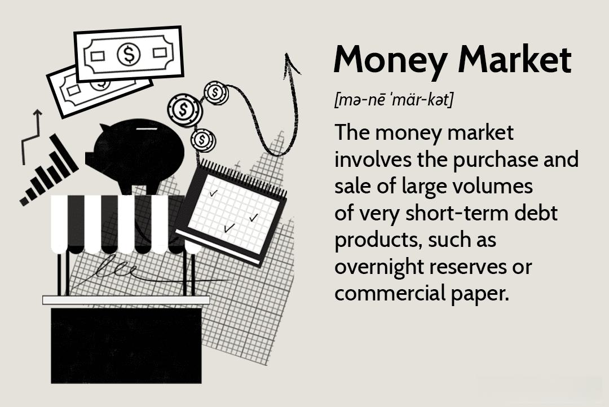

In the ever-evolving landscape of finance, several foundational components are crucial in shaping modern investment practices. Money market funds, financial instruments, investment strategies, and algorithmic trading are pivotal in this context. Each plays a distinct role in the broader investment ecosystem, providing investors with various tools and approaches to optimize their portfolios.

Money market funds are a type of mutual fund that invests in short-term, high-quality securities, aiming to offer greater returns than traditional savings accounts, while maintaining liquidity and safety. These funds are designed for investors prioritizing low risk and easy access to their cash. Such funds are composed of Treasury bills, certificates of deposit, and commercial paper. Understanding the operation and benefits of money market funds is essential for investors looking to balance risk and reward.



Alongside money market funds, financial instruments constitute the building blocks of investment portfolios. These assets, which include stocks, bonds, and derivatives, are traded in financial markets to generate returns and manage risk. In the scope of money market funds, the focus lies on short-term debt securities, which provide a steady interest income while ensuring minimal risk.

Investment strategies are developed to preserve capital and manage liquidity effectively. These strategies are crucial during periods of market volatility, offering investors a safe harbor and acting as cash management tools. Different investors, depending on their profiles and objectives, can integrate money market funds into their broader investment portfolios to maximize return on investment under varying market conditions.

Algorithmic trading employs computer algorithms to execute trades at optimal prices and speeds, forming an integral part of modern finance. This method is crucial for efficient price discovery and liquidity management, particularly in money market funds. While algorithmic trading can enhance returns, it is not without its challenges, including potential market risks and regulatory oversight.

Understanding money market funds, financial instruments, investment strategies, and algorithmic trading is vital for investors seeking to enhance their financial outcomes. By exploring these elements, investors can adapt to the changing economic landscape, ensuring well-rounded and informed decision-making in their investment processes.

## Table of Contents

## Understanding Money Market Funds

Money market funds are a type of mutual fund that focus on a specific niche within the investment landscape—short-term, high-quality securities. These funds are structured to offer investors a viable alternative to traditional savings accounts by providing potentially higher returns while preserving [liquidity](/wiki/liquidity-risk-premium) and maintaining a high level of safety.

The primary objective of money market funds is to mitigate risk and offer quick access to cash. They achieve this by investing in a diversified portfolio of short-dated debt instruments. Key components of money market funds include Treasury bills, certificates of deposit (CDs), and commercial paper. Treasury bills are short-term government securities with maturities ranging from a few days to one year, representing a way to lend money to the government with relatively low risk. Certificates of deposit are time deposits offered by banks, typically providing fixed interest for a specific period. Commercial paper consists of unsecured, short-term promissory notes issued by corporations, usually used to meet short-term liabilities.

There are various types of money market funds, each tailored to different investor needs. Government money market funds invest primarily in Treasury securities and government-backed assets, offering high security but typically lower returns. Prime money market funds have a broader investment mandate, allowing them to invest in a mix of government securities, commercial paper, and bank obligations, often providing higher yields. Municipal money market funds invest in short-term municipal securities, offering tax-exempt income which is particularly attractive to investors in higher tax brackets.

The advantages of money market funds include their stability, as they tend to maintain a stable net asset value (NAV), usually set at $1 per share. This stability makes them an attractive option for conservative investors seeking to preserve capital. Furthermore, the ability to quickly convert investments into cash makes money market funds a favored choice for emergency funds or temporary cash parking.

However, despite their benefits, money market funds are not entirely without risk. Interest rate fluctuations can impact the yield of the securities held within the fund. In a rising [interest rate](/wiki/interest-rate-trading-strategies) environment, existing securities with lower rates may lose value, affecting the overall return of the fund. Additionally, while money market funds are generally considered low risk, they are not federally insured. Therefore, in rare instances of extreme market stress, the fund could lose value. 

Overall, money market funds offer a strategic option for investors prioritizing liquidity and capital preservation without entirely sacrificing returns, fitting seamlessly within diverse investment portfolios.

## Financial Instruments in Money Market Funds

Financial instruments are crucial components of money market funds, primarily encompassing assets such as stocks, bonds, and derivatives that can be traded. In money market funds, these instruments are predominantly short-term debt securities, chosen for their ability to offer liquidity while maintaining minimal risk. Among the most common instruments are Treasury bills, repurchase agreements, and banker's acceptances.

Treasury bills are short-term government securities that mature in one year or less. They are sold at a discount and do not pay interest before maturity, making their return predictable and virtually risk-free, offering stability and predictability to investors. Repurchase agreements, or repos, are short-term loans where securities are sold with an agreement to repurchase them at a later date, often overnight. They offer high liquidity and low risk, given their collateralized nature, making them a staple in money market funds.

Banker's acceptances are time drafts backed by a bank, promising payment at a future date, usually not exceeding six months. Commonly used in international trade, they provide a secure and liquid investment option due to the bank's backing. 

The selection and management of these instruments within money market funds are driven by considerations of credit quality, maturity, and yield. Fund managers aim to maintain a diverse portfolio to mitigate risk while optimizing returns. They adhere to strict regulatory frameworks to ensure the quality and liquidity of the selected instruments. This typically involves maintaining a weighted average maturity of 60 days or less and a weighted average life of 120 days or less for the portfolio, ensuring quick access to cash.

The decision-making process involves assessing the credit ratings of the instruments, evaluating economic indicators, and projecting interest rate trends. Advanced models and algorithms may be employed to simulate various scenarios and optimize instrument selection to align with the fund's liquidity and return objectives.

In summary, the intricate process of selecting and managing financial instruments within money market funds involves balancing risk and return while adhering to regulatory standards, thereby providing investors with a reliable and efficient way to manage their cash reserves.

## Investment Strategies and Money Market Funds

Investment strategies that incorporate money market funds primarily aim to ensure capital preservation and maintain liquidity. These funds are particularly well-suited for individuals seeking to safeguard their capital during periods of market turbulence. They offer a secure option for cash management, acting as a stabilizing component within an investment portfolio.

Money market funds provide an attractive solution for investors looking to temporarily park excess cash. This can be beneficial for those waiting for more favorable investment opportunities in other asset classes. Due to their focus on short-term, high-quality debt securities, money market funds offer a reasonable yield compared to traditional savings accounts, while maintaining a relatively lower risk profile.

Integrating money market funds into a broader investment portfolio involves strategic allocation, which depends on the investor's risk tolerance, time horizon, and financial goals. For conservative investors, money market funds can constitute a larger portion of their portfolio, providing stability and intermittent liquidity. Aggressive investors, on the other hand, often utilize these funds for liquidity purposes, maintaining quick access to funds without the risk associated with more volatile segments of the market.

The variability in strategies is also evident among different investor profiles. Institutional investors may use money market funds as a buffer against market fluctuations, whereas retail investors might employ these funds to manage liquidity while pursuing long-term growth in other parts of their portfolio. 

In conclusion, the strategic use of money market funds can serve multiple purposes, from preserving capital during market downturns to effective cash management while awaiting better investment prospects. Understanding how to navigate these strategies and integrating them successfully can be advantageous for investors at all levels.

## The Role of Algorithmic Trading

Algorithmic trading, often referred to as algo trading, is a sophisticated method of executing trades using pre-programmed instructions based on variables such as time, price, and [volume](/wiki/volume-trading-strategy). This technique has revolutionized modern finance by increasing the speed and accuracy of transactions, and it plays an increasingly significant role in the management of money market funds.

In the context of money market funds, [algorithmic trading](/wiki/algorithmic-trading) is used to achieve efficient price discovery and liquidity management. Algorithms enable fund managers to process large volumes of transactions quickly, ensuring that trades occur at the optimal times and prices. This form of trading allows for real-time adjustment to trades, which is crucial in maintaining the liquidity that money market funds promise to their investors. For example, an algorithm can be programmed to automatically buy or sell securities based on predefined conditions, such as changes in interest rates or market [volatility](/wiki/volatility-trading-strategies), thereby helping to stabilize fund performance.

The mathematical underpinnings of algorithmic trading often involve complex statistical models and [machine learning](/wiki/machine-learning) techniques. These models analyze historical data to identify patterns or trends that can be used to predict future market movements. For instance, Python libraries such as NumPy and pandas can be utilized to perform these analyses and construct predictive models. Here is a simple example of how one might use Python for analyzing a time series data set to predict future movements:

```python
import numpy as np
import pandas as pd
from sklearn.model_selection import train_test_split
from sklearn.linear_model import LinearRegression

# Sample time series data
data = pd.read_csv('market_data.csv')

# Define the predictor and response variable
X = data[['time', 'other_predictors']]  # Features
y = data['price']  # Target variable

# Split the data into train and test sets
X_train, X_test, y_train, y_test = train_test_split(X, y, test_size=0.2, random_state=42)

# Create and train the model
model = LinearRegression()
model.fit(X_train, y_train)

# Predict future prices
predictions = model.predict(X_test)
```
This example outlines a basic linear regression approach to predict prices based on time-series data, which is a typical task for algorithmic trading models.

Despite the advantages, algorithmic trading also entails certain risks. The rapid nature of algo trading can exacerbate market volatility, especially if multiple algorithms make similar trades simultaneously. Moreover, technical glitches—often referred to as "flash crashes"—can result in significant financial losses or market disruptions. One prominent example is the Flash Crash of 2010, where major stock indices experienced a deep drop and recovery within minutes, primarily due to algorithmic trades.

Regulatory bodies worldwide have recognized these risks and imposed various regulatory measures to ensure market stability. In the United States, the Securities and Exchange Commission (SEC) has established rules to limit high-frequency trading activities and enhance the resilience of financial markets. The European Union, through the Markets in Financial Instruments Directive II (MiFID II), has also implemented regulations requiring trading firms to test their algorithms to ensure they do not contribute to excessive volatility.

In conclusion, while algorithmic trading significantly enhances the effectiveness and efficiency of money market funds, it demands careful consideration of associated risks and regulatory requirements. It remains a powerful tool that, when employed judiciously, can contribute to optimal investment outcomes in the complex landscape of modern finance.

## Challenges and Future Trends

Investors in money market funds face various challenges, notably interest rate fluctuations and regulatory changes. The performance and stability of money market funds are closely linked to prevailing interest rates. When interest rates rise, the value of the underlying securities in these funds may decrease, leading to reduced returns. Conversely, falling interest rates could enhance returns but might also encourage excess cash inflows, potentially straining fund management capabilities and liquidity maintenance.

Regulatory changes further complicate the landscape for money market funds. Regulations can impact the types of securities that funds are permitted to hold, their valuation methods, and liquidity thresholds. For example, reforms introduced post-2008 financial crisis imposed stricter liquidity requirements and stress-testing protocols, aimed at ensuring greater transparency and stability within these funds. Such changes can affect their viability and profitability, as fund managers might need to adjust strategies to comply with new mandates while striving to maintain competitive returns.

Algorithmic trading, while revolutionizing the speed and efficiency of transactions, brings its own challenges. Market risks, such as flash crashes and liquidity gaps, can be exacerbated by algorithms executing buy and sell orders at volumes and velocities beyond human capability. Furthermore, technical failures, including software glitches or connectivity issues, may trigger unintended trading actions, amplifying market volatility.

The future of money market funds and algorithmic trading is likely to be shaped by advances in [artificial intelligence](/wiki/ai-artificial-intelligence) (AI) and machine learning technologies. These technologies could enhance trading accuracy, improve risk management, and facilitate real-time data analysis, leading to more informed decision-making. Machine learning algorithms might enable predictive analytics for interest rate changes or regulatory impacts, providing strategic advantages for fund managers.

Industry experts anticipate further integration of these technologies in financial markets, paving the way for more sophisticated trading systems. However, they also caution about the ethical and operational risks associated with machine learning models, such as transparency concerns and the need for robust oversight.

In conclusion, the landscape for money market funds is continuously evolving, driven by interest rate dynamics, regulatory evolutions, and technological advancements. Investors and fund managers need to remain agile and informed to navigate these challenges and capitalize on the opportunities presented by emerging trends in algorithmic trading and AI integration.

## Conclusion

Money market funds, financial instruments, investment strategies, and algorithmic trading have become essential components of contemporary finance. These elements together form a complex web that enables investors to manage and optimize their portfolios effectively. By gaining a comprehensive understanding of how these components interact, investors can make more informed decisions that enhance the overall efficiency of their investment strategies and potentially improve returns.

Money market funds serve as a crucial tool for managing liquidity and preserving capital. They allow investors to earn returns comparable to short-term interest rates while maintaining easy access to their capital. This feature is particularly advantageous during volatile market conditions, offering a safe and liquid alternative to more risky investments. Furthermore, understanding various financial instruments like Treasury bills and repurchase agreements, which constitute the backbone of money market funds, empowers investors to navigate these markets with greater precision.

Algorithmic trading, another pivotal element, utilizes sophisticated algorithms to execute trades with speed and accuracy, facilitating optimal price discovery and liquidity management. By integrating algorithmic trading strategies into money market fund management, investors can achieve higher operational efficiency and access better market opportunities. However, these benefits come with challenges such as market risks and the need for robust regulatory compliance.

Staying abreast of the latest trends and challenges in finance is essential for investors aiming to remain competitive in this dynamic landscape. As financial technology continues to evolve, the role of artificial intelligence and machine learning in algorithmic trading and investment strategies is likely to grow, further enhancing the capabilities available to investors.

In conclusion, investors poised to capitalize on the interplay between money market funds, financial instruments, investment strategies, and algorithmic trading will be best positioned to navigate the financial markets successfully. A well-rounded and informed approach, accompanied by a readiness to adapt to new tools and methods, can lead to more favorable investment outcomes in this ever-evolving financial environment.

## References & Further Reading

[1]: ["Money Market Funds: How to Invest and Find the Best Returns"](https://www.forbes.com/advisor/investing/the-best-money-market-mutual-funds/) - A comprehensive guide on money market funds from Investopedia.

[2]: Kacperczyk, M., & Schnabl, P. (2013). ["How Safe Are Money Market Funds?"](https://pages.stern.nyu.edu/~pschnabl/research/KacperczykSchnablFeb2013.pdf) *The Quarterly Journal of Economics*, 128(3), 1073-1122.

[3]: BlackRock. (2016). ["Understanding Money Market Funds."](https://www.blackrock.com/us/individual/education/money-market-funds)

[4]: ["Algorithmic Trading: Winning Strategies and Their Rationale"](https://www.wiley.com/en-us/Algorithmic+Trading%3A+Winning+Strategies+and+Their+Rationale-p-9781118460146) by Ernest P. Chan

[5]: SEC Staff Report on Algorithmic Trading. (2014). ["Market Structure and Algorithmic Trading"](https://www.sec.gov/file/market-structure-and-algorithmic-trading)

[6]: International Monetary Fund. (2013). ["Money Market Funds and Systemic Risk"](https://libertystreeteconomics.newyorkfed.org/2012/06/money-market-funds-and-systemic-risk/)

[7]: ["An Introduction to Algorithmic Trading"](https://onlinelibrary.wiley.com/doi/book/10.1002/9781119206033) by the New York Stock Exchange (NYSE)