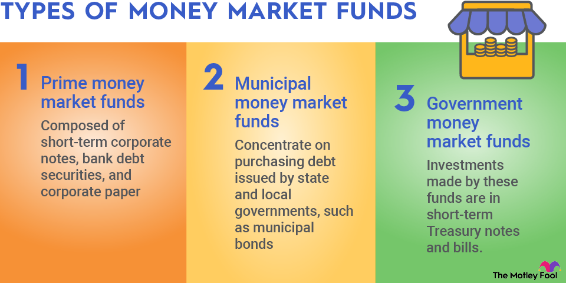

## Table of Contents

## What is a money market fund?

A money market fund is a type of investment where you put your money into a fund that invests in safe, short-term things like government bonds or certificates of deposit. These funds aim to keep your money safe and give you a small return, usually better than a regular savings account.

People often use money market funds to keep their money safe while still earning a bit of interest. They are popular for saving money that you might need soon, like for an emergency or a big purchase. Because they are low risk, they don't usually make as much money as riskier investments like stocks, but they are a good choice if you want to keep your money secure.

## What are the different types of money market funds?

There are a few different types of money market funds, and they mainly differ based on what they invest in. One type is government money market funds, which invest mostly in securities issued by the U.S. government, like Treasury bills. These are seen as very safe because the government backs them. Another type is prime money market funds, which invest in a variety of short-term debt from businesses, banks, and other institutions. These can offer a bit higher return but come with a bit more risk.

Then there are municipal money market funds, which invest in short-term debt from state and local governments. One cool thing about these is that the interest you earn is often tax-free, which can be a big plus if you're looking to save on taxes. Lastly, there are tax-exempt money market funds, which focus on securities that are exempt from federal income tax, and sometimes state and local taxes too. Each type of fund has its own benefits and risks, so it's good to think about what you need before choosing one.

## How do money market funds work?

Money market funds work by pooling money from many investors and using it to buy safe, short-term investments like government bonds, certificates of deposit, and other secure financial products. The goal is to keep the money safe while [earning](/wiki/earning-announcement) a small amount of interest. When you put money into a money market fund, you're buying shares in the fund, and the value of those shares usually stays around $1 per share. This makes it easy to know how much your investment is worth.

The interest you earn from the investments the fund makes is shared among all the shareholders. This interest is usually paid out monthly and can either be taken out as cash or reinvested to buy more shares in the fund. Money market funds are popular because they are low risk and easy to get your money out of if you need it quickly. They're a good choice if you want to keep your money safe but still earn a bit more than you would in a regular savings account.

## What are the advantages of investing in money market funds?

One big advantage of investing in money market funds is that they are very safe. They invest in things like government bonds and certificates of deposit, which are seen as low risk. This means your money is less likely to lose value, which is great if you want to keep your savings secure. Plus, they usually aim to keep the value of each share at $1, so it's easy to know how much your investment is worth.

Another advantage is that money market funds can give you a bit more interest than a regular savings account. While the returns are not as high as riskier investments like stocks, they are better than what you'd get from a typical bank account. This makes them a good choice if you want to earn a little extra on money you might need soon, like for an emergency or a big purchase. Also, it's easy to get your money out of a money market fund if you need it quickly, which adds to their appeal for short-term savings.

## What are the risks associated with money market funds?

Even though money market funds are seen as safe, they still have some risks. One risk is that the interest rates can go up and down. If rates go down, the return you get from your money market fund might not be as good as before. Another risk is that the investments the fund makes can lose value, though this is rare. If the value of the investments drops a lot, it could affect the value of your shares in the fund.

Another thing to think about is that money market funds are not backed by the government like bank accounts are. This means if the fund has big problems, you might not get all your money back. Also, while money market funds are easy to get money out of, some funds might have rules about how much you can take out at once or how often you can take money out. So, it's good to read the rules before you invest.

## How do money market funds differ from other investment options like savings accounts or bonds?

Money market funds are different from savings accounts because they usually give you a bit more interest. Savings accounts are very safe and backed by the government, but the interest you get is often lower than what you can earn from a money market fund. Money market funds invest in short-term things like government bonds and certificates of deposit, so they can offer a little more return. But, unlike savings accounts, money market funds are not insured by the government, which means there is a tiny bit more risk.

Money market funds are also different from bonds. Bonds are loans you give to a government or a company, and they pay you back with interest over time. Bonds can be riskier than money market funds because they can lose value if interest rates go up or if the borrower has money problems. Money market funds invest in short-term debt, which is usually safer and easier to turn into cash if you need it quickly. So, while bonds can offer higher returns, they come with more risk and less flexibility than money market funds.

In short, money market funds sit between savings accounts and bonds in terms of risk and return. They are safer than bonds but offer more interest than savings accounts. They are a good choice if you want to keep your money safe but still earn a bit more than you would in a regular savings account.

## What is the role of a money market fund's net asset value (NAV)?

The net asset value (NAV) of a money market fund is like the price of each share in the fund. It's important because it tells you how much your investment is worth. Money market funds usually try to keep the NAV at $1 per share. This makes it easy for investors to know the value of their money because it doesn't change much.

If the NAV stays at $1, it means the fund is doing a good job at keeping the value of your investment stable. But, if something goes wrong and the NAV drops below $1, it's called "breaking the buck." This is rare, but it can happen if the investments the fund made lose a lot of value. So, watching the NAV helps you understand if the fund is managing your money well.

## How are money market funds regulated?

Money market funds are watched over by the U.S. Securities and Exchange Commission (SEC). The SEC makes rules to keep these funds safe and honest. One big rule is that money market funds have to invest in safe, short-term things like government bonds and certificates of deposit. This helps make sure that the funds are not taking big risks with your money. The SEC also checks that the funds tell investors the truth about what they are investing in and how much they are making.

Another important rule is about something called the net asset value (NAV). Money market funds are supposed to keep the NAV at $1 per share. If it drops below $1, it's a big deal, and the SEC has rules to help stop this from happening. The SEC also says that money market funds have to be ready to give investors their money back quickly if they need it. All these rules help make money market funds a safe place to keep your money while still earning a little interest.

## What should investors look for when choosing a money market fund?

When choosing a money market fund, investors should first look at the fund's yield, which tells you how much interest you can expect to earn. A higher yield is good, but it's important to compare it with other funds to make sure you're getting a fair return for the level of risk. Also, check the fund's expense ratio, which is how much the fund charges you to manage your money. A lower expense ratio means more of your money stays in your pocket.

Another thing to consider is the type of money market fund. There are government funds, which invest in safe government securities, prime funds that invest in a mix of securities, and municipal funds that can offer tax benefits. Think about what you need - if you want safety, a government fund might be best, but if you're looking for a bit more return or tax savings, a prime or municipal fund could be better. Lastly, make sure the fund is from a reputable company with a good track record. This can give you peace of mind that your money is in good hands.

## How do interest rates affect money market funds?

Interest rates have a big impact on money market funds. When interest rates go up, the returns on the short-term investments that money market funds hold also go up. This means the fund can pay out more interest to its investors. So, if you're in a money market fund during a time when interest rates are rising, you might see your earnings go up too.

On the other hand, when interest rates go down, the returns on those short-term investments drop. This means the money market fund will have less interest to share with its investors. If you're in a money market fund when interest rates are falling, you might see your earnings go down. It's important to keep an eye on interest rates if you're thinking about investing in a money market fund, as they can change how much money you make.

## Can money market funds lose money, and under what circumstances?

Yes, money market funds can lose money, but it's not common. They are designed to be safe, but there are some situations where they might lose value. One way this can happen is if the short-term investments they hold, like government bonds or certificates of deposit, lose value. This could happen if the issuer of the bond or certificate runs into financial trouble and can't pay back what they owe. Another situation is if there's a big drop in the overall market, causing the value of the investments to go down a lot.

If the value of the investments drops enough, it can cause the fund's net asset value (NAV) to fall below $1 per share, which is called "breaking the buck." This is rare, but it has happened before. Another risk is if a lot of people want to take their money out of the fund at the same time, which is called a "run on the fund." If the fund can't sell its investments quickly enough to give everyone their money back, it might have to sell at a loss, which can also cause the fund to lose money. So, while money market funds are usually safe, there are some risks to be aware of.

## What advanced strategies can be used to optimize returns from money market funds?

To optimize returns from money market funds, one strategy is to keep an eye on interest rates and move your money around. When interest rates go up, you can switch to money market funds that are likely to benefit more from the higher rates. For example, prime money market funds might offer better returns than government funds during times of rising rates. By staying alert and moving your money to the fund with the best yield at the time, you can squeeze out a bit more return.

Another strategy is to use a technique called "laddering." This means spreading your money across different money market funds that mature at different times. By doing this, you can take advantage of higher interest rates as they come along without having to put all your money into one fund. As each part of your ladder matures, you can reinvest it at the current best rate, helping you to optimize your returns over time.

## What are the risks of algorithmic trading with money market funds?

Algorithmic trading, particularly high-frequency trading ([HFT](/wiki/high-frequency-trading-strategies)), can introduce several systemic risks when applied to money market funds. One prominent concern is the amplification of market [volatility](/wiki/volatility-trading-strategies). Algorithms can execute trades at incredibly fast speeds, reacting instantaneously to market events. In scenarios where multiple algorithms react concurrently to the same market indicators, their collective actions can inadvertently exacerbate market fluctuations. This rapid execution, though beneficial for exploiting brief market inefficiencies, can lead to unintended consequences like flash crashes, where asset prices plummet rapidly before rebounding.

Errant algorithms pose another significant risk. These are algorithms that behave unexpectedly due to flawed design, coding errors, or unforeseen market conditions. When an algorithm operates outside its intended parameters, it can initiate a cascade of trading actions that lead to substantial financial losses. For instance, a glitch in an algorithm may wrongly interpret noise as a trading signal, prompting a high [volume](/wiki/volume-trading-strategy) of erroneous transactions. This risk necessitates rigorous testing and fail-safes in coding, as even minor errors can have severe financial repercussions.

High-frequency trading also impacts money market funds by shifting the dynamics of market participation. HFT firms can potentially outpace traditional trading methods by capitalizing on tiny price discrepancies. This speed advantage can crowd out slower traders and may lead to an overemphasis on short-term gains rather than long-term financial strategies. The presence of HFT participants in markets associated with money market funds might pressure fund managers to adapt or risk being disadvantaged, which could alter the traditional, stable methodologies of these funds.

To quantify the risk, consider a model where the price change $\Delta P$ is influenced by the volume of trades $V$ executed via algorithms in a short time frame:

$$
\Delta P = f(V) + \epsilon
$$

where $f(V)$ is a function representing the price impact based on volume and $\epsilon$ captures external noise. If $f(V)$ is steep, indicating that even small changes in volume cause large price shifts, the algorithm's trades could significantly increase volatility.

Understanding these risks and implementing appropriate checks, such as circuit breakers and extensive pre-market testing, are crucial for mitigating potential adverse effects associated with [algorithmic trading](/wiki/algorithmic-trading) in money market funds.

## References & Further Reading

[1]: ["SEC Rule 2a-7"](https://www.law.cornell.edu/cfr/text/17/270.2a-7) - Securities and Exchange Commission

[2]: "Shock Markets: Trading Lessons for Volatile Times" by Robert I. Webb

[3]: "High-Frequency Trading: A Practical Guide to Algorithmic Strategies and Trading Systems" by Irene Aldridge

[4]: ["Managing Systemic Risk in Algorithmic Trading with Microstructure Noise"](https://journals.sagepub.com/doi/full/10.1177/03063127211048515) - Bank for International Settlements

[5]: ["Sorcery of the Finance: The Secret Power of Algorithmic Trading"](https://www.datacamp.com/blog/the-power-of-ai-in-finance-and-algorithmic-trading) by QuantInsti