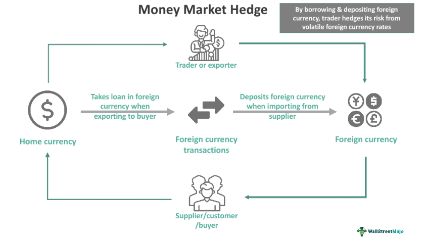

In the fast-paced world of finance, managing risks associated with currency fluctuations and market changes is crucial. A money market hedge is a fundamental strategy employed in financial risk management to address these concerns. This technique is used to minimize the risk posed by volatile exchange rates during foreign transactions, allowing companies to secure the value of a foreign currency in their domestic currency. 

A money market hedge typically involves utilizing money market instruments such as Treasury bills and commercial papers to hedge against potential losses. These instruments help enterprises effectively manage currency risk by locking in favorable exchange rates at the moment of the transaction. This proactive approach ensures a stable financial forecast despite fluctuations in the global currency markets.



Additionally, with the growing influence of technology in finance, hedging strategies like the money market hedge can now be integrated with algorithmic trading. This integration enhances risk management by automating complex trading strategies, thus reducing human error and increasing efficiency. Through the use of sophisticated algorithms, financial institutions can now more accurately predict market movements and implement hedges swiftly and effectively, offering a cutting-edge solution to manage financial risks in a dynamic economic landscape.

## Table of Contents

## Understanding Money Market Hedge

A money market hedge is a financial technique utilized to secure the value of foreign currency transactions in terms of a company's domestic currency, effectively mitigating the risks associated with exchange rate fluctuations. By employing this strategy, businesses can protect themselves from potential financial losses that may arise due to volatile currency movements, which are a common aspect of conducting international operations.

The core principle of a money market hedge involves creating offsetting positions in the domestic and foreign money markets to lock in the current exchange rate. This process typically requires the use of money market instruments such as Treasury bills and commercial paper. When a company is expecting to receive foreign currency in the future, it can borrow the present value of that foreign currency amount in the foreign market at the existing interest rate. Simultaneously, it invests an equivalent amount in the domestic money market, allowing it to repay the foreign currency loan upon maturity using the proceeds from the investment in the domestic market.

For example, suppose a U.S. company anticipates receiving €100,000 from a European buyer in three months. To hedge against the risk of the euro depreciating against the dollar, the company can engage in these steps:

1. **Calculate the Present Value**: Determine the present value of €100,000 by discounting it using the current euro interest rate for the period, say 3%. If the present value is, for instance, €97,087, this is the amount the company needs to borrow in euros.

2. **Borrow in the Foreign Market**: Borrow €97,087 from a European bank, agreeing to repay €100,000 in three months.

3. **Convert to Domestic Currency**: Convert the borrowed €97,087 into U.S. dollars at the current spot exchange rate. Assuming the rate is $1.10/€, the company would receive $106,795.70.

4. **Invest Domestically**: Invest $106,795.70 in the U.S. money market at the current interest rate, say 2%.

At the end of three months, the euro loan will be repaid with the €100,000 received from the sale, and the domestic investment will mature, allowing the company to capture the locked-in exchange rate and effectively safeguard its profits against currency risk.

Through the use of money market instruments, companies gain a high degree of flexibility and control over costs compared to other hedging options, such as forward contracts. The money market hedge is particularly advantageous when dealing with short-term foreign exchange exposures or when forward contracts are unavailable or unattractive due to market conditions. It provides a way to maintain financial stability, ensuring predictable outcomes in international business activities.

## The Strategy and Process of Money Market Hedge

A money market hedge is an effective way to mitigate the risks associated with foreign exchange transactions by using domestic and foreign money markets to lock in the cost of a foreign currency transaction. The process involves simultaneously borrowing and lending in two different currencies.

### Steps Involved in Setting Up a Money Market Hedge

1. **Determine the Amount and Date**: Identify the precise amount of foreign currency needed and the date when the transaction will take place. This is crucial, as the hedge effectively converts the foreign currency obligation into a domestic currency one.

2. **Borrow in Foreign Currency**: If a company needs to pay a foreign obligation, it first determines how much foreign currency it would need to borrow today to fulfill this future obligation, taking into account the interest that will accumulate.

3. **Convert Foreign Currency to Domestic Currency**: The borrowed foreign currency is then converted into the domestic currency at the prevailing spot exchange rate. This conversion locks in the cost of fulfilling the foreign obligation in the future.

4. **Invest the Domestic Currency**: The domestic currency obtained is invested in domestic money market instruments such as Treasury bills or commercial paper. This investment accrues interest over the period until the foreign obligation is due.

5. **Repay the Foreign Currency Loan**: Upon the maturity of the loan, the company uses the domestic currency proceeds to settle the foreign exchange transaction by paying off the foreign currency loan.

### Flexibility and Control over Transaction Costs

A money market hedge offers flexibility in hedging only part of a transaction, unlike forward contracts which typically involve the full amount of the currency exposure. This partial hedging approach can be particularly beneficial for companies seeking to manage costs efficiently while maintaining a degree of speculative exposure. By selectively hedging, entities control how much they want to lock in, potentially lowering transaction costs, as they only pay interest on the precise amount they choose to hedge.

### Advantages Over Forward Contracts

Money market hedges are preferable in certain situations compared to forward contracts:

- **Interest Rate Considerations**: When the differential between domestic and foreign interest rates is advantageous, money market hedges can be more cost-effective than offered forward rates.

- **Liquidity Needs**: If a company needs immediate liquidity in its domestic currency, converting the foreign currency borrowing through a money market hedge can provide the necessary domestic funds, unlike forward contracts which are more suited for future settlements.

- **Availability and Accessibility**: In some markets, especially those with limited access to derivatives or forward contracts, utilizing money market instruments may provide a more accessible tool for hedging foreign exchange risks.

Overall, while forward contracts fix a rate for future transactions, money market hedges utilize [interest rate](/wiki/interest-rate-trading-strategies) differentials, providing companies with a mechanism to manage cash flows and interest costs effectively. This strategic flexibility, along with the control over transaction costs via selective hedging, makes money market hedges an integral part of sophisticated financial risk management.

## Examples of Money Market Hedge

A money market hedge effectively mitigates the risks associated with fluctuations in exchange rates. To elucidate its practical application, consider a U.S.-based company, ABC Corp, which expects to receive €1,000,000 from a European client in 90 days. Concerned about potential depreciation in the euro relative to the U.S. dollar, ABC Corp aims to secure the current exchange rate to avoid future currency risk.

### Step-by-Step Example:

1. **Current Exchange Rate and Interest Rates:**
   - Assume the current spot exchange rate is €1 = $1.20.
   - The annual interest rate for borrowing in euros is 2%, and for deposit in U.S. dollars is 3%.

2. **Calculating the Required Loan:**
   - ABC Corp needs to calculate the present value of €1,000,000 which it will receive in 90 days. This is achieved by discounting the amount using the euro borrowing rate:
$$
   PV = \frac{€1,000,000}{(1 + 0.02 \times \frac{90}{360})} = €995,024.88

$$
   - ABC Corp borrows €995,024.88 today.

3. **Currency Conversion and Investment:**
   - Convert the borrowed €995,024.88 into U.S. dollars using the current spot exchange rate:
$$
   \$ = €995,024.88 \times 1.20 = \$1,194,029.86

$$
   - This amount is then invested in a U.S. bank account at an annual interest rate of 3% for 90 days:
$$
   Future\:Value = \$1,194,029.86 \times (1 + 0.03 \times \frac{90}{360}) = \$1,202,455.65

$$

4. **Repayment of the Loan:**
   - After 90 days, ABC Corp receives €1,000,000 from its client. It repays the euro loan, which has now grown to the original €1,000,000 due to the interest over the 90-day period.

5. **Resulting Hedge Outcome:**
   - By utilizing the money market hedge, ABC Corp effectively locked in the future exchange rate at approximately $1.2025/€ (calculated from the final U.S. dollar amount divided by the €1,000,000 transaction), securing the exchange rate risk-free irrespective of market fluctuations.

### Financial Implications:

The use of a money market hedge allows companies to stabilize cash flows and avoid unexpected losses due to unfavorable currency movements. However, this hedging strategy involves costs such as transaction fees and interest rate differentials. Companies need to consider these potential costs and benefits carefully to determine the suitability of a money market hedge for their specific financial objectives. Automating parts of the money market hedge setup through tools or algorithms can make the process more efficient and lower transaction costs, enhancing the hedging strategy's overall effectiveness.

## Comparing Money Market Hedge with Forward Contract

Money market hedges and forward contracts are both prominent tools used in managing currency risk, but they operate through different mechanisms and can be advantageous in diverse scenarios. Understanding their structure and uses is essential for effectively mitigating the risks associated with currency fluctuations.

**Differences Between Money Market Hedges and Forward Contracts**

1. **Mechanism of Operation:**
   - **Money Market Hedge:** Involves creating a synthetic forward rate through borrowing and lending activities in the money market. This is typically achieved by borrowing in the currency that will be received and investing in the currency that will be paid. The primary instruments used in this hedge are financial securities such as Treasury bills and commercial paper. It essentially locks in an exchange rate by equating the future value of financial cash flows.
   - **Forward Contract:** A derivative instrument where two parties agree to exchange a specific amount of currencies at a predetermined rate on a specified future date. This is a binding contract with an over-the-counter nature, generally provided by financial institutions or brokers.

2. **Costs and Flexibility:**
   - **Money Market Hedge:** Often requires setting up multiple transactions, such as lending and borrowing across different currencies. This can lead to higher transaction costs and complexities, especially for smaller amounts or short durations. However, it offers flexibility in terms of partial hedging, allowing companies to customize the amount they wish to hedge.
   - **Forward Contract:** Typically involves lower initial transaction costs with a straightforward setup. The contract is less flexible in terms of modifications post-agreement regarding the amount and duration.

3. **Credit Risk:**
   - **Money Market Hedge:** Generally considered low risk in terms of credit as it involves transactions with established financial institutions for borrowing and lending.
   - **Forward Contract:** Involves credit risk exposure to the counterparty as the contract relies on both parties fulfilling their obligations at maturity.

4. **Market Conditions and Predictability:**
   - **Money Market Hedge:** This method can be particularly beneficial in volatile market conditions or when access to foreign exchange markets is restricted. The effectiveness hinges on the interest rate differential between the two currencies and requires a comprehensive understanding of market dynamics.
   - **Forward Contract:** More effective in stable market conditions with pronounced predictability, where companies can lock in favorable rates for large transactions without being exposed to significant interest rate risk.

**Scenarios Where One Might Outperform the Other**

- **Money Market Hedge Advantages:**
  - When dealing with a short-term exposure where the interest rate differential is favorable.
  - In environments with restricted access to forward markets or when companies prefer not to use derivatives.
  - If a firm prefers to work within the regulated environment of money markets, avoiding the need for derivative-related documentation or compliance.

- **Forward Contract Advantages:**
  - For long-term exposures where a fixed forward rate provides certainty and budget stability.
  - In markets where forward contracts are highly liquid, readily available, and have attractive pricing with low associated costs.
  - Preferred when firms require a straightforward hedging tool with predictable pricing outcomes, particularly when minimal operational complexity is desired and counterparty risks can be managed effectively. 

Choosing between these instruments must involve careful consideration of market conditions, cost implications, and organizational requirements. Both hedging methods serve critical roles in financial risk management and offer differing advantages based on the specific conditions and needs of a transaction.

## Integrating Hedging Strategies in Algorithmic Trading

Algorithmic trading has revolutionized how financial institutions and individual traders approach risk management, including the execution of hedging strategies. This form of trading utilizes computer algorithms to execute transactions based on pre-set criteria, enabling a level of speed and precision that is difficult to achieve manually. In the context of hedging, algorithms can significantly enhance risk management by automating complex strategies, thus minimizing human error and optimizing transaction efficiency.

Algorithms are used to continuously analyze vast amounts of market data to identify trends, calculate risks, and execute trades at the most opportune moments. This capability is particularly beneficial for managing hedging strategies, which often involve complex decision-making processes based on market fluctuations. By leveraging [machine learning](/wiki/machine-learning) and statistical models, these algorithms can predict potential currency movements and adjust hedges in real-time to maintain desired risk exposure.

For example, consider a corporation that uses foreign currency options to hedge against currency risk. An algorithm can be programmed to monitor currency markets, economic indicators, and geopolitical events, continuously refining the hedge based on this analysis. When market conditions shift, the algorithm can automatically execute trades to optimize the hedged position, ensuring that the corporation continues to mitigate risk effectively.

Moreover, [algorithmic trading](/wiki/algorithmic-trading) allows for the [backtesting](/wiki/backtesting) of hedging strategies. Traders can simulate how different hedging strategies would have performed using historical data, enabling them to refine their algorithms for better future performance. This testing can be particularly advantageous for evaluating money market hedges, where interest rate differentials between currencies play a significant role. By simulating past scenarios, traders can optimize their strategies to maximize gains or minimize costs.

The automation provided by algorithms also allows traders to take advantage of [arbitrage](/wiki/arbitrage) opportunities that may arise fleetingly in the markets. Swift execution of trades can lock in such opportunities that contribute to the overall efficiency of the hedging strategy. Additionally, algorithmic systems can be designed to place trades only when certain conditions are met, reducing unnecessary transactions and keeping trading costs low.

Here's a simple Python example using a basic strategy for algorithmically adjusting a hedge ratio based on currency market [volatility](/wiki/volatility-trading-strategies):

```python
# Import necessary libraries
import numpy as np
from forex_python.converter import CurrencyRates

# Initialize currency converter
cr = CurrencyRates()

# Function to adjust hedge ratio
def adjust_hedge_ratio(current_volatility, base_ratio=0.5, sensitivity=0.1):
    """
    Adjusts the hedge ratio based on market volatility.
    :param current_volatility: Current market volatility as a decimal
    :param base_ratio: Base hedge ratio
    :param sensitivity: Sensitivity of hedge adjustment to volatility
    :return: Adjusted hedge ratio
    """
    adjusted_ratio = base_ratio + (sensitivity * current_volatility)
    return min(max(adjusted_ratio, 0), 1)  # Ensure ratio is between 0 and 1

# Example: Calculate adjusted hedge ratio
market_volatility = 0.2  # Example market volatility
adjusted_ratio = adjust_hedge_ratio(market_volatility)

# Print adjusted hedge ratio
print("Adjusted Hedge Ratio:", adjusted_ratio)
```

This script exemplifies a simplified methodology for dynamically adjusting a hedge ratio—imperative for real-time risk management. The model uses market volatility to determine how much to adjust the hedge, which is an essential part of automated strategies that protect against adverse market movements. More advanced versions would incorporate live data feeds and complex decision-making rules.

In conclusion, the integration of algorithmic trading with hedging strategies offers significant advantages in terms of efficiency, precision, and flexibility. By automating risk management tasks and continuously refining strategies based on data-driven insights, traders can manage financial risks more effectively, capitalizing on opportunities and mitigating potential losses with much greater agility.

## Conclusion

Money market hedges play a critical role in financial risk management by facilitating the management of risks associated with currency fluctuations. These hedges provide a way for companies engaged in foreign transactions to stabilize their costs and revenue forecasts, ensuring that currency risk does not undermine their financial stability. By securing the value of expected cash flows in the domestic currency, businesses can safeguard themselves against unfavorable exchange rate movements that might impact profit margins.

Furthermore, the evolving landscape of financial technology is paving the way for advancements in hedging strategies, particularly with the integration of algorithmic trading. The automation and precision offered by algorithms enable real-time execution of hedging strategies. Algorithmic trading systems can quickly analyze market conditions, execute transactions, and adjust strategies as needed, all while minimizing human error and reducing operational costs. These systems can be programmed to optimize hedging parameters, identify the most cost-effective instruments, and execute trades at opportune moments, enhancing the efficacy of hedging approaches.

With the continuous development in data analytics and machine learning, future trends in hedging are likely to be driven by increasingly sophisticated algorithms capable of handling more complex data scenarios and market dynamics. This evolution will likely lead to more personalized and adaptive risk management strategies, allowing companies to maintain competitiveness and resilience in the global market.

In conclusion, money market hedges are an indispensable tool in the financial toolkit, offering stability and predictability to businesses involved in international trade. As technology advances, harnessing the power of algorithmic trading will elevate the potential of these hedging strategies, making risk management more robust and efficient.

## References & Further Reading

[1]: Levi, M. D. (2005). ["International Finance"](https://www.taylorfrancis.com/books/mono/10.4324/9780203881712/international-finance-maurice-levi). Routledge.

[2]: Shapiro, A. C., & Moles, P. (2014). ["International Financial Management"](https://archive.org/details/internationalfin0000shap). Wiley.

[3]: Hull, J. C. (2017). ["Options, Futures, and Other Derivatives"](https://www.semanticscholar.org/paper/Options%2C-Futures%2C-and-Other-Derivatives-Hull/89bdee500c8623864fc9eb7a471546aa713acc44). Pearson.

[4]: Lopez de Prado, M. (2018). ["Advances in Financial Machine Learning"](https://www.amazon.com/Advances-Financial-Machine-Learning-Marcos/dp/1119482089). Wiley.

[5]: Aronson, D. (2011). ["Evidence-Based Technical Analysis: Applying the Scientific Method and Statistical Inference to Trading Signals"](https://www.amazon.com/Evidence-Based-Technical-Analysis-Scientific-Statistical/dp/0470008741). Wiley.

[6]: Jansen, S. (2020). ["Machine Learning for Algorithmic Trading"](https://github.com/stefan-jansen/machine-learning-for-trading). Packt Publishing.

[7]: Chan, E. P. (2008). ["Quantitative Trading: How to Build Your Own Algorithmic Trading Business"](https://github.com/ftvision/quant_trading_echan_book). Wiley.