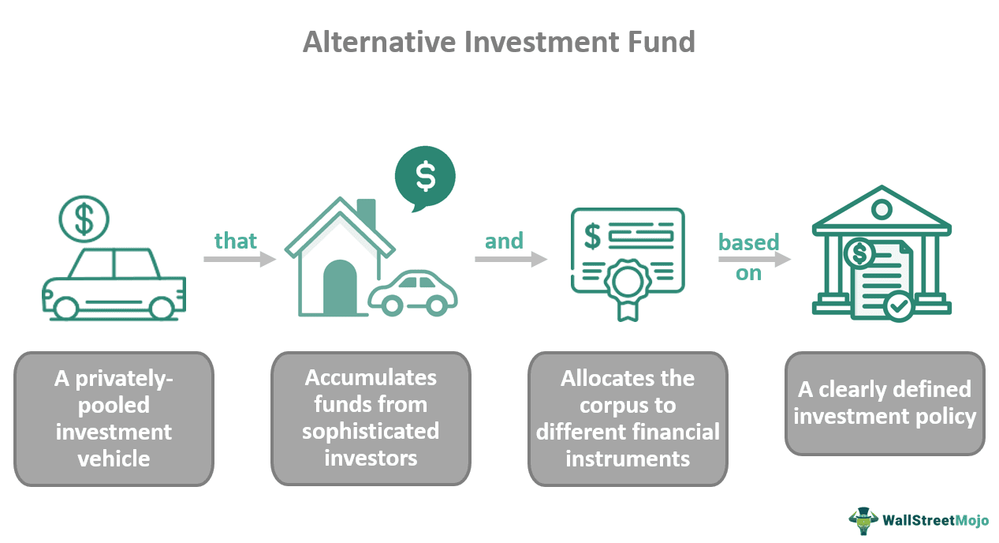

In response to economic challenges and the need for greater stability within financial markets, the Money Market Investor Funding Facility (MMIFF) was established by the Federal Reserve during the 2008 financial crisis. This initiative was devised to address liquidity challenges and restore confidence in the money markets. As algorithmic trading continues to grow, understanding facilities like the MMIFF and their role in supporting money market investments is increasingly vital.

The financial crisis of 2008 highlighted significant vulnerabilities in the global financial system, precipitated by heightened demand for liquidity and widespread market panic. Money markets, which are crucial for short-term funding and involve instruments like commercial paper and certificates of deposit, were particularly impacted due to the deterioration of credit conditions and increased withdrawal pressures on money market funds.

To counteract these challenges, the Federal Reserve introduced the MMIFF to provide liquidity support and stabilize the money markets. By enabling the purchase of short-term financial instruments in the secondary market, the MMIFF aimed to invigorate liquidity flows and support institutions facing redemption pressures. This intervention was crucial in preserving the operational functionality of money markets and maintaining financial stability.

As automated trading increasingly influences financial transactions, the liquidity and market stability provided by facilities like the MMIFF are essential for effective algorithmic trading. These financial solutions facilitate improved trading conditions by mitigating volatility, thus supporting the sophisticated strategies employed by algorithmic traders. Understanding the operational mechanics and impacts of such facilities allows for better navigation of money market investments, particularly in times of financial stress.

## Table of Contents

## What is the Money Market Investor Funding Facility (MMIFF)?

The Money Market Investor Funding Facility (MMIFF) was established by the Federal Reserve in response to the liquidity strains that emerged during the 2008 financial crisis. This initiative was designed to bolster liquidity in the money markets, which are crucial for short-term borrowing and lending activities essential for the smooth functioning of the financial system. 

The primary aim of the MMIFF was to facilitate the sale of financial instruments in the secondary market, thereby providing cash flow to money market investors. It addressed the liquidity challenges by allowing investors to sell assets that were otherwise difficult to liquidate under the prevailing market conditions. This strategic intervention was particularly targeted at supporting instruments with maturities ranging between seven and ninety days, including short-term debt securities such as certificates of deposit and commercial paper.

By enabling these transactions, the MMIFF played a pivotal role in stabilizing the money market. It provided a mechanism through which the Federal Reserve could indirectly inject [liquidity](/wiki/liquidity-risk-premium) into the money markets, thereby supporting institutions that are integral to the credit supply chain. The facility's implementation demonstrated a significant policy measure aimed at containing the systemic risk posed by the distressed market conditions, ensuring that financial entities had access to the necessary funds to meet their short-term obligations.

## Operations of the MMIFF

The Money Market Investor Funding Facility (MMIFF) was active from November 2008 to October 2009, a critical period marked by severe liquidity constraints in the financial sector. During its operation, the Federal Reserve Bank of New York authorized the creation and management of five Special Purpose Vehicles (SPVs). These SPVs played a vital role in channeling liquidity into money markets, primarily by purchasing short-term debt instruments from financial institutions. The central aim was to support the market for financial instruments with maturities ranging from seven to 90 days, including certificates of deposit and commercial paper.

The MMIFF's structure was designed to involve substantial financial backing. Specifically, it planned for the acquisition of up to $600 billion in eligible assets. To facilitate these transactions, the Federal Reserve provided federal loans covering a significant 90% of the purchase price undertaken by the SPVs. The remaining 10% of the financing was secured through the issuance of asset-backed commercial paper (ABCP).

This structured approach, involving SPVs and utilizing federal loans alongside market-driven ABCP issuance, was conceived to restore confidence by enhancing the liquidity of money market instruments. By ensuring that a substantial portion of the transaction costs was federally backed, the MMIFF reduced the systemic risk related to large-scale redemptions in money markets and improved market functioning during a period of significant economic distress.

## Impact on Money Markets

The Money Market Investor Funding Facility (MMIFF) notably expanded the secondary market for medium-term financial instruments, such as certificates of deposit and commercial paper. By creating a reliable purchasing platform for these instruments, the MMIFF provided a critical liquidity source for money market funds. This support was instrumental during periods of heightened withdrawal pressures, ensuring that these funds could meet redemption demands without resorting to the fire sale of assets, which could further destabilize the market.

Additionally, the liquidity injected into the market by the MMIFF had a significant ripple effect. By purchasing these instruments, the Federal Reserve effectively bolstered the balance sheets of financial institutions holding such short-term debt. This intervention not only fortified the stability of the money markets but also underpinned the overall credit availability in the economy. Financial institutions, relieved from immediate liquidity concerns, were better positioned to extend new credit to businesses and consumers. This availability of credit is essential for economic activity and recovery, especially in times of financial stress.

The MMIFF's role in supporting financial institutions was pivotal in maintaining confidence in the financial markets. By ensuring that money market funds had adequate liquidity, it reduced the likelihood of widespread panic among investors. Such stability is crucial in preventing a liquidity crisis from escalating into a solvency crisis for otherwise healthy institutions. This indirect strengthening of credit availability was a key [factor](/wiki/factor-investing) in sustaining economic activity and helping to stabilize the broader financial system during the 2008 crisis.

## MMIFF and Algorithmic Trading

The integration of financial facilities like the Money Market Investor Funding Facility (MMIFF) with [algorithmic trading](/wiki/algorithmic-trading) represents a significant advancement in financial markets. Algorithmic trading, characterized by automated, high-speed trading strategies, thrives in environments where liquidity is ample and market conditions are stable. The liquidity support provided by the MMIFF during the 2008 financial crisis was pivotal in stabilizing money market conditions, which, in turn, benefited algorithmic trading systems.

The MMIFF enhanced liquidity by enabling the purchase of short-term debt instruments, thus alleviating pressure on money market funds and financial institutions. This intervention mitigated [volatility](/wiki/volatility-trading-strategies) and fostered a stable financial environment essential for algorithmic trading operations. Algorithms, relying on quantitative models to detect and exploit market inefficiencies, require reliable data inputs and predictable market behavior. The stability driven by MMIFF facilitated such conditions by preventing drastic fluctuations that could disrupt algorithmic strategies.

Understanding facilities like MMIFF is crucial for algorithmic traders. These facilities directly affect market liquidity, which is vital for the execution speed and efficiency of algorithmic trades. The increased liquidity reduces transaction costs and minimizes the impact cost, the latter being the adverse effect on the market price due to the execution of a trade. Additionally, improved market stability allows algorithms to function with reduced slippage — the difference between expected and actual transaction prices.

Furthermore, facilities like MMIFF have implications for market volatility. By stabilizing money markets, MMIFF indirectly reduced the risks associated with sharp price movements, allowing algorithmic strategies to operate under conditions of lower risk. This stability is crucial, especially for high-frequency trading algorithms that execute multiple trades within fractions of a second, where any unforeseen volatility could lead to substantial financial losses.

In summary, the interaction between the MMIFF and algorithmic trading underscores the importance of liquidity and stability in financial markets. For algorithmic traders, comprehending the operations and impacts of such financial facilities is essential to refine their trading algorithms and strategies to align with prevailing market conditions. In the context of evolving market dynamics, these insights not only enhance the efficacy of algorithmic trading but also contribute to more resilient financial systems.

## Conclusion

The Money Market Investor Funding Facility (MMIFF) underscored the critical role of liquidity in money markets during financial crises. By addressing liquidity issues in the wake of the 2008 crisis, the MMIFF demonstrated the Federal Reserve’s capacity to innovate and create mechanisms that promote financial stability. This strategic intervention highlighted how central banks can utilize unconventional tools to restore confidence in financial markets and stabilize economic conditions.

The implementation of the MMIFF offered valuable lessons that continue to inform the strategies of investors and traders. By ensuring liquidity in money markets, measures like the MMIFF provide a foundation for better understanding the complexities of money market investments. This improved understanding is not only essential for traditional traders but also enhances the effectiveness of algorithmic trading strategies, which increasingly rely on stable and liquid markets. Algorithmic traders, in particular, benefit from insights into how such facilities can influence liquidity, market stability, and volatility, allowing them to adapt their strategies accordingly.

In essence, the MMIFF serves as a pivotal example of how targeted interventions can mitigate systemic risks and support the broader economic framework. Analyzing the outcomes and methodologies associated with the MMIFF equips financial market participants with the knowledge necessary to navigate future challenges and optimize trading practices in both conventional and automated environments.

## References & Further Reading

[1]: Adrian, Tobias, Kimbrough, Karin, and Marchioni, Dina. (2010). ["The Federal Reserve’s Commercial Paper Funding Facility."](https://papers.ssrn.com/sol3/papers.cfm?abstract_id=1532323) Federal Reserve Bank of New York.

[2]: Duygan-Bump, Burcu, Parkinson, Patrick, Rosengren, Eric, Suarez, Gustavo, and Willen, Paul. (2013). ["How Effective Were the Federal Reserve Emergency Liquidity Facilities? Evidence from the Asset-Backed Commercial Paper Money Market Mutual Fund Liquidity Facility."](https://www.jstor.org/stable/42002589) Federal Reserve.

[3]: Fleming, Michael J. (2012). ["Federal Reserve Liquidity Provision during the Financial Crisis of 2007-2009."](https://papers.ssrn.com/sol3/papers.cfm?abstract_id=2126214) Annual Review of Financial Economics.

[4]: Gorton, Gary B. (2009). ["Slapped in the Face by the Invisible Hand: Banking and the Panic of 2007."](https://papers.ssrn.com/sol3/papers.cfm?abstract_id=1401882) Prepared for the Federal Reserve Bank of Atlanta’s 2009 Financial Markets Conference.

[5]: Kacperczyk, Marcin and Schnabl, Philipp. (2010). ["When Safe Proved Risky: Commercial Paper during the Financial Crisis of 2007–2009."](https://www.nber.org/papers/w15538) American Economic Journal: Macroeconomics.