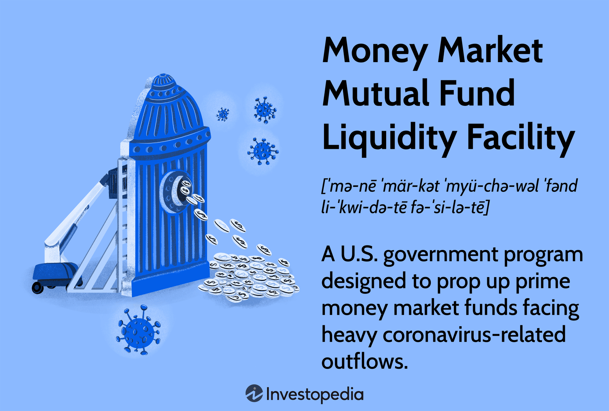

## Table of Contents

## What is a Money Market Mutual Fund (MMMF)?

A Money Market Mutual Fund (MMMF) is a type of investment that pools money from many people to buy short-term, safe investments like government securities and high-quality commercial papers. These funds aim to keep the value of each share at a stable $1, which makes them a low-risk option for people who want to keep their money safe while still earning a small amount of interest.

People often use MMMFs as a place to park their cash temporarily. For example, they might use it while they decide on other investments or save up for a short-term goal. The interest rates on MMMFs are usually higher than regular savings accounts but lower than riskier investments like stocks. This makes them a good choice for someone who wants a bit more return than a savings account without taking on too much risk.

## What is the Money Market Mutual Fund Liquidity Facility (MMLF)?

The Money Market Mutual Fund Liquidity Facility (MMLF) is a program set up by the Federal Reserve to help money market mutual funds during tough financial times. It started in March 2020, during the COVID-19 crisis, to stop people from pulling their money out of these funds all at once, which could cause big problems in the financial system.

Under the MMLF, banks and other financial institutions can borrow money from the Federal Reserve by using certain high-quality assets from money market mutual funds as collateral. This helps the funds stay liquid, meaning they have enough cash to meet people's requests to take their money out. By doing this, the MMLF helps keep the money market stable and prevents a financial crisis from getting worse.

## Why was the MMLF established?

The MMLF was set up by the Federal Reserve in March 2020 because of the COVID-19 crisis. During this time, many people were worried about their money and started taking it out of money market mutual funds. This could have caused big problems because these funds might not have had enough cash to give everyone their money back at once.

To stop this from happening, the Federal Reserve created the MMLF. It let banks borrow money from the Fed by using certain safe assets from money market mutual funds as a kind of guarantee. This helped the funds stay stable and keep enough cash on hand, which made the whole financial system safer during a scary time.

## How does the MMLF work?

The MMLF helps money market mutual funds during tough times. When people start taking their money out of these funds quickly, it can cause problems. The MMLF lets banks borrow money from the Federal Reserve. To do this, banks give the Fed some safe assets from the money market mutual funds as a kind of promise. This way, the funds can get cash quickly and don't have to worry about running out of money.

By doing this, the MMLF keeps the money market mutual funds stable. It stops a big rush of people wanting their money back, which could make the financial system shaky. The Federal Reserve started the MMLF in March 2020 because of the COVID-19 crisis. It was a way to help keep the financial system safe when everyone was worried about their money.

## Who can participate in the MMLF?

The MMLF is open to banks and other financial institutions that want to help money market mutual funds. These banks can borrow money from the Federal Reserve by giving them certain safe assets from the funds. This helps the funds stay stable and have enough cash when people want to take their money out.

The Federal Reserve set up the MMLF in March 2020 because of the COVID-19 crisis. It was a way to stop people from pulling their money out of money market mutual funds all at once, which could cause big problems. By letting banks borrow money and use the funds' assets as a promise, the MMLF keeps the financial system safe during tough times.

## What types of assets are eligible under the MMLF?

The MMLF accepts certain types of assets from money market mutual funds. These assets need to be high-quality and safe. They include U.S. Treasury securities, which are loans to the government, and securities that come from agreements to buy back U.S. Treasury securities later. These are called repo agreements.

Also, the MMLF accepts securities from agreements to buy back other types of high-quality securities. These can be securities issued by government-sponsored enterprises like Fannie Mae and Freddie Mac. The main idea is to make sure the assets are safe and can be easily turned into cash if needed.

## How does the MMLF impact the financial market?

The MMLF helps keep the financial market stable during tough times. When people start taking their money out of money market mutual funds quickly, it can cause big problems. The MMLF lets banks borrow money from the Federal Reserve by using safe assets from these funds as a promise. This way, the funds can get cash quickly and don't have to worry about running out of money. By doing this, the MMLF stops a big rush of people wanting their money back, which could make the financial system shaky.

The MMLF was set up in March 2020 because of the COVID-19 crisis. It was a way to help keep the financial system safe when everyone was worried about their money. By letting banks borrow money and use the funds' assets as a promise, the MMLF makes sure that money market mutual funds can stay stable. This helps prevent a financial crisis from getting worse and keeps the whole market calm during scary times.

## What are the terms and conditions for borrowing through the MMLF?

The MMLF lets banks borrow money from the Federal Reserve by using safe assets from money market mutual funds as a promise. The [interest rate](/wiki/interest-rate-trading-strategies) for borrowing through the MMLF is the same as the rate for the Federal Reserve's primary credit, which is the rate they charge banks for short-term loans. Banks have to pay back the money they borrow within 12 months, but they can pay it back early if they want to.

To use the MMLF, banks need to give the Federal Reserve certain types of assets from money market mutual funds. These assets need to be high-quality and safe, like U.S. Treasury securities and securities from agreements to buy back U.S. Treasury securities later. The Federal Reserve started the MMLF in March 2020 to help keep the financial system stable during the COVID-19 crisis. It was a way to stop people from pulling their money out of money market mutual funds all at once, which could cause big problems.

## How is the MMLF different from other Federal Reserve liquidity facilities?

The MMLF is different from other Federal Reserve [liquidity](/wiki/liquidity-risk-premium) facilities because it focuses specifically on helping money market mutual funds during tough times. While other facilities like the Primary Dealer Credit Facility (PDCF) or the Term Auction Facility (TAF) might help banks and other financial institutions in general, the MMLF targets the stability of money market mutual funds. It does this by letting banks borrow money from the Federal Reserve using safe assets from these funds as a promise.

Another way the MMLF is different is in the types of assets it accepts. The MMLF only takes high-quality and safe assets like U.S. Treasury securities and securities from agreements to buy back these securities. Other facilities might accept a wider range of assets. Also, the MMLF was set up quickly in March 2020 to deal with the specific problems caused by the COVID-19 crisis, showing its focus on immediate stability for money market mutual funds.

## What are the historical examples of the MMLF being used?

The MMLF was used for the first time during the COVID-19 crisis in March 2020. Many people were worried about their money and started taking it out of money market mutual funds. This could have caused big problems because these funds might not have had enough cash to give everyone their money back at once. To stop this from happening, the Federal Reserve set up the MMLF. It let banks borrow money from the Fed by using certain safe assets from money market mutual funds as a kind of guarantee. This helped the funds stay stable and keep enough cash on hand, which made the whole financial system safer during a scary time.

The MMLF was a big help during the early days of the COVID-19 crisis. It showed that the Federal Reserve could act quickly to keep the financial system stable when people were worried and pulling their money out of funds. By letting banks borrow money and use the funds' assets as a promise, the MMLF made sure that money market mutual funds could stay calm and keep working well. This was important because it stopped a financial crisis from getting worse and helped keep the market steady during a tough time.

## How does the MMLF affect the stability of money market mutual funds?

The MMLF helps keep money market mutual funds stable during tough times. When people get worried and start taking their money out of these funds quickly, it can cause big problems. The MMLF lets banks borrow money from the Federal Reserve by using safe assets from the funds as a promise. This way, the funds can get cash quickly and don't have to worry about running out of money. By doing this, the MMLF stops a big rush of people wanting their money back, which could make the financial system shaky.

The MMLF was set up in March 2020 because of the COVID-19 crisis. It was a way to help keep the financial system safe when everyone was worried about their money. By letting banks borrow money and use the funds' assets as a promise, the MMLF makes sure that money market mutual funds can stay stable. This helps prevent a financial crisis from getting worse and keeps the whole market calm during scary times.

## What are the potential risks and criticisms associated with the MMLF?

One risk of the MMLF is that it might make money market mutual funds take on more risk. They might think the Federal Reserve will always help them out, so they might buy riskier assets to get a higher return. This could make the financial system less safe over time. Also, if the MMLF is used too much, it could lead to inflation. When the Federal Reserve lends a lot of money, it can make more money available in the economy, which can push prices up.

Some people also criticize the MMLF because it might favor big banks. Only banks and certain financial institutions can use it, which means smaller funds might not get the same help. This could make the financial system less fair. Another criticism is that the MMLF might not be a long-term solution. It's good for emergencies, but it doesn't fix the bigger problems that can make money market mutual funds unstable in the first place.

## References & Further Reading

[1]: Kacperczyk, M., & Schnabl, P. (2013). ["How safe are money market funds?"](https://pages.stern.nyu.edu/~pschnabl/research/KacperczykSchnablFeb2013.pdf) The Review of Financial Studies, 26(10), 2767-2813.

[2]: Duffie, D. (2010). ["How Big Banks Fail and What to Do about It."](https://web.stanford.edu/~duffie/DuffieDealersMarch10.pdf) Princeton University Press.

[3]: ["Money Market Funds: A Financial Stability Perspective"](https://www.federalreserve.gov/econres/feds/files/2022012pap.pdf) European Central Bank, April 2021.

[4]: ["The Impact of Algorithmic Trading on Liquidity, Volatility and Stock Performance"](https://www.semanticscholar.org/paper/Analyzing-the-impact-of-algorithmic-trading-on-A-Damilare-Oyeniyi/cfaa220cded37f824aa2bf5b97f26c9b2aa6cb95) European Securities and Markets Authority.

[5]: Pozsar, Z., Adrian, T., Ashcraft, A., & Boesky, H. (2013). ["Shadow Banking."](https://papers.ssrn.com/sol3/papers.cfm?abstract_id=2378449) Federal Reserve Bank of New York Economic Policy Review, Dec.