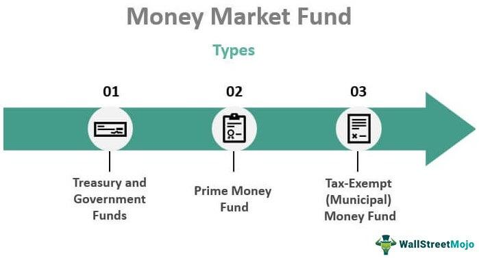

In today's financial landscape, navigating investment options such as money market funds and mutual funds is essential for informed investment strategies. Understanding the unique features and characteristics of these investment vehicles can significantly impact portfolio performance and financial goals. Money market funds are designed to provide capital preservation and liquidity, making them an attractive option for risk-averse investors. These funds invest in high-quality, short-term debt securities, ensuring a stable and secure investment environment.

Mutual funds, on the other hand, offer a diversified portfolio with the potential for higher returns. They involve professional management and strategic asset allocation across various asset classes, including stocks and bonds. This diversification aims to optimize risk-adjusted returns for investors, tailored to different investment objectives and risk tolerances.

Algorithmic trading has become an integral component in fund management, using computer algorithms to automate trading decisions. This technology enhances the speed and precision of trades, reduces human error, and allows fund managers to capitalize on market opportunities efficiently. By integrating algorithmic trading, fund management can respond dynamically to market changes, optimizing the performance of money market and mutual funds.

This article provides a comprehensive exploration of money market funds, mutual funds, and the transformative role of algorithmic trading. The insights offered aim to equip investors with the knowledge necessary to make informed investment decisions, aligning their financial goals with the right investment options.

## Table of Contents

## Understanding Money Market Mutual Funds

Money market mutual funds are a specific category of mutual funds that focus on investments in high-quality, short-term debt securities. These funds were designed to offer investors a safe and liquid alternative for parking capital temporarily while earning a modest return. Typically, money market mutual funds invest in instruments such as Treasury bills, commercial paper, and certificates of deposit, which are considered to bear minimal credit risk due to their short maturities and high credit ratings.

The primary objectives of money market mutual funds are capital preservation and liquidity. By investing in short-term, high-quality debt securities, these funds aim to maintain a stable net asset value (NAV), often pegged at one dollar per share. The short duration of the underlying assets helps minimize the risk of [interest rate](/wiki/interest-rate-trading-strategies) fluctuations, thus protecting investors' capital. This stability provides investors with a high degree of confidence in the potential return of their initial investment, making it a preferred choice for risk-averse individuals.

Liquidity is another critical feature of money market mutual funds. Investors can typically enter or [exit](/wiki/exit-strategy) these funds without delay, thanks to the highly liquid nature of the underlying securities. This ease of access makes them an attractive option for those seeking short-term investment opportunities or a safe refuge during periods of market [volatility](/wiki/volatility-trading-strategies).

However, it's important to note that while money market mutual funds are low-risk compared to other mutual fund categories, they are not entirely risk-free. The yields offered by these funds are generally modest, reflecting the low-risk nature of the investments. Additionally, regulatory provisions, such as those established by the Securities and Exchange Commission (SEC) in the United States, aim to ensure the stability and safety of these funds, but they do not guarantee against potential losses.

Investors considering money market mutual funds should evaluate their risk tolerance, investment horizon, and need for [liquidity](/wiki/liquidity-risk-premium). These funds can serve as an effective component of a diversified investment strategy, balancing the potential for higher returns in other asset classes with the stability and security that money market mutual funds provide.

## Exploring Mutual Funds

Mutual funds are investment vehicles that pool money from multiple investors to purchase a diversified portfolio of assets, including stocks, bonds, and mixed asset classes. This pooling strategy allows individual investors to access a diversified range of investment securities with lower transaction costs than they might incur buying these securities individually.

A key feature of mutual funds is strategic asset allocation, which involves distributing investments across various asset classes to balance risk and potential returns. This strategic allocation is overseen by professional managers who capitalize on their expertise and market insights to optimize the fund's performance. The goal is to achieve a mix that aligns with the fund’s investment objectives, taking into account factors like market volatility, economic conditions, and interest rates.

Investors in mutual funds can choose between actively managed funds and passive index funds. Actively managed funds employ fund managers who make decisions about asset allocation, market sector selection, and specific security investments. These managers employ strategic market maneuvers to seek returns that outperform the benchmark indices, though this active management often comes with higher fees due to the need for continuous oversight and analysis.

Alternatively, passive index funds aim to replicate the performance of a specific index, such as the S&P 500, by holding a portfolio of stocks or bonds that mirror the components of the index. These funds typically have lower fees compared to actively managed funds, reflecting their simplified, buy-and-hold investment approach.

Mutual funds enable investors to reap the benefits of diversification, reducing risk by investing across varied securities. The potential for higher returns is largely dependent on market conditions and the skillful execution of the fund's investment strategy. Investors should evaluate mutual funds based on their individual financial goals, risk tolerance, and investment horizon, selecting funds that align most closely with their desired outcomes.

## Algorithmic Trading in Fund Management

Algorithmic trading refers to the use of computer algorithms to execute trading decisions automatically, a process that fundamentally transforms fund management. These algorithms are designed to evaluate market data, identify trading opportunities, and execute trades at speeds and accuracies surpassing human capability. By automating trading processes, [algorithmic trading](/wiki/algorithmic-trading) minimizes human errors, an essential benefit in market environments where split-second decisions can have significant financial implications.

This technology improves trade execution by utilizing predefined criteria to perform operations such as identifying optimal entry and exit points, managing orders, and monitoring real-time market movements. With computational algorithms, fund managers can execute complex trading strategies involving a large [volume](/wiki/volume-trading-strategy) of trades across various financial instruments, benefiting from the reduced latency and enhanced precision that algorithmic trading offers.

Moreover, algorithmic trading capitalizes on market opportunities by continually scanning for patterns or signals that humans might overlook due to the sheer volume of data involved. Algorithms can adjust strategies dynamically and efficiently, ensuring that trades are executed under favorable conditions and as market fluctuations occur. This responsiveness to market changes is enhanced by using high-frequency trading ([HFT](/wiki/high-frequency-trading-strategies)) algorithms, which can complete thousands of trades in fractions of a second, exploiting even minute pricing discrepancies.

In the context of modern fund management, algorithmic trading is increasingly essential in controlling transaction costs. By optimizing the timing, size, and price of trades, algorithms can significantly reduce the market impact of large transactions, thus preserving fund value. This control over transaction costs is critical in achieving the desired returns while maintaining competitiveness in a rapidly evolving financial landscape.

Overall, algorithmic trading not only enhances the efficiency of fund management through precision and speed but also allows more robust risk management by automatically implementing complex strategies. As a result, algorithmic trading plays a pivotal role in fund management, combining technological prowess with market acumen to optimize financial outcomes.

## Comparative Analysis: Money Market Funds vs. Mutual Funds

Money market funds and mutual funds represent two distinct investment vehicles catering to different investor needs and risk profiles. Money market funds are designed to prioritize safety and liquidity. They achieve this by investing in low-risk, short-term debt instruments such as Treasury bills, commercial paper, and certificates of deposit. These funds aim to provide investors with a stable place to park their cash while [earning](/wiki/earning-announcement) a modest return. Due to their focus on capital preservation, money market funds tend to yield lower returns compared to other investment types, reflecting their minimal risk levels.

In contrast, mutual funds offer a diverse range of investment opportunities that generally include equities, bonds, and other asset classes. This diversification facilitates exposure to various markets and sectors, thus spreading risk to some extent. Mutual funds potentially yield higher returns, attributable to their ability to engage in strategic asset allocation and benefit from professional fund management. They are versatile, ranging from actively managed funds that aim to outperform the market through tactical decisions to passive index funds that mirror market indices and aim for steady growth.

When choosing between money market funds and mutual funds, investors should consider several factors:

1. **Risk Tolerance**: Investors with a low tolerance for risk and a primary goal of preserving capital might favor money market funds. These funds are less susceptible to market volatility and are an ideal choice for those seeking minimal risk exposure. On the other hand, investors willing to accept higher risk in pursuit of potential higher returns might opt for mutual funds.

2. **Time Horizon**: The investment timeline significantly impacts fund choice. Money market funds are suitable for short-term investments, given their liquidity and stability. Conversely, mutual funds are more appropriate for long-term investment strategies, where market fluctuations can be weathered over time, allowing for capital growth.

3. **Expected Returns**: The desired return on investment should align with fund selection. Money market funds, while safer, generally offer lower returns. Mutual funds, with their broad and risky asset allocation, provide an opportunity for higher returns, albeit with a commensurate increase in risk.

Investors must weigh these aspects against their individual financial goals and constraints. Balancing the need for financial stability and the pursuit of growth is crucial in selecting an appropriate investment mix, highlighting the contrasting dynamics of money market and mutual funds.

## Conclusion

Investors must align their financial goals with investment decisions to optimize their portfolios effectively. This alignment involves weighing the stability offered by money market funds against the growth potential inherent in mutual funds. Money market funds, with their low-risk and liquid nature, provide safety for investors seeking capital preservation and easy access to their money. Conversely, mutual funds, with their diversified asset base, offer higher potential returns but come with increased risk. This variance highlights the necessity for investors to carefully assess their risk tolerance, investment horizon, and expected returns when selecting between these fund types.

Algorithmic trading has become a crucial component in modern fund management, bringing significant advantages by enhancing efficiency and minimizing human error. Through precise, data-driven decision-making, algorithmic trading optimizes trade execution speed and accuracy, identifying and capitalizing on fleeting market opportunities that human traders might miss. This technological advancement allows for more responsive fund management, adapting swiftly to market fluctuations while controlling transaction costs.

Ultimately, making informed investment decisions requires a comprehensive understanding of each investment's features and associated risks, particularly in light of emerging technological advancements like algorithmic trading. By integrating this knowledge, investors can better navigate the complex financial landscape, aligning their strategies with personal financial objectives for optimal outcomes.

## References & Further Reading

Bogle, J. C. (2017). *The Little Book of Common Sense Investing*. This book provides insights into the benefits of index investing and emphasizes the importance of low-cost funds in achieving sustainable long-term investment success.

Chan, E. P. (2009). *Quantitative Trading: How to Build Your Own Algorithmic Trading Business*. This text explores the development and implementation of algorithmic trading strategies, offering a comprehensive understanding of the quantitative approaches that can optimize trading performance.

Amerig, C., & Kiazim, O. (2023). *Money Market Funds: Risk, Regulation, and Reform*. This publication examines the landscape of money market funds, addressing the associated risks, regulatory environment, and potential reforms that impact these investment vehicles.

Webb, R. I. (2013). *Shock Markets: Trading Lessons for Volatile Times*. Webb discusses strategies for navigating market volatility and provides lessons that are applicable to managing investment portfolios during times of financial uncertainty.

