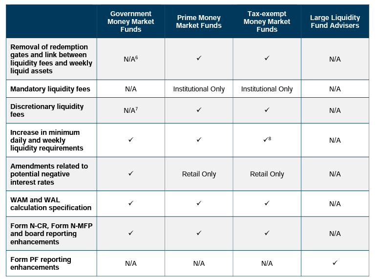

## Table of Contents

## What is a money market?

A money market is a part of the financial market where short-term borrowing and lending happen. It includes things like treasury bills, commercial papers, and certificates of deposit. These are all safe investments that don't last long, usually less than a year. People and businesses use the money market to manage their cash and invest money they don't need right away.

The money market is important because it helps keep the economy running smoothly. Banks and other financial institutions use it to borrow money quickly when they need it. This helps them meet their daily needs and keep their services going. For investors, the money market is a safe place to park their money and earn a little interest, without taking big risks.

## Why are money market regulations important?

Money market regulations are important because they help keep the financial system safe and stable. Without rules, people and businesses might take big risks with their money, which could cause problems for everyone. Regulations make sure that the money market stays a safe place for short-term investments. They set limits on what kinds of investments can be made and how much risk is allowed. This helps prevent big financial crises and protects people's savings.

These regulations also make sure that everyone follows the same rules. This is important because it creates a fair playing field for all investors and financial institutions. When everyone knows the rules and follows them, it builds trust in the money market. This trust is crucial because it encourages more people to invest and helps the economy grow. Without trust, people might be afraid to put their money in the market, which could slow down economic activity.

## What recent changes have been made to money market regulations?

Recently, there have been some important changes to money market regulations to make them safer. One big change came after the 2008 financial crisis. The U.S. government made new rules to stop money market funds from breaking the dollar, which means losing value. They also made funds keep more cash on hand, so they can pay back investors quickly if many people want their money back at the same time.

Another change happened in 2016 when the Securities and Exchange Commission (SEC) introduced new rules. These rules made some money market funds change how they work. Now, if the fund's value goes down, investors can see that the value is less than a dollar. This makes it clearer for investors to see if their money is safe. These changes help make sure that money market funds are more stable and less likely to cause big problems in the future.

## How do these changes affect individual investors?

The recent changes to money market regulations have made things a bit different for individual investors. Now, some money market funds show if their value drops below a dollar. This means investors can see if their money is losing value, which helps them make better choices about where to put their money. It's like having a clearer window into what's happening with their investments.

These changes also make money market funds safer. Funds now have to keep more cash on hand, so if a lot of people want their money back at once, the fund can pay them without problems. This is good for individual investors because it reduces the chance that they'll lose money suddenly. Overall, these rules help keep their investments more stable and secure.

## What are the key objectives of the new money market regulations?

The main goal of the new money market regulations is to make sure that money market funds are safe and stable. After the big financial problems in 2008, the government wanted to stop money market funds from losing value suddenly. So, they made rules that say funds have to keep more cash ready to use. This way, if a lot of people want their money back at the same time, the fund can give it to them without trouble. Keeping more cash helps protect the money of individual investors and keeps the whole money market running smoothly.

Another important aim of these new rules is to make things clearer for investors. Before, if a money market fund lost value, it was hard to see. Now, some funds have to show if their value goes below a dollar. This helps investors understand if their money is safe or not. By making things more open, the rules help build trust. When people trust the money market, they are more likely to invest, which is good for the economy.

## How do money market funds operate under the new regulations?

Money market funds now have to follow new rules to make sure they are safe for people to invest in. One big change is that some funds have to show if their value drops below a dollar. This means investors can see if their money is losing value. It helps them know if their investment is safe or not. Before, it was hard to see if a fund was losing value, but now it's clear. This makes things more open and helps build trust in the funds.

Another change is that money market funds have to keep more cash ready to use. This is important because if a lot of people want their money back at the same time, the fund can pay them without problems. Having more cash on hand helps keep the fund stable and protects the money of individual investors. These new rules came after the big financial problems in 2008, when some funds lost value suddenly. The government made these changes to stop that from happening again and to keep the money market running smoothly.

## What are the implications of these regulatory changes for financial institutions?

The new rules for money market funds have made things different for banks and other financial institutions. Now, they have to keep more cash ready to use. This means they need to be more careful with their money and make sure they always have enough to give back to investors if a lot of people want their money at the same time. It's like having a bigger safety net, which makes things safer but also means they might not be able to use as much money for other things.

These changes also mean that financial institutions have to be more open about what's happening with their funds. If a fund's value drops below a dollar, they have to show it. This helps investors see if their money is safe, but it also puts more pressure on banks to keep their funds stable. They need to work harder to make sure their funds don't lose value, which can be tough but is good for keeping trust in the money market.

## How have money market yields been impacted by the regulatory changes?

The new rules for money market funds have changed how much money investors can earn from them. Because funds now have to keep more cash ready to use, they might not be able to invest as much money in other things that could give higher returns. This means the money market yields, or the interest that investors earn, might be a bit lower than before. The extra cash sitting around doesn't earn as much as other investments, so the overall yield goes down.

But these changes also make money market funds safer. When funds have more cash on hand, they are less likely to lose value suddenly. This can make investors feel more comfortable putting their money in these funds, even if the yield is a bit lower. In the end, the trade-off is between [earning](/wiki/earning-announcement) a little less interest and having a safer place to keep your money. For many people, the safety is worth the lower yield.

## What are the potential risks associated with the new money market regulations?

The new rules for money market funds can make things safer, but they also bring some risks. One risk is that money market funds might earn less money because they have to keep more cash ready to use. This means they can't invest as much in other things that could give higher returns. If the yields, or the interest that investors earn, go down too much, people might decide to put their money somewhere else. This could mean less money coming into the money market, which might not be good for the economy.

Another risk is that the new rules might make it harder for financial institutions to manage their money. They need to keep more cash on hand, which can limit what they can do with their money. If something unexpected happens, like a big financial crisis, having more cash might not be enough to handle the problem. Also, if funds have to show when their value drops below a dollar, it might make investors panic and pull their money out quickly. This could cause a rush to get money back, which might lead to bigger problems in the money market.

## How do the new regulations align with international money market standards?

The new rules for money market funds in the U.S. are made to be similar to what other countries are doing. Many places around the world have their own rules to make sure money market funds are safe and stable. For example, after the big financial problems in 2008, lots of countries made new rules to stop funds from losing value suddenly. The U.S. rules, like keeping more cash ready to use and showing when a fund's value drops below a dollar, are a lot like what other countries are doing to keep their money markets safe.

Even though the rules might be a bit different from one country to another, the main ideas are the same. They all want to make sure that money market funds are a safe place for people to put their money. By having rules that are similar to other countries, the U.S. helps make the global money market more stable. This is important because money moves around the world, and having similar rules helps keep things smooth and safe for everyone.

## What measures are in place to monitor compliance with the new money market regulations?

The new money market rules are watched closely to make sure everyone follows them. The Securities and Exchange Commission (SEC) in the U.S. is the main group that checks if money market funds are doing what they're supposed to do. They look at the funds' reports and do checks to see if the funds are keeping enough cash ready to use and if they're showing the right value to investors. If a fund isn't following the rules, the SEC can make them fix it or even punish them.

Other groups also help keep an eye on things. For example, the Financial Stability Oversight Council (FSOC) watches the whole financial system, including money market funds, to make sure it's stable. They work with the SEC and other regulators to spot any big problems early. By having lots of eyes watching, it helps make sure the money market stays safe and everyone follows the new rules.

## What future regulatory changes might we expect in the money market sector?

In the future, we might see more rules to make money market funds even safer. After big financial problems like the one in 2008, governments often make new rules to stop those problems from happening again. So, if there are new risks or if the economy changes a lot, regulators might make money market funds keep even more cash ready to use or change how they show their value to investors. These changes would be to make sure that money market funds stay a safe place for people to put their money.

Another thing that might happen is more rules to make money markets around the world work the same way. Right now, different countries have their own rules, but having similar rules everywhere could make things easier and safer for everyone. So, we might see more talks between countries to agree on common rules. This would help money move smoothly around the world and keep the global money market stable.

## References & Further Reading

[1]: U.S. Securities and Exchange Commission. (2014). ["Money Market Fund Reform; Amendments to Form PF."](https://www.sec.gov/files/rules/final/2014/33-9616.pdf) 

[2]: Bunglawala, Z., Kochhar, P., Patwardhan, S. (2015). ["The future of money market fund regulation."](https://www.fsb.org/uploads/P270224.pdf) PwC.

[3]: Monch, E. (2015). ["Algorithmic Trading and Market Dynamics."](https://www.cmegroup.com/education/files/Algo_and_HFT_Trading_0610.pdf) Deutsche Bank Global Markets Research.

[4]: Gao, L., & Mizrach, B. (2013). ["High-frequency trading in the equity and bond markets."](https://papers.ssrn.com/sol3/papers.cfm?abstract_id=2294038) Federal Reserve Bank of New York. 

[5]: Lopez de Prado, M. (2018). ["Advances in Financial Machine Learning."](https://www.amazon.com/Advances-Financial-Machine-Learning-Marcos/dp/1119482089) 

[6]: Hull, J. C. (2018). ["Risk Management and Financial Institutions."](https://www.amazon.com/Management-Financial-Institutions-Wiley-Finance/dp/1119932483) 5th Edition. 

[7]: CFTC. (2016). ["Regulation Automated Trading."](https://www.federalregister.gov/documents/2016/11/25/2016-27250/regulation-automated-trading) 

[8]: Securities and Exchange Commission. (2010). ["Risk Management Controls for Brokers or Dealers with Market Access."](https://www.sec.gov/files/rules/final/2010/34-63241.pdf) 

[9]: Markowitz, H. (1952). ["Portfolio Selection."](https://onlinelibrary.wiley.com/doi/abs/10.1111/j.1540-6261.1952.tb01525.x) The Journal of Finance.