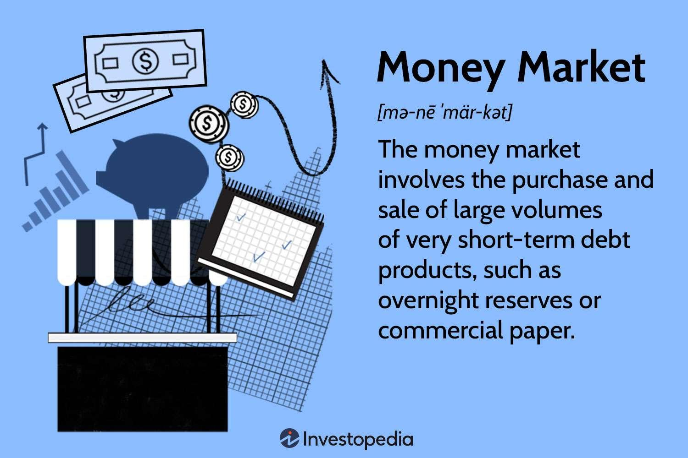

Financial instruments are fundamental components of the money markets, serving as vehicles through which capital flow is facilitated between savers and borrowers. These instruments include treasury bills, commercial papers, and certificates of deposit, each playing a unique role in ensuring liquidity and efficient capital allocation (Mishkin, 2015). The money markets themselves are crucial for short-term borrowing and lending, offering a mechanism for managing liquidity and interest rates across the financial ecosystem.

The participants in theses markets, referred to as market users, encompass a diverse array of entities such as banks, corporations, and governments. These users are primary drivers of money markets, with motivations ranging from managing liquidity needs to maximizing profitability through tactical asset allocations (Choudhry, 2011). Their active engagement influences market dynamics, impacting both the availability and cost of capital. 



Algorithmic trading has increasingly become a cornerstone of modern financial markets, exemplifying a significant technological advancement in trading practices. By leveraging algorithms, traders can execute large orders at speeds and efficiencies unattainable by human effort alone, thereby enhancing the precision of trades (Aldridge, 2013). The infusion of algorithmic trading impacts both cost structures and the speed of operations within money markets, prompting a pivotal intersection between technology and traditional methodologies in finance.

In the evolving landscape of financial markets, the interplay between financial instruments, market users, and algorithmic trading is manifesting transformative effects. This article aims to explore these dynamic elements, highlighting their roles, interactions, and the resulting implications for modern finance. The scope includes examining the various types of financial instruments and their market roles, identifying key money market users and their strategies, delving into the realm of algorithmic trading and its technological underpinnings, and analyzing how these factors collectively reshape market practices and efficiencies. Through this exploration, the article seeks to provide a comprehensive understanding of current trends and future possibilities in money markets, offering insights into the adaptive strategies necessary for market participants in an ever-evolving financial environment.

## Table of Contents

## Overview of Financial Instruments in Money Markets

Financial instruments are essential tools in money markets, functioning as contracts that represent a claim to future cash flows. These instruments are critical for managing liquidity, financing, and risk, and include treasury bills, commercial papers, and certificates of deposit.

Treasury bills are short-term government securities with maturities typically ranging from a few days to one year. Issued by the government, they are considered one of the safest investments because they have little risk of default. They play a crucial role in the money market as they provide a risk-free benchmark for other short-term securities.

Commercial papers are unsecured, short-term debt instruments issued by corporations to meet immediate cash flow needs. Typically having maturities of up to 270 days, they offer higher returns than treasury bills, reflecting their higher risk profile. Corporations, banks, and other financial institutions commonly issue commercial papers to fund operational expenses or short-term obligations.

Certificates of deposit (CDs) are time deposits offered by banks, with fixed interest rates and specified maturity dates, ranging from a few weeks to several years. CDs are negotiable and can be traded in secondary markets, providing [liquidity](/wiki/liquidity-risk-premium) to participants while allowing banks to manage capital.

These instruments collectively facilitate efficient money market operations by addressing liquidity needs and influencing interest rates. They enable issuers to obtain funds at competitive costs and investors to earn returns on short-term cash holdings. The interaction of supply and demand for these instruments affects liquidity and interest rates in the market. When demand for treasury bills and commercial paper is high, it typically leads to lower yields, reflecting their perceived safety and liquidity.

Recent trends in money market financial instruments include the increased use of electronic platforms for trading, enhancing transparency and efficiency. The emergence of environmental, social, and governance ([ESG](/wiki/esg-investing)) criteria has also influenced the design of money market securities, with issuers and investors incorporating ESG considerations into their decisions.

Overall, financial instruments in money markets are pivotal for maintaining liquidity and stability, serving as the backbone of short-term funding and investment strategies.

## Key Users of Money Markets

Money markets serve as crucial platforms for a variety of financial entities. Key users of money markets include banks, corporations, and governments, each with distinct roles and motivations that drive their participation in these markets.

**Banks** play a pivotal role in the money markets as both suppliers and users of funds. They engage in money markets primarily to manage their liquidity and regulatory requirements. Banks borrow and lend short-term funds, using instruments like repurchase agreements and certificates of deposit. Their participation helps maintain monetary stability and provides a mechanism for the transmission of central bank policies. Additionally, banks utilize money markets for interest rate risk management, employing derivative instruments such as interest rate swaps to hedge against rate fluctuations.

**Corporations** participate in money markets to manage their  short-term funding needs and optimize their cash management processes. Companies issue short-term debt instruments like commercial papers to meet immediate capital needs or bridge financing until longer-term funding can be secured. Corporations also invest in various money market instruments to generate returns on surplus cash. By doing so, they actively manage liquidity, ensuring that operational expenses and investment opportunities are adequately funded.

**Governments**, through their treasuries, act as major players by issuing short-term securities such as treasury bills to finance governmental operations and manage public debt. Government issuance of these instruments provides a risk-free benchmark for other financial products, thus contributing to market pricing efficiency. Moreover, central banks are active participants when they intervene in the money markets to implement monetary policies, influencing interest rates and overall economic activity.

The interplay among these market users involves a dynamic exchange of funds and risk, where strategy plays a key role. For example, a corporation might strategically time the issuance of commercial paper to coincide with favorable market conditions, while banks might adjust lending volumes based on regulatory pressures or anticipated policy changes. This interactivity ensures that funds flow efficiently, meeting the diverse financial needs of each participant while stabilizing the market.

In terms of risk management, these entities employ a range of practices: banks often use value-at-risk models and stress testing to gauge financial resilience, corporations may hedge [forex](/wiki/forex-system) or [interest rate](/wiki/interest-rate-trading-strategies) risk using derivatives, and governments might adjust fiscal policies to mitigate currency fluctuations or interest rate risk. These strategies help maintain financial soundness and stability within the money market system.

User participation is essential to maintaining market stability and efficiency. The presence of diverse participants ensures a steady supply and demand for funds, which supports liquidity and fosters competitive interest rates. Moreover, the active engagement of various users reduces the risk of market concentration, enhancing resilience against systemic shocks. A well-functioning money market, with robust participation from key users, underpins the broader financial ecosystem, enabling efficient capital allocation and economic growth.

 to Algorithmic Trading

Algorithmic trading refers to the utilization of computer programs and algorithms to execute trading orders in financial markets. These algorithms determine the timing, price, and quantity of orders with a pre-determined set of rules. The evolution of [algorithmic trading](/wiki/algorithmic-trading) in financial markets began with the advent of electronic trading platforms in the late 20th century, which paved the way for automating trading processes that were previously manual. Over time, the sophistication of these algorithms has increased, incorporating complex decision-making processes and massive data analysis, contributing to their widespread adoption across various financial markets.

The primary benefits of algorithmic trading include speed and precision. Algorithms allow for trades to be executed in microseconds, much faster than any human trader could achieve. This speed advantage is crucial in markets where prices can change in fractions of a second. Precision is another significant benefit, as algorithms can execute trades with a high degree of accuracy, minimizing the risk of human error and emotional biases in trading decisions. Furthermore, algorithmic trading can handle large volumes of data simultaneously, enabling strategies to be backtested against historical data to assess their effectiveness before deployment in live markets.

Several algorithmic trading strategies have become prevalent in financial markets. Market-making involves placing both buy and sell orders for a financial instrument to capture the spread between the bid and ask prices. This strategy provides liquidity to the markets and helps in stabilizing prices. Trend-following strategies, on the other hand, attempt to identify and capitalize on market [momentum](/wiki/momentum) by buying assets when prices are rising and selling when they are declining. Arbitrage strategies seek to exploit price discrepancies between different markets or instruments, buying low in one and selling high in another to make a profit. These strategies highlight the versatility and adaptability of algorithmic trading across various market conditions.

Technological advancements have been instrumental in the widespread adoption of algorithmic trading. High-frequency trading ([HFT](/wiki/high-frequency-trading-strategies)), a subset of algorithmic trading, relies on cutting-edge technology and infrastructure to execute large volumes of trades at incredibly high speeds. Progress in computing power, data analytics, and [machine learning](/wiki/machine-learning) has further enhanced the capabilities of algorithmic trading, allowing for more sophisticated decision-making processes and pattern recognition in large datasets. Additionally, access to vast pools of real-time market data has enabled traders to fine-tune their algorithms for optimal performance.

Despite its advantages, algorithmic trading faces several challenges and is subject to regulatory scrutiny. One major risk of algorithmic trading is the potential for flash crashes—sudden, severe drops in asset prices within a very short time due to an overwhelming [volume](/wiki/volume-trading-strategy) of rapid sell orders executed by algorithms. These can destabilize financial markets and incur significant financial losses. Market manipulation is another concern, as certain algorithmic strategies may be exploited to deceive other market participants. As a response, regulatory bodies have established guidelines and requirements to ensure fair and transparent trading practices. These regulations may include the monitoring of algorithmic trading activities, pre-approval of algorithms, and restrictions on certain types of high-frequency trading practices to mitigate associated risks. 

In conclusion, algorithmic trading has revolutionized how financial markets operate, offering significant advantages in speed and precision while introducing new challenges and regulatory considerations. Its continued evolution will likely shape the future landscape of trading.

## Impact of Algorithmic Trading on Money Markets

Algorithmic trading has fundamentally reshaped the operations of money markets by introducing significant changes to market liquidity, pricing efficiency, and overall transaction processes. The rise of algorithms in trading has led to enhanced market operations, but it also brings associated risks that require careful management.

Algorithms, through rapid execution and continuous market analysis, have significantly improved market liquidity and pricing efficiency in money markets. By evaluating vast data sets swiftly, algorithms can execute trades at optimal times, thereby quickly maintaining or adjusting market positions. This has increased the volume of transactions, ensuring that buyers and sellers can engage in instant transactions, thereby enhancing overall market liquidity. Pricing efficiency, denoted as how closely the prices reflect available information, has also seen improvement owing to the quick absorption and reaction to market signals by trading algorithms. 

The risks associated with algorithmic trading, including the potential for flash crashes and market manipulation, present significant challenges. Flash crashes occur when rapid sell-offs triggered by algorithms lead to precipitous drops in asset prices over very short periods, before typically recovering just as quickly. This [volatility](/wiki/volatility-trading-strategies) can be exacerbated by high-frequency trading algorithms that react en masse to market events. Furthermore, the potential for market manipulation exists, as sophisticated algorithms might be employed to create deceptive market activities – such as spoofing – which is the act of placing large orders with no intention of execution, solely to create a false impression of demand or supply.

Algorithms have also played a pivotal role in enhancing market transparency and reducing transaction costs. Automated systems provide immediate access to market data and historical performance metrics, fostering a more informed trading environment. Moreover, algorithms reduce the need for manual intervention, significantly cutting down on transaction costs related to human error and time delays. By employing algorithms, financial institutions can execute more trades with greater precision and lower costs, which benefits end-users through decreased spreads.

Several case studies illustrate the successes and failures of algorithmic trading in money markets. For instance, according to research provided by the Bank of International Settlements, the deployment of algorithmic trading in the U.S. Treasuries market has improved liquidity. However, the 2010 Flash Crash highlights a failure, where a single large sell order triggered by an algorithm led to a drastic market drop. These case studies reveal that while algorithmic trading can lead to improved efficiency and cost savings, there must be a framework of regulation and robust risk management to mitigate potential adverse effects.

In summary, algorithmic trading continues to revolutionize money market operations by improving liquidity and efficiency while also posing risks through potential volatility and manipulative practices. Continuous advancements and regulatory measures are essential to harness the full benefits of algorithmic trading while safeguarding market stability.

## Case Studies of Financial Instruments and Algorithmic Trading

Financial instruments, when traded algorithmically, can significantly alter trading dynamics in money markets. Through case studies, we can explore how specific strategies have been applied, the lessons learned, and the broader implications for both the market and the future of algorithmic trading.

### Real-World Examples of Algorithmic Trading of Financial Instruments

**Treasury Bills and Algorithmic Trading: Case Study**

One concrete example involves the algorithmic trading of U.S. Treasury bills, where automation and algorithms have been utilized for improving transaction efficiency. Large financial institutions have deployed market-making algorithms designed to analyze real-time market data and execute trades rapidly, minimizing price volatility and enhancing liquidity.

**Algorithmic Strategy Breakdown**

1. **Data Collection and Analysis**: The algorithm collects real-time data on Treasury bill prices, yields, and trading volumes from various electronic trading platforms.

2. **Execution Algorithm**: Using a volume-weighted average price (VWAP) strategy, the algorithm divides large orders into smaller chunks, executing them incrementally throughout the trading day. This helps in reducing market impact.

3. **Risk Management**: Continuous monitoring of interest rate changes and economic indicators allows the algorithm to adjust trading parameters, mitigating the potential impact of sudden market shifts.

4. **Feedback Loops**: Post-trade analytics are employed to evaluate performance and refine strategies, ensuring alignment with market conditions.

```python
import numpy as np

# Simplified Python algorithm for a VWAP trading strategy
def vwap(prices, volumes):
    return np.sum(prices * volumes) / np.sum(volumes)

prices = np.array([100, 101, 102])
volumes = np.array([200, 250, 150])

vwap_price = vwap(prices, volumes)
print(f"VWAP Price: {vwap_price}")
```

### Lessons Learned and Insights

**Efficiency and Liquidity**: Algorithmic trading of Treasury bills has shown enhanced market efficiency by tightening bid-ask spreads, thus lowering the cost for market participants.

**Flexibility Requirement**: The need for adaptive algorithms is highlighted, emphasizing the importance of incorporating real-time data and feedback mechanisms to respond to sudden market changes.

**Risk of Overfitting**: Some algorithms may be too narrowly optimized for past market data, underlining the necessity for more generalized models that can handle various market conditions.

### Impact on the Market Landscape

These algorithmic trading practices have contributed to increased market liquidity and tighter spreads, promoting a more competitive environment. However, the growing reliance on algorithms raises concerns about potential systemic risks, such as those seen during the "flash crash" of 2010, where rapid algorithmic trading exacerbated price swings.

### Future Implications

The integration of [artificial intelligence](/wiki/ai-artificial-intelligence) and machine learning promises further sophistication in algorithmic trading, enabling even more nuanced responses to changing market dynamics. This evolution could lead to increased market stability if adequately managed, alongside a higher standard of transactional efficiency.

Nonetheless, the importance of robust regulatory oversight will grow, ensuring that these technological advancements do not jeopardize market integrity. The ongoing development of more transparent algorithms can help mitigate concerns around market manipulation, fostering trust and encouraging broader adoption in money markets. Future advancements could reshape both the operational and regulatory framework of algorithmic trading, establishing new paradigms in financial markets.

## Conclusion

In reviewing the critical elements addressed throughout this article, we have examined the pivotal role of financial instruments in money markets, the diverse array of market users, and the transformative impact of algorithmic trading. The intricate interplay between these components underscores the dynamic and interconnected nature of contemporary financial systems.

The symbiotic relationship among financial instruments, market participants, and algorithmic trading has become increasingly pronounced. Financial instruments such as treasury bills, certificates of deposit, and commercial papers provide the necessary liquidity and structural foundation for money markets. Meanwhile, market users—including banks, corporations, and governments—utilize these instruments to fulfill various financial needs, thereby influencing market dynamics and fostering economic stability. Algorithmic trading has introduced a new dimension, enhancing market efficiency and precision, yet also imposing challenges like potential market manipulation and flash crashes.

Looking forward, the landscape of money markets is poised for continued evolution. Technological advancements will likely propel algorithmic trading further, leading to greater integration with traditional trading practices. However, balancing the precision and speed of algorithmic methods with the insights and judgments of traditional techniques is critical to mitigating risks and maximizing benefits.

The continual study and adaptation in this ever-changing financial world are crucial. Market participants and regulators must maintain a proactive stance, embracing innovations while remaining vigilant against emerging risks. The evolution of money markets, driven by the convergence of financial instruments, user strategies, and algorithmic technologies, will require ongoing engagement and expertise to harness its full potential.

## References & Further Reading

[1]: Mishkin, F. S. (2015). ["The Economics of Money, Banking, and Financial Markets."](https://www.pearsonhighered.com/assets/preface/0/1/3/4/0134855388.pdf) Pearson.

[2]: Choudhry, M. (2011). ["The Money Markets Handbook: A Practitioner's Guide."](https://books.google.com/books/about/The_Money_Markets_Handbook.html?id=OqHDJ92U134C) Wiley.

[3]: Aldridge, I. (2013). ["High-Frequency Trading: A Practical Guide to Algorithmic Strategies and Trading Systems."](https://onlinelibrary.wiley.com/doi/pdf/10.1002/9781119203803.fmatter) Wiley.

[4]: Hasbrouck, J. (2007). ["Empirical Market Microstructure: The Institutions, Economics, and Econometrics of Securities Trading."](https://academic.oup.com/book/52241) Oxford University Press.

[5]: ["Algorithmic Trading: Winning Strategies and Their Rationale"](https://www.wiley.com/en-us/Algorithmic+Trading%3A+Winning+Strategies+and+Their+Rationale-p-9781118460146) by Ernest P. Chan