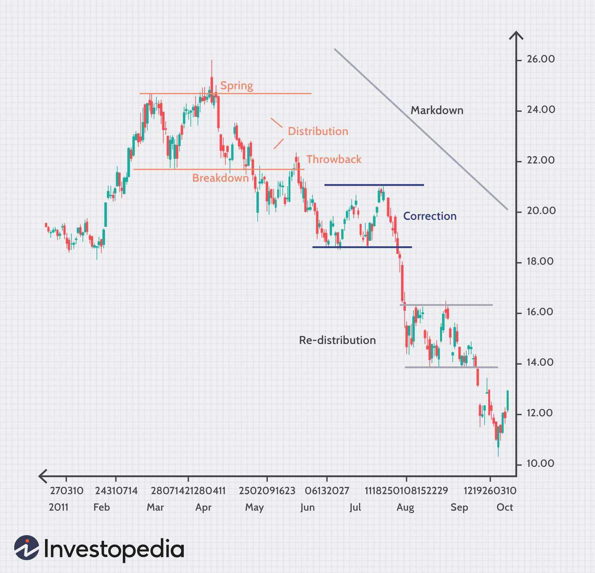

## Table of Contents

## What does the term 'Money on the Sidelines' refer to in finance?

The term 'Money on the Sidelines' refers to the idea that there is cash or money that is not currently invested in the stock market or other investments. People often talk about this when they think that a lot of people are holding onto their money instead of investing it. They believe that if this money were to be invested, it could push the prices of stocks or other investments higher.

However, many experts argue that the concept of 'Money on the Sidelines' is a myth. They say that money not invested in stocks is usually invested somewhere else, like in bonds, savings accounts, or other financial instruments. So, the total amount of money in the economy stays the same, it just moves around between different types of investments. This means that the idea of money waiting on the sidelines to come into the market might not be as significant as some people think.

## How does the concept of 'Money on the Sidelines' impact the stock market?

The concept of 'Money on the Sidelines' suggests that if a lot of people decide to invest their money that they've been holding onto, it could make stock prices go up. This is because more people buying stocks means more demand, and when demand goes up, prices usually follow. So, if everyone suddenly decides to put their money into the stock market, it could lead to a big increase in stock prices.

However, many experts believe that this idea isn't quite right. They say that money not in the stock market is usually already invested somewhere else, like in bonds or savings accounts. So, if someone moves their money from a savings account into stocks, they're not adding new money to the economy; they're just moving it around. This means that the total amount of money stays the same, and the idea of 'Money on the Sidelines' waiting to come into the market might not be as important as some people think.

## Can you explain the mechanism behind 'Money on the Sidelines'?

The idea of 'Money on the Sidelines' means that there is money that people are not using to buy stocks or other investments right now. People think that if everyone with this money decides to invest it all at once, it could make stock prices go up. This is because more people wanting to buy stocks would mean more demand, and when demand goes up, prices usually go up too.

But many experts say this idea might not be true. They explain that money not in the stock market is usually already being used somewhere else, like in a bank account or in bonds. So, if someone decides to take their money out of a bank and buy stocks instead, they're not adding new money to the economy; they're just moving it around. This means the total amount of money stays the same, and the idea of 'Money on the Sidelines' might not be as important as some people think.

## What are common examples of 'Money on the Sidelines'?

Common examples of 'Money on the Sidelines' include money that people keep in their savings accounts at banks. Instead of investing this money in stocks or other investments, they keep it safe in the bank where it earns a little interest. Another example is money that people put into bonds. Bonds are like loans to companies or governments, and they usually pay back a steady amount of interest over time. People might choose to invest in bonds instead of stocks because they think bonds are safer.

Another example is money that people keep in money market funds. These funds invest in very safe, short-term investments and give people easy access to their money. People might put their money here instead of in stocks because they want to be able to use it quickly if they need to. So, all of this money that people are not using to buy stocks right now is what people call 'Money on the Sidelines.'

## How does 'Money on the Sidelines' relate to investor behavior?

The concept of 'Money on the Sidelines' is closely tied to how investors behave. When people talk about 'Money on the Sidelines,' they're usually talking about money that investors are not using to buy stocks right now. This can happen when investors are feeling unsure or worried about the stock market. They might decide to keep their money in safer places, like savings accounts or bonds, instead of investing it in stocks. This behavior shows that investors are trying to protect their money from risks they see in the market.

However, many experts say that the idea of 'Money on the Sidelines' might not be as important as some people think. They explain that money not in stocks is usually already invested somewhere else. So, if an investor decides to move their money from a savings account into stocks, they're not adding new money to the economy; they're just moving it around. This means that even if a lot of investors suddenly decide to invest their money in stocks, it might not make as big a difference as some people expect.

## What are the economic implications of large amounts of 'Money on the Sidelines'?

When people talk about large amounts of 'Money on the Sidelines,' they mean that a lot of money is not being used to buy stocks or other investments right now. Some people think that if all this money suddenly goes into the stock market, it could make stock prices go up a lot. This is because more people wanting to buy stocks would mean more demand, and when demand goes up, prices usually go up too. So, the idea is that this money could help the economy grow if it gets invested.

However, many experts say that this idea might not be as important as some people think. They explain that money not in stocks is usually already being used somewhere else, like in bank accounts or bonds. So, if someone moves their money from a bank account into stocks, they're not adding new money to the economy; they're just moving it around. This means the total amount of money stays the same, and the idea of 'Money on the Sidelines' might not have a big impact on the economy.

## How do financial analysts track 'Money on the Sidelines'?

Financial analysts track 'Money on the Sidelines' by looking at different places where people might keep their money instead of investing it in stocks. They look at how much money people have in savings accounts, money market funds, and bonds. By watching these numbers, analysts can get an idea of how much money is not being used to buy stocks right now. They also pay attention to surveys and reports that ask people about their investing plans, which can give clues about whether more money might move into the stock market soon.

However, many experts think that tracking 'Money on the Sidelines' might not be very useful. They say that money not in stocks is usually already invested somewhere else, so it's not really "on the sidelines." If someone moves their money from a savings account into stocks, they're just moving it around, not adding new money to the economy. So, while analysts can track where money is, the idea of 'Money on the Sidelines' waiting to come into the market might not be as important as some people think.

## What role do interest rates play in the concept of 'Money on the Sidelines'?

Interest rates play a big role in the concept of 'Money on the Sidelines.' When interest rates are high, people might decide to keep their money in savings accounts or bonds instead of buying stocks. This is because high interest rates mean they can earn more money just by keeping their money safe. So, if interest rates go up, more money might stay on the sidelines, and less money might go into the stock market.

On the other hand, when interest rates are low, people might be more willing to take their money out of savings accounts and invest it in stocks. This is because they can't earn much interest by keeping their money safe, so they might look for better returns in the stock market. So, low interest rates could mean less money on the sidelines and more money going into stocks. But remember, even if interest rates change, the total amount of money in the economy stays the same; it just moves around between different places.

## How does 'Money on the Sidelines' affect asset allocation strategies?

When people think about 'Money on the Sidelines,' it can change how they decide to spread their money across different investments. If someone believes there's a lot of money waiting to be put into the stock market, they might decide to move some of their own money from safe places like savings accounts or bonds into stocks. They do this because they think that if everyone else starts buying stocks, the prices will go up, and they want to be part of that rise. So, the idea of 'Money on the Sidelines' can make people adjust their asset allocation to try and take advantage of what they think will happen in the market.

However, many experts say that 'Money on the Sidelines' might not be as important as some people think. They explain that money not in stocks is usually already being used somewhere else, like in a bank account or in bonds. So, if someone moves their money from a savings account into stocks, they're not adding new money to the economy; they're just moving it around. This means that even if a lot of people suddenly decide to invest their money in stocks, it might not make as big a difference as some people expect. So, while the idea of 'Money on the Sidelines' can influence how people think about their asset allocation, it's important to remember that the total amount of money in the economy stays the same, and it just moves around between different types of investments.

## What are the criticisms or misconceptions about 'Money on the Sidelines'?

Some people think that 'Money on the Sidelines' means there's a lot of money waiting to be put into the stock market, and if it all goes in at once, stock prices will go up a lot. But many experts say this idea is not right. They explain that money not in stocks is usually already being used somewhere else, like in a bank account or in bonds. So, if someone moves their money from a bank account into stocks, they're not adding new money to the economy; they're just moving it around. This means the total amount of money stays the same, and the idea of 'Money on the Sidelines' might not be as important as some people think.

Another criticism is that the concept of 'Money on the Sidelines' can make people think that the economy can grow just by moving money around. But this isn't true. The economy grows when people make new things, start new businesses, or find new ways to do things better. Moving money from one place to another doesn't create new money or make the economy bigger. So, while the idea of 'Money on the Sidelines' might sound like it could help the economy, it's really more about how people move their money around, not about making the economy grow.

## How has the concept of 'Money on the Sidelines' evolved with modern financial instruments?

The idea of 'Money on the Sidelines' used to be about money people kept in simple places like savings accounts or bonds instead of buying stocks. But now, with new financial tools, this idea has changed a bit. People can now keep their money in things like money market funds, which are like savings accounts but can invest in short-term, safe things. They can also use exchange-traded funds (ETFs) or mutual funds, which let people invest in a bunch of different things at once, making it easier to move money around quickly. So, 'Money on the Sidelines' now includes these new places where people might keep their money before deciding to invest in stocks.

Even with these new tools, the basic idea of 'Money on the Sidelines' is still the same. People think that if a lot of money moves from these new places into the stock market, it could make stock prices go up. But many experts still say that this idea might not be as important as some people think. They explain that money not in stocks is usually already being used somewhere else, so moving it around doesn't really add new money to the economy. So, even with modern financial instruments, the total amount of money stays the same, and it's just about how people move their money around.

## What case studies or historical events illustrate the impact of 'Money on the Sidelines'?

One historical event that people often talk about when discussing 'Money on the Sidelines' is the period after the 2008 financial crisis. During this time, many people were scared about the stock market and decided to keep their money in safe places like savings accounts and bonds. Some people thought that if all this money moved into the stock market, it would make stock prices go up a lot. But even when the market started to recover, the money didn't all rush back into stocks at once. Instead, it moved slowly, showing that the idea of 'Money on the Sidelines' waiting to come into the market might not be as powerful as some people think.

Another example is the period after the dot-com bubble burst in the early 2000s. After the bubble, many investors were worried and kept their money out of the stock market. They put it into safer investments like bonds. Some people thought this money would come back into the market and push stock prices up. But what happened was that the money moved back into stocks slowly over time, not all at once. This showed that even when there's a lot of money on the sidelines, it doesn't always rush back into the market in a big wave that makes prices go up quickly.

## References & Further Reading

[1]: Bergstra, J., Bardenet, R., Bengio, Y., & Kégl, B. (2011). ["Algorithms for Hyper-Parameter Optimization."](https://dl.acm.org/doi/10.5555/2986459.2986743) Advances in Neural Information Processing Systems 24.

[2]: ["Advances in Financial Machine Learning"](https://www.amazon.com/Advances-Financial-Machine-Learning-Marcos/dp/1119482089) by Marcos Lopez de Prado

[3]: ["Evidence-Based Technical Analysis: Applying the Scientific Method and Statistical Inference to Trading Signals"](https://www.amazon.com/Evidence-Based-Technical-Analysis-Scientific-Statistical/dp/0470008741) by David Aronson

[4]: ["Machine Learning for Algorithmic Trading"](https://github.com/stefan-jansen/machine-learning-for-trading) by Stefan Jansen

[5]: ["Quantitative Trading: How to Build Your Own Algorithmic Trading Business"](https://www.amazon.com/Quantitative-Trading-Build-Algorithmic-Business/dp/1119800064) by Ernest P. Chan