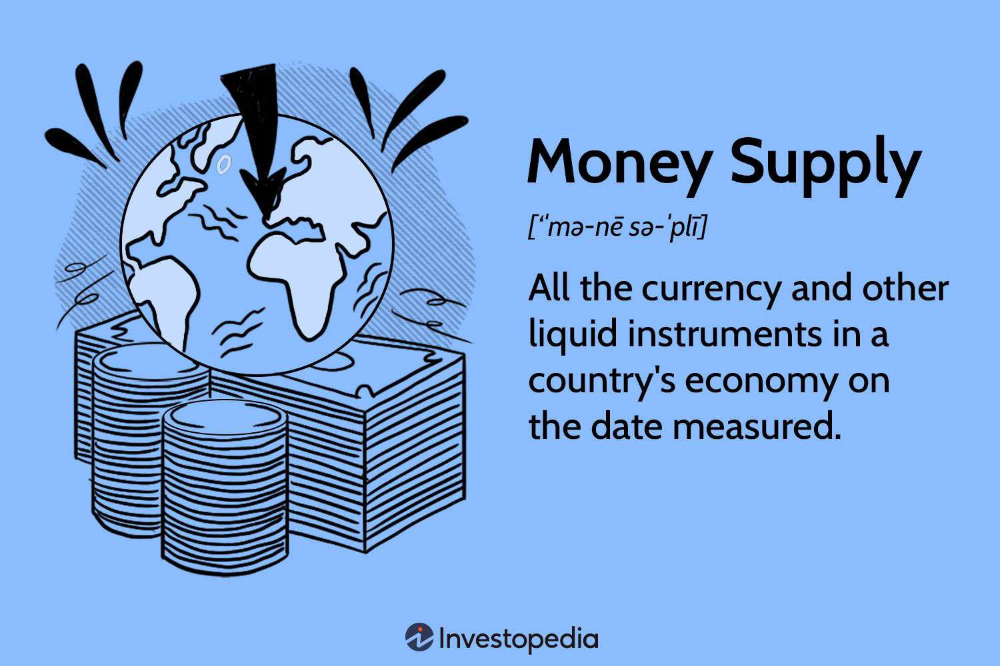

The interconnection between the economy, money supply, and trading has consistently captured the attention of both economists and traders. Central to this interest is the money supply, a critical factor that influences a nation's economic environment by affecting key variables such as inflation, interest rates, and economic growth. Understanding these elements is crucial because they determine the flow of funds within an economy, influencing everything from consumer spending to investment dynamics. For instance, an increase in the money supply generally lowers interest rates, potentially stimulating economic growth through increased lending and investment activities. Conversely, a reduced money supply can lead to higher interest rates, curbing economic expansion.

Simultaneously, the advent of algorithmic trading has transformed trading activities. By utilizing sophisticated algorithms and computational techniques, traders can execute orders with unprecedented speed and precision. This shift towards automation in trading not only enhances efficiency but also significantly reduces human error, making it a compelling choice for institutional and individual traders.



This article aims to comprehensively explore these pivotal concepts. It will detail the types of money, the concept of money supply, and its effects on the economy, along with how algorithmic trading integrates into this framework. By doing so, we seek to elucidate the complex yet fascinating interplay between monetary policy and trading strategies in the ever-evolving financial landscape.

## Table of Contents

## Understanding Money Supply and Its Types

Money supply represents the total amount of monetary assets available within an economy at any given time. Understanding the components of money supply is essential for both policymakers and economists as it helps in the analysis and regulation of economic conditions. Typically, money supply is divided into several categories, primarily M1, M2, and sometimes M3.

M1 comprises the most liquid forms of money, including physical currency and coins, demand deposits such as checking accounts, and other assets that can be quickly and easily converted to cash with minimal loss of value. The liquidity characteristic of M1 makes it crucial for day-to-day transactions and immediate financial needs.

M2 includes all elements of M1 plus additional assets that are slightly less liquid. It encompasses savings deposits, money market securities, mutual funds, and other time deposits that require notice or incur penalties if withdrawn prematurely. These components of M2 reflect money that is not used directly for everyday transactions but can readily be converted to cash or checking deposits, serving as a buffer for economic activities that necessitate a longer period to mature.

The distinctions between M1 and M2 allow analysts to gauge the economic landscape from both immediate transactional perspectives and broader financial security aspects. They further facilitate the formulation of monetary policy by central banks aiming to influence inflation, interest rates, and economic growth. Although M3 is less commonly used, it includes large time deposits, institutional money market funds, and other larger liquid assets, providing a broader view of an economy’s monetary structure. 

Knowing these distinctions provides insight into how money flows through the economy, impacting consumer spending, investment, and overall economic vitality. Accurate measurement of the money supply categories, such as M1 and M2, is essential for formulating effective monetary policies and making informed economic forecasts.

## The Role of Money Supply in Economic Performance

Money supply is a critical economic indicator that significantly impacts the health and functionality of an economy. It encompasses the total amount of monetary assets within a particular economy at a given time and is closely monitored by policymakers and economists to gauge economic conditions accurately.

An increase in money supply often serves as a stimulus for economic growth. When the supply of money expands, it typically leads to lower interest rates. This reduction in interest rates makes borrowing cheaper, encouraging businesses to invest and expand operations, thereby stimulating job creation and increasing consumption. Consequently, consumer spending increases as access to credit becomes more affordable, further propelling economic growth.

Conversely, when the money supply is restricted, economic growth can be impeded. A limited supply of money often results in higher interest rates, making borrowing more expensive. As businesses face increased costs of capital, investment is likely to be curtailed, potentially leading to slower job growth or even contraction. Similarly, consumers may reduce spending due to the higher cost of borrowing, which can dampen demand within the economy.

To navigate these dynamics and achieve desired economic outcomes, economists and central banks employ monetary policy. The strategic management of money supply through instruments like open market operations, discount rates, and reserve requirements allows these entities to influence economic stability and growth. By adjusting these levers, central banks aim to control inflation, maintain employment levels, and foster sustainable economic expansion.

In summary, the role of money supply in economic performance is multifaceted, affecting interest rates, consumer spending, investment, and overall economic growth. Skillful management of the money supply through monetary policy is essential for ensuring a balanced and thriving economy.

## Algorithmic Trading: An Overview

Algorithmic trading utilizes computerized systems to execute financial transactions according to predefined strategies and market conditions. At its core, it incorporates complex mathematical models and algorithms designed to dynamically identify profitable trading opportunities. By automating trade execution, [algorithmic trading](/wiki/algorithmic-trading) ensures rapid and precise transactions, significantly reducing human-induced errors or lapses.

The backbone of algorithmic trading is the mathematical and statistical models used to analyze vast datasets and recognize patterns that signal potential trading opportunities. These models can incorporate a wide range of variables, including asset prices, market conditions, and macroeconomic indicators, to make informed decisions. For instance, an algorithm might monitor live market data to detect specific conditions triggering buy or sell orders within milliseconds.

The technology underpinning algorithmic trading offers distinct advantages over manual trading. Speed is a crucial [factor](/wiki/factor-investing); algorithms can process and react to market data far faster than a human could. This speed advantage is particularly beneficial in high-frequency trading, where milliseconds can determine the success of a transaction.

Moreover, algorithms operate with precise accuracy, executing trades exactly as coded without the errors often inherent in human decision-making. This precision reduces the risk of emotional or subjective influences affecting trading decisions. Unlike human traders, algorithms can operate 24/7 without fatigue, enhancing consistency in trading performance.

Algorithmic trading is prevalent in various markets, including stocks, [forex](/wiki/forex-system), commodities, and cryptocurrencies, and is favored by both institutional investors and individual traders seeking efficiency and reliability. This type of trading has transformed the financial landscape, facilitating unprecedented levels of market [liquidity](/wiki/liquidity-risk-premium) and enabling sophisticated trading techniques that were previously impractical with manual processes. 

In summary, algorithmic trading leverages advanced technology to enhance trading efficiency and accuracy, offering significant advantages in speed and reliability, which increasingly make it the method of choice for modern traders.

## Types of Algorithmic Trading Strategies

Common algorithmic trading strategies encompass various approaches that utilize systematic and quantitative methods to optimize trading decisions. Among the prominent strategies are trend-following, [arbitrage](/wiki/arbitrage), market-making, and [statistical arbitrage](/wiki/statistical-arbitrage).

Trend-following strategies aim to exploit market [momentum](/wiki/momentum) by identifying and trading in the direction of existing trends. These strategies often rely on technical indicators like moving averages or momentum oscillators to signal potential entry and [exit](/wiki/exit-strategy) points. A common mathematical representation of a trend-following strategy involves calculating moving averages. For example, a simple moving average (SMA) of a price series can be defined as:

$$
\text{SMA}_n = \frac{1}{n} \sum_{i=0}^{n-1} P_{t-i}
$$

where $\text{SMA}_n$ is the moving average over $n$ periods, and $P_{t-i}$ denotes the price at the $t-i$ point.

Market-making strategies are designed to provide liquidity to financial markets by simultaneously placing buy and sell orders for a security. The primary objective is to profit from the bid-ask spread while maintaining a neutral market position. Market makers continuously adjust their quotes based on supply and demand dynamics. These strategies rely heavily on speed and precision in order entry, often facilitated by advanced algorithms and high-frequency trading systems.

Statistical arbitrage involves leveraging quantitative models to identify and exploit price inefficiencies among correlated securities. This strategy requires the use of statistical methods to assess the likelihood of a reversion to mean price relationships. For example, [pair trading](/wiki/pair-trading) is a common form of statistical arbitrage, which involves evaluating the historical correlation between two stocks and taking long or short positions when the price ratio diverges from the mean. A basic pair trading strategy can be formulated in Python as follows:

```python
import numpy as np
import pandas as pd

def calculate_z_score(series):
    return (series - series.mean()) / np.std(series)

# Assuming 'prices_stock1' and 'prices_stock2' are Pandas Series of historical prices
price_ratio = prices_stock1 / prices_stock2
zscore = calculate_z_score(price_ratio)

# Trading signals based on z-score
sell_signal = zscore > 2
buy_signal = zscore < -2
```

These algorithmic strategies utilize sophisticated mathematical and statistical models, potentially incorporating [machine learning](/wiki/machine-learning) techniques, to continuously adapt to changing market conditions. The integration of such strategies allows traders to capitalize on inefficiencies with reduced human intervention, thereby improving execution speed and accuracy in the ever-evolving trading landscape.

## Interrelation Between Money Supply and Algorithmic Trading

Changes in money supply are a critical factor affecting financial markets as they directly influence interest rates and liquidity levels. An increase in money supply typically results in lower interest rates, which can enhance the liquidity of financial markets. This increased liquidity often leads to a bullish market environment as borrowing costs decrease, encouraging spending and investment. Conversely, a decrease in money supply can heighten interest rates, restrict liquidity, and exert bearish pressure on financial markets. 

Algorithmic traders closely monitor these changes in the money supply and other economic indicators, integrating this information into their trading models. For instance, when a central bank announces a monetary policy that expands the money supply, algorithmic traders might adjust their strategies to capitalize on the expected increase in asset prices due to improved market liquidity and lower interest rates. This could involve increasing long positions in equities or other risk assets expected to benefit from the economic stimulus.

The dynamic nature of money supply and its fluctuations present both challenges and opportunities for algorithmic trading. Traders must devise algorithms that are both robust and flexible to respond efficiently to rapid market changes. For example, a sudden change in monetary policy could lead to a swift adjustment in market sentiment, requiring algorithms to execute trades quickly to capitalize on short-term price movements. 

Consider a simple Python example to show how an algorithm might adjust its trading strategy based on changes in interest rates:

```python
def adjust_strategy(interest_rate):
    """
    Adjusts trading strategy based on the current [interest rate](/wiki/interest-rate-trading-strategies).

    Parameters:
    interest_rate (float): The current market interest rate.

    Returns:
    str: Suggested trading action.
    """
    if interest_rate < 2.0:
        return "Long Position - Favorable for growth stocks"
    elif interest_rate < 4.0:
        return "Neutral - Maintain current positions"
    else:
        return "Short Position - Anticipate bearish trends"

# Example usage:
current_interest_rate = 1.5
trading_decision = adjust_strategy(current_interest_rate)
print(trading_decision)  # Output: Long Position - Favori ble for growth stocks
```

This example illustrates a fundamental decision-making process where the algorithm alters its strategy based on the current interest rate. In reality, these algorithms can be far more complex, incorporating a broader range of economic indicators, but the fundamental idea of adapting to changes in the money supply and related variables remains central to algorithmic trading success.

In summary, algorithmic trading's effectiveness hinges on its adaptability to the ever-changing economic landscape characterized by shifts in money supply and interest rates. By leveraging such economic indicators, algorithmic traders seek to optimize returns and maintain a competitive edge in the financial markets.

## Conclusion

Understanding the interconnections between money supply and algorithmic trading strategies is essential for successfully navigating today's complex financial environments. Money supply, a fundamental economic indicator, serves as a barometer for the health of an economy, influencing variables such as inflation, interest rates, and liquidity. These economic signals are critical inputs for algorithmic trading strategies, which rely on precise and timely data to maximize trading performance.

Algorithmic trading, with its reliance on sophisticated mathematical models and algorithms, benefits significantly from the capacity to interpret and integrate economic signals like changes in money supply. Such integration allows algorithms to dynamically adjust trading strategies in response to shifting economic landscapes, thereby optimizing returns. As these algorithms become increasingly advanced, with the ability to process vast amounts of data in real-time, their dependence on accurate economic indicators becomes even more pivotal.

The evolving nature of technology continues to significantly impact both monetary policy and algorithmic trading. Developments in computational power, data analytics, and machine learning are transforming how economic data is analyzed and used in trading strategies. As a result, the interplay between monetary policy and algorithmic trading is progressively reshaping both economic and trading landscapes. This transformation highlights the importance of continuously developing sophisticated tools and strategies to adapt to an ever-changing financial ecosystem. By maintaining a keen understanding of money supply dynamics and leveraging advanced algorithmic models, market participants can achieve a competitive edge in today's fast-paced financial markets.

## FAQs

### What role does money supply play in the economy?

Money supply is fundamental in determining the economic conditions of a country. It represents the total [volume](/wiki/volume-trading-strategy) of monetary assets available in an economy at a particular time, influencing critical economic variables such as inflation, interest rates, and overall economic growth. An increase in money supply often leads to lower interest rates because more money is available for borrowing, which can stimulate investment and consumer spending, thereby boosting economic growth. Conversely, a decrease in money supply can result in higher interest rates, reducing spending and potentially slowing down economic growth. Central banks manipulate the money supply through monetary policy to maintain price stability, promote employment, and foster favorable economic conditions.

### How do different types of money (M1, M2) impact economic analysis?

The categorization of money into M1, M2, and sometimes M3, plays a significant role in economic analysis by providing insights into different levels of liquidity and economic health. M1 consists of the most liquid forms of money, such as cash and checking deposits, serving as an immediate medium of exchange that reflects short-term economic activity. M2 includes all of M1 plus savings deposits, time deposits, and money market mutual funds, representing a broader view of the money supply that includes short-term to medium-term savings and investment vehicles. These distinctions aid economists and policymakers in assessing financial stability and predicting economic trends. For instance, a rapid increase in M1 might indicate a surge in spending, while a growth in M2 may suggest increased savings and future spending power.

### What are the advantages of algorithmic trading over manual trading?

Algorithmic trading offers several advantages over manual trading, driven primarily by its speed, accuracy, and efficiency. Algorithms can analyze market data and execute trades in fractions of a second, much quicker than a human trader could. This speed advantage allows traders to capitalize on short-lived market inefficiencies and high-frequency opportunities. Furthermore, algorithmic trading reduces human error and emotional bias, ensuring that trades are executed based on pre-defined strategies and data-driven insights. This method also allows for [backtesting](/wiki/backtesting) strategies using historical data to refine approaches before live trading, enhancing the overall precision and reliability of trading strategies.

### How can changes in money supply influence trading strategies?

Changes in money supply can significantly impact financial markets, influencing interest rates and liquidity levels, which are crucial factors for trading strategies. Algorithmic traders monitor changes in money supply to adjust their trading algorithms accordingly. For instance, an expansionary monetary policy leading to increased money supply might lower interest rates, making debt financing cheaper. This scenario could result in a bullish market outlook prompting traders to adopt trend-following strategies. On the other hand, a contractionary policy might signal potential tightening of financial conditions, encouraging strategies focused on hedging risks or capturing short-term [volatility](/wiki/volatility-trading-strategies). By dynamically adjusting strategies based on monetary indicators, traders can optimize their algorithms to maximize returns and minimize risks.

## References & Further Reading

[1]: Mishkin, F. S. (2019). ["The Economics of Money, Banking and Financial Markets."](https://www.pearsonhighered.com/assets/preface/0/1/3/4/0134855388.pdf) Pearson.

[2]: Blinder, A. S. (2006). ["Monetary Policy Today: Sixteen Questions and About Twelve Answers"](https://www.princeton.edu/~ceps/workingpapers/129blinder.pdf). Federal Reserve Bank of Kansas City.

[3]: Cartea, Á., Jaimungal, S., & Penalva, J. (2015). ["Algorithmic and High-Frequency Trading."](https://assets.cambridge.org/97811070/91146/frontmatter/9781107091146_frontmatter.pdf) Cambridge University Press.

[4]: Griffin, J. M., & Shams, A. (2018). ["Manipulation in the VIX?"](https://papers.ssrn.com/sol3/papers.cfm?abstract_id=2972979) Journal of Financial Economics, 119(3), 618-635.

[5]: Engle, R. F. (2001). ["The Use of ARCH/GARCH Models in Applied Econometrics."](https://www.aeaweb.org/articles?id=10.1257/jep.15.4.157) Oxford Economic Papers, 54(4), 557-586.