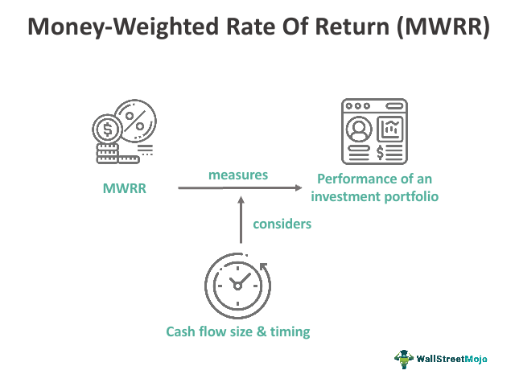

Investment performance measurement is an essential practice for investors striving to evaluate the success of their investment strategies. Accurate performance metrics enable investors to make informed decisions, optimize their portfolios, and achieve their financial goals. Among the plethora of performance indicators, the money-weighted rate of return (MWRR) offers a distinct advantage by taking into account the timing and magnitude of cash flows. This characteristic makes MWRR particularly insightful, as it mirrors the actual financial experience of the investor.

The MWRR, often synonymous with the internal rate of return (IRR) in financial terminologies, goes beyond simple return calculations by recognizing that the infusion or withdrawal of capital can significantly influence investment outcomes. This consideration is crucial in providing a true reflection of portfolio performance over time. Unlike other metrics that may overlook individual cash flow impacts, MWRR adjusts for varying cash flow scenarios, making it indispensable when evaluating personalized investment trajectories.



This article endeavors to elucidate the complexities surrounding MWRR, highlight its comparative advantages over other performance metrics, and explore its practical applications, particularly in algorithmic trading. As automated investing continues to gain prominence, understanding the implications of MWRR becomes critical. Algorithmic strategies can leverage this metric to better accommodate liquidity fluctuations and optimize trading decisions accordingly. Consequently, comprehending MWRR equips investors and traders with a precise tool for maximizing returns under diverse market conditions.

Ultimately, recognizing what makes MWRR advantageous in specific investment contexts helps stakeholders tailor their strategies to reflect genuine performance outcomes.

## Table of Contents

## Understanding Money-Weighted Rate of Return

The money-weighted rate of return (MWRR) serves as a crucial metric in evaluating the performance of an investment portfolio by considering both the magnitude and timing of cash flows. Unlike other metrics, the MWRR effectively represents the internal rate of return (IRR) specific to an investor's portfolio, reflecting the personal investment experience rather than market performance alone.

The MWRR is calculated by equating the present values of all cash flows to the initial investment value. This equation requires solving for the discount rate that brings the net present value of all cash inflows and outflows to zero. Mathematically, this can be expressed as:

$$
\sum_{t=0}^{n} \frac{C_t}{(1 + \text{MWRR})^t} = 0
$$

where $C_t$ represents the cash flow at time $t$.

This approach is comprehensive as it not only evaluates returns but also places significant weight on when these cash flows occur in relation to market conditions. For instance, investments that receive cash inflows during periods of low asset prices or high potential growth can result in a different MWRR compared to investments receiving inflows during peaks. This quality makes the MWRR particularly appropriate when assessing portfolios with substantial and irregular cash flows, such as those managed individually or with tailored strategies.

For investors looking to calculate MWRR efficiently, utilizing tools like spreadsheets or financial calculators is practical. Spreadsheet functions such as IRR, for example, automate the trial-and-error process traditionally involved in finding the MWRR by iterating until the net present value equals zero. A simple Python implementation can also aid in determining the MWRR using numerical methods for roots, such as the following:

```python
import numpy as np

def mwrr(cash_flows):
    # Using numpy's IRR function to calculate the internal rate of return
    return np.irr(cash_flows)

# Example cash flows: Initial investment of -1000, followed by returns of 200, 300, 400
example_cash_flows = [-1000, 200, 300, 400]
print("MWRR:", mwrr(example_cash_flows))
```

In conclusion, the MWRR offers a nuanced and personalized view of investment performance by accounting for the specific timing and scale of cash flows, making it an invaluable tool for evaluating personalized investment strategies.

## Cash Flows and Their Impact on MWRR

Cash flows significantly impact the Money-Weighted Rate of Return (MWRR), affecting returns based on both their timing and magnitude. The MWRR is sensitive to the exact moments when cash flows occur, as well as their size, making it critical for investors to monitor these aspects closely.

Inflows like dividends, interest, and proceeds from assets sales can enhance the MWRR, particularly when they align advantageously with market conditions. For instance, receiving dividend payments during periods of market upturn can boost overall returns by increasing the capital available for reinvestment at favorable rates. Timing these inflows to coincide with periods of anticipated growth can therefore amplify the resultant MWRR.

Conversely, outflows such as withdrawals and reinvestments of dividends, while sometimes necessary, reduce the capital base that can grow over time. When cash is withdrawn from the portfolio, it diminishes the amount of investment able to accrue compound returns, which can lower the MWRR if these outflows are timed at less opportune moments or during market downturns.

For precise calculations of MWRR, it is crucial to accurately identify and chronicle all cash movements, associating them with their respective time periods. This chronological listing ensures that the true impact of each cash flow on the investment's performance is captured. The MWRR, unlike other metrics, cannot be computed from final values alone; instead, it requires detailed cash flow data over the investment's lifetime.

Spreadsheet software offers powerful tools to simplify the complex task of calculating MWRR. Functions like the Internal Rate of Return (IRR) are particularly useful, as they automate the iterative process of finding the rate at which the net present value of these cash flows equals zero. This function uses trial and error methods to solve the equation:

$$
\text{NPV} = \sum_{t=0}^{n} \frac{C_t}{(1 + r)^t} = 0
$$

Where $C_t$ represents the cash flow at time $t$, and $r$ is the MWRR. Utilizing such spreadsheet functions allows investors to compute MWRR without manual iteration, thus reducing errors and saving time.

Coding these calculations can further enhance precision and efficiency. Here is a simple Python example using the NumPy library to calculate MWRR:

```python
import numpy as np

# Define cash flows with the initial investment as a negative number
cash_flows = [-1000, 200, 300, 400, 500]  # Consider this as an example

# Calculate MWRR using numpy's IRR function
mwrr = np.irr(cash_flows)

print(f"The Money-Weighted Rate of Return is: {mwrr:.2%}")
```

This code snippet demonstrates how algorithmic approaches can streamline the computation process, providing quick and accurate insights into investment performance. By leveraging such technologies, investors can more proficiently assess the implications of cash flows on the MWRR, leading to better-informed investment decisions.

## MWRR vs. Time-Weighted Rate of Return (TWRR)

While both the Money-Weighted Rate of Return (MWRR) and the Time-Weighted Rate of Return (TWRR) measure investment performance, they offer distinct perspectives due to their different methodologies and applications. 

TWRR evaluates portfolio growth while eliminating the effects of external cash inflows and outflows. This makes it particularly useful for assessing the performance of investment managers because it isolates investment skill from the impact of investor behavior or timing of cash flows. TWRR is calculated by computing the geometric mean of the portfolio returns for each sub-period, thus focusing solely on investment results rather than cash flow effects. This property makes TWRR valuable in situations where the goal is to gauge how well an investment manager performs relative to a benchmark or a peer group, independent of client-initiated cash activities.

Conversely, MWRR captures the actual investment experience of the investor because it incorporates all cash flow circumstances—both size and timing. MWRR is effectively the internal rate of return (IRR) for an investment portfolio, and it is calculated by setting the present value of all cash flows, including contributions and withdrawals, equal to the initial portfolio value. This allows MWRR to reflect the investor's personal outcome by factoring in the real impact of cash management decisions. The formula for MWRR is grounded in:

$$
\text{NPV} = \sum_{t=0}^{n} \frac{C_t}{(1 + r)^t} = 0
$$

where $C_t$ is the cash flow at time $t$ and $r$ is the MWRR to be calculated iteratively.

In [algorithmic trading](/wiki/algorithmic-trading), both metrics provide valuable insights for strategy development. Understanding both allows traders to predict and respond to cash flow impacts, optimizing trading decisions. Algorithmic systems can use TWRR to benchmark the performance of different trading algorithms, independent of cash flow distortions, while MWRR can be used to understand how cash movements affect total returns.

In scenarios with no cash flow interruptions, MWRR and TWRR tend to yield similar results as cash flow effects are minimal or non-existent. However, their differences become notably pronounced with frequent or significant cash transactions, where MWRR may diverge by reflecting the timing advantage or disadvantage of these cash flows. This divergence emphasizes the importance of selecting the appropriate metric based on the investor’s or portfolio manager's specific circumstances and objectives.

## Limitations and Considerations of MWRR

The Money-Weighted Rate of Return (MWRR) is a highly sensitive metric due to its reliance on cash flows and their timing. It accounts for the specific sequence and magnitude of cash inflows and outflows, which can be advantageous in capturing the realistic financial outcomes of investments. However, this same sensitivity can lead to misrepresentations of true performance if cash flows are not analyzed correctly.

One primary limitation of MWRR is its potential bias towards periods when there are higher assets under management. Fund managers may be unfairly penalized for cash flows that occur beyond their control, as MWRR does not distinguish between performance driven by investment strategy and changes in return driven by external cash flow events. This bias can skew performance evaluations, especially in scenarios where large and irregular cash flows are present.

Furthermore, MWRR excels at providing a personalized performance measure, reflecting the individual stages of an investor's cash flow circumstances. However, this personalization comes at the cost of comparability across different portfolios. Unless cash flow timing is standardized, comparing MWRRs between varying investment accounts may lead to inaccurate conclusions.

Investors looking to apply the MWRR must be cognizant of the complexities inherent in its calculation. The traditional method requires solving for the internal rate of return (IRR) where the net present values of cash inflows and outflows balance to zero, which might involve iterative trial-and-error processes. Using tools like spreadsheets or financial calculators can aid this process, making the calculation more efficient and accessible.

To obtain meaningful insights from MWRR, it is vital to evaluate it within specific contexts. This involves analyzing the distinct needs and characteristics of the investment environment and understanding the limits of MWRR in broader financial comparisons. By considering both its insights and limitations, investors can use MWRR effectively alongside other metrics to gain a comprehensive understanding of investment performance.

## MWRR in Algorithmic Trading

Algorithmic trading systems can leverage the money-weighted rate of return (MWRR) to better understand and adapt to the dynamic impacts of cash flows on investment performance. By incorporating MWRR into algorithmic models, traders enhance their strategies by accounting for [liquidity](/wiki/liquidity-risk-premium) and timing effects of cash flows, which are crucial elements in the volatile environments where high-frequency trading occurs. In such automated settings, cash flows can frequently alter the trajectory of investment growth, necessitating sophisticated tools like MWRR to adjust trading parameters in response to these changes.

One practical application of MWRR in algorithmic trading is in the optimization of strategy parameters. Historical MWRR data provides insights into how past cash flows affected portfolio performance, allowing traders to refine their algorithms for more consistent returns. For instance, understanding periods of high and low MWRR can reveal patterns in cash flow timing, indicating optimum times for buying or selling assets to maximize returns.

In Python, calculating the MWRR can be automated, enhancing the efficiency of its integration into algorithmic trading systems. The internal rate of return (IRR) function from libraries such as NumPy can be utilized to compute the MWRR by inputting a list of cash flows. Here's an example of how this might be done:

```python
import numpy as np

def calculate_mwrr(cash_flows):
    return np.irr(cash_flows)

# Example cash flows: initial investment of -1000, return of 200 after year 1, and 1200 after year 2
cash_flows = [-1000, 200, 1200]
mwrr = calculate_mwrr(cash_flows)
print(f"The Money-Weighted Rate of Return is {mwrr:.2%}")
```

In such cases, integrating MWRR into trading algorithms aids in dynamically adjusting to varying cash inflows and outflows, thus maintaining optimal liquidity and investment growth. This nuanced view of performance enables algorithmic systems to fine-tune their executions more precisely, thereby potentially improving overall investment outcomes. MWRR, when utilized effectively within these systems, provides a clearer context for evaluating investment success, especially in environments where maximizing return consistency is paramount.

## Conclusion

The money-weighted rate of return (MWRR) offers a comprehensive perspective on investment performance by incorporating the magnitude and timing of cash flows. Unlike more conventional metrics, MWRR reflects the actual investor experience, making it particularly valuable in contexts where cash flows are significant and variable. This personalized approach has found applications in diverse investment strategies, including algorithmic trading, where decisions sharply affect both cash flow timing and portfolio performance dynamics.

MWRR's insights extend beyond traditional portfolio analysis. In automated trading systems, where frequent iterations and cash movements occur, MWRR can help traders optimize strategies by accounting for liquidity fluctuations and cash flow impacts on returns. Despite its advantages, MWRR must be applied with awareness of its limitations, particularly its sensitivity to the timing and size of cash flows. Misinterpretations can arise if these factors are not carefully analyzed, especially when comparing multiple portfolios with differing cash flow patterns.

Considering MWRR alongside other performance metrics, such as the time-weighted rate of return, allows investors to achieve a more rounded view of their investment success. This holistic approach equips financial professionals to make strategic, informed decisions, driving enhanced long-term investment performance. By leveraging MWRR accurately, investors and traders gain not only a powerful tool for assessing historical performance but also a strategic lens for future investment choices. This capability positions MWRR as an essential component in the toolkit of sophisticated investors aiming for sustainable success in market environments characterized by variable cash flows.

## References & Further Reading

[1]: Bacon, C. R. (2020). ["Practical Portfolio Performance Measurement and Attribution"](https://onlinelibrary.wiley.com/doi/book/10.1002/9781119206309) (3rd ed.). Wiley.

[2]: Fabozzi, F. J., Kolm, P. N., Pachamanova, D. A., & Focardi, S. M. (2007). ["Robust Portfolio Optimization and Management."](https://onlinelibrary.wiley.com/doi/book/10.1002/9781119202172) Wiley.

[3]: Grinold, R. C., & Kahn, R. N. (2000). ["Active Portfolio Management: A Quantitative Approach for Producing Superior Returns and Controlling Risk"](https://www.amazon.com/Active-Portfolio-Management-Quantitative-Controlling/dp/0070248826). McGraw-Hill Education.

[4]: Maginn, J. L., Tuttle, D. L., McLeavey, D. W., & Pinto, J. E. (2007). ["Managing Investment Portfolios: A Dynamic Process"](https://books.google.com/books/about/Managing_Investment_Portfolios.html?id=8-xBSh1avUsC) (3rd ed.). Wiley.

[5]: Reilly, F. K., & Brown, K. C. (2011). ["Investment Analysis and Portfolio Management"](https://www.researchgate.net/publication/31745765_Investment_Analysis_and_Portfolio_Management_FK_Reilly_KC_Brown) (10th ed.). Cengage Learning.