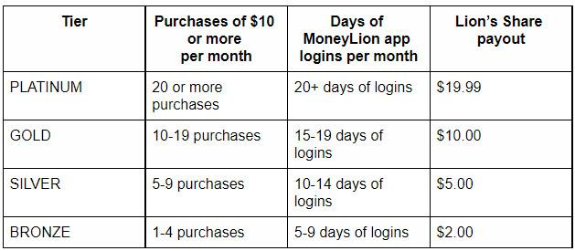

## Table of Contents

## What is MoneyLion and what services do they offer?

MoneyLion is a company that helps people manage their money better. They offer different services to help you with your finances. MoneyLion wants to make it easier for everyone to understand and use their money wisely.

One of the main services MoneyLion offers is a mobile app. This app lets you keep track of your money, make a budget, and even get small loans if you need them. They also have a feature called "Round-Ups" that saves your spare change from everyday purchases. Another service they provide is helping you invest your money. They offer ways to invest in the stock market, even if you don't have a lot of money to start with. Overall, MoneyLion aims to help you save, spend, and invest your money more smartly.

## How does MoneyLion's loan process work for beginners?

MoneyLion makes getting a loan easy for beginners. If you need a loan, you can use their app to apply. You'll need to fill out some information about yourself and how much money you want to borrow. MoneyLion will then check if you can get the loan based on things like your income and credit history. If you're approved, they'll tell you how much you can borrow and what the interest rate will be.

Once you're approved, you can choose to accept the loan. The money will be put into your bank account quickly, usually within a few days. You'll need to pay back the loan over time, usually in monthly payments. MoneyLion will remind you when your payments are due so you don't forget. If you have any questions, you can always ask their customer service for help.

## What are the eligibility criteria for getting a loan from MoneyLion?

To get a loan from MoneyLion, you need to meet some basic requirements. You must be at least 18 years old and a U.S. citizen or a permanent resident. You also need to have a regular source of income, which can be from a job, self-employment, or even government benefits like Social Security. MoneyLion will look at your income to make sure you can pay back the loan.

Another important thing is your credit history. MoneyLion will check your credit score to see if you have a good history of paying back what you owe. If your credit score is not great, you might still be able to get a loan, but the [interest rate](/wiki/interest-rate-trading-strategies) might be higher. You'll also need a bank account where MoneyLion can deposit the loan money and where you can make payments from. If you meet these criteria, you can apply for a loan through their app and see if you get approved.

## What types of loans does MoneyLion provide?

MoneyLion offers different types of loans to help people with their money needs. One type of loan they provide is called a personal loan. This is money you can borrow for things like paying off credit cards, fixing your car, or covering unexpected bills. Personal loans from MoneyLion can be for a few hundred dollars up to a few thousand dollars, and you pay them back over time, usually in monthly payments.

Another type of loan MoneyLion offers is a cash advance. This is a smaller amount of money you can get quickly, often to help with immediate needs like groceries or gas. Cash advances are usually paid back with your next paycheck. They are easier to get than personal loans, but they might have higher fees or interest rates.

MoneyLion also has a feature called Credit Builder Plus. This isn't a traditional loan, but it helps you build your credit while you borrow money. You can use it to get a loan and make payments on time, which helps improve your credit score. This can be a good option if you're trying to build or fix your credit history.

## How does MoneyLion determine loan amounts and interest rates?

MoneyLion looks at a few things to decide how much money they can lend you and what interest rate you'll get. They start by checking your income to make sure you can pay back the loan. If you have a steady job or regular money coming in, they might be able to lend you more. They also look at your credit history. If you've paid back loans on time before, they might give you a bigger loan and a lower interest rate. If your credit isn't so good, they might still lend you money, but the amount might be smaller and the interest rate higher.

Besides income and credit history, MoneyLion also considers how much money you're asking for and how long you want to take to pay it back. If you want a bigger loan, they might give you a higher interest rate because it's riskier for them. If you choose to pay back the loan over a longer time, the interest rate might also be higher. MoneyLion wants to make sure they can lend you money safely, so they use all this information to come up with the right loan amount and interest rate for you.

## What are the fees associated with MoneyLion loans?

When you get a loan from MoneyLion, there are a few fees you might have to pay. One fee is called an origination fee. This is a small percentage of the loan amount that MoneyLion charges to cover the cost of processing your loan. Another fee you might see is a late payment fee. If you don't pay your loan on time, MoneyLion might charge you a fee to remind you to pay up.

For cash advances, MoneyLion might charge an express fee. This is a fee for getting your money quickly, usually within a few hours. Also, if you use their Credit Builder Plus feature, there might be a monthly membership fee. This fee helps you build your credit while you borrow money, but it's something extra you have to pay each month. Always check the details before you take out a loan so you know exactly what fees you might have to pay.

## Can you explain the repayment options available with MoneyLion?

MoneyLion offers different ways to pay back your loan, so you can choose what works best for you. For personal loans, you usually pay back the money in monthly payments. This means you pay a set amount every month until the loan is paid off. The amount you pay each month depends on how much you borrowed and the interest rate. If you can pay more than the minimum, you can do that too, which helps you pay off the loan faster and save on interest.

For cash advances, the repayment is a bit different. You usually have to pay back the money you borrowed plus any fees with your next paycheck. This means the repayment period is shorter, often just a few weeks. If you need more time, you might be able to talk to MoneyLion about setting up a different plan. It's important to pay on time to avoid late fees and to keep your credit in good shape.

## How does MoneyLion's credit building feature work?

MoneyLion's credit building feature is called Credit Builder Plus. It helps you improve your credit score while you borrow money. When you use Credit Builder Plus, you get a loan from MoneyLion, and you pay it back over time. As you make your payments on time, MoneyLion reports this to the credit bureaus, which helps build your credit history. This can be really helpful if you're trying to improve your credit or if you don't have much credit history yet.

There's a small monthly membership fee for using Credit Builder Plus, but it's worth it if you want to build your credit. You can use the money you borrow for anything you need, like paying bills or buying something important. The key is to make sure you pay back the loan on time every month. If you do, your credit score can go up, making it easier for you to get loans or credit cards in the future.

## What are the pros and cons of using MoneyLion for loans?

Using MoneyLion for loans has some good points. It's easy to apply for a loan through their app, and you can get the money quickly, which is great if you need it fast. They offer different types of loans, like personal loans and cash advances, so you can pick what fits your needs. MoneyLion also has a credit building feature called Credit Builder Plus, which can help you improve your credit score while you pay back your loan. This can be really helpful if you're trying to build or fix your credit.

However, there are some downsides to consider. MoneyLion might charge fees, like an origination fee for personal loans or an express fee for cash advances. If you're late with your payments, you could also get hit with a late fee. The interest rates can be high, especially if your credit isn't great. And if you use the Credit Builder Plus feature, you'll have to pay a monthly membership fee. So, it's important to read all the details and make sure you can handle the payments before you take out a loan with MoneyLion.

## How does MoneyLion compare to other personal loan providers?

MoneyLion is different from other personal loan providers because it's easy to use and quick. You can apply for a loan right from their app, and if you're approved, you can get the money fast. This is great if you need money in a hurry. MoneyLion also offers different types of loans, like personal loans and cash advances, so you can pick what works best for you. They also have a feature called Credit Builder Plus, which helps you build your credit while you pay back your loan. This can be really helpful if you're trying to improve your credit score.

But, MoneyLion might charge more fees than some other providers. For example, they might charge an origination fee for personal loans or an express fee for cash advances. If you're late with your payments, you could also get a late fee. The interest rates can be higher than some other places, especially if your credit isn't very good. And if you use the Credit Builder Plus feature, you'll have to pay a monthly membership fee. So, it's a good idea to compare MoneyLion with other loan providers to see which one is the best fit for you.

## What advanced features does MoneyLion offer for managing finances?

MoneyLion offers some cool tools to help you manage your money better. One feature is called "Round-Ups," which takes the spare change from your everyday purchases and saves it for you. For example, if you buy something for $2.75, MoneyLion rounds that up to $3 and puts the extra $0.25 into your savings. This makes saving money easy without you even noticing. They also have a budgeting tool that helps you see where your money goes each month, so you can make a plan to spend less and save more.

Another helpful feature is their investment options. MoneyLion lets you invest in the stock market even if you don't have a lot of money to start with. They have managed investment accounts that pick stocks for you, so you don't need to be an expert to start investing. This can help your money grow over time. Plus, MoneyLion's app is really easy to use, so you can check your accounts, see your budget, and track your investments all in one place.

## How can expert users optimize their use of MoneyLion's services for maximum benefit?

Expert users can get the most out of MoneyLion by using all the features together. For example, they can use the "Round-Ups" feature to save money without thinking about it. Every time they buy something, MoneyLion rounds up the amount and puts the extra change into savings. This can add up over time. They can also use the budgeting tool to keep track of their spending and make sure they're sticking to their financial goals. By combining these tools, expert users can save more and spend less, helping them reach their money goals faster.

Another way expert users can benefit is by using MoneyLion's investment options. Even if they don't have a lot of money to start with, they can invest in the stock market through MoneyLion's managed accounts. These accounts pick stocks for them, so they don't need to be experts in investing. By regularly putting money into these investments, expert users can grow their money over time. Plus, they can use the app to keep an eye on all their accounts in one place, making it easy to manage their finances and make smart money decisions.

## References & Further Reading

[1]: Bergstra, J., Bardenet, R., Bengio, Y., & Kégl, B. (2011). ["Algorithms for Hyper-Parameter Optimization."](https://dl.acm.org/doi/10.5555/2986459.2986743) Advances in Neural Information Processing Systems 24.

[2]: ["Advances in Financial Machine Learning"](https://www.amazon.com/Advances-Financial-Machine-Learning-Marcos/dp/1119482089) by Marcos Lopez de Prado

[3]: ["Evidence-Based Technical Analysis: Applying the Scientific Method and Statistical Inference to Trading Signals"](https://www.amazon.com/Evidence-Based-Technical-Analysis-Scientific-Statistical/dp/0470008741) by David Aronson

[4]: ["Machine Learning for Algorithmic Trading"](https://github.com/stefan-jansen/machine-learning-for-trading) by Stefan Jansen

[5]: ["Quantitative Trading: How to Build Your Own Algorithmic Trading Business"](https://www.amazon.com/Quantitative-Trading-Build-Algorithmic-Business/dp/1119800064) by Ernest P. Chan