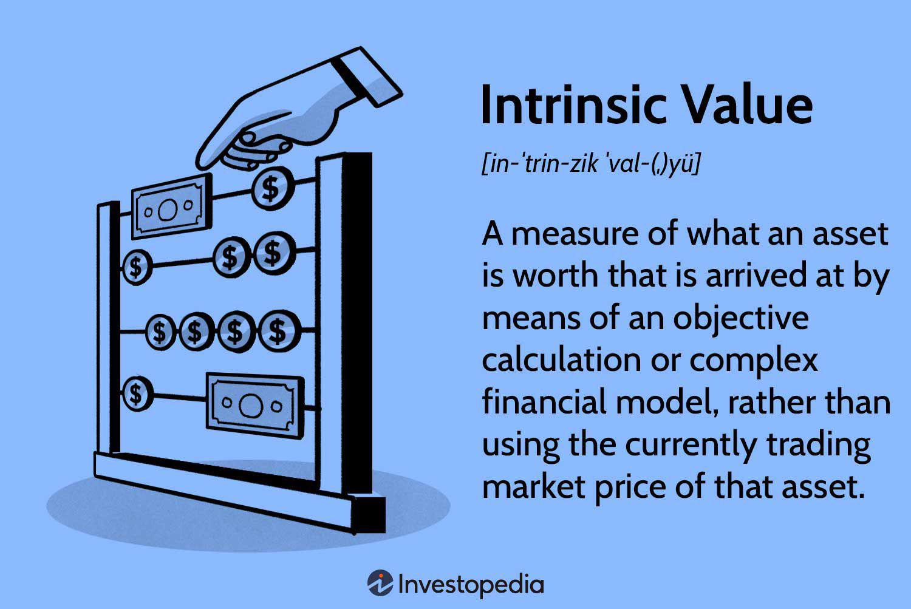

Understanding the complex world of options trading can be daunting, especially when terms like moneyness and intrinsic value come into play. Options trading is a form of derivative trading where the contract's value is based on an underlying asset. Determining the potential profitability and risk of these contracts involves a keen understanding of several key concepts, of which moneyness and intrinsic value are foundational.

Moneyness refers to the intrinsic value of an option at its current state, providing insight into whether exercising the option would be profitable. It helps traders categorize options into three states: in-the-money (ITM), at-the-money (ATM), and out-of-the-money (OTM). These categories are essential in evaluating the likelihood of options becoming profitable and thus play a vital role in pricing and trading strategies.



Intrinsic value, on the other hand, represents the actual value of an option if it were exercised immediately. It is calculated by identifying the difference between the current price of the underlying asset and the strike price of the option, only for ITM options. Understanding this helps traders assess whether an option is worth exercising or holding, which is crucial for making informed trading decisions.

The continuous evolution of financial markets has seen algorithmic trading become increasingly prominent. This advancement leverages computational power to apply statistical and mathematical models for trading decisions, enhancing speed and efficiency. In this context, a thorough grasp of moneyness and intrinsic value contributes significantly to developing and refining algorithmic trading strategies that aim to maximize returns while managing risks efficiently.

This article aims to connect the dots between these core concepts and algorithmic trading strategies. By exploring the interplay between moneyness, intrinsic value, and algorithmic systems, we seek to provide a comprehensive understanding that enhances trading decisions. As a starting point, we will define these concepts and explain their relevance in options trading.

## Table of Contents

## What is Moneyness in Options Trading?

Moneyness is a critical concept in options trading that characterizes the intrinsic value of an option relative to the current price of the underlying asset. Understanding moneyness helps traders evaluate options and make informed decisions. Three primary types of moneyness exist: in-the-money (ITM), at-the-money (ATM), and out-of-the-money (OTM).

An option is considered in-the-money if executing it would result in a positive cash flow. For a call option, this situation arises when the asset's current market price exceeds the option's strike price. Conversely, a put option is ITM if the market price is below the strike price. This intrinsic value is fundamental in assessing the option's immediate profitability and understanding how deeply the option is ITM.

At-the-money options occur when the option's strike price is approximately equal to the underlying asset's market price. ATM options possess no intrinsic value but are valuable due to their potential responsiveness to market movements.

An option is out-of-the-money if exercising it would not be immediately profitable. A call option is OTM when the asset's market price is below the strike price, while a put option is OTM when the market price is above the strike price. OTM options have only extrinsic value, reflecting the market's belief in future price fluctuations.

Moneyness significantly affects options trading profitability and decision-making. ITM options are frequently chosen when traders anticipate favorable market movements, as these options intrinsically hold value. ATM options are often used by traders seeking substantial [volatility](/wiki/volatility-trading-strategies) exposure without committing to a specific directional move, whereas OTM options may be purchased with the expectation of significant price shifts or used in strategies like protective puts.

Moneyness also influences option premiums. ITM options generally have higher premiums due to their intrinsic value and lower relative risk of expiring worthless. In contrast, ATM and OTM options are usually cheaper as they lack intrinsic value. However, the extrinsic value of these options can fluctuate more dramatically based on volatility expectations and time to expiration, which traders observe through the implied volatility and the Greeks, notably Delta.

To illustrate, consider a trader using moneyness to predict market moves. If the S&P 500 index is trading at 4,000 points and a trader expects a bullish market move, they might buy ITM call options with a strike price of 3,900, anticipating increased intrinsic value as the index rises. Alternatively, for a speculative and less costly approach, they could purchase ATM calls to capitalize on potential volatility.

Moneyness serves as a crucial determinant in evaluating option pricing, impacting premiums and strategic decisions in trading. By assessing an option's moneyness, traders can better predict potential market movements and adjust their approach accordingly.

## Understanding Intrinsic Value in Options

Intrinsic value in options represents the actual, quantifiable potential benefit of exercising an option based on the difference between the current price of the underlying asset and the option's strike price. For a call option, the intrinsic value is computed as $\text{max}(0, S - K)$, where $S$ is the current stock price and $K$ is the strike price. For a put option, it is $\text{max}(0, K - S)$.

In contrast, extrinsic value accounts for the remaining premium of the option, reflecting factors such as volatility and time until expiration. The option premium is thus a combination of intrinsic value and extrinsic value, expressed as:

$$
\text{Option Premium} = \text{Intrinsic Value} + \text{Extrinsic Value}
$$

Understanding moneyness is crucial for determining intrinsic value. Moneyness indicates whether an option would have intrinsic value if exercised at the current market price. An option is "in-the-money" (ITM) if exercising it is profitable, meaning a call option's market price is higher than the strike price or a put option's market price is lower. Conversely, "out-of-the-money" (OTM) options have no intrinsic value because exercising them would not be profitable.

The connection between intrinsic value and moneyness can be exemplified as follows:

1. **Call Option**:
   - ITM: Current stock price ($120) > Strike price ($100); hence, intrinsic value = $20.
   - OTM: Current stock price ($90) < Strike price ($100); intrinsic value = $0.

2. **Put Option**:
   - ITM: Current stock price ($80) < Strike price ($100); hence, intrinsic value = $20.
   - OTM: Current stock price ($110) > Strike price ($100); intrinsic value = $0.

Intrinsic value serves as a fundamental metric in evaluating whether an option should be exercised, as it highlights the immediate payoff from exercising. It also assists traders in assessing the option's true worth at a given moment, independent of future market conditions. 

For trading strategy adjustments, intrinsic value provides a straightforward measure to decide whether holding or selling an option might be advantageous. If the intrinsic value is significant and corresponds well with market predictions, exercising the option or holding it might be prudent. However, a zero intrinsic value may prompt the trader to verify if retaining the option aligns with broader strategy goals, such as exploiting potential future movements that could increase extrinsic value.

Traders incorporating intrinsic value assessments must judiciously consider these evaluations alongside extrinsic factors. Adjusting strategies based on intrinsic value can optimize decision timing, exercise opportunities, and potential sell-offs, aligning more closely with market swings and enhancing overall trading performance.

## The Rise of Algorithmic Trading in Options Markets

Algorithmic trading, also known as automated trading or algo trading, has become increasingly influential in the financial markets. This form of trading uses computer algorithms to execute trades based on pre-defined criteria, such as timing, price, and [volume](/wiki/volume-trading-strategy), with minimal human intervention. In options markets, the utilization of [algorithmic trading](/wiki/algorithmic-trading) is significant due to its ability to process vast amounts of data rapidly and make calculated decisions that [factor](/wiki/factor-investing) in complex variables like moneyness and intrinsic value.

**Designing Algorithms to Leverage Moneyness and Intrinsic Value**

Algorithms can strategically leverage moneyness and intrinsic value to optimize trading outcomes. Moneyness, which determines whether an option is in-the-money, at-the-money, or out-of-the-money, acts as a critical input for determining the likely profitability of an option. Intrinsic value, on the other hand, is the difference between the option’s strike price and the underlying asset's price, focusing on the immediate exercisable value of an option.

A simple algorithmic approach could involve assessing the moneyness of options to prioritize trades. For instance, an algorithm might be designed as follows in Python:

```python
def evaluate_option_moneyness(option_price, strike_price, underlying_price):
    intrinsic_value = max(0, underlying_price - strike_price)
    if intrinsic_value > 0:
        return "In-the-money"
    elif underlying_price == strike_price:
        return "At-the-money"
    else:
        return "Out-of-the-money"

# Example usage
option_type = evaluate_option_moneyness(option_price=5, strike_price=100, underlying_price=105)
print(f'The option is {option_type}.')
```

Such algorithms can also be enhanced with additional logic to assess intrinsic value, thereby enabling traders to focus on options with higher probabilistic returns.

**Speed and Efficiency in Algorithmic Trading**

One of the most significant advantages of algorithmic trading in options markets is its ability to execute trades at lightning speed and with exceptional efficiency. Algorithms can scan and analyze multiple financial instruments simultaneously, allowing traders to capture fleeting market opportunities that manual trading would miss. This speed is not only advantageous for exploiting short-term fluctuations but also for implementing complex strategies that require precise timing.

**Case Studies: Successful Implementations**

Several case studies highlight the successful use of algorithms in options trading. For example, firms that have utilized algorithms to analyze vast data sets and optimize back-tested strategies have reported substantial improvements in trade execution and profitability. By methodically assessing market conditions and incorporating metrics like moneyness and intrinsic value, these algorithms have been able to anticipate movements and adjust positions accordingly.

**Challenges in Developing Algorithms for Options Trading**

While the benefits are clear, developing algorithms for options trading also presents challenges. The foremost challenge is data quality and availability. Algorithms depend on accurate and up-to-date data, and any discrepancies can lead to incorrect decisions. Furthermore, the inherent complexity of options markets, which involves multi-faceted financial instruments, requires sophisticated algorithms that can handle and process numerous variables clearly and efficiently.

Developers must also be wary of overfitting, where algorithms perform exceptionally well on historical data but fail to adapt to future market conditions. Robust risk management frameworks are essential, as algorithms that heavily rely on moneyness and intrinsic values need to account for unpredictable market dynamics.

In conclusion, the rise of algorithmic trading has revolutionized options markets, empowering traders with tools that merge computational power with strategic insights. However, successful implementation demands careful consideration of data integrity and market volatility, along with continuous algorithm refinement to maintain a competitive trading edge.

## Integrating Moneyness and Intrinsic Value into Algo Trading

Incorporating moneyness and intrinsic value into algorithmic trading involves using these key metrics to inform trading algorithms and enhance decision-making processes. Moneyness, which highlights an option's intrinsic value in relation to the underlying asset's price, is pivotal in shaping algorithmic responses to market changes.

Traders employ advanced computational models to simulate various market scenarios, thus predicting option movements. These models often utilize techniques such as Monte Carlo simulations, which involve repeated random sampling to compute potential outcomes, or Black-Scholes models, which provide theoretical estimates for option pricing. For instance, in a Python-based framework, traders can use libraries like `NumPy` and `SciPy` to support these simulations and pricing calculations:

```python
import numpy as np
from scipy.stats import norm

def black_scholes_call(S, K, T, r, sigma):
    d1 = (np.log(S/K) + (r + sigma**2 / 2) * T) / (sigma * np.sqrt(T))
    d2 = d1 - sigma * np.sqrt(T)
    return S * norm.cdf(d1) - K * np.exp(-r * T) * norm.cdf(d2)
```

Algorithms leveraging moneyness indicators often involve statistical models and [machine learning](/wiki/machine-learning) techniques trained to recognize patterns and triggers. For example, upon detecting an option nearing an "in-the-money" status, a machine learning algorithm might automatically generate buy signals, maximizing gain potential before option expiry.

Risk management within these algorithms is critical, especially since reliance on moneyness and intrinsic values can expose traders to market volatility and unexpected financial movements. Strategies such as dynamic hedging, which involves frequent adjustment of a portfolio to maintain a target risk level, are used to mitigate these risks. Algorithms might set thresholds for exposure limits or incorporate stop-loss conditions automatically to prevent substantial losses.

Looking to the future, machine learning and AI technologies offer considerable promise in advancing trading strategies. By employing artificial neural networks and [reinforcement learning](/wiki/reinforcement-learning), algorithms can evolve by learning from past data to optimize actions, rather than solely relying on predefined rules. This means AI-driven models can adaptively refine their approach based on real-time market conditions and historical performance data, pointing towards increasingly sophisticated and autonomous trading systems. Such advances necessitate continuous innovation and strategy refinement, ensuring traders capitalize on rapid technological developments while managing risk effectively.

## Best Practices for Traders

Incorporating the concepts of moneyness and intrinsic value into trading routines requires a strategic approach that combines knowledge, technology, and adaptability. Here are some best practices for traders seeking to maximize their options trading outcomes:

**Evaluating Software and Platforms**

Choosing the right software or trading platform is critical for accessing reliable data on moneyness and intrinsic values. Traders should look for platforms that offer real-time analytics, robust data feeds, and intuitive user interfaces. Platforms such as Bloomberg Terminal, E*TRADE, and Thinkorswim provide comprehensive tools for analyzing options data, including calculators for intrinsic value and moneyness. It is also vital that the chosen software supports [backtesting](/wiki/backtesting) and simulation capabilities, allowing traders to test their strategies under historical market conditions without financial risk.

**Building a Systematic Approach**

Successful trading strategies are often systematic, involving predetermined rules and criteria based on thorough analysis. Traders should develop a routine that regularly assesses market conditions and updates their strategies accordingly. This might include setting time intervals to review market trends, taking into account factors like volatility, [liquidity](/wiki/liquidity-risk-premium), and interest rates which can affect intrinsic value and moneyness. Employing a systematic approach allows traders to adapt to changing conditions, ensuring their strategies remain relevant and effective.

**Avoiding Common Pitfalls**

When integrating moneyness and intrinsic value metrics into trading algorithms, traders should be vigilant of potential pitfalls. One common mistake is overfitting models to past data, which can lead to poor performance in live markets. Additionally, traders should be cautious of excessive reliance on any single indicator, as market conditions can quickly alter moneyness and intrinsic value. Diversification of strategies and robust risk management practices are crucial to mitigating such risks. Staying informed about regulatory changes and market reforms is also vital, as these can impact the assumptions underlying trading algorithms.

**Continuous Learning and Staying Ahead**

The landscape of options trading is continuously evolving, driven by technological advancements and innovative financial products. To maintain a competitive edge, traders should commit to ongoing education and skill development. This can be achieved through webinars, online courses, and financial literature. Platforms like Coursera and Khan Academy offer courses that cover options trading and quantitative finance. Additionally, forums and online communities provide valuable insights and foster discussions about market trends and algorithm development. Engaging in these learning opportunities helps traders stay abreast of industry changes, enabling them to refine their techniques and strategies in the dynamic world of options trading.

By adhering to these best practices, traders can effectively integrate concepts of moneyness and intrinsic value into their trading frameworks, enhancing their decision-making and optimizing trading outcomes.

## Conclusion

Moneyness and intrinsic value are central to options trading, serving as vital metrics foundational to evaluating potential trades. Moneyness reflects an option's intrinsic value relative to the current price of the underlying asset, categorically classified as in-the-money, at-the-money, or out-of-the-money. This classification informs traders about the option’s profitability and potential outcomes, aiding in strategic decision-making. Intrinsic value, the difference between the current price of the asset and the strike price of the option (for in-the-money options), offers precise insights into the immediate worth of executing an option. Both concepts assist traders in assessing the immediate risks and rewards associated with options, thereby shaping trading strategies and influencing premium calculations.

Algorithmic trading introduces a transformative dimension to options trading by leveraging these concepts to automate and optimize decision-making processes. Algorithms can swiftly analyze large volumes of data concerning moneyness and intrinsic value to execute trades at optimal conditions, enhancing both speed and efficiency in the market. This technological shift underscores the need for traders to harness and deepen their understanding of these metrics, ensuring they remain informed and competitive in a rapidly evolving market environment.

As financial markets continue to evolve, integrating innovative strategies using moneyness and intrinsic value becomes essential. The seamless blending of these core principles with technology, particularly through algorithmic and machine learning models, offers traders advantageous insights and strategic foresight. Machine learning models can learn from historical data patterns, further refining predictions on option movements and capitalizing on moneyness indicators.

Looking ahead, the future of options trading will likely continue to be shaped by advancements in technology. By embracing these changes and leveraging algorithmic precision, traders can enhance their methodologies, adapting to new market conditions with greater agility. The continuous evolution of financial markets demands a commitment to innovation and learning, ensuring traders remain at the forefront of options trading with cutting-edge tools and insights.

## References & Further Reading

[1]: Hull, J. C. (2018). ["Options, Futures, and Other Derivatives"](https://www.semanticscholar.org/paper/Options%2C-Futures%2C-and-Other-Derivatives-Hull/89bdee500c8623864fc9eb7a471546aa713acc44). Pearson.

[2]: Black, F., & Scholes, M. (1973). ["The Pricing of Options and Corporate Liabilities."](https://www.cs.princeton.edu/courses/archive/fall09/cos323/papers/black_scholes73.pdf) Journal of Political Economy, 81(3), 637-654.

[3]: Wilmott, P. (2006). ["Paul Wilmott on Quantitative Finance"](https://www.amazon.com/Paul-Wilmott-Quantitative-Finance-Set/dp/0470018704). Wiley.

[4]: Jansen, S. (2020). ["Machine Learning for Algorithmic Trading"](https://github.com/stefan-jansen/machine-learning-for-trading). Packt Publishing Ltd.

[5]: Chriss, N. A. (1997). ["Black-Scholes and Beyond: Option Pricing Models"](https://www.amazon.com/Black-Scholes-Beyond-Option-Pricing-Models/dp/0786310251). McGraw-Hill.

[6]: Lopez de Prado, M. (2018). ["Advances in Financial Machine Learning"](https://www.amazon.com/Advances-Financial-Machine-Learning-Marcos/dp/1119482089). Wiley.

[7]: Chan, E. P. (2009). ["Quantitative Trading: How to Build Your Own Algorithmic Trading Business"](https://github.com/ftvision/quant_trading_echan_book). Wiley.