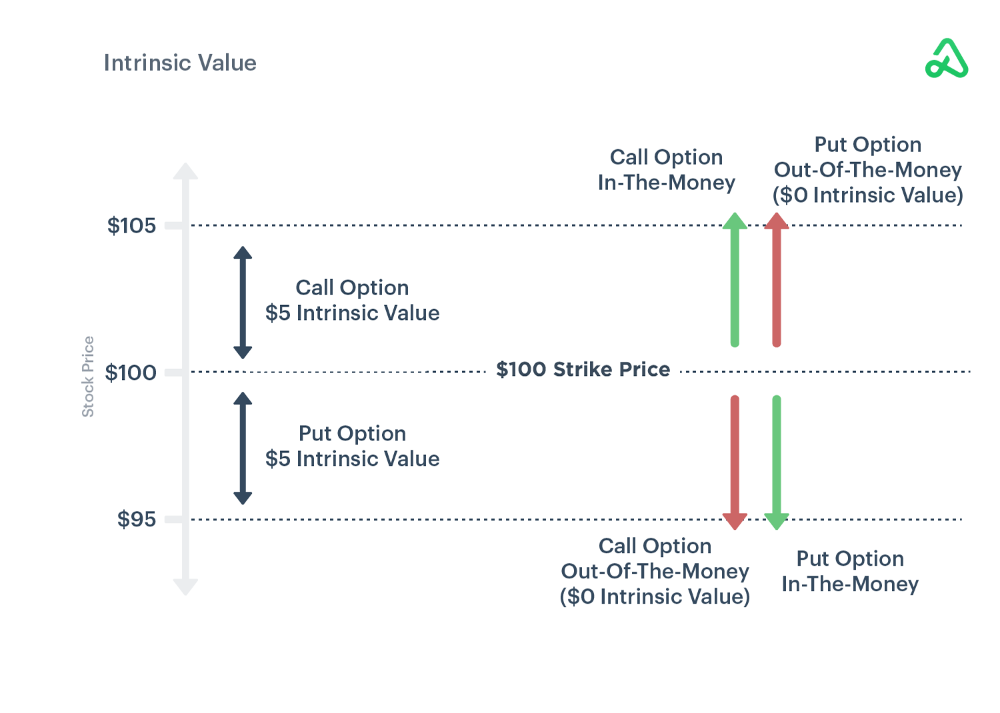

## Table of Contents

## What is an option in financial terms?

An option is a contract that gives the buyer the right, but not the obligation, to buy or sell an asset at a specific price on or before a certain date. The asset could be stocks, commodities, or currencies. Options are popular in financial markets because they can be used for various purposes like speculation, hedging, or income generation.

There are two main types of options: call options and put options. A call option gives the buyer the right to buy the asset, while a put option gives the buyer the right to sell the asset. The price at which the asset can be bought or sold is called the strike price. If the market price of the asset is favorable compared to the strike price, the buyer can exercise the option to make a profit. If not, the buyer can let the option expire worthless, only losing the premium paid for the option.

## How is moneyness defined for options?

Moneyness tells us if an option would be profitable to use right now. It compares the current price of the asset to the option's strike price. For a call option, if the asset's price is higher than the strike price, the option is "in the money" because you could buy the asset cheaper than its current market price. If the asset's price is lower than the strike price, the call option is "out of the money" because it wouldn't be profitable to buy the asset at the strike price. If the asset's price is exactly the same as the strike price, the option is "at the money."

For a put option, it works the opposite way. If the asset's price is lower than the strike price, the put option is "in the money" because you could sell the asset at a higher price than its current market value. If the asset's price is higher than the strike price, the put option is "out of the money" because selling at the strike price wouldn't be profitable. Like with call options, if the asset's price equals the strike price, the put option is "at the money." Moneyness helps traders decide whether to exercise their options or let them expire.

## What are the different states of moneyness for options?

Moneyness is a way to tell if an option is worth using right now. It looks at the price of the thing you can buy or sell with the option, called the asset, and compares it to the option's strike price. For a call option, which lets you buy the asset, if the asset's price is higher than the strike price, the option is "in the money." This means you could buy the asset cheaper than its current market price, which is good. If the asset's price is lower than the strike price, the call option is "out of the money." This means it wouldn't be profitable to buy the asset at the strike price, so you're better off not using the option. If the asset's price is exactly the same as the strike price, the option is "at the money," which is kind of in the middle.

For a put option, which lets you sell the asset, it works the opposite way. If the asset's price is lower than the strike price, the put option is "in the money." This means you could sell the asset at a higher price than its current market value, which is good. If the asset's price is higher than the strike price, the put option is "out of the money." This means selling at the strike price wouldn't be profitable, so you're better off not using the option. Just like with call options, if the asset's price equals the strike price, the put option is "at the money." Knowing the moneyness helps traders decide whether to use their options or let them expire.

## What is the intrinsic value of an option?

The intrinsic value of an option is how much money you would make if you used the option right now. It's the difference between the current price of the asset and the option's strike price, but only if that difference is positive. If it's not positive, the intrinsic value is zero. For a call option, if the asset's price is higher than the strike price, the intrinsic value is the difference. For a put option, if the asset's price is lower than the strike price, the intrinsic value is the difference.

For example, if you have a call option with a strike price of $50 and the asset's current price is $60, the intrinsic value is $10 because you could buy the asset for $50 and sell it for $60. But if the asset's price is $40, the intrinsic value is zero because buying at $50 and selling at $40 would lose money. The intrinsic value is important because it shows the immediate profit potential of an option, but it doesn't include the time value, which is the extra value the option might have because it still has time before it expires.

## How do you calculate the intrinsic value of a call option?

The intrinsic value of a call option is the difference between the current price of the asset and the strike price of the option, but only if that difference is positive. If you have a call option that lets you buy the asset at the strike price, and the asset's current price is higher than that strike price, then the intrinsic value is how much more the asset is worth right now compared to what you could buy it for with the option. For example, if your call option has a strike price of $50 and the asset is currently worth $60, the intrinsic value is $10 because you could buy the asset for $50 and sell it for $60 right away.

If the current price of the asset is less than or equal to the strike price, the intrinsic value of the call option is zero. This is because there's no immediate profit to be made by using the option. For instance, if your call option still has a strike price of $50 but the asset is only worth $45, it wouldn't make sense to buy the asset at $50 when you could buy it for $45 on the market. So, the intrinsic value in this case would be zero.

## How do you calculate the intrinsic value of a put option?

The intrinsic value of a put option is the difference between the strike price of the option and the current price of the asset, but only if that difference is positive. A put option gives you the right to sell the asset at the strike price. If the current price of the asset is lower than the strike price, you could buy the asset at the current market price and then sell it at the higher strike price, making a profit. For example, if your put option has a strike price of $50 and the asset is currently worth $40, the intrinsic value is $10 because you could buy the asset for $40 and sell it for $50 right away.

If the current price of the asset is higher than or equal to the strike price, the intrinsic value of the put option is zero. This is because there's no immediate profit to be made by using the option. For instance, if your put option still has a strike price of $50 but the asset is worth $55, it wouldn't make sense to sell the asset at $50 when you could sell it for $55 on the market. So, the intrinsic value in this case would be zero.

## What is the difference between intrinsic value and time value of an option?

The intrinsic value of an option is how much money you would make if you used the option right now. It's the difference between the current price of the asset and the option's strike price, but only if that difference is positive. If it's not positive, the intrinsic value is zero. For a call option, if the asset's price is higher than the strike price, the intrinsic value is the difference. For a put option, if the asset's price is lower than the strike price, the intrinsic value is the difference. The intrinsic value shows the immediate profit potential of an option.

The time value of an option is the extra value it has because it still has time before it expires. This value comes from the possibility that the option might become more profitable before it expires. The time value depends on things like how long until the option expires, how much the asset's price might change, and the overall risk in the market. As the option gets closer to expiring, the time value goes down because there's less time for the asset's price to move in a favorable way. The total value of an option is the sum of its intrinsic value and its time value.

## How does the underlying asset's price affect the moneyness of an option?

The price of the thing you can buy or sell with the option, called the asset, decides if an option is worth using right now. This is what we mean by moneyness. For a call option, which lets you buy the asset, if the asset's price is higher than the strike price, the option is "in the money." This means you could buy the asset for less than it's worth right now, which is good. If the asset's price is lower than the strike price, the call option is "out of the money." This means it wouldn't be profitable to buy the asset at the strike price, so you're better off not using the option. If the asset's price is exactly the same as the strike price, the option is "at the money," which is kind of in the middle.

For a put option, which lets you sell the asset, it works the opposite way. If the asset's price is lower than the strike price, the put option is "in the money." This means you could sell the asset for more than it's worth right now, which is good. If the asset's price is higher than the strike price, the put option is "out of the money." This means selling at the strike price wouldn't be profitable, so you're better off not using the option. Just like with call options, if the asset's price equals the strike price, the put option is "at the money." Knowing how the asset's price affects moneyness helps traders decide whether to use their options or let them expire.

## Can an option have a negative intrinsic value?

An option cannot have a negative intrinsic value. Intrinsic value is the amount of money you would make if you used the option right now. It's the difference between the current price of the thing you can buy or sell with the option, called the asset, and the option's strike price. But, if this difference is less than zero, the intrinsic value is just set to zero. This means you won't lose more money than what you paid for the option.

For example, if you have a call option that lets you buy a stock at $50, but the stock is only worth $45 right now, the intrinsic value is zero, not negative $5. The same goes for a put option. If you can sell a stock at $50 but it's worth $55, the intrinsic value is zero, not negative $5. So, no matter what, the intrinsic value of an option can never be negative.

## How does moneyness influence option pricing models like the Black-Scholes model?

Moneyness is a big deal when it comes to figuring out how much an option is worth using models like the Black-Scholes model. This model looks at things like how long until the option expires, how much the price of the asset might change, and the current price of the asset compared to the strike price, which is what moneyness is all about. If an option is "in the money," it means you could make money right now if you used it, so the option will be worth more. On the other hand, if it's "out of the money," it wouldn't be worth using right now, so the option will be cheaper.

The Black-Scholes model uses a special formula to figure out the option's price, and moneyness is a key part of that formula. It helps decide the option's intrinsic value, which is the money you could make right now, and its time value, which is the extra value because the option still has time before it expires. The closer the asset's price is to the strike price, or the more "at the money" the option is, the more important the time value becomes because there's a bigger chance the option could become profitable before it expires. So, moneyness helps the Black-Scholes model give a fair price for the option based on what it's worth now and what it could be worth later.

## What role does volatility play in the moneyness and intrinsic value of options?

Volatility is how much the price of the asset can change, and it has a big impact on options. It affects the moneyness of an option by changing how likely it is for the option to be "in the money" or "out of the money." If the asset's price is very volatile, it can move a lot, which means an option that's "out of the money" today might become "in the money" tomorrow. This makes options on volatile assets more exciting because there's a bigger chance for them to become profitable, even if they're not worth using right now.

Volatility also plays a part in the intrinsic value of options, but in a more indirect way. The intrinsic value is how much money you would make if you used the option right now, and it doesn't change just because the asset's price is volatile. But, high volatility can make the total value of the option higher because it increases the time value, which is the extra value the option has because it still has time before it expires. So, even if the intrinsic value stays the same, the overall price of the option can go up because of the chance that the asset's price might move in a way that makes the option more valuable before it expires.

## How do interest rates and dividends impact the intrinsic value and moneyness of options?

Interest rates and dividends can change the value of options in ways that might not be obvious at first. When interest rates go up, it makes it more expensive to borrow money, which can affect the price of the asset you can buy or sell with the option. For call options, higher interest rates can make the asset's price go up, which might make a call option that was "out of the money" become "in the money." For put options, higher interest rates can make the asset's price go down, which could move a put option from "out of the money" to "in the money." But, the intrinsic value, which is how much money you would make if you used the option right now, doesn't change directly because of interest rates. It's more about how the asset's price changes because of interest rates.

Dividends also play a role in the moneyness and intrinsic value of options. When a company pays a dividend, it usually makes the stock price drop by the amount of the dividend on the ex-dividend date. This drop can affect the moneyness of options. For call options, the drop in stock price might move an option from "in the money" to "out of the money." For put options, the drop might move an option from "out of the money" to "in the money." Just like with interest rates, the intrinsic value doesn't change directly because of dividends. It's more about how the stock price changes because of the dividend. So, while dividends and interest rates don't change the intrinsic value directly, they can change the asset's price, which in turn affects the moneyness of the option.

## What is the understanding of intrinsic value in options?

Intrinsic value in options represents the actual, quantifiable potential benefit of exercising an option based on the difference between the current price of the underlying asset and the option's strike price. For a call option, the intrinsic value is computed as $\text{max}(0, S - K)$, where $S$ is the current stock price and $K$ is the strike price. For a put option, it is $\text{max}(0, K - S)$.

In contrast, extrinsic value accounts for the remaining premium of the option, reflecting factors such as volatility and time until expiration. The option premium is thus a combination of intrinsic value and extrinsic value, expressed as:

$$
\text{Option Premium} = \text{Intrinsic Value} + \text{Extrinsic Value}
$$

Understanding moneyness is crucial for determining intrinsic value. Moneyness indicates whether an option would have intrinsic value if exercised at the current market price. An option is "in-the-money" (ITM) if exercising it is profitable, meaning a call option's market price is higher than the strike price or a put option's market price is lower. Conversely, "out-of-the-money" (OTM) options have no intrinsic value because exercising them would not be profitable.

The connection between intrinsic value and moneyness can be exemplified as follows:

1. **Call Option**:
   - ITM: Current stock price ($120) > Strike price ($100); hence, intrinsic value = $20.
   - OTM: Current stock price ($90) < Strike price ($100); intrinsic value = $0.

2. **Put Option**:
   - ITM: Current stock price ($80) < Strike price ($100); hence, intrinsic value = $20.
   - OTM: Current stock price ($110) > Strike price ($100); intrinsic value = $0.

Intrinsic value serves as a fundamental metric in evaluating whether an option should be exercised, as it highlights the immediate payoff from exercising. It also assists traders in assessing the option's true worth at a given moment, independent of future market conditions. 

For trading strategy adjustments, intrinsic value provides a straightforward measure to decide whether holding or selling an option might be advantageous. If the intrinsic value is significant and corresponds well with market predictions, exercising the option or holding it might be prudent. However, a zero intrinsic value may prompt the trader to verify if retaining the option aligns with broader strategy goals, such as exploiting potential future movements that could increase extrinsic value.

Traders incorporating intrinsic value assessments must judiciously consider these evaluations alongside extrinsic factors. Adjusting strategies based on intrinsic value can optimize decision timing, exercise opportunities, and potential sell-offs, aligning more closely with market swings and enhancing overall trading performance.

## References & Further Reading

[1]: Hull, J. C. (2018). ["Options, Futures, and Other Derivatives"](https://www.semanticscholar.org/paper/Options%2C-Futures%2C-and-Other-Derivatives-Hull/89bdee500c8623864fc9eb7a471546aa713acc44). Pearson.

[2]: Black, F., & Scholes, M. (1973). ["The Pricing of Options and Corporate Liabilities."](https://www.cs.princeton.edu/courses/archive/fall09/cos323/papers/black_scholes73.pdf) Journal of Political Economy, 81(3), 637-654.

[3]: Wilmott, P. (2006). ["Paul Wilmott on Quantitative Finance"](https://www.amazon.com/Paul-Wilmott-Quantitative-Finance-Set/dp/0470018704). Wiley.

[4]: Jansen, S. (2020). ["Machine Learning for Algorithmic Trading"](https://github.com/stefan-jansen/machine-learning-for-trading). Packt Publishing Ltd.

[5]: Chriss, N. A. (1997). ["Black-Scholes and Beyond: Option Pricing Models"](https://www.amazon.com/Black-Scholes-Beyond-Option-Pricing-Models/dp/0786310251). McGraw-Hill.

[6]: Lopez de Prado, M. (2018). ["Advances in Financial Machine Learning"](https://www.amazon.com/Advances-Financial-Machine-Learning-Marcos/dp/1119482089). Wiley.

[7]: Chan, E. P. (2009). ["Quantitative Trading: How to Build Your Own Algorithmic Trading Business"](https://github.com/ftvision/quant_trading_echan_book). Wiley.