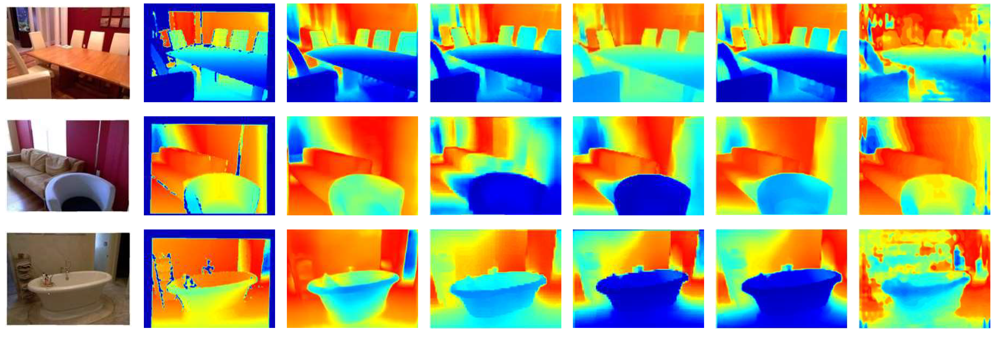

## Table of Contents

## What is monocular depth estimation?

Monocular depth estimation is a way to figure out how far away things are in a picture using just one camera. It's like trying to guess the distance of objects in a photo. This is useful in many areas, like self-driving cars, where knowing the distance to objects helps the car move safely. The main idea is to use the clues in the image, like how big things look or how clear they are, to estimate their distance from the camera.

To do monocular depth estimation, computers use special math and learning methods. They look at lots of pictures with known distances and learn patterns from them. Then, they can guess the distances in new pictures. This is done using something called a neural network, which is a type of computer program that can learn from examples. The neural network looks at the whole image and figures out how far away each part is, making a depth map that shows the distance of everything in the scene.

## How does monocular depth estimation differ from stereo depth estimation?

Monocular depth estimation and stereo depth estimation are two ways to figure out how far away things are, but they use different methods. Monocular depth estimation uses just one camera to guess the distance of objects in a scene. It looks at clues in the image, like how big things appear or how clear they are, to make a depth map. This method is useful because it only needs one camera, making it simpler and cheaper to use. However, it's harder to get very accurate results because it relies on patterns learned from lots of images rather than direct measurements.

On the other hand, stereo depth estimation uses two cameras, much like how our eyes work together to see depth. By comparing the images from both cameras, it can calculate the exact distance to objects. This method is more accurate because it uses the difference in the position of objects in the two images, known as disparity, to directly measure depth. The formula for calculating depth from disparity is $$ \text{Depth} = \frac{\text{Baseline} \times \text{Focal Length}}{\text{Disparity}} $$. While stereo depth estimation gives better results, it's more complex and requires careful setup of the two cameras.

Both methods have their places in different applications. Monocular depth estimation is great for situations where you can't use two cameras, like in mobile phones or small drones. Stereo depth estimation is preferred in scenarios where high accuracy is needed, such as in robotics or autonomous vehicles. Each method has its own trade-offs between accuracy, cost, and ease of use.

## What are the main challenges in monocular depth estimation?

One big challenge in monocular depth estimation is that it's hard to get very accurate results with just one camera. Unlike stereo depth estimation, which uses two cameras to measure depth directly, monocular depth estimation has to guess the distances based on patterns in the image. These patterns might include how big things look, how clear they are, or how they are arranged. But these clues can be tricky and not always reliable, so the depth maps created can have mistakes. For example, if an object is far away but looks big because it's actually very large, the system might think it's closer than it really is.

Another challenge is that monocular depth estimation needs a lot of training data to work well. The computer has to learn from thousands of pictures with known distances to understand the patterns that show depth. This means you need a big dataset, and collecting and labeling all those images can be time-consuming and expensive. Also, the system might not work as well on new scenes that are very different from the ones it was trained on. If the lighting, the types of objects, or the environment changes a lot, the depth estimates might not be accurate. This makes it hard to use monocular depth estimation in all kinds of situations without retraining the system.

## What is the role of machine learning in monocular depth estimation?

Machine learning plays a big role in monocular depth estimation. It helps computers learn how to guess the distance of objects in a picture by looking at lots of images with known distances. This learning happens through a type of [machine learning](/wiki/machine-learning) called [deep learning](/wiki/deep-learning), which uses neural networks. These neural networks are like brains that can spot patterns in images. They look at things like how big objects appear, how clear they are, and other clues to figure out how far away everything is. The more images the [neural network](/wiki/neural-network) sees, the better it gets at estimating depth.

The process starts with training the neural network on a big dataset of images where the depth is already known. The network learns to connect the visual clues in these images to the correct depth values. Once trained, it can then take a new picture and create a depth map, showing how far away each part of the scene is. This is useful in many areas, like helping self-driving cars see the road or making virtual reality more realistic. But it's not perfect; the accuracy depends a lot on the quality and variety of the training data. If the new scenes are very different from what the network was trained on, the depth estimates might not be as good.

## How does ViP-DeepLab contribute to monocular depth estimation?

ViP-DeepLab is a special kind of neural network that helps make monocular depth estimation better. It uses a method called vision permutation, which lets the network look at the image in different ways to understand it better. This helps the network see more details and patterns that it might miss otherwise. By doing this, ViP-DeepLab can make more accurate depth maps from just one picture. It's like giving the network a better set of eyes to see the world more clearly.

In monocular depth estimation, ViP-DeepLab can be trained on lots of images with known distances. Once trained, it can take a new picture and guess how far away everything is. This is useful in many places, like helping self-driving cars see the road or making virtual reality more realistic. ViP-DeepLab's way of looking at images helps it do a better job at guessing distances, making it a helpful tool in monocular depth estimation.

## What are the key components of the ViP-DeepLab model?

The ViP-DeepLab model has a few important parts that help it work well. The main part is the vision permutation method, which lets the model look at the image in different ways. This helps the model see more details and patterns that it might miss if it only looked at the image one way. Another important part is the neural network architecture, which is designed to understand these different views of the image and combine them to make better guesses about the depth. The model also uses something called a decoder, which takes all the information the neural network has learned and turns it into a depth map that shows how far away everything in the image is.

These parts work together to make ViP-DeepLab good at monocular depth estimation. The vision permutation part helps the model see the image from different angles, kind of like moving a puzzle piece around to see where it fits best. The neural network then takes all these different views and learns how to connect them to the right depth values. Finally, the decoder takes all this information and makes a clear depth map. By using these key components, ViP-DeepLab can make more accurate depth maps from just one picture, which is really helpful in things like self-driving cars or virtual reality.

## How does ViP-DeepLab improve upon previous monocular depth estimation models?

ViP-DeepLab improves on previous monocular depth estimation models by using a special method called vision permutation. This method lets the model look at the image in different ways, helping it see more details and patterns. It's like moving a puzzle piece around to find the best fit. By doing this, ViP-DeepLab can make more accurate guesses about how far away things are in a picture. This is really helpful in places like self-driving cars or virtual reality, where knowing the distance to objects is important.

Another way ViP-DeepLab is better is through its smart neural network design. The network takes all the different views of the image and learns how to connect them to the right depth values. Then, it uses a decoder to turn this information into a clear depth map. This means ViP-DeepLab can make better depth maps from just one picture compared to older models. By using these new ideas, ViP-DeepLab helps make monocular depth estimation more accurate and useful in real-world situations.

## What datasets are commonly used to train and evaluate monocular depth estimation models like ViP-DeepLab?

Common datasets for training and evaluating monocular depth estimation models like ViP-DeepLab include the KITTI dataset and the NYU Depth V2 dataset. The KITTI dataset is often used because it has lots of pictures taken from cars driving around. These pictures show different road scenes with things like cars, buildings, and trees. Each picture also has a depth map that shows how far away everything is. This makes it a good choice for training models to understand depth in real-world driving situations. The NYU Depth V2 dataset is another popular choice. It has pictures taken inside buildings, like homes and offices. These pictures show things like furniture, walls, and people. Like the KITTI dataset, each picture comes with a depth map, making it useful for training models to understand depth in indoor settings.

Both datasets are important because they help models like ViP-DeepLab learn from different kinds of scenes. By using these datasets, the models can see many examples of how objects look at different distances. This helps them make better guesses about depth in new pictures. The more varied the training data, the better the model can work in different situations. So, using datasets like KITTI and NYU Depth V2 helps make sure that monocular depth estimation models are as accurate and useful as possible.

## What are the typical performance metrics used to assess monocular depth estimation models?

The typical performance metrics used to assess monocular depth estimation models are the Mean Absolute Error (MAE) and the Root Mean Square Error (RMSE). MAE measures the average difference between the predicted depth and the actual depth for each pixel in the image. It's like finding out how far off the model's guesses are on average. A lower MAE means the model is doing a better job at estimating depth. RMSE is another way to measure how well the model is doing, but it puts more weight on bigger mistakes. It's calculated by taking the square root of the average of the squared differences between the predicted and actual depths. A lower RMSE also means the model is more accurate.

Another important metric is the accuracy under a certain threshold, often called the delta (δ) accuracy. This measures the percentage of pixels where the ratio of the predicted depth to the actual depth, or the other way around, is within a certain range. For example, if δ < 1.25, it means the predicted depth is within 25% of the actual depth for a certain percentage of pixels. This metric helps show how often the model's guesses are close enough to be useful. By looking at these metrics, researchers can see how well their monocular depth estimation models are working and find ways to make them better.

## How can the performance of ViP-DeepLab be optimized for specific applications?

To make ViP-DeepLab work better for certain tasks, you can train it with pictures that look like the ones it will see in real use. For example, if you want to use it in self-driving cars, you should train it with lots of road scenes from places where the cars will drive. This helps the model learn the right patterns and clues for that specific job. You can also change the model's settings, like how big the neural network is or how it looks at the image, to make it better at guessing distances in those scenes. By doing this, ViP-DeepLab can be more accurate and useful for the task you need it for.

Another way to improve ViP-DeepLab's performance is to use special tricks while it's learning. You can use methods like [data augmentation](/wiki/data-augmentation), where you change the training pictures a little bit, like flipping them or making them brighter, to help the model learn from more examples. You can also use something called transfer learning, where you start with a model that's already good at understanding images and then teach it to guess depth. This can make the training faster and the final model better. By using these tricks and training the model with the right pictures, you can make ViP-DeepLab work really well for your specific needs.

## What are the current limitations of ViP-DeepLab in monocular depth estimation?

One of the main limits of ViP-DeepLab in monocular depth estimation is that it still needs a lot of pictures to learn from. If the new scenes it sees are very different from the ones it was trained on, it might not guess the distances as well. For example, if ViP-DeepLab was trained mostly on road scenes but then used in a forest, it might make more mistakes because the patterns it learned don't fit as well. This means that to use ViP-DeepLab in different places, you might need to train it again with new pictures that match those places.

Another challenge is that even though ViP-DeepLab is good at understanding images, it can still make mistakes. These mistakes can happen if the lighting changes a lot or if there are things in the picture that it hasn't seen before. Also, while ViP-DeepLab can make better guesses than some older models, it's still not as accurate as stereo depth estimation, which uses two cameras to measure depth directly. This means that for jobs where you need very exact depth information, like in some kinds of robots, ViP-DeepLab might not be the best choice.

## What future developments are expected in the field of monocular depth estimation using models like ViP-DeepLab?

In the future, we can expect models like ViP-DeepLab to get even better at guessing how far away things are in pictures. One big improvement could be making them need less training data. Right now, these models need a lot of pictures to learn from, but new ways of teaching them might let them learn well with fewer images. Another exciting development could be making them work better in all kinds of scenes, not just the ones they were trained on. This would make them more useful in places like self-driving cars, where the scenes can change a lot.

Also, we might see these models become more accurate and faster. New ideas in how the models look at pictures and learn from them could help them make better guesses about depth. For example, using even smarter ways to look at images, like combining vision permutation with other methods, could make the depth maps more precise. And as computers get faster, these models might be able to work in real-time, making them useful for things like virtual reality where quick responses are important.

## References & Further Reading

[1]: Eigen, D., Puhrsch, C., & Fergus, R. (2014). ["Depth Map Prediction from a Single Image using a Multi-Scale Deep Network."](https://arxiv.org/abs/1406.2283) Advances in Neural Information Processing Systems 27.

[2]: Laina, I., Rupprecht, C., Belagiannis, V., Tombari, F., & Navab, N. (2016). ["Deeper Depth Prediction with Fully Convolutional Residual Networks."](https://arxiv.org/abs/1606.00373) 2016 Fourth International Conference on 3D Vision (3DV).

[3]: Godard, C., Mac Aodha, O., Firman, M., & Brostow, G.J. (2019). ["Digging into Self-Supervised Monocular Depth Estimation."](https://arxiv.org/abs/1806.01260) Proceedings of the IEEE International Conference on Computer Vision (ICCV).

[4]: Ranftl, R., Bochkovskiy, A., & Koltun, V. (2021). ["Vision Transformers for Dense Prediction."](https://arxiv.org/abs/2103.13413) Proceedings of the IEEE/CVF Conference on Computer Vision and Pattern Recognition (CVPR).

[5]: Geiger, A., Lenz, P., Stiller, C., & Urtasun, R. (2013). ["Vision meets Robotics: The KITTI Dataset."](https://journals.sagepub.com/doi/full/10.1177/0278364913491297) The International Journal of Robotics Research.

[6]: Silberman, N., Hoiem, D., Kohli, P., & Fergus, R. (2012). ["Indoor Segmentation and Support Inference from RGBD Images."](https://link.springer.com/chapter/10.1007/978-3-642-33715-4_54) Advances in Neural Information Processing Systems 25.

[7]: Dosovitskiy, A., Beyer, L., Kolesnikov, A., Weissenborn, D., Zhai, X., Unterthiner, T., ... & Houlsby, N. (2020). ["An Image is Worth 16x16 Words: Transformers for Image Recognition at Scale."](https://arxiv.org/abs/2010.11929) arXiv:2010.11929.