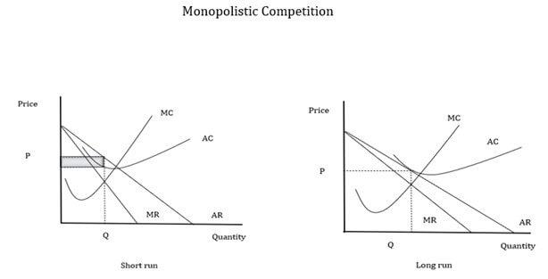

Economic market structures are fundamental frameworks that dictate the behavior of firms and the dynamics of market competition. These structures range from perfect competition, characterized by many sellers and standardized products, to monopoly, wherein a single entity dominates the market with no viable substitutes for its product or service. Between these extremes lies monopolistic competition, a market structure defined by the presence of numerous firms offering differentiated products, freedom of entry and exit, and sufficient market power to influence prices.

Monopolistic competition is characterized by its unique blend of features: product differentiation, where firms offer variations in quality, features, or branding; a large number of small firms, each holding a relatively small market share; and significant emphasis on non-price competition, such as advertising and product variation, to attract consumer preference. This market structure creates a dynamic environment where pricing strategies are flexible, allowing firms to adjust prices without losing all customers to competitors immediately. The restaurant industry and clothing brands are typical examples of monopolistic competition, where consumer choice is influenced by brand loyalty and perceived product differentiation.



Algorithmic trading represents a paradigm shift in financial markets, marked by the use of computer algorithms to execute trades at high speeds and volumes. These algorithms analyze vast sets of data to determine the timing, price, and volume of trades, thereby minimizing human intervention and maximizing efficiency in decision-making processes. Since its inception in the late 20th century, algorithmic trading has evolved substantially due to advancements in technology, including artificial intelligence and machine learning, enabling more sophisticated forms of data analysis and predictive modeling.

Integrating monopolistic competition with algorithmic trading presents a unique opportunity to enhance market efficiency and strategic pricing. Algorithmic trading can provide firms operating within monopolistic competition markets with enhanced tools for data analytics, allowing them to optimize pricing strategies, improve product placement, and respond swiftly to market changes. This integration can lead to improved liquidity, more precise targeting of consumer preferences, and the potential to outpace competitors in innovation and service delivery.

This article aims to explore the confluence of monopolistic competition and algorithmic trading, examining how algorithm-driven strategies can be tailored to markets characterized by product differentiation and strategic competition. By analyzing this integration, we will uncover potential benefits and challenges, providing insights into future trends and regulatory implications. The scope of this article encompasses an in-depth exploration of these concepts, offering a roadmap for businesses seeking to leverage these market dynamics for competitive advantage.

## Table of Contents

## Understanding Monopolistic Competition

Monopolistic competition is an economic market structure characterized by several distinct features that set it apart from perfect competition and pure monopoly. It is defined by the presence of differentiated products, a large number of sellers, and relatively easy market entry and exit conditions. This structure arises when numerous firms produce similar yet not identical products, allowing for some degree of market power.

Differentiated products in monopolistic competition mean that each company offers a product variant that, although similar, is perceived as unique by consumers. This differentiation can be real or perceived and often involves variations in quality, branding, features, or customer service. As a result, firms have some control over pricing and face a downward-sloping demand curve for their particular product, unlike the perfectly elastic demand faced by firms in perfect competition.

The existence of many sellers in this market type means that no single firm can dominate the market. Instead, each firm holds a relatively small market share, contributing to the overall supply of the differentiated products. Additionally, the relative ease of entry and [exit](/wiki/exit-strategy) ensures that firms can enter the market with a new and differentiated product and leave if they fail to compete effectively. This ease of mobility maintains competitive pressure on existing firms to continuously innovate and improve their offerings.

Industries that commonly operate under monopolistic competition include retail businesses like clothing, restaurants, and consumer electronics. These sectors are characterized by numerous brands offering similar products with unique selling points, appealing to various consumer preferences.

Market dynamics in monopolistic competition involve a combination of pricing strategies, non-price competition, and consumer choice. Since each firm seeks to maximize profit, they can use pricing strategies such as product bundling, promotional discounts, or premium pricing to attract and retain customers. Non-price competition is equally crucial, as firms engage in extensive marketing, advertising, and product innovation to differentiate their products from competitors. Consumer choice plays a vital role, as buyers evaluate these differentiated products based on personal preferences, brand loyalty, and perceived value, influencing firms' strategic decisions.

However, monopolistic competition presents both challenges and advantages. One notable challenge is the potential for inefficient allocation of resources, as firms tend to produce at a level where average total cost is not minimized, leading to excess capacity. The pursuit of differentiation can also result in higher production and marketing costs. Nonetheless, the advantages include increased product variety and innovation, as firms constantly strive to offer better and more diverse products to gain a competitive edge. This variety benefits consumers through improved goods and services, while firms benefit from the ability to exercise some control over pricing and market positioning.

## Algorithmic Trading in Today's Market

Algorithmic trading refers to the use of computer algorithms to automate the trading process, taking advantage of certain market conditions without human intervention. At its core, [algorithmic trading](/wiki/algorithmic-trading) employs complex mathematical models and formulas to make high-speed decisions regarding the purchase and sale of securities. This automation is designed to capitalize on market inefficiencies much faster and more accurately than a human trader could accomplish manually. Algorithmic trading is structured around the principles of data analysis, execution speed, and technology-driven strategies that utilize historical and real-time data to detect patterns and execute trades.

Historically, algorithmic trading has undergone significant transformations since its inception. The origins of algorithmic trading can be traced back to the 1970s, with the development of electronic trading systems, particularly for institutional investors. In the 1980s, the advent of program trading emerged, enabling the execution of a large number of stocks simultaneously based on predefined strategies. The technology saw a substantial boost with the rise of the internet in the 1990s, which provided greater access to market data and technological infrastructures, fostering the growth of more sophisticated algorithms. The continuous evolution in computer processing power and the advent of [machine learning](/wiki/machine-learning) have further propelled algorithmic trading into more advanced frontiers, enabling higher frequency trading within microseconds.

Algorithmic trading typically involves several components. Data analysis is the initial step where historical and real-time data are scrutinized to identify trading opportunities based on market trends and statistical models. Execution algorithms then take the insights derived to place orders in the market. These algorithms operate on strategies like [arbitrage](/wiki/arbitrage), [statistical arbitrage](/wiki/statistical-arbitrage), [trend following](/wiki/trend-following), and [market making](/wiki/market-making). The critical advantage here is speed—algorithms can perform trades within milliseconds, allowing traders to exploit tiny price fluctuations across various markets. For instance, a basic algorithm for moving average crossover strategy might be illustrated in Python as follows:

```python
def moving_average(prices, window_size):
    window = []
    moving_averages = []

    for price in prices:
        window.append(price)
        if len(window) > window_size:
            window.pop(0)
        moving_averages.append(sum(window) / len(window))

    return moving_averages

prices = [20, 21, 19, 22, 23, 20, 25, 24]
short_window_ma = moving_average(prices, 3)
long_window_ma = moving_average(prices, 5)
signals = [1 if short > long else 0 for short, long in zip(short_window_ma, long_window_ma)]
```

Algorithmic trading has had a profound impact on financial markets. It has significantly increased market [liquidity](/wiki/liquidity-risk-premium), tightened bid-ask spreads, and improved price discovery processes. The speed and efficiency of algorithmic trading facilitate a more efficient allocation of capital and resources in financial markets, benefiting both traders and investors. However, the dominance of algorithms has also introduced risks, including market [volatility](/wiki/volatility-trading-strategies) and systemic risks associated with high-frequency trading. Events such as the 2010 Flash Crash highlight potential vulnerabilities, where automated algorithms rapidly exacerbated market conditions, leading to a drastic and sudden market decline.

In conclusion, algorithmic trading represents a critical shift in the execution of trades, emphasizing speed, precision, and data reliance. Despite its numerous benefits in enhancing market efficiency and facilitating complex trading strategies, the associated challenges underscore the need for continuous monitoring and regulation to guard against systemic instabilities.

## Interplay Between Monopolistic Competition and Algorithmic Trading

Algorithmic trading has a significant impact on markets characterized by monopolistic competition through its ability to process vast datasets rapidly and execute trades with precision. In monopolistic markets, where numerous firms offer differentiated products, algorithmic trading contributes to optimized pricing strategies and enhanced market liquidity. Such trading systems can analyze and react to market conditions, adjusting prices to reflect the competitive dynamics efficiently. 

The potential benefits of integrating algorithmic trading into these markets are substantial. Firstly, improved pricing strategies emerge from the capability of algorithms to process complex datasets, including historical sales data, consumer preferences, and competitor pricing. This data-driven pricing approach allows firms to set competitive prices quickly, thereby maintaining their market position while optimizing profits. Additionally, algorithmic trading contributes to efficient market liquidity by executing trades rapidly across various time frames, ensuring that the market remains active and fluid.

However, the integration of algorithmic trading into monopolistic markets also presents risks and challenges. The speed and [volume](/wiki/volume-trading-strategy) at which algorithmic trading operates can contribute to increased market volatility. Rapid execution of trades can lead to drastic price fluctuations, posing a risk to market stability. Furthermore, the emphasis on automation reduces the role of human traders, who traditionally rely on intuition and experience to make trading decisions. This reduction in human intervention can lead to highly homogenized market behaviors, potentially stifling unique competitive strategies that rely on human cognition.

Empirical examples illustrate the impact of algorithmic trading in monopolistic competition-based markets. For instance, in the retail sector where numerous firms compete with slightly differentiated products, algorithm-driven dynamic pricing models have allowed companies like Amazon to adjust prices in near real-time, underlining their competitive advantage. Similarly, in the airline industry, where services are differentiated by customer experience and brand loyalty, algorithms have been employed to optimize fare strategies based on demand fluctuations and competitor pricing, showcasing a clear intersection of monopolistic competition and algorithmic trading.

These case studies underscore the transformative potential and consequential challenges posed by algorithmic trading within monopolistic competition frameworks. Robust strategies that marry the technical prowess of algorithmic systems with nuanced human insight may enhance adaptive capabilities, fostering sustainable innovations in competitive markets.

## Algorithmic Trading Strategies in Monopolistic Competition

Algorithmic trading in monopolistic competition leverages technology to devise strategies that account for product differentiation and competitive pricing, fundamental characteristics of such markets. The application of these strategies enables firms to enhance their market positioning and optimally utilize their resources.

One common algorithmic trading strategy employed in monopolistic competitive markets is statistical arbitrage. Statistical arbitrage involves trading a diversified portfolio of securities based on statistical and mathematical models to identify pricing inefficiencies. In monopolistic competition, where products are similar yet differentiated, these strategies allow traders to exploit short-term pricing anomalies, thus ensuring competitive pricing.

Another significant strategy is market making algorithms, which are vital for providing liquidity in markets characterized by numerous sellers. Market makers continuously buy and sell securities to facilitate trading and narrow spreads, thus reducing transaction costs for consumers and promoting a more competitive environment.

Customization of algorithms for product differentiation and competitive pricing is imperative in monopolistic competition. Algorithms are designed to incorporate product-specific attributes and assess competitive pricing mechanisms. For instance, by using Natural Language Processing (NLP), algorithms can analyze consumer sentiment from social media and reviews, allowing traders to adjust prices dynamically based on consumer perceptions of product differentiation.

The incorporation of AI and machine learning elevates the development of trading strategies by enhancing predictive analytics and adaptive algorithms. Machine learning models can process vast datasets to identify patterns and trends that inform pricing and trading decisions, thus providing a competitive edge. For example, [reinforcement learning](/wiki/reinforcement-learning) can be applied to continually adapt strategies based on market feedback, optimizing trades according to evolving market conditions.

Real-world applications of these strategies reveal their effectiveness in monopolistically competitive industries. E-commerce platforms, for example, utilize dynamic pricing algorithms to adjust product prices in real-time based on factors such as competitor pricing, demand fluctuations, and consumer behavior insights. This responsiveness not only aligns with the dynamic nature of monopolistic competition but also ensures that firms remain competitive in heavily saturated markets.

A notable success story is the use of algorithmic trading in the retail sector, where companies like Amazon employ sophisticated pricing algorithms to maintain an edge over a multitude of competitors offering similar products. By analyzing vast amounts of market data and consumer trends, these algorithms enable dynamic product pricing, maximizing profits while maintaining competitive pricing.

In conclusion, algorithmic trading strategies in monopolistic competition require careful customization to address market-specific characteristics like product differentiation and competitive pricing. The integration of AI and machine learning plays a crucial role in refining these strategies, thereby transforming market dynamics and enhancing trade efficiencies.

## Regulatory Considerations

Algorithmic trading, which leverages computer algorithms to automate trading decisions and executions, is integral to modern financial markets. Despite its advantages in speed and precision, it presents regulatory challenges that need careful consideration, especially when intersecting with monopolistic competition.

### Overview of Regulatory Frameworks for Algorithmic Trading

Globally, financial markets are subject to diverse regulatory standards aimed at ensuring fairness, transparency, and stability. In the United States, the Securities and Exchange Commission (SEC) and the Commodity Futures Trading Commission (CFTC) oversee trading activities, including algorithmic trading, by enforcing rules concerning market manipulation and transparency. The European Union implemented the Markets in Financial Instruments Directive II (MiFID II), which imposes rigorous requirements on algorithmic and high-frequency trading to mitigate systemic risks and guarantee market integrity.

Regulatory frameworks like MiFID II focus on aspects like algorithm testing, risk controls, and the obligation to maintain records of all trading activities, ensuring that algorithms do not disrupt market operations. These frameworks also often require firms to have human oversight over algorithmic operations to address any unforeseen anomalies promptly.

### Impact of Regulation on Monopolistic Competitive Markets

Monopolistic competitive markets, characterized by numerous firms offering differentiated products, face unique regulatory implications when algorithmic trading is integrated. Regulations can influence pricing strategies, as algorithmic trading allows firms to adjust prices rapidly and accurately in response to market changes. This ability can enhance competitive dynamics but may also invite scrutiny regarding potential price-fixing or collusive behaviors facilitated by similar algorithms across competing firms.

Further, regulations can affect market entry and exit dynamics by imposing compliance costs that disproportionately affect smaller firms, potentially reducing competition diversity. This environment could lead to increased market concentration, shifting the market closer to an oligopoly rather than maintaining monopolistic competition.

### Need for Regulatory Updates in Technological Advancements

As technological advancements accelerate, existing regulatory frameworks may become obsolete. For algorithmic trading, which continuously evolves with technologies like [artificial intelligence](/wiki/ai-artificial-intelligence) and machine learning, there is a pressing need to update regulations periodically to address new challenges and complexities. 

This necessity includes ensuring that regulations cover advanced trading strategies and the use of vast datasets, which may not have been envisioned during the drafting of earlier rules. Moreover, the inclusion of robust testing and validation requirements for algorithms to prevent market manipulation or excessive volatility is imperative.

### Balancing Innovation and Market Stability

Balancing innovation with market stability is crucial in regulating algorithmic trading within monopolistic competition contexts. Overly stringent regulations can stifle innovation, limiting firms' ability to leverage technological advances for competitive advantages. Conversely, lax regulations could lead to systemic risks, compromising the market's overall stability.

An effective regulatory framework should strike this balance by fostering an environment where innovative trading strategies can develop while maintaining mechanisms to monitor and mitigate potential risks. This approach calls for nuanced policies that incentivize compliance through measures such as sandboxing, where new technologies can be tested in a controlled manner before full market implementation.

In conclusion, while regulatory frameworks are essential to ensuring the integrity of algorithmic trading, particularly in monopolistic competitive markets, it is crucial for these regulations to evolve alongside technological advancements. By doing so, they can successfully balance promoting innovation with safeguarding market stability.

## Future Trends and Implications

The evolution of monopolistic competition and algorithmic trading is poised to transform the landscape of economic markets, driven by technological advancements and data-driven decision-making. In the future, these changes promise to redefine how businesses operate and consumers interact within these markets.

**Predictions for the Evolution of Monopolistic Competition and Algorithmic Trading**

Monopolistic competition, characterized by numerous firms offering differentiated products, is expected to become more dynamic as algorithmic trading integrates into these markets. Algorithms, which enable rapid processing of complex data sets, will likely enhance firms’ abilities to adapt quickly to market changes, refine pricing strategies, and improve customer targeting. As a result, we anticipate increased competition among firms, heightened product differentiation, and more personalized consumer experiences.

**Emerging Technologies and Their Potential Impact**

Several emerging technologies are set to have a profound impact on monopolistic competition and algorithmic trading. Blockchain, for example, offers transparency and security, which could streamline supply chains and reduce transaction costs, thereby improving market efficiency. Additionally, the adoption of artificial intelligence (AI) and machine learning (ML) is expected to revolutionize product development and marketing strategies by providing deeper insights into consumer behavior and preferences.

Quantum computing, though still in its infancy, holds the promise of further accelerating algorithmic computations and optimizing trading strategies, potentially reshaping decision-making processes in monopolistic competitive markets.

**The Role of Data Analytics and Big Data in Shaping Future Strategies**

Data analytics and big data are increasingly essential in refining algorithmic trading strategies within monopolistic competition. Firms that harness vast quantities of data can gain a competitive edge by leveraging insights to anticipate market trends and consumer demands. Advanced analytics enable firms to perform predictive modeling, enhancing their ability to forecast economic shifts and adjust strategies proactively.

Python, a popular programming language for data analysis, plays a significant role in processing and visualizing large data sets. Here's a simple Python example illustrating how businesses can utilize data analytics for predictive purposes:

```python
import pandas as pd
from sklearn.linear_model import LinearRegression

# Sample data: Product price and sales
data = {'price': [10, 12, 15, 18, 20],
        'sales': [100, 90, 75, 60, 55]}

df = pd.DataFrame(data)

# Linear regression model
model = LinearRegression()
model.fit(df[['price']], df['sales'])

# Predict sales for a new price
new_price = [[17]]
predicted_sales = model.predict(new_price)

print(f'Predicted sales for price $17: {predicted_sales[0]}')
```

This code demonstrates how businesses can use simple predictive analytics to forecast sales based on past performance data, aiding strategic decision-making.

**Long-Term Implications for Businesses and Consumers**

The convergence of algorithmic trading and monopolistic competition has long-term implications for both businesses and consumers. For businesses, the increasing reliance on technology necessitates investing in digital infrastructure and talent capable of managing sophisticated algorithms. Companies that adapt successfully will benefit from more efficient operations, reduced costs, and enhanced competitiveness.

Consumers stand to benefit from the influx of technologically driven competition through better product choices, improved service quality, and potentially lower prices due to efficient market operations. However, these advances also raise concerns regarding data privacy and the ethical use of AI in consumer interactions, warranting careful consideration and potentially new regulatory measures.

As monopolistic competition continues to evolve alongside algorithmic trading, the ability to anticipate and effectively respond to these technological and data-driven shifts will define market leaders and shape future economic landscapes.

## Conclusion

In summary, the intricate linkage between monopolistic competition and algorithmic trading is marked by both opportunity and complexity. Monopolistic competition, characterized by numerous sellers and product differentiation, fosters an environment where pricing and non-price strategies play a crucial role. Algorithmic trading, with its roots in technological advancements, revolutionizes how these strategies can be implemented by utilizing data analytics and execution algorithms, enhancing market efficiency and liquidity.

The interplay between these two phenomena leads to significant implications for market dynamics. Algorithmic trading can potentially optimize pricing strategies and offer better product differentiation in monopolistic competition markets. However, it also poses challenges such as increased market volatility and diminished human oversight. Notable case studies illustrate both the benefits and risks associated with this integration.

Businesses are encouraged to embrace innovative strategies that leverage the synergies between algorithmic trading and monopolistic competition. This includes investing in artificial intelligence and machine learning to develop robust trading algorithms that can adapt to market changes while respecting the unique characteristics of monopolistic competition.

Future research should focus on understanding the long-term impacts of this integration, examining how emerging technologies like blockchain and quantum computing may further influence these markets. Additionally, there is a need for continuous evaluation of regulatory frameworks to ensure they keep pace with technological advancements, balancing innovation with market stability. Questions around ethical considerations, transparency, and data privacy in algorithmic trading also present fertile ground for exploration. As these fields continue to evolve, businesses and researchers alike must remain vigilant and proactive in harnessing their full potential.

## References & Further Reading

[1]: Chamberlin, E. H. (1933). "The Theory of Monopolistic Competition." Harvard University Press.  

[2]: Dixit, A. K., & Stiglitz, J. E. (1977). ["Monopolistic Competition and Optimum Product Diversity."](https://www.aeaweb.org/aer/top20/67.3.297-308.pdf) The American Economic Review, 67(3), 297-308.  

[3]: Lopez de Prado, M. (2018). ["Advances in Financial Machine Learning."](https://www.amazon.com/Advances-Financial-Machine-Learning-Marcos/dp/1119482089) Wiley.  

[4]: Chan, E. P. (2009). ["Quantitative Trading: How to Build Your Own Algorithmic Trading Business."](https://github.com/ftvision/quant_trading_echan_book) Wiley.  

[5]: Jansen, S. (2020). ["Machine Learning for Algorithmic Trading."](https://github.com/stefan-jansen/machine-learning-for-trading) Packt Publishing.  

[6]: Aronson, D. R. (2007). ["Evidence-Based Technical Analysis: Applying the Scientific Method and Statistical Inference to Trading Signals."](https://onlinelibrary.wiley.com/doi/book/10.1002/9781118268315) Wiley.  

[7]: DeBondt, W. F. M., & Thaler, R. (1985). ["Does the Stock Market Overreact?"](https://www.jstor.org/stable/2327804) The Journal of Finance, 40(3), 793-805.  

[8]: Gerakos, J., & Syverson, C. (2020). ["Competition in Financial Markets: Evidence from Broker-Dealers."](https://onlinelibrary.wiley.com/doi/abs/10.1111/1475-679X.12087) National Bureau of Economic Research.  

[9]: Black, F., & Scholes, M. (1973). ["The Pricing of Options and Corporate Liabilities."](https://www.cs.princeton.edu/courses/archive/fall09/cos323/papers/black_scholes73.pdf) Journal of Political Economy, 81(3), 637-654.