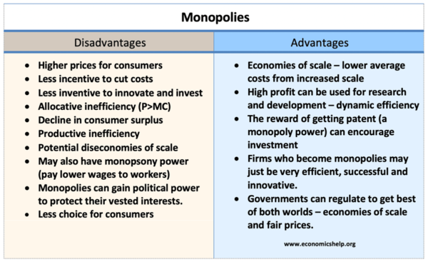

## Table of Contents

## What is monopolistic competition?

Monopolistic competition is a market structure where many companies sell products that are similar but not exactly the same. Each company tries to make its product different from others, maybe by changing the design, adding new features, or using different marketing strategies. This way, they can have some control over the price of their product, unlike in perfect competition where all products are the same and companies can't set their own prices.

In this type of market, companies compete with each other, but they also have some power to act like a monopoly because their products are a bit unique. Consumers have many choices, but they might be loyal to certain brands because of the differences in the products. This can lead to companies spending a lot on advertising to make their product stand out and attract more customers. Overall, monopolistic competition is common in industries like clothing, restaurants, and personal care products where companies try to make their products special.

## How does monopolistic competition differ from perfect competition?

Monopolistic competition and perfect competition are different in how they work and what they look like. In perfect competition, there are many sellers and all of them sell the same product. This means that no single seller can control the price because if they try to charge more, people will just buy from someone else. It's like everyone selling the exact same apples at the market, so the price stays the same for everyone. In perfect competition, companies don't need to spend money on making their products different or on advertising because their product is just like everyone else's.

On the other hand, monopolistic competition is different because each company tries to make their product a little special. They might change the design, add new features, or use different marketing to make their product stand out. This means they can have some control over the price because their product is not exactly the same as others. It's like selling apples, but some are red, some are green, and some come with a special sticker. Companies in monopolistic competition often spend a lot on advertising to make sure people know about their unique product. This kind of market is common in industries like restaurants or clothing where companies want to be different from each other.

## What are the key characteristics of monopolistic competition?

Monopolistic competition is a type of market where many companies sell products that are similar but not exactly the same. Each company tries to make their product a little different from others. They might change the design, add new features, or use different marketing to make their product stand out. This way, they can have some control over the price of their product. It's not like perfect competition where all products are the same and companies can't set their own prices.

In this market, companies compete with each other, but they also have some power to act like a monopoly because their products are a bit unique. Consumers have many choices, but they might be loyal to certain brands because of the differences in the products. This can lead to companies spending a lot on advertising to make their product stand out and attract more customers. Overall, monopolistic competition is common in industries like clothing, restaurants, and personal care products where companies try to make their products special.

## How do firms in monopolistic competition set prices?

In monopolistic competition, firms set prices based on how different their product is from others. Since each firm's product is a bit unique, they can charge a little more than if they were selling the exact same thing as everyone else. They look at what it costs to make the product, and then they add a bit more to make a profit. But they also have to think about what people are willing to pay. If they set the price too high, people might choose a similar product from another company that's cheaper.

Firms also use advertising to make their product seem more special. This can help them charge a higher price because people might think their product is better. But they have to be careful not to set the price too high, or they might lose customers to other companies. So, it's a balance between making their product seem valuable and keeping the price at a level where people will still buy it.

## What role does product differentiation play in monopolistic competition?

Product differentiation is really important in monopolistic competition. It's when companies make their products a little different from others. They might change the design, add new features, or use different marketing to make their product stand out. This helps them because it makes people think their product is special. When a product is different, the company can charge a bit more money for it. This is because people might be willing to pay more for something that seems unique or better than other similar products.

Because of product differentiation, companies in monopolistic competition can have some control over the price of their product. They don't have to sell at the same price as everyone else like in perfect competition. Instead, they can set a price that's a bit higher because their product is not exactly the same. This also means they need to spend money on advertising to make sure people know about their unique product. So, product differentiation is a big part of how companies in monopolistic competition work and how they make money.

## How does advertising influence monopolistic competition?

Advertising is very important in monopolistic competition. It helps companies make their products seem special. When a company advertises, they can show people why their product is different and better than others. This can make people want to buy their product instead of someone else's. Because of this, companies can charge a bit more money for their product. They need to spend money on ads to make sure people know about their unique product and think it's worth the extra cost.

Advertising also helps companies keep their customers. When people see ads a lot, they might start to trust and like the brand more. This can make them loyal to the company, so they keep buying the product even if other companies have similar ones. In monopolistic competition, where products are a bit different but still similar, this loyalty can be really helpful. It means the company can keep selling their product and making money, even if new companies come into the market.

## What are the entry and exit conditions in monopolistic competition?

In monopolistic competition, it's pretty easy for new companies to start up and for old ones to leave. If someone thinks they can make a special product that people will like, they can start a new business without too much trouble. They might need some money to get going, but there aren't big barriers stopping them. This means that if a company sees a chance to make money by selling something a bit different, they can jump in and try it.

On the other hand, if a company in monopolistic competition isn't doing well, it's also easy for them to stop and leave the market. If they're not making enough money or if they can't keep up with the competition, they can close down without too much hassle. This coming and going of companies helps keep the market lively and competitive, because new businesses can always try to do better than the old ones.

## What are the advantages of monopolistic competition for consumers?

Monopolistic competition is good for consumers because it gives them lots of choices. In this type of market, companies try to make their products a little different from each other. This means that people can pick the product that they like best, whether it's because of the design, the features, or even the brand. Having many options can make shopping more fun and help people find exactly what they want.

Another advantage is that companies in monopolistic competition often try hard to make their products better. They do this because they want to stand out from other companies. This can lead to new and improved products coming out all the time. Also, since companies are always trying to attract customers, they might offer sales or special deals, which can save people money. So, monopolistic competition can lead to better products and sometimes lower prices for consumers.

## What are the disadvantages of monopolistic competition for consumers?

One downside of monopolistic competition for consumers is that it can make products more expensive. Because companies in this market try to make their products different, they often spend a lot of money on things like advertising and making their product unique. They then add these costs to the price of the product, which means consumers have to pay more. Even though there are many choices, the products might not be that different from each other, but the prices can still be high because of all the extra costs.

Another disadvantage is that all the advertising can be confusing. Companies advertise a lot to make their products seem special, and this can make it hard for consumers to know which product is really the best. Sometimes, people might end up buying a product just because they saw a lot of ads for it, not because it's actually better than others. This can lead to people spending money on things that they might not need or that aren't as good as they thought.

## How does monopolistic competition affect economic efficiency?

Monopolistic competition can make the economy less efficient in some ways. Because companies try to make their products different, they spend a lot of money on things like advertising and making their product unique. This extra spending doesn't make the product better for people; it just makes it seem different. All this extra cost means that the price of the product goes up, and that's not good for economic efficiency. Also, because each company has a little bit of control over the price, they might not produce as much as they could if they were in perfect competition. This means that resources aren't being used in the best way possible.

On the other hand, monopolistic competition can also have some good effects on economic efficiency. Because companies are always trying to make their products better and different, it can lead to new ideas and innovations. When companies come up with new and better products, it can make the economy more efficient in the long run. Also, having lots of choices can make people happier, and that's something that's hard to measure but still important. So, while monopolistic competition might not be as efficient as perfect competition in some ways, it can still help the economy by pushing companies to innovate and giving people more choices.

## What are the long-term implications of monopolistic competition on market structure?

In the long run, monopolistic competition can lead to a lot of changes in the market. Because it's easy for new companies to start up and for old ones to leave, the market can be very lively. New businesses might come in with new ideas and products, trying to do better than the companies already there. This can make the market more competitive and keep companies on their toes. Over time, this can lead to a lot of different products and brands, giving people more choices and maybe even better products.

On the other hand, the constant need to advertise and make products different can make the market a bit messy. Companies spend a lot of money trying to stand out, which can make prices go up. Also, because each company has a little bit of control over the price, they might not produce as much as they could. This can mean that resources aren't being used in the best way. So, while monopolistic competition can keep the market lively and bring new ideas, it can also make things less efficient and more expensive for people.

## How do government policies affect firms in monopolistic competition?

Government policies can have a big impact on companies in monopolistic competition. One way is through rules about advertising. Governments might set rules about what companies can say in their ads to make sure they're not lying or tricking people. This can make it harder for companies to make their products seem special, which is a big part of how they compete in monopolistic competition. Also, governments might have rules about how companies can start up or close down. If it's easy to start a new business, more companies might come into the market, making it more competitive. But if the rules make it hard to start up, there might be fewer companies, which can make the market less lively.

Another way government policies can affect these companies is through taxes and subsidies. If the government puts high taxes on certain products, it can make them more expensive for people to buy. This can hurt companies that sell those products because people might not want to pay the higher price. On the other hand, if the government gives money to companies to help them make new products or improve old ones, it can help those companies do better in the market. This can lead to more innovation and better products for people to choose from. So, government policies can shape how companies in monopolistic competition work and how well they do.

## References & Further Reading

[1]: Chamberlin, E. H. (1933). "The Theory of Monopolistic Competition." Harvard University Press.  

[2]: Dixit, A. K., & Stiglitz, J. E. (1977). ["Monopolistic Competition and Optimum Product Diversity."](https://www.aeaweb.org/aer/top20/67.3.297-308.pdf) The American Economic Review, 67(3), 297-308.  

[3]: Lopez de Prado, M. (2018). ["Advances in Financial Machine Learning."](https://www.amazon.com/Advances-Financial-Machine-Learning-Marcos/dp/1119482089) Wiley.  

[4]: Chan, E. P. (2009). ["Quantitative Trading: How to Build Your Own Algorithmic Trading Business."](https://github.com/ftvision/quant_trading_echan_book) Wiley.  

[5]: Jansen, S. (2020). ["Machine Learning for Algorithmic Trading."](https://github.com/stefan-jansen/machine-learning-for-trading) Packt Publishing.  

[6]: Aronson, D. R. (2007). ["Evidence-Based Technical Analysis: Applying the Scientific Method and Statistical Inference to Trading Signals."](https://onlinelibrary.wiley.com/doi/book/10.1002/9781118268315) Wiley.  

[7]: DeBondt, W. F. M., & Thaler, R. (1985). ["Does the Stock Market Overreact?"](https://www.jstor.org/stable/2327804) The Journal of Finance, 40(3), 793-805.  

[8]: Gerakos, J., & Syverson, C. (2020). ["Competition in Financial Markets: Evidence from Broker-Dealers."](https://onlinelibrary.wiley.com/doi/abs/10.1111/1475-679X.12087) National Bureau of Economic Research.  

[9]: Black, F., & Scholes, M. (1973). ["The Pricing of Options and Corporate Liabilities."](https://www.cs.princeton.edu/courses/archive/fall09/cos323/papers/black_scholes73.pdf) Journal of Political Economy, 81(3), 637-654.