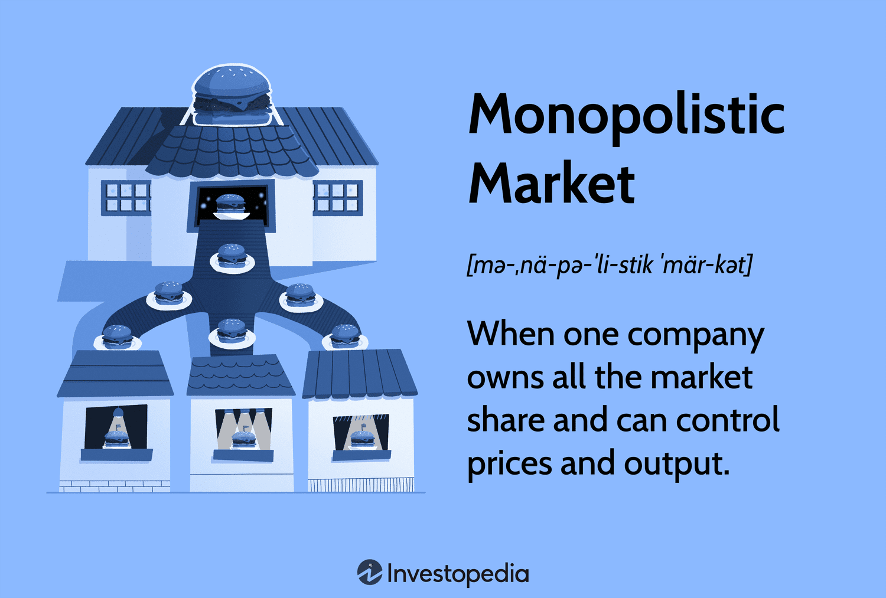

Monopolistic markets are a fundamental concept in economic theory, referring to market structures where a single firm or a group of firms exercises significant control over the production and sale of a particular product. These markets stand in contrast to perfectly competitive markets, where numerous small firms compete against each other. The significance of monopolistic markets lies in their ability to influence prices, restrict output, and generate substantial economic profit due to their market power. In economic parlance, a pure monopoly exists when a single firm is the sole producer of a good or service with no close substitutes, enabling it to set prices above marginal costs, as delineated by the formula $P > MC$, where $P$ represents price, and $MC$ denotes marginal cost.

Understanding the economic impacts of monopolistic markets is crucial in today's economically interconnected world. Monopolies can lead to inefficiencies in resource allocation and potentially diminish consumer welfare by limiting the options available to consumers and raising prices. Furthermore, the presence of monopolistic markets raises questions about innovation and technological advancement, as firms enjoying monopoly power might lack the competitive pressure to innovate.

In recent years, the rise of algorithmic trading has transformed the landscape of financial markets, adding another layer of complexity to market characteristics. Algorithmic trading involves the use of computer programs to execute trades based on pre-defined criteria, significantly impacting market liquidity, price formation, and efficiency. This development intersects with monopolistic market characteristics in multifaceted ways. Algorithmic trading can accentuate market volatility, especially when combined with high-frequency trading strategies, thereby influencing the competitiveness and stability of markets.

This article will explore three key themes: economic impacts, market characteristics, and algorithmic trading. Each section will address how these components interact and shape modern economic landscapes. First, we will delve into an understanding of monopolistic markets, examining their makeup and historical evolution. Following this, the article will analyze the economic impacts of monopolistic markets, focusing on pricing strategies, consumer welfare, and innovation. Subsequently, the characteristics of markets will be evaluated to understand their implications on competitive dynamics, stability, and regulatory environments.

The role of algorithmic trading in modern markets will be scrutinized to uncover its influence on market liquidity, efficiency, and the regulatory challenges it poses. Finally, intersections between monopolistic markets, market characteristics, and algorithmic trading will be investigated to assess their combined effects on market dynamics. The article will conclude with policy implications and recommendations, exploring antitrust laws, regulatory approaches, and the potential for international cooperation to address the challenges posed by these evolving market structures. This comprehensive analysis aims to enhance understanding and inform stakeholders in navigating the complex terrain of modern economic and financial systems.

## Table of Contents

## Understanding Monopolistic Markets

A monopolistic market is characterized by the presence of a single seller or a dominant firm that exerts significant control over the market, leading to a lack of competition. This market structure allows the entity to influence prices and outputs to maximize profits. In economic theory, monopolistic markets deviate from perfect competition, wherein numerous small firms operate without significant market control.

**Distinguishing Features: Product Differentiation and Market Power**

One of the primary features of monopolistic markets is product differentiation. Unlike in perfect competition where products are homogeneous, monopolistic markets allow firms to create variations and unique selling propositions that distinguish their products from those of competitors. This differentiation can take many forms, such as quality differences, branding, or unique features, giving firms more flexibility in setting prices.

Market power is another defining characteristic. Monopolistic entities have the ability to set prices above marginal cost, unlike in perfectly competitive markets where firms are price takers. This power stems from the lack of close substitutes for the product and high barriers to entry that prevent new competitors from entering the market. The Lerner Index is often used to measure the degree of pricing power in a monopolistic market, defined by the formula:

$$
L = \frac{P - MC}{P}
$$

where $L$ is the Lerner Index, $P$ is the price set by the firm, and $MC$ is the marginal cost.

**Types of Monopolistic Markets: Pure Monopoly vs. Monopolistic Competition**

Monopolistic markets can be categorized into two main types: pure monopoly and monopolistic competition. 

1. **Pure Monopoly**: In a pure monopoly, a single firm dominates the entire market with no close substitutes for its product. This firm is the sole provider, allowing it to control prices and output levels extensively. Public utilities, such as electricity and water services, often operate under this structure due to high infrastructure costs and natural barriers to new entrants.

2. **Monopolistic Competition**: This type of market features many firms that sell products that are similar but not identical. Each company has a degree of market power, primarily due to product differentiation. Despite the presence of many competitors, each firm's unique product attributes allow for price setting above marginal costs. The fast-food industry is a common example, where numerous restaurants offer differentiated meal options.

**Examples of Industries with Monopolistic Characteristics**

Industries with monopolistic traits typically showcase high entry barriers, significant control over pricing, and limited competitive pressure. The technology industry, particularly sectors dominated by major players like Google or Microsoft, exemplifies these characteristics. These firms leverage brand strength, product innovation, and network effects to maintain market dominance.

**Historical Context and Evolution**

Historically, monopolistic markets have often arisen due to technological advancements, regulatory environments, or natural resource control. The late 19th and early 20th centuries saw the emergence of monopolies in industries such as steel and oil, exemplified by firms like Carnegie Steel and Standard Oil. Over time, regulatory interventions, such as antitrust laws, have aimed to curb excessive market power and foster competition. The evolution of digital platforms and global supply chains continues to shape the dynamics of monopolistic markets, presenting ongoing challenges and considerations for policymakers and economists.

## Economic Impacts of Monopolistic Markets

Monopolistic markets significantly influence pricing strategies and profit margins due to the inherent market power held by firms. In these markets, companies can set prices above marginal cost without losing all customers because of product differentiation and a lack of perfect substitutes. This leads to higher profit margins compared to more competitive markets. The influence of a monopolistic market structure on consumer choices is profound; consumers face limited options and often higher prices, which can reduce consumer surplus and overall welfare.

Innovation in monopolistic markets is a double-edged sword. On one hand, firms with market power may have the resources and incentives to innovate, providing the potential for significant technological advancements. However, the lack of competitive pressure can also lead to complacency, potentially stifling innovation. The role of barriers to entry, such as high startup costs, patents, and brand loyalty, further entrenches market dominance. These barriers prevent new firms from entering the market, thereby maintaining the status quo and allowing existing firms to operate with less competitive pressure.

The long-term economic effects of monopolistic markets on market efficiency and resource allocation are complex. While these markets can lead to allocative inefficiency—where resources are not used where they are most valued due to price distortions—they may improve productive efficiency if economies of scale are achieved. Nevertheless, the overall effect is often a net welfare loss compared to perfectly competitive markets, where prices tend to reflect true economic costs.

To better understand these dynamics, consider a simple economic model where a monopolist maximizes profit by setting output $Q$ such that marginal revenue $MR$ equals marginal cost $MC$. The profit-maximizing condition is:
$$
MR = MC
$$

However, in a practical scenario with high entry barriers, the monopolist faces less pressure to minimize costs, potentially leading to X-inefficiency, where the firm operates above the minimum cost curve.

In summary, while monopolistic markets can lead to high profits for firms, the impact on consumer welfare, innovation, and long-term market efficiency is often negative. These impacts underscore the importance of regulatory oversight to curb excessive market power and promote competitive dynamics.

## Market Characteristics and Their Implications

Market characteristics are fundamental in shaping the dynamics and outcomes of different market structures. Understanding these characteristics helps in analyzing competitive interactions, regulatory responses, and economic efficiency. Key characteristics that define markets include demand elasticity, market segmentation, and switching costs.

### Demand Elasticity

Demand elasticity measures how sensitive the quantity demanded is to a change in price. It affects firms’ pricing strategies and market competitiveness. For instance, in markets with high demand elasticity, consumers are more responsive to price changes, compelling firms to maintain competitive pricing. On the other hand, low elasticity markets allow firms more pricing power, potentially leading to higher profit margins but at the expense of consumer welfare.

The formula for price elasticity of demand ($E_d$) is:

$$

E_d = \frac{\%\ \text{Change in quantity demanded}}{\%\ \text{Change in price}} 
$$

Understanding demand elasticity helps regulators predict market reactions to price interventions and tax policies, allowing for a more informed regulatory strategy.

### Market Segmentation

Market segmentation involves dividing a broad consumer market into subgroups of consumers with common needs or characteristics. This allows firms to target specific segments effectively, tailoring products and marketing strategies to match consumer preferences. Segmentation can lead to increased market power, as firms can distinguish their offerings and reduce direct competition. However, it might also decrease market stability by encouraging niche markets that are sensitive to economic shifts or consumer trends.

### Switching Costs

Switching costs refer to the expenses or inconveniences that consumers incur when changing from one supplier or product to another. High switching costs can significantly affect market dynamics by reducing customer churn and insulating companies from competitive pressures. This can lead to market power concentration and reduced innovation since firms face less pressure to improve offerings. 

For example, industries such as telecommunications and software often exhibit high switching costs due to contracts, service setup fees, or learning curves associated with new technologies.

### Implications on Market Stability and Volatility

These market characteristics influence stability and [volatility](/wiki/volatility-trading-strategies) by affecting firm behavior, consumer choices, and market entry barriers. Markets with low demand elasticity and high switching costs are generally more stable, as firms have less incentive to engage in aggressive pricing wars, and consumers are less likely to migrate. However, this stability can be at the cost of innovation and long-term efficiency.

### Regulatory Environment Interaction

Regulatory environments must adapt to market characteristics to ensure fair competition and consumer protection. For example, regulators might enforce antitrust laws in markets with significant segmentation to prevent dominance abuse. Additionally, policies aimed at reducing switching costs, like promoting interoperability standards or mandating transparency in pricing, can enhance competitive dynamics and benefit consumers.

### Case Studies

Markets with unique characteristics, such as the pharmaceutical industry, showcase these dynamics. Pharmaceuticals often exhibit low demand elasticity due to the essential nature of certain drugs and high switching costs related to brand loyalty and regulatory constraints. As a result, firms can exercise significant pricing power, prompting regulatory interventions like price control measures and promoting generic drug competition to enhance accessibility and affordability.

In the technology sector, rapid innovation and high switching costs often lead to monopolistic behaviors and market volatility. Regulatory approaches here may focus on fostering competition through antitrust actions and incentivizing new market entrants to ensure a dynamic and consumer-friendly market environment.

In conclusion, key market characteristics shape the competitive and regulatory landscape. A nuanced understanding of these dynamics is crucial for policymakers, businesses, and stakeholders aiming to navigate and influence market outcomes effectively.

## The Role of Algorithmic Trading in Modern Markets

Algorithmic trading, often called algo trading, refers to the use of computer algorithms to manage trading activities in financial markets. These algorithms follow a defined set of rules designed to execute trades at optimal times and prices, significantly faster than human counterparts. Algorithmic trading's prevalence has grown rapidly, driven by advances in computing power, data availability, and the pursuit of automation for efficiency and profitability in trading operations.

Algorithmic trading has a profound relationship with market [liquidity](/wiki/liquidity-risk-premium). By enabling rapid execution of trades, these algorithms contribute to the continuous buy and sell orders that enhance liquidity. This increase in liquidity reduces the bid-ask spread, making trading cheaper for all market participants. However, concerns remain regarding liquidity 'hollowing out,' where apparent liquidity may vanish due to algo trading strategies that withdraw liquidity under certain conditions.

The impact of [algorithmic trading](/wiki/algorithmic-trading) on price formation and market efficiency is significant. Algorithms can process vast arrays of data to identify mispricings across markets, thereby contributing to more accurate price discovery. Yet, this same precision and speed can exacerbate market volatility. Algorithms that react to short-term price movements may lead to chain reactions, amplifying market trends or causing large price swings, as witnessed during the 2010 Flash Crash.

Regulation of high-frequency and algorithmic trading remains a complex issue. Authorities face challenges in monitoring and controlling the activities due to the sheer speed and [volume](/wiki/volume-trading-strategy) of transactions. Key regulatory concerns include market manipulation, such as spoofing and layering, where orders are placed without the intent to execute to manipulate prices. Regulatory bodies have been implementing measures such as circuit breakers and minimum resting times for orders to mitigate these risks.

Ethically and economically, algorithmic trading provokes significant debate. Proponents argue it increases market efficiency, lowers costs, and democratizes trading by providing retail investors with access to sophisticated tools. Critics, however, highlight risks such as market manipulation, systemic risks, and the potential for a few algorithm developers to dominate market dynamics, leading to monopolistic scenarios. The debate extends to issues of fairness, as investors with access to advanced algorithms may enjoy advantages over those who do not.

As algorithmic trading continues to evolve, it is crucial for stakeholders to consider both its benefits and challenges. Balancing technological advancement and fair market practices will require ongoing dialogue between market participants, regulators, and developers to ensure that the growing role of algorithms aligns with the broader goals of market integrity and stability.

## Intersections Between Monopolistic Markets, Market Characteristics, and Algo Trading

Monopolistic market characteristics significantly impact algorithmic trading strategies, as these markets often exhibit less price competition and greater control over supply. This can lead to predictable price movements and reduced price volatility, providing opportunities for algorithmic traders to exploit pricing inefficiencies. In markets with monopolistic traits, such as limited competition and differentiated products, algorithms can be fine-tuned to identify patterns unobservable in more competitive settings, augmenting profit potential.

Algorithmic trading itself may also foster monopolistic behaviors. High-frequency trading ([HFT](/wiki/high-frequency-trading-strategies)), a form of algorithmic trading, can create barriers to entry due to the significant initial investment required in technology and infrastructure, consolidating market power among a few dominant players. These entities can influence market dynamics, potentially skewing the balance towards monopolistic practices by exerting disproportionate control over trading volumes and liquidity.

The interplay between market volatility, monopolistic power, and trading algorithms creates a feedback loop that can destabilize or stabilize markets. In periods of low volatility, firms with substantial market power may use algorithms to subtly adjust prices without deterring demand, while high volatility may compel these firms to employ risk management algorithms to mitigate potential losses. Moreover, algorithmic trading can exacerbate price swings if a significant volume of trades is executed simultaneously based on similar algorithmic signals, resulting in abrupt market corrections.

When monopolistic market characteristics and algorithmic trading coalesce, several market outcomes are possible. Algorithmic trading might enhance price discovery and liquidity, even in less competitive markets. However, excessive concentration of trading power can lead to reduced market access and competition, reinforcing monopolistic tendencies. The expanded use of [machine learning](/wiki/machine-learning) and [artificial intelligence](/wiki/ai-artificial-intelligence) in trading algorithms introduces further complexity, potentially amplifying these dynamics through more sophisticated predictive capabilities and decision-making models.

Technological advancements continue to shape future interactions between monopolistic market traits and algorithmic trading. As technology evolves, algorithms become more adept at processing large datasets and identifying subtle trends. This increases their ability to navigate markets with monopolistic characteristics efficiently. Furthermore, developments in blockchain technology and decentralized finance (DeFi) may present new paradigms that could either counteract or exacerbate the concentration of market power.

In conclusion, the intersection of monopolistic markets, distinctive market characteristics, and algorithmic trading is a multifaceted domain where strategic manipulation coexists with technological innovation. Stakeholders must consider both the positive and negative outcomes to ensure market stability and fairness are sustained.

## Policy Implications and Recommendations

Policy responses to the challenges posed by monopolistic markets and algorithmic trading are pivotal in ensuring market efficiency and consumer protection. A multi-faceted approach encompassing antitrust laws, innovative regulatory mechanisms, and international cooperation is essential.

Antitrust laws play a crucial role in maintaining competitive markets by preventing monopolistic practices that can stifle competition and harm consumers. These laws aim to dismantle or regulate dominant firms that abuse their market power. Notable examples include the Sherman Act in the United States and the European Union's competition law, which target anti-competitive agreements, abuse of dominant positions, and mergers that may restrict competition. Updating these laws to address challenges posed by digital platforms and tech giants is vital, given their potential to exhibit monopolistic behavior. Recent reforms in the EU and US reflect attempts to tighten control over such entities and ensure fair competition.

Algorithmic trading introduces complexities that traditional regulatory frameworks might not effectively address. Innovative regulatory approaches include implementing circuit breakers to curb extreme volatility caused by high-frequency trading and requiring increased transparency in trading algorithms. For instance, mandating the disclosure of algorithmic trading strategies could help regulators monitor and control unfair trading practices. Additionally, creating sandboxes for testing new financial technologies can foster innovation while maintaining oversight.

Balancing market efficiency with consumer protection necessitates strategies that uphold competitive markets without stifling innovation. Regulators can encourage market efficiency by promoting transparency and accessibility, enabling smaller market participants to compete effectively. Consumer protection can be strengthened by establishing guidelines that guard against algorithmic bias and ensure fair pricing. For example, algorithms that set prices based on discriminatory factors should be scrutinized and regulated.

International cooperation on regulatory standards is increasingly important due to the global nature of financial markets and trading activities. Cross-border coordination among regulators can help harmonize standards, preventing regulatory [arbitrage](/wiki/arbitrage) where entities exploit differences between jurisdictions to circumvent regulations. Institutions like the Financial Stability Board and the International Organization of Securities Commissions (IOSCO) can play a vital role in fostering international dialogue and collaboration, helping to standardize approaches to market oversight and enforcement.

In conclusion, addressing the challenges of monopolistic markets and algorithmic trading requires a nuanced blend of traditional antitrust measures, modern regulatory innovations, and international collaboration. By aligning policies with the evolving market landscape, regulators can enhance competition, protect consumers, and nurture a dynamic and fair economic environment.

## Conclusion

This article explored the multifaceted impacts of monopolistic markets, market characteristics, and algorithmic trading on modern economies. Monopolistic markets, characterized by significant market power and product differentiation, influence pricing strategies, consumer choice, and innovation. These effects are tempered by regulatory interventions aimed at maintaining competitive markets and promoting consumer welfare.

Algorithmic trading, while enhancing market liquidity and efficiency, presents new challenges, including those related to fairness, market stability, and the necessity for updated regulatory frameworks. The interaction between algorithmic trading and monopolistic market characteristics raises concerns about potential market manipulations and barriers to entry, necessitating vigilant oversight.

There is an ongoing need to balance market forces with regulatory responses. Policymakers must continually adapt to technological advancements and market evolutions, ensuring that regulations are effective yet flexible. This requires collaboration among stakeholders, as informed engagement is crucial for formulating strategies that both safeguard and enhance market function.

Looking ahead, the trajectory of economic landscapes will hinge on these finely-tuned balances. As technology and markets continue to evolve, stakeholders must remain proactive and adaptable, striving to forge a future where economic efficiency aligns with equitable access and opportunity.

## References & Further Reading

[1]: Posner, R. A. (2001). ["Antitrust Law, Second Edition."](https://press.uchicago.edu/ucp/books/book/chicago/A/bo3628468.html) University of Chicago Press.

[2]: ["Algorithmic Trading and DMA: An Introduction to Direct Access Trading Strategies"](https://archive.org/details/algorithmictradi0000john) by Barry Johnson

[3]: Shapiro, C., & Varian, H. R. (1998). ["Information Rules: A Strategic Guide to the Network Economy."](https://link.springer.com/article/10.1023/A:1007897212472) Harvard Business School Press.

[4]: Stiglitz, J. E. (2001). ["Principles of Microeconomics."](https://d3bxy9euw4e147.cloudfront.net/oscms-prodcms/media/documents/PrinciplesofMicroeconomics-LR.pdf) W.W. Norton & Company.

[5]: O'Hara, M. (2015). ["High Frequency Trading: New Realities for Traders, Markets, and Regulators."](https://www.semanticscholar.org/paper/High-frequency-trading-%3A-new-realities-for-traders%2C-Easley-Prado/e1b693a045a0554198a83b127f534f17592ebb08) Financial Analysts Journal.

[6]: Lopez de Prado, M. (2018). ["Advances in Financial Machine Learning."](https://www.amazon.com/Advances-Financial-Machine-Learning-Marcos/dp/1119482089) Wiley.

[7]: Vives, X. (2001). ["Oligopoly Pricing: Old Ideas and New Tools."](https://www.jstor.org/stable/pdf/41794874.pdf) MIT Press.