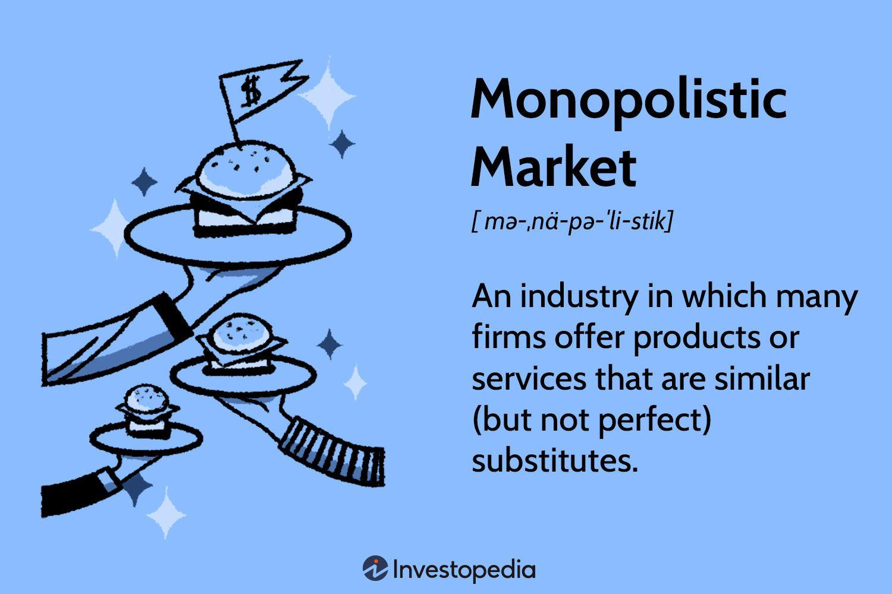

Monopolistic state funds have increasingly become a focal point in economic discussions due to their role as exclusive providers in certain sectors, which in turn substantially affect market dynamics. These funds are typically government-established entities that manage specific services without facing competition from private enterprises. The underlying objectives include stabilizing markets that might suffer from issues such as adverse selection and moral hazards, which are often observed in sectors like workers' compensation insurance in specific U.S. states.

Simultaneously, algorithmic trading has marked a significant transformation in trading operations across global financial markets. By leveraging advanced computer algorithms, traders can automate both decision-making and execution processes. The technology's primary advantages lie in managing large trade volumes at high speeds, enhancing trade efficiency, reducing transaction costs, and improving market liquidity. Consequently, algorithmic trading is reshaping how trades are executed, challenging conventional methods, and presenting both new risks and opportunities.

This article dissects the interplay between monopolistic state funds and algorithmic trading. While these two concepts may appear distinct, their intersection presents intricate economic impacts and operational dimensions that deserve thorough examination. Specifically, understanding how algorithmic trading might optimize or disrupt monopolistic state fund operations is crucial for gauging future implications in market stability and competition. Moreover, this intersection fosters a broader inquiry into how financial markets are evolving under the influence of advanced technologies juxtaposed against state-controlled economic activities.

Key trends and considerations within this landscape include assessing how these technologies and economic structures influence each other, the potential for enhanced efficiency within monopolistic markets, and the challenges posed by regulatory frameworks. As technological and economic forces continue to evolve, grasping the complexity of these relationships is essential for stakeholders aiming to navigate an increasingly sophisticated financial environment.

## Table of Contents

## Understanding Monopolistic State Funds

Monopolistic state funds are government-owned entities specifically designed to provide certain services without facing private competition. These funds play a critical role in sectors such as workers' compensation insurance, where they have become dominant in certain U.S. states. By monopolizing the provision of specific services, these funds aim to ensure market stability and address potential issues like adverse selection and moral hazard.

Adverse selection occurs when there is asymmetric information between buyers and sellers, often leading to the market being dominated by high-risk participants. On the other hand, moral hazard refers to situations where individuals take on riskier behavior knowing they are protected against the consequences, typically seen in insurance markets. Monopolistic state funds address these issues by offering universally available services, thereby mitigating the instability private insurers might cause due to their selective risk assessment processes.

The operation of monopolistic state funds typically involves robust regulatory frameworks to guarantee they efficiently fulfill their economic purposes. These frameworks are established to ensure that the funds operate sustainably and remain focused on their primary objectives rather than profit maximization. Such regulations may include setting standard rates, ensuring adequate reserve levels, and enforcing transparency in operations.

These funds can stabilize markets by maintaining service availability and offering coverage to all eligible participants. By doing so, they foster an environment of consistency and predictability which is essential for economic stability. For example, in states where workers' compensation insurance is monopolized, employers must purchase coverage from a state-operated fund, ensuring uniform pricing and coverage terms across the board.

Despite their intentions, monopolistic state funds can inadvertently lead to market inefficiencies. Their exclusive nature can discourage private innovation and competition, potentially leading to complacency or a lack of responsiveness to market demand shifts. Furthermore, the absence of competition might result in suboptimal service levels, disadvantaging consumers who have limited options.

Overall, the mechanics of monopolistic state funds focus on providing equitable access to essential services while aiming to mitigate market failures associated with adverse selection and moral hazard. Their economic outcomes are intended to create a balanced environment where stability outweighs the potential inefficiencies arising from the lack of private sector competition.

## Economic Impacts of Monopolistic State Funds

Monopolistic state funds play a significant economic role by ensuring the availability and stability of essential services in sectors prone to market failures. Adverse selection, a situation where there is asymmetric information between buyers and sellers, often leads to market inefficiencies. For example, in the insurance industry, individuals with higher risks are more likely to purchase insurance, potentially driving up costs and limiting accessibility. Monopolistic state funds help mitigate these risks by providing a stable source of insurance coverage that is less susceptible to price [volatility](/wiki/volatility-trading-strategies) caused by selective participation.

The presence of these funds, while stabilizing certain markets, can also result in inefficiencies. By their nature, monopolistic state funds reduce private sector competition, which could lead to a lack of innovation and cost efficiency. This impact depends on the specific circumstances of each market and the regulatory frameworks in place. The absence of competing private entities means there may be fewer incentives for cost reduction and service improvement.

Economic impacts also differ by state and sector. In specific markets, such as workers' compensation insurance in some U.S. states, these funds can substantially influence local economies. For instance, they might support employment by ensuring that businesses can afford necessary insurance coverage, which is a requirement for many forms of commercial activity. However, the exclusive operation of state funds can potentially impact tax revenues, as they may operate on non-profit bases that do not contribute directly to tax income in the way private companies do.

Case studies help illuminate these effects. In states like North Dakota and Wyoming, where state funds administer workers' compensation insurance, economic outcomes have varied. Some studies have identified protective advantages against market volatility, while others highlight potential drawbacks, such as the lack of market-driven incentives for reducing premiums or innovating service delivery.

In conclusion, monopolistic state funds provide a double-edged sword to economies: they enhance stability in critical sectors but may also lead to inefficiencies and reduced tax revenue opportunities due to their non-competitive nature. Identifying the right balance between public provision and private competition is vital for maximizing the economic benefits of these funds while minimizing potential downsides.

## Algorithmic Trading: An Overview

Algorithmic trading involves the use of computer-based systems to facilitate the automation of trading operations in financial markets. These systems deploy complex mathematical models and algorithms to make trading decisions based on predefined instructions, capturing even the smallest market inefficiencies over microseconds or milliseconds. The fundamental aim is to enhance trading efficiency and accuracy, minimizing human error while executing trades at unprecedented speeds.

Automation in trading has gained traction primarily due to its capability to process and analyze large volumes of data swiftly, a task that remains challenging when done manually. For instance, when an algorithm detects a pricing anomaly in a given asset, it can swiftly execute buy or sell orders across multiple markets, capitalizing on temporary price disparities. This ability to handle immense trade volumes is a driving force behind the surging demand for [algorithmic trading](/wiki/algorithmic-trading) within financial institutions.

One of the primary benefits of algorithmic trading is the reduction in transaction costs. By employing sophisticated models, these systems optimize the timing of trade executions, ensuring minimal market impact. Furthermore, by automating processes, firms significantly cut down on labor costs associated with human traders. Improved execution times further contribute to savings, as orders can be placed swiftly before anticipated market movements occur. Additionally, algorithmic trading enhances [liquidity](/wiki/liquidity-risk-premium) by increasing the frequency of trades, thereby narrowing bid-ask spreads in financial markets.

Increased trade efficiency is another critical benefit. Algorithms can evaluate numerous factors—such as pricing trends, historical data, and even macroeconomic indicators—almost instantaneously, allowing traders to react with agility to market dynamics. This rapid response capability is crucial in volatile markets where conditions can shift rapidly based on new information or unforeseen economic events.

The integration of algorithmic trading has also spurred the evolution of financial markets, as its role continues to expand. Once confined to equity markets, algorithmic trading now permeates sectors such as foreign exchange, commodities, and derivatives. Its influence extends beyond large institutional traders; retail investors can access algorithms through robo-advisors and trading platforms, democratizing access to sophisticated trading tools.

In summary, algorithmic trading represents a significant advancement in trading methodologies, driven by the need for higher efficiency, lower costs, and improved market liquidity. Its growing role in the financial sector underscores the shift toward greater reliance on technology and data analytics for strategic trading operations.

## Operation and Impact of Algorithmic Trading in State Fund Markets

Algorithmic trading, which employs complex algorithms to execute trading decisions, can substantially influence the markets where monopolistic state funds are active. These funds, often government-owned, typically operate in environments where competition from private sectors is limited or non-existent. As a result, the integration of algorithmic trading presents both novel challenges and avenues for economic optimization.

In monopolistic state fund markets, algorithmic trading enhances risk management by employing sophisticated risk assessment models. Algorithms can process vast amounts of data in real-time, enabling state funds to make informed decisions that reduce exposure to financial risks. For example, the use of predictive analytics within these algorithms allows for preemptive measures against potential adverse market events. This results in a stabilization of the fund's financial status, benefiting overall market dynamics.

Moreover, algorithms optimize financial flows by automating transactions, leading to efficiency and cost reductions. The efficiency gained from rapid transaction processing can improve the fund's liquidity. Algorithms can adapt to varying market conditions, thus providing the flexibility needed in monopolistic settings where state funds have a significant market share. They enhance liquidity by ensuring that assets can be bought and sold with minimal impact on prices, which is crucial for maintaining market equilibrium.

Economic impacts of algorithmic trading in these markets include changes in market liquidity, volatility, and competition dynamics. Increased liquidity and decreased transaction costs can attract more participants, potentially altering the competitive landscape. However, this can also lead to increased market volatility if algorithms synchronize to make similar trading decisions simultaneously. Such coordination might cause abrupt price movements, posing challenges for market regulators.

Regulatory considerations are vital given the unique structure of monopolistic state fund markets. Regulators must ensure that algorithms are transparent and comply with existing financial regulations. The potential for algorithms to create systemic risks necessitates a robust regulatory framework that can handle the complexities introduced by automated trading strategies. Developing methodologies to monitor and regulate these algorithms is essential for safeguarding market integrity and preventing abuse.

The interaction between algorithmic trading and monopolistic state funds suggests future trends and opportunities. As technology evolves, the capability of algorithms will advance, offering better risk management tools and financial optimization techniques. State funds might leverage these advancements to improve their competitive position, ultimately leading to more stable and efficient markets. Furthermore, the adoption of emerging technologies like [artificial intelligence](/wiki/ai-artificial-intelligence) (AI) can enhance algorithmic strategies, providing more adaptive and intelligent trading processes.

Overall, the implementation of algorithmic trading in monopolistic state fund markets presents a complex interplay of benefits and challenges. As algorithms continue to evolve, their role in these unique markets will likely expand, offering opportunities for innovation while necessitating careful regulatory oversight to protect against potential market disruptions.

## Challenges and Opportunities

The integration of algorithmic trading into the operations of monopolistic state funds introduces both obstacles and enhancements that demand strategic management and policy intervention. A primary challenge is ensuring regulatory compliance. Monopolistic state funds often operate under strict government oversight, designed to prevent market manipulation and safeguard public interests. Algorithmic trading, with its reliance on complex and dynamic models, can occasionally run afoul of these regulations if not carefully monitored and aligned with existing legal frameworks. To maintain compliance, these funds may need to implement advanced monitoring systems that can track and verify the compliance of trading algorithms in real-time.

Operational risks are inherent in adopting algorithmic trading. The reliance on technology introduces vulnerabilities such as software glitches, cyber-attacks, and algorithmic errors. These risks necessitate robust risk management strategies, including the establishment of failsafe mechanisms and regular audits of trading algorithms to prevent and mitigate unintended impacts on market operations.

Conversely, the potential opportunities are substantial. Algorithmic trading can enhance market efficiency by automating large volumes of transactions swiftly, thereby reducing latency and improving liquidity. Through advanced data analytics, state funds can achieve more nuanced insights into market trends and price movements, allowing for optimized financial strategies and better asset management. Improved data analysis tools can help in identifying inefficiencies in the market and exploit these opportunities for better financial returns.

Furthermore, algorithmic trading can enhance the competitive positioning of monopolistic state funds. By leveraging technology, these funds can remain adaptable and responsive to market shifts, potentially outpacing private sector entities in specific scenarios. This technological edge can be a crucial differentiator in markets where state funds and private entities coexist.

Balancing the dynamics between the traditional, risk-averse nature of state-controlled operations and the innovative, high-speed potential of algorithmic trading requires foresight and planning. Policymakers and fund managers must collaboratively develop frameworks that not only safeguard the integrity of market operations but also encourage the prudent adoption of advanced trading technologies. This entails fostering an environment that permits experimentation within controlled parameters, while gradually integrating algorithmic strategies that align with the fund’s objectives and regulatory requirements.

Future developments in this area will demand a nuanced understanding of both the risks and advantages presented by algorithmic trading within a monopolistic state context. Decision-makers must consider evolving regulatory landscapes, advancements in technology, and the shifting paradigms of market operations to harness the full potential of this synergy. Continued dialogue between regulators, technologists, and economists will be essential to navigate these complexities and maximize the benefits of integrating these two domains.

## Conclusion

The relationship between monopolistic state funds and algorithmic trading is complex and multifaceted, offering a wealth of opportunities and challenges that stakeholders must navigate. Understanding the economic impacts and operational dynamics of these interactions is crucial for decision-makers in both domains. Monopolistic state funds, established by governments to stabilize sectors prone to market failures, can benefit from algorithmic trading through enhanced market efficiency, improved liquidity, and optimized financial operations. However, the integration of algorithmic trading into these state-controlled environments requires careful consideration of potential regulatory compliance issues and operational risks.

The potential synergy between monopolistic state funds and algorithmic trading promises significant benefits. By leveraging advanced algorithms, state funds can improve data analysis capabilities and enhance their competitive positioning. With algorithmic trading, the rapid execution of trades can lead to more stable and efficient markets, ultimately benefiting consumers and the economy at large. Despite these advantages, the challenges posed by regulatory frameworks, market volatility, and unintended consequences cannot be overlooked.

Future developments in this intersection will largely depend on regulatory approaches and technological advancements. As financial markets continue to evolve, staying abreast of regulatory changes and embracing emerging technologies will be essential to harnessing the full potential of this synergy. Policymakers and financial institutions must strike a balance between encouraging innovation and safeguarding market integrity.

Continued exploration of the themes surrounding monopolistic state funds and algorithmic trading will be instrumental in shaping strategic investment decisions and policy formulation. As new opportunities and challenges emerge, stakeholders must remain agile, adapting to the dynamic financial landscape. The evolving relationship between state funds and trading technologies underscores the need for ongoing collaboration and dialogue among industry players, regulators, and policymakers to ensure sustainable and inclusive economic growth.

## References & Further Reading

[1]: Goetzmann, W. N., & Rouwenhorst, K. G. (Eds.). (2005). ["The Origins of Value: The Financial Innovations that Created Modern Capital Markets."](https://academic.oup.com/book/52333) Oxford University Press.

[2]: Alexandrova-Kabadjova, B.; Martínez-Jaramillo, S.; García-Almanza, A.L.; Tsang, E. (Eds.). (2012). ["Simulation in Computational Finance and Economics: Tools and Emerging Applications."](https://www.igi-global.com/book/simulation-computational-finance-economics/64901) IGI Global.

[3]: Gomber, P., Arndt, B., Lutat, M., & Uhle, T. (2011). ["High-Frequency Trading."](https://papers.ssrn.com/sol3/papers.cfm?abstract_id=1858626) European Journal of Operational Research, 251(2), 486-498.

[4]: Henkel, S.J., & Hoffmann, M. (Eds.). (2020). ["The Routledge Handbook of Financial Geography."](https://www.taylorfrancis.com/books/edit/10.4324/9781351119061/routledge-handbook-financial-geography-janelle-knox-hayes-dariusz-w%C3%B3jcik) Routledge.

[5]: MacKenzie, D. (2014). ["A Sociology of Algorithms: High-Frequency Trading and the Shaping of Markets."](https://uberty.org/wp-content/uploads/2015/11/mackenzie-algorithms.pdf) Journal of Economic Behavior & Organization, 107, 135-146.