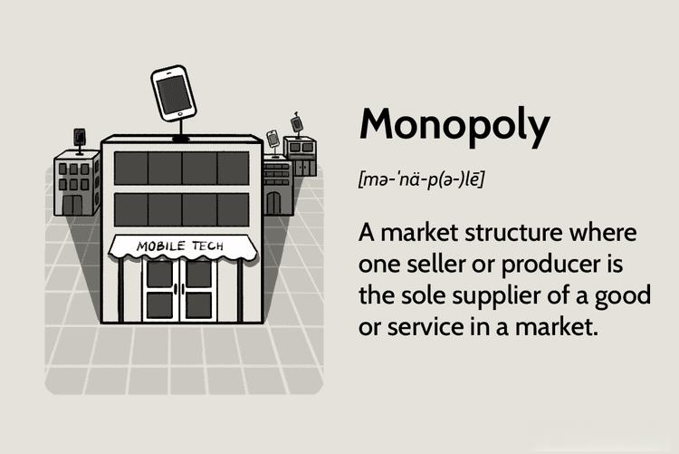

Monopolies play a pivotal role in economic discussions, frequently fueling debates regarding their influence on market dynamics, economic efficiency, and consumer welfare. These entities arise when a single seller dominates a market, granting them considerable control over pricing and output. This often results in substantial economic implications, including potential inefficiencies and restricted consumer choice.

In today's economic landscape, it is crucial to understand how monopolies operate within the broader context of market regulation and the burgeoning field of algorithmic trading. Each of these elements shares a complex interplay, influencing not only market mechanisms but also the broader economic environment. The intricate balance of promoting innovation while safeguarding consumer interests underscores the importance of addressing these aspects collectively.

This article aims to explore key dimensions of this interaction by examining the economic impacts that monopolies have on our markets, alongside the critical role of regulation in maintaining equilibrium. It investigates how algorithmic trading introduces both opportunities and challenges, potentially reshaping market structures traditionally influenced by monopolistic forces.

A thorough analysis will be conducted on various types of monopolies, recognizing their unique characteristics, respective benefits, and potential drawbacks. Furthermore, it will dissect regulatory responses necessary to mitigate negative outcomes, ensuring these powerful entities do not detrimentally affect market functionality or stability.

Understanding these interconnected topics is essential for comprehending their implications on contemporary markets. This knowledge is vital for policymakers, economists, and stakeholders who strive to craft effective regulatory frameworks that balance the innovation-driving aspects of monopolies with the protective measures necessary for consumer welfare. By illuminating these aspects, we aspire to provide readers with a comprehensive understanding of the challenges and opportunities that monopolies, market regulation, and algorithmic trading present in current economic systems.

## Table of Contents

## Monopolies: Definition and Economic Impact

A monopoly is defined as a market structure where a single seller or producer controls the entirety of the market for a particular product or service, thereby having the power to significantly influence the market prices and output levels. This dominance allows the monopolist to act as a price maker, setting prices higher than they would be in a competitive market. As a result, monopolies can lead to several economic inefficiencies, notably allocative and productive inefficiency. Allocative inefficiency arises when resources are not distributed in a way that maximizes consumer satisfaction. In the case of a monopoly, fewer goods are produced, and prices are higher than they would be in a more competitive market, leading to decreased consumer surplus. Productive inefficiency occurs when goods are not produced at the lowest possible cost. Monopolies may lack the pressure to become efficient and reduce costs since there is no direct competition.

There are various forms of monopolies, each with unique characteristics that influence their economic impact. Natural monopolies occur in industries where high fixed costs or significant economies of scale make it most efficient for a single firm to supply the entire market. Examples include utilities like water and electricity. While natural monopolies can benefit consumers through lower costs due to efficiency in scale, they can also stifle innovation and reduce consumer choice due to the lack of competitive pressure.

Government monopolies are established through legal means, often providing a public service or regulating critical industries to ensure service provision and quality. Technological monopolies occur when a firm holds a patent or exclusive technological advantage, allowing them to dominate the market. Geographic monopolies exist when a firm is the sole provider of a product or service in a specific location due to environmental or logistical factors.

The economic impact of monopolies is multifaceted. On one hand, monopolies can lead to high prices, restricted output, and reduced consumer choice, which negatively impacts consumer welfare. On the other hand, they can enable significant investment in research and development due to the financial resources available to monopolists, potentially resulting in innovation. However, this potential is often not realized fully, as the lack of competition may lead to complacency.

Understanding the structure of monopolies is crucial for assessing their broader impacts on market functionality and economic stability. Monopolistic structures have the potential to disrupt the balance of market forces, leading to long-term implications for economic growth and distribution of wealth. These effects underscore the importance of developing strategies and policies to regulate monopolies while aligning market dynamics with societal welfare objectives.

## The Role of Market Regulation

Market regulation is integral to preserving competitive market practices and ensuring consumer interests are protected in the presence of monopolies. Central to this regulation are antitrust laws and policies that are designed to prevent entities from acquiring excessive market power and to promote fair competition. These legal frameworks serve as a barrier against practices that may stifle competition such as price-fixing, exclusive trading agreements, or mergers that might excessively concentrate market power.

A primary method of regulation involves the implementation of price capping measures. Price capping involves setting a maximum price that a monopolist can charge for its products or services, preventing exploitation of consumers. One common form of this regulation is the RPI-X formula, where the price increases are limited to the Retail Price Index (RPI) minus a [factor](/wiki/factor-investing) X. This approach incentivizes efficiency because firms are motivated to reduce costs to maintain profitability under capped pricing conditions.

Another critical regulatory tool is the dismantling of monopolies. This can occur through the breaking up of large companies into smaller entities to increase competition. Historical examples include the breakup of Standard Oil in 1911 and AT&T in 1982 in the United States, which aimed to restore competitive balance to their respective markets.

Merger policies also play a vital role in maintaining market competitiveness. Regulatory bodies closely scrutinize proposed mergers to ensure they do not lead to a substantial reduction in competition. Authorities may block mergers, approve them with conditions, or, in some cases, completely dismantle them if they assess that the resultant entity would wield undue market power.

Effective regulation is crucial to prevent monopolies from exploiting their market position to the detriment of economic efficiency and consumer welfare. By curbing potential abuses of monopoly power, such regulations foster an environment where innovation and competition can flourish. This, in turn, benefits consumers through better quality products, improved services, and competitive pricing.

In summary, a robust regulatory framework is essential for balancing monopoly power with consumer protection. Through antitrust laws, price capping, the breakup of monopolies, and merger oversight, governments strive to uphold the principles of a fair and competitive marketplace. These measures ensure that the economic landscape remains dynamic, equitable, and conducive to both innovation and consumer welfare.

## Algorithmic Trading and its Intersection with Monopolies

The integration of [algorithmic trading](/wiki/algorithmic-trading) into modern financial markets signifies a transformative shift in how trades are executed and influence market dynamics, including those traditionally governed by monopolistic practices. Algorithmic trading, a process that employs complex algorithms to automate the trading of securities, enhances market efficiency by enabling quicker transaction times, reducing transaction costs, and minimizing human error. However, its capacity to concentrate market power among a few dominant firms presents a paradoxical challenge within the context of monopolistic market structures. 

On one hand, algorithmic trading contributes to increased market efficiency by facilitating high-frequency trading ([HFT](/wiki/high-frequency-trading-strategies)), where algorithms execute a large number of trades at incredibly fast speeds. This can lead to tighter bid-ask spreads and improved [liquidity](/wiki/liquidity-risk-premium), benefiting the overall market by providing smoother price discovery and reducing [volatility](/wiki/volatility-trading-strategies). Furthermore, algorithmic trading's ability to process vast datasets and execute trades based on real-time market analysis allows firms to optimize their trading strategies, potentially democratizing access to market information that was previously available to only a few.

On the other hand, the high costs associated with developing and maintaining sophisticated trading algorithms can lead to a concentration of market power with large financial institutions that can afford such investments. These firms can exploit information asymmetries, potentially leading to unfair competitive advantages, thereby exacerbating monopolistic tendencies. The enhanced speed and [volume](/wiki/volume-trading-strategy) capacity offered by algorithmic trading might marginalize smaller market participants, reducing market competition and diversity. 

Thus, assessing the interaction between algorithmic trading and existing market structures is essential for devising effective regulatory responses. Policymakers must consider how algorithmic trading can both undermine and bolster monopolistic practices and adapt regulatory frameworks accordingly. For instance, implementing measures such as circuit breakers and transaction taxes could mitigate the risk of market manipulation and ensure fair competition.

As technological advancements continue to shape financial markets, nuanced regulatory measures are necessary to address both traditional challenges posed by monopolies and the emerging complexities introduced by algorithmic trading. The interplay between technology-driven efficiency gains and potential risks of market power concentration necessitates a balanced approach in modern economic policy. By embracing technological innovation while safeguarding against the perils of power concentration, policymakers can foster a financial environment that promotes both progress and equitable competition. 

Overall, understanding and managing the dual impact of algorithmic trading—both its efficiency-enhancing potential and its tendency to concentrate market power—are vital to ensuring that financial markets remain competitive, inclusive, and resilient.

## Regulatory Strategies and Future Implications

Developing effective regulatory strategies in the context of both traditional monopolies and the sophisticated realm of algorithmic trading necessitates a nuanced and adaptable approach. These strategies must evolve to address the continuous advancements in technology and their resultant impact on market structures. The dynamic nature of global markets, characterized by rapid technological integrations, poses significant challenges to maintaining fair competition and safeguarding consumer welfare.

One potential strategy involves the creation of more adaptive regulatory frameworks that possess the flexibility to respond to technological shifts. This adaptability is crucial given the swift pace at which digital technologies can alter market landscapes. Policymakers are tasked with the complex challenge of crafting regulations that are not only robust enough to address existing monopolistic practices but also flexible enough to incorporate future technological advancements. This requires a forward-looking approach that anticipates changes and their potential implications on competition.

In the digital era, traditional regulatory measures must be re-evaluated and potentially redesigned to address the specific challenges posed by digital monopolies and algorithmic trading. This includes considering new metrics for assessing market power that go beyond conventional measures such as market share. For example, understanding data ownership, control over digital platforms, and network effects can provide deeper insights into the power dynamics of digital monopolies.

Additionally, future regulations must incorporate strategies that directly address the integration of technology within markets. This includes fostering innovation while preventing the consolidation of excessive power among a few dominant players. Regulatory bodies might need to implement oversight mechanisms that specifically target the transparency and accountability of algorithmic trading systems. Ensuring these systems operate fairly is critical to maintaining competitive equity in financial markets.

Fostering a balanced approach to regulation is paramount. This balance involves promoting economic stability and innovation while ensuring equitable market conditions. By doing so, regulatory frameworks can accommodate the benefits of technological advancement while mitigating risks associated with increased market power concentration. Policymakers should strive to develop policies that are not only reflective of current market conditions but also have the capacity to evolve alongside future economic transformations.

In summary, the development of regulatory strategies in the context of monopolies and algorithmic trading demands a comprehensive, adaptable, and forward-thinking approach. By addressing these complexities, policymakers can create a regulatory environment that supports innovation and protects consumer interests, thereby contributing to economic stability and sustainable market growth.

## Conclusion

Monopolies, regulation, and algorithmic trading are intricately linked components of today's economic frameworks. A nuanced understanding and strategic regulation of monopolies are crucial to leveraging their advantages while mitigating potential risks to consumer welfare. Monopolies, when unchecked, can lead to reduced innovation and higher prices, compromising consumer interests. To address this, regulatory frameworks must be designed to curb excessive market power while allowing beneficial monopolistic practices, such as economies of scale, to persist.

Algorithmic trading, a significant technological development, introduces both opportunities and challenges within these frameworks. Its potential to improve market efficiency and liquidity is evident, yet it also poses risks of power centralization among few industry players. Thus, incorporating algorithmic trading into existing regulatory structures is essential to maintain and promote competitive fairness. Effective regulation in this context must be adaptable, ensuring that advancements in technology do not compromise market competitiveness or consumer protection.

Continuous scrutiny of market dynamics and regulatory measures is vital for effectively responding to economic transitions. This vigilance allows policymakers to refine regulations, addressing both traditional and emerging issues. Such iterative policy adjustments help sustain a balance between fostering innovation and protecting consumers, thereby facilitating stable and equitable market environments. 

Informed regulation and diligent oversight are key to maintaining this balance, enabling economic systems to evolve sustainably while safeguarding the interests of all market participants.

## References & Further Reading

[1]: Carlton, D. W., & Perloff, J. M. (1994). [Modern Industrial Organization](https://books.google.com/books/about/Modern_Industrial_Organization_Global_Ed.html?id=Gr4bCAAAQBAJ). HarperCollins College Publishers. 

[2]: Shapiro, C., & Varian, H. R. (1998). [Information Rules: A Strategic Guide to the Network Economy](https://link.springer.com/article/10.1023/A:1007897212472). Harvard Business School Press.

[3]: Stigler, G. J. (1968). ["The Organization of Industry"](https://press.uchicago.edu/ucp/books/book/chicago/O/bo3645103.html). University of Chicago Press.

[4]: Vives, X. (2001). ["Oligopoly Pricing: Old Ideas and New Tools"](https://www.jstor.org/stable/pdf/41794874.pdf). MIT Press.

[5]: Hasbrouck, J. (2007). ["Empirical Market Microstructure: The Institutions, Economics, and Econometrics of Securities Trading"](https://academic.oup.com/book/52241) by Oxford University Press.

[6]: Nocera, J. (1992). ["A Piece of the Action: How the Middle Class Joined the Money Class"](https://www.amazon.com/Piece-Action-Middle-Class-Joined/dp/1476744890). Simon & Schuster.

[7]: Varian, H. R. (1989). [Price discrimination and social welfare.](https://www.sciencedirect.com/science/article/pii/S1573448X89010137). The Quarterly Journal of Economics, 104(2), 227-251.