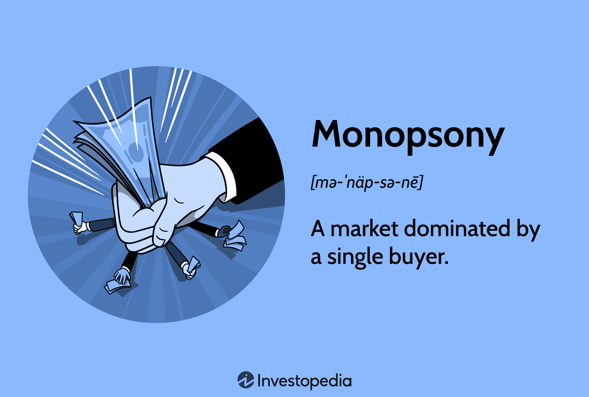

Monopsony, a term originating in economic theory, refers to a market situation where a single buyer substantially controls the market as the major purchaser of goods or services. This control allows the monopsonist to dictate terms to suppliers, potentially leading to lower prices for inputs but also possibly to a reduction in the supply of goods. The significance of monopsony lies in its profound impact on market dynamics, pricing, and the allocation of resources. Unlike monopoly, which involves a single seller, monopsony focuses on the buyer's power, demonstrating how market power can affect both supply and demand sides of the market.

Market power, a critical concept connected to monopsony, refers to the ability of a firm or buyer to influence prices in a market, deviating from the ideal of perfect competition. It is a testament to the capacity of market participants to shape conditions favorable to themselves, thereby affecting overall market efficiency. In a monopsonistic market, this power is manifested in the buyer's ability to influence wages, prices, and the production decisions of suppliers, often resulting in a mismatch between market equilibrium and socially optimal outcomes.

Algorithmic trading represents a contemporary embodiment of economic principles, leveraging advanced mathematical models and algorithms to make trading decisions at speeds beyond human capability. This practice has transformed financial markets, introducing new dimensions of efficiency, speed, and complexity. The use of algorithms in trading highlights the importance of technology-driven market interventions and their ability to influence traditional market structures, raising questions about fairness, transparency, and competitive balance.

The purpose of this article is to explore the intersection of monopsony market power and algorithmic trading, two seemingly disparate yet intricately connected concepts. By examining how algorithmic trading might influence or be influenced by monopsony dynamics, we aim to shed light on the complexities that arise at this intersection. This exploration is crucial for both investors and policymakers as they navigate the evolving landscape of modern markets where traditional economic theories meet cutting-edge technological applications.

Understanding these concepts is vital for investors, who must grasp the nuances of market power to identify investment risks and opportunities accurately. Likewise, policymakers need to appreciate the potential consequences of monopsony power and algorithmic trading on market fairness and efficiency, to devise regulations that ensure equitable and effective market operations. As markets continue to evolve, continuous analysis and understanding are necessary to address the challenges posed by these economic phenomena effectively.

## Table of Contents

## Understanding Monopsony Market Power

Monopsony is a market structure characterized by a single buyer, or a very limited number of buyers, dominating the purchase of goods or services. Unlike monopoly, where there is a single seller, monopsony gives the buyer significant market power to influence prices and other market dynamics. This power often translates into the ability to dictate terms to sellers, who have few alternative buyers for their products or services.

**Examples of Monopsony:**

A classic example of monopsony can be found in certain labor markets where a single employer or a handful of employers dominate job opportunities. Consider a small town where a large corporation provides the majority of employment. Here, the corporation can exert significant pressure on wage levels due to the lack of competition. Another modern example lies within digital platforms that aggregate large pools of sellers and buyers, such as Amazon, which can influence the pricing and contractual terms for the multitude of suppliers on its platform due to its dominant position as a buyer.

**Characteristics of Monopsony Market Power:**

Monopsony differs from monopoly in its function within the market structure. While a monopoly has the power to set prices high due to lack of competition, a monopsony does the opposite—it pushes prices down. The distinction is crucial in understanding how these market structures uniquely impact economic conditions and market dynamics. The unique characteristics of a monopsony include a downward pressure on prices and wages, reduced profitability for sellers, and the potential for reduced supply if prices are driven too low for sustainable production.

**Implications on Pricing and Market Dynamics:**

In a monopsonistic market, the buyer's ability to set prices below competitive levels can lead to inefficiencies and welfare losses. Sellers receive less than the value of their product, and the market may see reduced quality and innovation over time. For example, Amazon's bargaining power allows it to maintain lower prices for consumers, but can squeeze suppliers' margins, sometimes leading to less investment in new products.

The market dynamics in a monopsony can also affect supply chain decisions, with sellers forced to cut costs, which can impact the quality and variety of goods available in the market. Mathematical representation of monopsony can include the Marginal Cost of Labor (MCL) and the Marginal Revenue Product of Labor (MRP), where the monopsonist equates MCL with MRP rather than equating wage rates directly with MRP, as would occur in a competitive market.

**Economic Impact on Consumers and Producers:**

The economic impact of monopsony extends to both consumers and producers. For consumers, the immediate effect can be lower prices; however, in the long run, the reduction in competition can lead to a decrease in consumer choices and potential declines in quality. Producers face pressure on profit margins, which can reduce motivation to innovate or improve products. This dynamic may also lead to job losses or lower wages, as employers exploit their buying power in labor markets.

**Regulatory Perspectives and Potential Interventions:**

Given the effects of monopsonistic power, regulatory authorities focus on maintaining fair competition and equal bargaining positions in such markets. Potential interventions include antitrust regulations that prevent the concentration of buyer power, implementing fair labor standards, and monitoring digital platforms' market behaviors. Regulatory approaches may also involve ensuring transparency and fostering competitive environments to counterbalance monopsony power, thereby protecting both suppliers and consumers.

Understanding monopsony market power is crucial for devising strategies that ensure market efficiency and fairness, as well as for shaping policy interventions that protect the interests of stakeholders in affected markets.

## Economic Theory Behind Market Power

Market power, a central concept in economic theory, refers to the ability of a firm or a group of firms to influence the price and output levels in a market. Unlike in a perfectly competitive market where no single participant has market power, firms with market power can affect prices and thereby manipulate the distribution of resources and economic efficiency. Classical and modern economic theories have deeply explored these dynamics through various models and approaches.

### Classical and Modern Economic Theories

Classical economic theories of market power often focus on the structure of markets and the conduct of firms. The two predominant models used to describe oligopoly behaviors, where market power is evident, are the Cournot and Bertrand models.

- **Cournot Model**: Proposed by Antoine Augustin Cournot in the 19th century, this model considers firms that compete on the quantity of output they decide to produce. In this model, each firm's output decision affects the market price and consequently the other firms' decisions. The model assumes that firms choose their output levels simultaneously and are aware of each other's output. The equilibrium in the Cournot model occurs where each firm chooses the optimal quantity, given the quantities of the competitors, leading to a Nash equilibrium.

$$

Q_i^* = \frac{a - c - \sum_{j \neq i} Q_j^*}{b(n+1)}
$$

where $Q_i^*$ is the equilibrium output for firm $i$, $a$ represents market demand intercept, $c$ is marginal cost, $b$ is the slope of the demand curve, and $n$ is the number of firms in the market. This model demonstrates how firms have substantial control over prices due to limited competition.

- **Bertrand Model**: In contrast to the Cournot model, the Bertrand model, developed by Joseph Bertrand, examines firms that compete on prices rather than quantities. Firms simultaneously set their prices, and consumers choose the firm offering the lower price. Under Bertrand competition with identical products and constant marginal costs, the firm that sets the lower price captures the entire market, leading to a price equal to marginal cost, reminiscent of perfect competition outcomes.

### Role of Market Power in Resource Allocation and Efficiency

Market power can lead to suboptimal resource allocation and reduced efficiency. Firms with significant market power may set prices above marginal cost, leading to allocative inefficiency as the price does not reflect the true cost of production. This can result in a deadweight loss, where potential gains from trade are not realized. Furthermore, productive inefficiency can arise because firms with market power may not minimize production costs due to the lack of competitive pressure.

### Measuring and Quantifying Market Power

Economists have developed several metrics to quantify market power:

- **Herfindahl-Hirschman Index (HHI)**: This index measures market concentration and thus the degree of market power. It is calculated as the sum of the squares of the market shares of all firms in the industry. An industry with an HHI above 2,500 is considered highly concentrated, indicating significant market power.

- **Lerner Index**: This measures the markup of price over marginal cost, providing an indication of a firm's pricing power relative to cost. It is defined as:

$$
L = \frac{P - MC}{P}
$$

where $P$ is the price set by the firm, and $MC$ is the marginal cost. A higher Lerner Index indicates greater market power.

### Case Studies on Market Power

Market power has manifested in various sectors with significant economic outcomes:

- **Technology Giants**: Companies such as Google, Amazon, and Facebook have demonstrated considerable market power through their dominance in digital markets. Their control over data, network effects, and platform gatekeeping have led to regulatory scrutiny worldwide, with debates centering on antitrust implications and consumer welfare.

- **Pharmaceutical Markets**: The pharmaceutical industry often sees instances of market power where firms can patent drugs and enjoy temporary monopolies. This has led to high prices and limited access to essential medicines, prompting regulatory interventions to balance innovation incentives with public health needs.

Understanding market power is crucial for analyzing and regulating industries where such dynamics can impact consumers, producers, and the overall economy. Policymakers and economists continue to study and monitor market structures to ensure competitive practices and economic fairness.

## Algorithmic Trading: A Technological Revolution

Algorithmic trading refers to the use of computer algorithms to execute trading orders on financial markets automatically. These algorithms utilize complex mathematical models and formulas to make high-speed decisions, which are then executed with minimal human intervention. The importance of [algorithmic trading](/wiki/algorithmic-trading) in today's financial markets cannot be overstated, as it accounts for a significant proportion of trading activities, leading to increased market [liquidity](/wiki/liquidity-risk-premium) and decreased transaction costs.

The history of algorithmic trading can be traced back to the 1970s with the advent of electronic trading systems. In the 1980s, more sophisticated computerized trading programs began to emerge, allowing traders to develop and test quantitative models. The subsequent development of financial markets' technological infrastructure in the 1990s paved the way for more advanced algorithmic trading systems. Today, algorithmic trading has evolved into a highly specialized and competitive field, driven by ongoing innovations in [machine learning](/wiki/machine-learning) and [artificial intelligence](/wiki/ai-artificial-intelligence).

The primary benefits of algorithmic trading include speed, efficiency, and enhanced data processing capabilities. Algorithms can analyze vast datasets at lightning speed, enabling traders to react to market changes much faster than human counterparts. Furthermore, algorithmic trading facilitates efficient execution by optimizing order placement, minimizing market impact, and reducing the risk of human error. This process enhances liquidity, making it easier for market participants to enter and [exit](/wiki/exit-strategy) positions.

However, there are potential risks and challenges associated with algorithmic trading. Systems are susceptible to technical failures, and erroneous algorithms can lead to market anomalies, as witnessed during the infamous "Flash Crash" of 2010. Moreover, high-frequency trading, a subset of algorithmic trading, has raised concerns about unfair market advantages and increased market [volatility](/wiki/volatility-trading-strategies).

Successful examples of algorithmic trading strategies include statistical [arbitrage](/wiki/arbitrage), which exploits pricing inefficiencies between correlated securities, and trend-following strategies, which capitalize on market [momentum](/wiki/momentum). Mean reversion strategies, which assume that asset prices will revert to their historical means, are also widely used, providing traders with robust frameworks to leverage market opportunities.

By continually evolving and adapting, algorithmic trading remains a technological revolution, redefining financial markets and challenging traditional trading paradigms.

## Intersection of Monopsony Market Power and Algorithmic Trading

Algorithmic trading, characterized by the use of pre-programmed trading instructions, has significantly transformed the financial markets. Its intersection with monopsony market power raises intriguing dynamics, affecting both economic efficiencies and market competitiveness.

Algorithmic trading can influence monopsony market power by altering the way market participants interact and execute trades. In a monopsony, a market is dominated by a single buyer, which can dictate terms to sellers, often leading to lower prices or wages. Algorithmic trading can exacerbate this power by increasing the efficiency and speed with which these dominant players operate, thus consolidating their influence. For instance, large financial institutions employing sophisticated algorithms can absorb market information faster than smaller players, allowing them to maintain or even enhance their monopsony power.

Real-world instances shed light on such interactions. On digital platforms, like Amazon, which can act as monopsonies for sellers, algorithmic trading tools are utilized to optimize pricing strategies and supplier negotiations. These algorithms analyze vast amounts of data to predict market trends and buyer behavior, providing the platform with a significant advantage in setting terms that sellers must comply with, potentially squeezing their margins.

The regulatory implications of this intersection are profound. As algorithmic trading systems grow more advanced, there is a pressing need for oversight to prevent market abuses and ensure fair competition. Regulatory bodies worldwide, such as the Securities and Exchange Commission (SEC) in the United States, have been considering frameworks to monitor and manage the growth of algorithmic trading to protect market integrity. The adoption of measures like circuit breakers and trading halts can mitigate the risk of automated systems exacerbating monopsony power during periods of market volatility.

Technology, while boosting the capabilities of larger players, can also be a tool for smaller market participants to level the playing field. Open-source trading platforms and advanced analytics are becoming accessible, enabling smaller firms to tap into algorithmic trading benefits. These tools allow them to respond more effectively to market signals, potentially reducing the imbalance created by monopsony conditions.

Looking ahead, several trends at the convergence of monopsony power and algorithmic trading warrant attention. As artificial intelligence and machine learning techniques become more embedded in trading systems, there is potential for a more pronounced imbalance if left unchecked. These technologies could increase the data asymmetry between large and small market participants, necessitating enhanced regulatory frameworks to ensure democratic access to market information and trading technologies. Moreover, the continuous data-vacuuming capabilities of advanced algorithms might lead to novel forms of monopsony power, where data control and processing capabilities become as crucial as capital itself.

In conclusion, while algorithmic trading offers efficiency gains, its intersection with monopsony market power poses challenges that require vigilant regulatory oversight to ensure fair and competitive markets. Understanding these evolving dynamics is vital for investors, policymakers, and stakeholders to foster an equitable economic landscape.

## Conclusion

Monopsony market power, economic theory, and algorithmic trading are integral concepts shaping modern economic environments. A monopsony, characterized by a single buyer dominating the market, significantly impacts how prices and resources are allocated, often leading to less favorable conditions for suppliers. Understanding monopsony is crucial for recognizing asymmetrical power dynamics within markets, an insight that offers potential pathways to achieving economic efficiencies. Similarly, market power—a key focus for economists—determines the extent to which firms can influence prices, affecting overall market dynamics and resource distribution.

Algorithmic trading represents a revolutionary application of economic principles through its capability to execute trades at speeds and volumes unattainable by human traders. This form of trading enhances market efficiency but also introduces risks related to market manipulation and systemic vulnerabilities. The intersection of monopsony market power and algorithmic trading poses unique challenges and opportunities. For instance, algorithmic trading can exacerbate monopsony power by allowing dominant players to consolidate their positions more effectively, potentially widening the gap between large and small market participants.

Investors and policymakers must prioritize understanding these interactions to navigate and strategize effectively within financial markets. Balancing the efficiencies brought by algorithmic trading with the fairness and welfare implications of enhanced monopsony power is crucial. Strategies should focus on fostering competitive markets while protecting smaller players from excessive market power concentration.

The ethical and economic implications at this intersection warrant further exploration, emphasizing the need for robust debate and research. This includes examining regulatory measures, such as antitrust laws and financial regulations, to mitigate potential abuses of market power while enabling the benefits of technological advancements in trading.

Regulatory bodies are urged to act decisively to ensure that the evolution of market dynamics aligns with the principles of fairness and economic stability. Proactive regulatory frameworks should aim to address challenges presented by the convergence of monopsony power and algorithmic trading, ensuring that markets operate in a manner that benefits all stakeholders.

## References & Further Reading

[1]: Robinson, J. (1933). "The Economics of Imperfect Competition." Macmillan. 

[2]: Ashenfelter, O., & Card, D. (2001). ["Did the Elimination of Mandatory Retirement Affect Faculty Retirement?"](https://davidcard.berkeley.edu/papers/mandatory-retirement.pdf) American Economic Review.

[3]: Posner, R. A. (2001). "Antitrust Law, Second Edition." University of Chicago Press.

[4]: Anderson, N., Webber, S., & Wright, J. (2005). ["Economics: Principles, Problems, and Policies."](https://journals.sagepub.com/doi/epdf/10.1177/0170840605051481) McGraw-Hill.

[5]: Latzer, M., & Schmitz, S. W. (Eds.). (2002). "Carl Menger and the Evolution of Payments Systems: From Barter to Electronic Money." Edward Elgar Publishing.

[6]: Edmond, C. (2020). ["The Price Mechanism and Australia's Economic Growth."](https://www.learn-economics.co.uk/The-price-mechanism.html) Reserve Bank of Australia Research Discussion Paper.