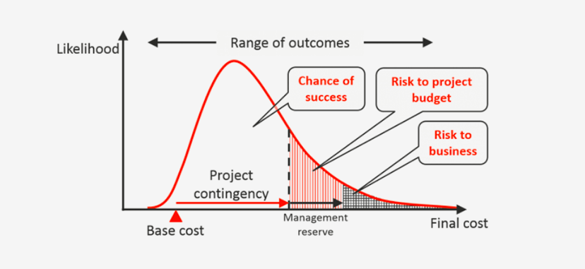

## Table of Contents

## What is Monte Carlo Analysis?

Monte Carlo Analysis is a way to predict what might happen in the future by using math and random numbers. It's like playing a game many times to see all the possible outcomes. Instead of guessing what might happen, you use a computer to run a simulation many times. Each time, the computer uses random numbers to change the conditions a little bit. This helps you see all the different ways things could turn out.

For example, if you want to know how long a project might take, you can use Monte Carlo Analysis. You would tell the computer about all the tasks in the project and how long each one might take. The computer would then run the simulation many times, each time using different times for each task. After running the simulation many times, you can see that the project might finish early, on time, or late. This helps you plan better and be ready for different situations.

## How does Monte Carlo Analysis relate to risk estimation?

Monte Carlo Analysis helps with risk estimation by showing all the possible outcomes of a situation. Instead of just guessing what might happen, you use a computer to run a simulation many times. Each time, the computer changes the conditions a little bit using random numbers. This way, you can see all the different ways things could turn out, which helps you understand the risks better.

For example, if you're trying to figure out the risk of a project going over budget, you can use Monte Carlo Analysis. You would tell the computer about all the costs involved and how much each one might vary. The computer would then run the simulation many times, each time using different costs for each part of the project. After running the simulation, you can see how likely it is that the project will go over budget. This helps you plan better and be ready for different financial situations.

## What are the basic steps involved in performing a Monte Carlo Analysis?

To perform a Monte Carlo Analysis, you start by identifying all the parts of the situation you want to study. For example, if you're looking at a project, you would list all the tasks, how long each might take, and how much each might cost. You also need to know how likely it is that these things will change. This information helps you create a model of your situation on a computer.

Next, you use the computer to run the simulation many times. Each time, the computer uses random numbers to change the conditions a little bit. This could mean changing how long a task takes or how much it costs. After running the simulation many times, you collect all the results. You can then look at these results to see all the different ways things could turn out. This helps you understand the risks and plan better for the future.

In summary, Monte Carlo Analysis involves creating a model of your situation, running many simulations with random changes, and then analyzing the results to understand the possible outcomes and risks. It's a powerful tool that helps you make better decisions by showing you what might happen in different scenarios.

## What types of data are needed for a Monte Carlo Simulation in risk estimation?

To do a Monte Carlo Simulation for risk estimation, you need to gather information about the different parts of your situation. This means you need to know about all the things that could change and affect your outcome. For example, if you're looking at a project, you need to know how long each task might take and how much each task might cost. You also need to understand how likely it is that these things will change. This information helps you build a model on a computer that represents your situation.

Once you have this data, you can run the simulation. The computer will use random numbers to change the values of these parts many times. Each time, it creates a different scenario based on the data you provided. After running the simulation many times, you can look at all the results to see how likely different outcomes are. This helps you see the risks and plan better for the future.

## How can Monte Carlo Analysis help in understanding uncertainties in risk?

Monte Carlo Analysis helps us understand uncertainties in risk by showing us all the different ways things could turn out. When we're not sure about something, like how long a project might take or how much it might cost, we can use Monte Carlo Analysis to see what might happen. It's like playing a game many times, but instead of guessing, we use a computer to run the game over and over again. Each time, the computer changes the conditions a little bit using random numbers. This helps us see all the possible outcomes and understand how likely each one is.

By running the simulation many times, Monte Carlo Analysis gives us a clear picture of the risks involved. We can see how often things go well, how often they go badly, and how often they fall somewhere in between. This helps us plan better because we know what to expect. For example, if we're managing a project, we can see how likely it is that the project will finish on time or go over budget. This way, we can prepare for different situations and make better decisions.

## What are the common software tools used for Monte Carlo Analysis in risk estimation?

There are several software tools that people use for Monte Carlo Analysis in risk estimation. One popular tool is Microsoft Excel, which has add-ins like @RISK and Crystal Ball that make it easier to run Monte Carlo simulations. These add-ins let you enter your data and see the results in a way that's easy to understand. Another tool is MATLAB, which is good for more complex simulations because it can handle a lot of data and do advanced calculations.

Other software tools include Palisade's DecisionTools Suite, which has several programs that work together to help you with risk analysis. This suite includes tools like @RISK and PrecisionTree, which can be used for different parts of your analysis. There's also GoldSim, which is designed for modeling and simulating complex systems, making it useful for understanding risks in projects that have many parts that can change. These tools help you see all the possible outcomes and make better decisions based on the risks involved.

## Can you explain the difference between deterministic and probabilistic approaches in risk estimation using Monte Carlo Analysis?

In risk estimation, a deterministic approach means you use fixed values for all the parts of your situation. For example, if you're looking at a project, you might say that each task will take a certain amount of time and cost a certain amount of money. You don't change these values, so you get one outcome. This approach is simpler, but it doesn't show you how things might change or go wrong. It's like saying, "If everything goes exactly as planned, this is what will happen."

On the other hand, a probabilistic approach, like Monte Carlo Analysis, takes into account that things can change. Instead of using fixed values, you use ranges and probabilities. For example, you might say that a task could take anywhere from 1 to 3 days, and you tell the computer how likely each time is. The computer then runs the simulation many times, each time using different values within those ranges. This way, you see many different outcomes, which helps you understand the risks better. It's like saying, "Things might not go exactly as planned, so let's see all the ways it could turn out."

## How do you interpret the results of a Monte Carlo Simulation for risk assessment?

When you look at the results of a Monte Carlo Simulation for risk assessment, you see a lot of different outcomes. Each time the computer ran the simulation, it used different numbers to change the conditions a little bit. This gives you a big picture of all the ways things could turn out. You can see how often things go well, how often they go badly, and how often they fall somewhere in between. This helps you understand the risks because you can see how likely each outcome is.

For example, if you're looking at a project, the results might show you that there's a 70% chance the project will finish on time, but a 30% chance it will be late. You can also see how often the project might go over budget and by how much. By looking at all these different outcomes, you can make better plans. You know what to expect and can be ready for different situations. This way, you can manage the risks better and make decisions that help the project succeed.

## What are some limitations of using Monte Carlo Analysis in risk estimation?

Monte Carlo Analysis is a powerful tool, but it has some limitations. One big limitation is that it depends a lot on the information you put into it. If your data about how long tasks might take or how much they might cost is not accurate, the results of the simulation will also be wrong. It's like trying to predict the weather with a broken thermometer. If the information you start with is not good, the predictions won't be good either.

Another limitation is that Monte Carlo Analysis can be complicated and take a lot of time to set up and run. You need to know how to use the software and understand how to make a good model of your situation. This can be hard, especially if you're not used to working with computers or math. Also, running the simulation many times can take a long time, especially if you're looking at a big project with a lot of parts that can change. This means you need to plan ahead and give yourself enough time to do the analysis properly.

## How can Monte Carlo Analysis be integrated with other risk management techniques?

Monte Carlo Analysis can be used together with other risk management techniques to make better plans and decisions. For example, you can use it with qualitative risk analysis, which is when you talk about risks in a more general way. You might have meetings where people share their thoughts on what could go wrong and how bad it could be. Then, you can use Monte Carlo Analysis to add numbers to these ideas. It helps you see how likely different risks are and how much they might affect your project. This way, you combine the big picture from qualitative analysis with the detailed numbers from Monte Carlo Analysis.

Another way to use Monte Carlo Analysis with other techniques is by combining it with decision tree analysis. Decision trees are like maps that show you different choices and what might happen if you choose each one. You can use Monte Carlo Analysis to add more details to these maps. For each choice on the decision tree, you can run a Monte Carlo Simulation to see all the possible outcomes and how likely they are. This helps you make better decisions because you can see the risks and rewards for each choice more clearly. By using Monte Carlo Analysis with other methods, you get a fuller picture of the risks and can plan more effectively.

## What advanced statistical methods can enhance the accuracy of Monte Carlo Simulations in risk estimation?

To make Monte Carlo Simulations more accurate for risk estimation, you can use something called variance reduction techniques. These methods help make the results of the simulation more reliable by reducing the randomness in the outcomes. One common technique is called antithetic variates, where you run pairs of simulations with opposite random numbers. This helps cancel out some of the randomness and gives you a clearer picture of the risks. Another technique is called control variates, where you compare your simulation results to known values to adjust and improve the accuracy of your outcomes.

Another advanced method is using Bayesian [statistics](/wiki/bayesian-statistics) with Monte Carlo Simulations. Bayesian methods let you update your predictions as you get new information. This is helpful because you can keep improving your risk estimates as you learn more about your project. For example, if you start seeing that some tasks are taking longer than expected, you can use Bayesian updating to adjust your simulation and get a better idea of how the project will turn out. By combining these advanced statistical methods with Monte Carlo Simulations, you can make more accurate and useful predictions about risks.

## Can you provide a case study where Monte Carlo Analysis significantly improved risk estimation outcomes?

In a construction project, a company used Monte Carlo Analysis to better understand the risks of finishing on time and staying within budget. They had a big project with many tasks, and each task could take a different amount of time and cost different amounts of money. By using Monte Carlo Analysis, they ran the simulation many times, each time using different times and costs for each task. This showed them that there was a 60% chance the project would finish on time and an 80% chance it would stay within budget. With this information, they could plan better. They decided to add more workers to the tasks that were most likely to cause delays, which helped them finish the project on time and save money.

Another case study comes from the financial industry, where a bank used Monte Carlo Analysis to estimate the risk of loan defaults. They wanted to know how likely it was that people would not be able to pay back their loans. They used Monte Carlo Analysis to run many simulations, each time changing the chances of people defaulting on their loans a little bit. The results showed them that there was a 10% chance of a high number of defaults, which could hurt the bank's profits. With this information, the bank decided to be more careful about who they gave loans to and set aside more money to cover possible losses. This helped them manage the risk better and protect their business.

## What are the benefits of using Monte Carlo in risk management?

Monte Carlo methods offer substantial advantages in risk management by providing a comprehensive perspective on potential risks that can significantly affect trading outcomes. By utilizing stochastic processes to simulate a multitude of potential market scenarios, Monte Carlo analysis allows traders to anticipate the impact of extreme market events. This method enhances understanding of the risk landscape by exploring a wide array of possible future states, thus unveiling scenarios that deterministic models might overlook.

One of the primary benefits of Monte Carlo simulations is that they aid traders in establishing realistic expectations for profit and loss. By modeling thousands of potential market trajectories, traders can gain insights into the distribution of potential returns and risks. This approach facilitates more informed decision-making about strategy adjustments and capital allocation. For example, traders can use Monte Carlo simulations to estimate Value at Risk (VaR) or Conditional Value at Risk (CVaR), providing quantitative measures of potential losses at a given confidence level. These estimates can be critical for setting appropriate stop losses or determining the amount of risk capital needed.

$$
\text{VaR} = \text{Quantile}(\alpha, \text{Loss Distribution})
$$

where $\alpha$ represents the confidence level, and the Loss Distribution is derived from the Monte Carlo simulation results.

Monte Carlo methods are invaluable for simulating different trading scenarios by altering variables such as [volatility](/wiki/volatility-trading-strategies), interest rates, and price movements. Through these simulations, traders can test their strategies against a wide range of hypothetical market conditions. For example, a trader might simulate a bull market, bear market, or periods of high volatility to understand how different market dynamics impact strategy performance. These insights help traders optimize their strategies, ensuring robustness and adaptability to diverse market conditions.

Overall, Monte Carlo techniques enable traders to navigate market uncertainties with greater confidence, promoting a proactive approach to risk management. As computational power and technology continue to advance, the relevance and application of Monte Carlo methods in [algorithmic trading](/wiki/algorithmic-trading) and risk management are expected to grow, further enhancing their role in fostering stable financial returns.

## References & Further Reading

[1]: [Bergstra, J., Bardenet, R., Bengio, Y., & Kégl, B. (2011). "Algorithms for Hyper-Parameter Optimization."](https://papers.nips.cc/paper/4443-algorithms-for-hyper-parameter-optimization) Advances in Neural Information Processing Systems 24.

[2]: ["Advances in Financial Machine Learning"](https://www.amazon.com/Advances-Financial-Machine-Learning-Marcos/dp/1119482089) by Marcos Lopez de Prado

[3]: ["Evidence-Based Technical Analysis: Applying the Scientific Method and Statistical Inference to Trading Signals"](https://www.amazon.com/Evidence-Based-Technical-Analysis-Scientific-Statistical/dp/0470008741) by David Aronson

[4]: ["Machine Learning for Algorithmic Trading"](https://github.com/stefan-jansen/machine-learning-for-trading) by Stefan Jansen

[5]: ["Quantitative Trading: How to Build Your Own Algorithmic Trading Business"](https://www.amazon.com/Quantitative-Trading-Build-Algorithmic-Business/dp/1119800064) by Ernest P. Chan