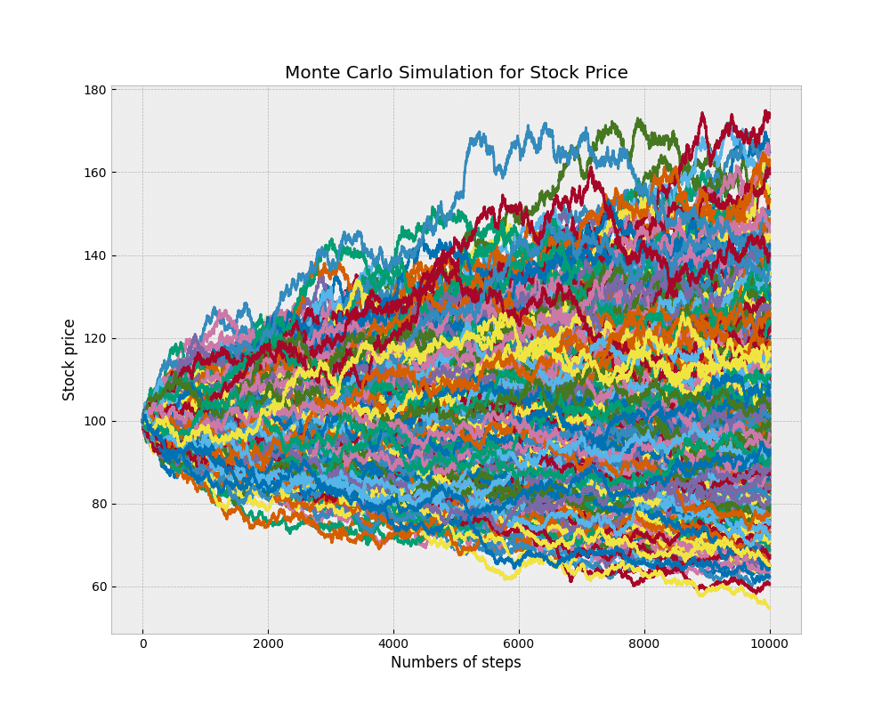

## Table of Contents

## What are Monte Carlo methods?

Monte Carlo methods are a type of mathematical technique used to solve problems by using random sampling. Imagine you want to know the average height of all the trees in a huge forest. Instead of measuring every single tree, you could randomly pick a few trees, measure their heights, and then use that information to estimate the average height of all the trees. This is similar to how Monte Carlo methods work; they use random samples to make predictions or solve problems.

These methods are especially useful for problems that are too complex or too difficult to solve exactly with traditional math. For example, they can be used in finance to predict how stock prices might change in the future, or in physics to understand how particles might behave in a system. By running many simulations with random inputs, Monte Carlo methods can provide a good approximation of what might happen in real life, even when the exact solution is hard to find.

## How do Monte Carlo methods apply to option pricing?

Monte Carlo methods help figure out the price of options, which are financial contracts that give you the right to buy or sell something at a set price in the future. To do this, they run many simulations of how the price of the underlying asset, like a stock, might change over time. Each simulation uses random numbers to mimic how the stock price might go up or down. By running lots of these simulations, Monte Carlo methods can predict a range of possible future prices for the stock.

Once we have all these possible future prices, we can see how much the option would be worth in each scenario. For example, if it's a call option, we look at how much the stock price at the end of each simulation is above the option's strike price. We then average all these values to get an estimate of the option's price. This approach is especially useful for complex options where traditional math formulas might not work well, because Monte Carlo methods can handle many different variables and scenarios.

## What is an option and why is pricing it important?

An option is a kind of financial agreement that gives you the right, but not the obligation, to buy or sell something at a certain price before a certain date. Imagine you have the right to buy a toy for $10 even if the price goes up to $15. That's what an option does, but with things like stocks or commodities. There are two main types: a call option lets you buy, and a put option lets you sell.

Pricing an option is important because it helps you figure out how much you should pay for it. If you know the option's price, you can decide if it's a good deal or not. It's like knowing if that toy option is worth it at the price you're being asked to pay. Getting the price right is tricky because it depends on many things, like how much the stock price might change, how long until the option expires, and even interest rates. That's why methods like Monte Carlo are used to help estimate the right price.

## Can you explain the basic steps of using Monte Carlo simulation for option pricing?

To use Monte Carlo simulation for option pricing, you start by making a model of how the price of the stock might change over time. This model uses random numbers to guess how the stock price might go up or down. You run this model many times, each time starting with the current stock price and letting it change randomly until the option's expiration date. Each run gives you a different possible future price for the stock.

After you've run the model many times, you look at what the stock price is at the end of each run. If you have a call option, you figure out how much the stock price is above the option's strike price for each run. If it's a put option, you look at how much it's below the strike price. You then average all these values to get an estimate of what the option might be worth. This average gives you a good guess of the option's price, which can help you decide if it's a good deal or not.

## What are the advantages of using Monte Carlo methods for option pricing?

One big advantage of using Monte Carlo methods for option pricing is that they can handle really complex situations. Imagine you want to price an option that depends on many things, like how much a stock price might jump around, or even how interest rates might change. Traditional math formulas might struggle with all these variables, but Monte Carlo methods can easily include them all. They do this by running lots of random simulations, which means they can deal with all sorts of tricky scenarios that other methods can't.

Another advantage is that Monte Carlo methods are very flexible. If you want to change something in your model, like how you think the stock price might behave, you can easily adjust the simulation and get new results. This makes it great for testing different ideas and seeing how they affect the option's price. Plus, because Monte Carlo methods use random sampling, they can give you a good estimate of the option's price even if you don't know everything perfectly, which is often the case in the real world.

## What are the limitations or challenges of Monte Carlo methods in option pricing?

One challenge with using Monte Carlo methods for option pricing is that they can take a long time to run. Because these methods rely on running lots of random simulations, the more simulations you do, the more accurate your estimate of the option's price becomes. But running thousands or even millions of simulations can be slow, especially if you're trying to price a lot of options or if your model is very complicated. This can be a problem if you need quick answers, like in fast-moving financial markets.

Another limitation is that the accuracy of Monte Carlo methods depends on how good your model is. If your model of how the stock price changes is wrong, then your estimate of the option's price will be off too. This means you need to be careful about the assumptions you make in your model, like how much the stock price might jump around or how interest rates might change. Getting these assumptions right can be tricky, and if they're wrong, it can lead to big mistakes in your option pricing.

## How does the choice of random number generation affect Monte Carlo simulations for option pricing?

The choice of random number generation is really important for Monte Carlo simulations used in option pricing. These simulations work by guessing how a stock price might change over time using random numbers. If the random numbers aren't good, the guesses won't be good either. For example, if the random numbers are too predictable or not spread out enough, the simulation might not show all the different ways the stock price could go. This can make the option price estimate less accurate.

To make sure the random numbers are good, people often use special computer programs called random number generators. These programs are designed to create numbers that are truly random and cover a wide range of possibilities. Using a good random number generator helps make the Monte Carlo simulation more reliable, which means the option price estimate will be closer to the real value. So, choosing the right random number generator is a big deal for getting accurate results in option pricing.

## What is variance reduction and how can it improve Monte Carlo option pricing?

Variance reduction is a way to make Monte Carlo simulations more accurate without running more simulations. Imagine you're trying to guess the average height of trees in a forest by measuring a few trees. If you pick trees randomly, your guess might be off because you might accidentally pick mostly tall or mostly short trees. Variance reduction techniques help you pick trees in a smarter way, so your guess is closer to the real average even if you measure fewer trees.

In option pricing, variance reduction can make your estimate of the option's price more reliable. For example, one common technique is called antithetic variates. This means you run two simulations at the same time, but one goes up when the other goes down. By averaging the results of these opposite simulations, you can cancel out some of the randomness and get a better estimate of the option's price. This way, you can get a more accurate price without needing to run as many simulations, which saves time and makes your pricing more efficient.

## How do you handle path-dependent options using Monte Carlo methods?

Path-dependent options are a bit trickier to price with Monte Carlo methods because their value depends not just on where the stock price ends up, but on how it got there. Imagine you have an option that pays out based on whether the stock price ever hit a certain level during its journey. To price this kind of option, you need to keep track of the stock price at every step of your simulation, not just at the end. Each run of the simulation gives you a different path the stock price could take, and you check if that path meets the conditions of the option.

To make sure you get a good estimate of the option's price, you run lots of these simulations. Each time, you calculate how much the option would be worth based on the path the stock price took. Then, you average all these values to get your final estimate of the option's price. This way, Monte Carlo methods can handle the complexity of path-dependent options by considering all the different ways the stock price might move over time.

## What role does the risk-neutral valuation play in Monte Carlo option pricing?

Risk-neutral valuation is a key part of Monte Carlo option pricing. It's a way of figuring out how much an option is worth by pretending that everyone is okay with taking risks. In a risk-neutral world, people don't care if the stock price goes up or down. They just look at the average of all the possible outcomes. When you use Monte Carlo simulations, you run lots of different scenarios of how the stock price might change. Risk-neutral valuation helps you calculate the average value of the option from all these scenarios, making it easier to find a fair price.

Using risk-neutral valuation in Monte Carlo methods means you can focus on the math of the option's payoff without worrying about how much people like or dislike risk. You use the risk-free interest rate, which is the rate you get from super safe investments like government bonds, to discount the future payoffs back to today's value. This way, even though the stock price moves randomly in your simulations, the final price you get for the option is based on a solid, risk-free foundation. It's like using a steady anchor to keep your pricing estimates reliable and trustworthy.

## How can one implement a Monte Carlo simulation for pricing exotic options?

To price exotic options using Monte Carlo simulation, you start by building a model of how the stock price might change over time. This model uses random numbers to guess different paths the stock price could take until the option expires. Exotic options are trickier because their value depends on more than just the final stock price; it might depend on whether the stock ever hit a certain level or how much it moved around. So, in your simulation, you need to keep track of the stock price at every step. You run many simulations, each time checking if the stock's path meets the exotic option's conditions. At the end of each simulation, you figure out how much the option would be worth based on that path.

After running lots of these simulations, you take the average of all the option values to get your estimate of the exotic option's price. This average gives you a good guess of what the option might be worth in the real world. The key to getting a good estimate is running enough simulations to cover all the different ways the stock price could move. Using techniques like variance reduction can help make your estimate more accurate without needing to run as many simulations. This way, even though exotic options are complex, Monte Carlo simulation can handle them by considering all the different paths the stock price might take.

## What are some advanced techniques for improving the efficiency of Monte Carlo methods in option pricing?

One advanced technique for making Monte Carlo methods more efficient in option pricing is called variance reduction. This technique helps you get a more accurate estimate of the option's price without running more simulations. Imagine you're trying to guess the average height of trees in a forest. If you pick trees randomly, your guess might be off because you might accidentally pick mostly tall or mostly short trees. Variance reduction techniques help you pick trees in a smarter way, so your guess is closer to the real average even if you measure fewer trees. For example, using antithetic variates means you run two simulations at the same time, but one goes up when the other goes down. By averaging the results of these opposite simulations, you can cancel out some of the randomness and get a better estimate of the option's price.

Another technique is called importance sampling. This method focuses on the parts of the simulation that matter most for the option's price. Imagine you're looking for a specific type of tree in the forest. Instead of searching the whole forest randomly, you could focus on areas where that type of tree is more likely to be found. In option pricing, importance sampling helps you run simulations that are more likely to show the stock price paths that affect the option's value the most. This way, you can get a good estimate of the option's price with fewer simulations, making the process faster and more efficient.

## How can Monte Carlo Simulations be applied to option pricing?

Monte Carlo simulations have become an integral tool for estimating the expected value of options by generating a multitude of random scenarios. These simulations account for crucial variables such as [volatility](/wiki/volatility-trading-strategies) and interest rates, allowing for a comprehensive analysis of potential option pricing outcomes. 

At the core of Monte Carlo simulations lies the ability to model uncertainty and randomness in financial markets. The process begins by simulating potential future asset prices. One common technique involves modeling asset prices using a geometric Brownian motion, which is expressed mathematically as:

$$
S(t) = S_0 \cdot \exp\left((\mu - 0.5 \cdot \sigma^2) \cdot t + \sigma \cdot W(t)\right)
$$

where:
- $S(t)$ is the asset price at time $t$,
- $S_0$ represents the initial asset price,
- $\mu$ denotes the drift or expected return of the asset,
- $\sigma$ symbolizes the volatility of the asset,
- $W(t)$ is a Wiener process or standard Brownian motion. 

For option pricing, financial professionals employ this simulation to evaluate the payoff for different scenarios at option maturity. The expected payoff of the option is calculated by averaging the payoffs across all simulated scenarios, subsequently discounting it back to its present value using the risk-free rate. The flexibility of Monte Carlo simulations makes them especially useful for modeling European options, which can only be exercised at expiration, as well as more intricate exotic options that have various path-dependent features.

Furthermore, Monte Carlo simulations are adept at handling high-dimensional problems and complex models, making them suitable for various option types. For instance, barrier options, where payoff depends on underlying asset price reaching a certain barrier level, or Asian options, where payoff is determined by averaging the underlying asset price over a predefined period, both can be efficiently priced using these methods.

The application of Monte Carlo simulations extends beyond pricing to include a strategic framework for risk assessment and opportunity identification. Financial professionals utilize simulations to model different market scenarios, thereby gaining insights into potential risks and market opportunities. This enhances investment strategies by providing a clearer understanding of the range of possible outcomes and their probabilities, enabling informed decision-making.

To implement a basic Monte Carlo simulation for option pricing in Python, a practitioner might employ the following code:

```python
import numpy as np
import math

# Function to simulate European Call Option Pricing using Monte Carlo
def monte_carlo_option_pricing(S0, K, T, r, sigma, num_simulations):
    np.random.seed(0)  # For reproducibility
    payoff_sum = 0

    # Simulate random asset prices and calculate payoff
    for _ in range(num_simulations):
        # Generate a random standard normally distributed number
        Z = np.random.standard_normal()
        # Calculate asset price at maturity
        ST = S0 * math.exp((r - 0.5 * sigma ** 2) * T + sigma * math.sqrt(T) * Z)
        # Calculate payoff for call option
        payoff_sum += max(ST - K, 0)

    # Calculate the present value of the expected payoff
    option_price = (payoff_sum / num_simulations) * math.exp(-r * T)
    return option_price

# Example parameters
S0 = 100  # Initial asset price
K = 105  # Strike price
T = 1    # Time to maturity in years
r = 0.05  # Risk-free interest rate
sigma = 0.2  # Volatility
num_simulations = 10000  # Number of simulations

# Calculate and print option price
option_price = monte_carlo_option_pricing(S0, K, T, r, sigma, num_simulations)
print(f"The estimated option price is: {option_price:.2f}")
```

This code demonstrates a practical approach for financial professionals to leverage Monte Carlo simulations, allowing for the estimation of option prices with a high degree of flexibility and adaptability to diverse financial instruments.

## What is the Mathematics Behind Monte Carlo Methods for Option Pricing?

Monte Carlo methods are fundamentally grounded in stochastic processes, probability theory, and numerical analysis, enabling them to effectively model the uncertainty and complexity inherent in option pricing. At the core of these methods are stochastic processes such as Brownian motion and random walks. 

Brownian motion, or the Wiener process, is a continuous-time stochastic process whose path is continuous yet nowhere differentiable. It is a cornerstone in the mathematical modeling of financial markets, capturing the random behavior of asset prices over time. The evolution of a stock price $S(t)$ under Brownian motion can be described by the stochastic differential equation (SDE):

$$

dS(t) = \mu S(t) dt + \sigma S(t) dW(t) 
$$

where:
- $\mu$ is the drift term representing the average rate of return,
- $\sigma$ is the volatility representing the uncertainty or risk associated with the asset,
- $dW(t)$ is an increment of a Wiener process or standard Brownian motion.

Monte Carlo methods utilize such equations to simulate numerous possible future price paths of the underlying asset. Each path represents a potential future state of the market, calculated by discretizing the SDE over small time intervals $\Delta t$. The standard approach is to approximate the process using an Euler-Maruyama method to solve the SDE:

$$

S(t+\Delta t) = S(t) + \mu S(t) \Delta t + \sigma S(t) \epsilon \sqrt{\Delta t} 
$$

where $\epsilon$ is a standard normal random variable, simulating the randomness of price changes.

Further, Monte Carlo simulations often rely on random walks, which are discrete stochastic processes resembling paths consisting of a succession of random steps. In option pricing, a random walk can represent the unpredictable path a financial asset might take. These paths provide the necessary statistical sampling required for estimating the expected payoff of an option at maturity.

The next step is calculating the payoff for each simulated path. For a European call option, the payoff is $\max(S(T) - K, 0)$, where $S(T)$ is the simulated stock price at maturity and $K$ is the strike price. Averaging the discounted payoffs over all simulated paths, with the discount [factor](/wiki/factor-investing) accounting for the risk-free [interest rate](/wiki/interest-rate-trading-strategies) $r$ over time $T$, provides the estimated option price:

$$

C = \frac{1}{N} \sum_{i=1}^{N} e^{-rT} \max(S_i(T) - K, 0) 
$$

where $N$ is the number of simulated paths.

The accuracy of Monte Carlo simulations stems from the law of large numbers, which ensures that as the number of simulations increases, the estimated option price converges to its true value. Moreover, employing variance reduction techniques, such as antithetic variates or control variates, can enhance the efficiency of the simulation process by reducing the variance of the estimated option price without increasing the number of simulations.

In summary, the combination of stochastic calculus, numerical methods, and statistical sampling underpins the application of Monte Carlo methods to option pricing. These mathematical foundations allow for the effective modeling of real-world market conditions, delivering robust and precise valuations of financial derivatives amidst inherent market uncertainties.

## What are the advantages and limitations of Monte Carlo methods?

Monte Carlo methods offer significant advantages in modeling complex, high-dimensional problems, making them a valuable tool in option pricing. One of the primary benefits is their flexibility in handling a wide range of option types, including European, American, and exotic options. By simulating a vast array of possible price paths for underlying assets, Monte Carlo simulations provide a robust mechanism for estimating expected option values and assessing the risk associated with financial instruments. This adaptability is particularly beneficial in environments characterized by high volatility and unpredictability, where deterministic methods may fall short.

A notable strength of Monte Carlo methods is their ability to model problems described by intricate mathematical models. With the inclusion of stochastic differential equations, Monte Carlo simulations can capture the random behavior of asset prices over time. The expected payoff of an option can be determined using the formula:

$$

C = e^{-rT} \cdot \frac{1}{N} \sum_{i=1}^{N} \text{Payoff}(S_i)
$$

where $C$ is the option price, $r$ is the risk-free interest rate, $T$ is the time to expiration, $N$ is the number of simulations, and $\text{Payoff}(S_i)$ represents the payoff from the $i$-th simulated path.

While Monte Carlo methods are advantageous for their accuracy and flexibility, they also have limitations. One of the significant challenges is their computational intensity. Running simulations may require substantial processing power, particularly when a high number of scenarios are generated to achieve precise results. This computational demand can become a bottleneck, especially when pricing options in real-time or simulating complex models over extensive periods.

Another limitation is the need for a deep understanding of the mathematical foundation underlying Monte Carlo simulations. Financial professionals must be proficient in probability theory, stochastic calculus, and numerical methods to implement and interpret Monte Carlo models effectively. Misunderstandings or incorrect parameter settings can lead to inaccurate pricing and risk assessments, making expertise in these areas crucial.

Moreover, Monte Carlo methods often require careful calibration and validation to ensure reliability and realism in their predictions. The randomness inherent in simulation means that results can vary significantly, emphasizing the importance of convergence tests, variance reduction techniques, and using a sufficiently large number of simulations to achieve stable and accurate results.

In conclusion, while Monte Carlo methods provide powerful tools for option pricing with high flexibility, accuracy, and versatility, their effective use demands a balanced consideration of computational resources and mathematical expertise. As computational technology advances, the limitations related to resource demands may diminish, further enhancing the practicality and precision of Monte Carlo simulations in financial modeling.

## References & Further Reading

[1]: Boyle, P., Broadie, M., & Glasserman, P. (1997). ["Monte Carlo Methods for Security Pricing."](https://www.sciencedirect.com/science/article/pii/S0165188997000286) Journal of Economic Dynamics and Control, 21(8-9), 1267-1321.

[2]: Glasserman, P. (2004). ["Monte Carlo Methods in Financial Engineering."](https://link.springer.com/book/10.1007/978-0-387-21617-1) Springer.

[3]: Clewlow, L., & Strickland, C. (1998). ["Implementing Derivative Models."](https://www.wiley.com/en-us/Implementing+Derivative+Models-p-9780471966517) Wiley.

[4]: Jäckel, P. (2002). ["Monte Carlo Methods in Finance."](https://www.amazon.com/Monte-Carlo-Methods-Finance-Jaeckel/dp/047149741X) Wiley.

[5]: Stentoft, L. (2004). ["American Option Pricing Using LSM Monte-Carlo."](https://moscow.sci-hub.se/3135/e617c68eb6b4e64ed8dea0442fb8865e/stentoft2004.pdf?download=true) Review of Derivatives Research, 7, 129-168.