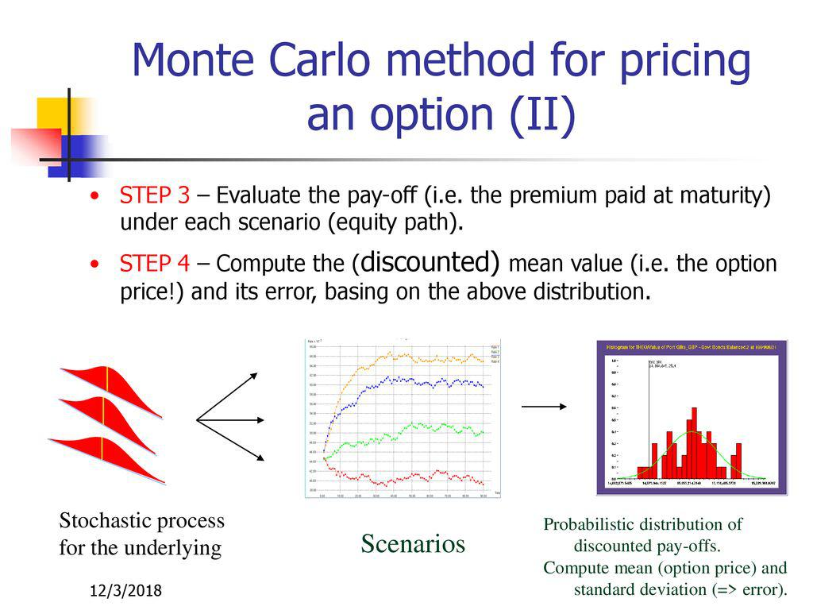

Monte Carlo methods have become fundamental to the financial sector, particularly in option pricing within algorithmic trading. These methods, rooted in probability and statistics, provide sophisticated tools for simulating various scenarios in the pricing of options. This article examines how Monte Carlo simulations can be applied to option pricing, exploring their mathematical foundation, advantages, limitations, and real-world applications. 

The complexity inherent in option pricing underscores the necessity for robust techniques like Monte Carlo methods. Options, as derivatives, offer the right but not the obligation to buy or sell an underlying asset, which introduces challenges in determining their correct price. Several factors such as market volatility, interest rates, and time until expiration influence pricing, necessitating the use of advanced models to capture these dynamics accurately. Understanding these complexities enhances the appreciation of Monte Carlo methods as they allow for the detailed simulation of possible future states of the world, contributing to more precise options pricing.



The article is designed to serve as a comprehensive guide for financial professionals aiming to harness Monte Carlo methods for enhancing the accuracy of options pricing. By exploring the mathematical rigor behind these methods and their practical applications, readers can gain valuable insights into strengthening their financial decision-making and risk management strategies.

## Table of Contents

## Understanding the Complexity of Option Pricing

Option pricing is a fundamental aspect of financial risk management, derivatives trading, and portfolio optimization. Options, which are financial derivatives, confer the right but not the obligation to buy or sell an underlying asset at a predetermined price before a specified expiration date. This characteristic inherently complicates the pricing process due to several influencing factors such as the volatility of the underlying asset, prevailing interest rates, and the time remaining until expiration.

Volatility plays a significant role in option pricing as it measures the uncertainty or the expected fluctuation in the price of the underlying asset. Higher volatility typically increases the potential for profit from the option, thereby elevating its price. Similarly, interest rates affect option pricing by influencing the present value of the exercise price. Generally, higher interest rates increase the call option prices and decrease put option prices, due to the cost of holding the underlying asset and the time value of money considerations.

The time to expiration is another critical factor. Options with longer durations provide a greater chance for the underlying asset to move favorably, thus increasing the option's value. This relationship is often depicted through the time decay concept or theta, which measures the rate of decline in the option's value as it approaches expiration.

Monte Carlo methods provide a powerful framework to manage these complexities in option pricing. These methods utilize random sampling and statistical modeling to simulate a wide range of possible outcomes for the underlying asset’s price over time. By conducting numerous simulations, Monte Carlo methods enable the estimation of the expected value of options with considerable precision. This stochastic approach considers the random nature of market movements and delivers insights into potential market scenarios, thereby aiding in informed financial decision-making.

For example, suppose we wish to price a European-style call option using a simple Monte Carlo simulation in Python. The code snippet below demonstrates this process:

```python
import numpy as np

# Parameters
S0 = 100  # Initial stock price
K = 105  # Strike price
T = 1.0  # Time to expiration in years
r = 0.05  # Risk-free rate
sigma = 0.2  # Volatility
num_simulations = 10000

# Monte Carlo simulation
np.random.seed(42)  # For reproducibility
Z = np.random.standard_normal(num_simulations)
ST = S0 * np.exp((r - 0.5 * sigma**2) * T + sigma * np.sqrt(T) * Z)
payoff = np.maximum(ST - K, 0)  # Call option payoff
option_price = np.exp(-r * T) * np.mean(payoff)

print("Monte Carlo estimated option price:", option_price)
```

In essence, Monte Carlo simulations offer robust solutions to model complex scenarios and improve accuracy in estimating option values. By accounting for various pricing factors and providing a flexible approach to accommodate different types of options, they have become indispensable tools for financial professionals aiming to optimize investment strategies and assess risks appropriately.

## A Brief History of Monte Carlo Methods

Monte Carlo methods trace their origins to the 1940s, when physicists such as Stanislaw Ulam and John von Neumann conceptualized them during the development of atomic weapons at the Los Alamos National Laboratory. These methods gained their name due to their reliance on randomness and probability, akin to the random outcomes in games of chance at the Monte Carlo Casino in Monaco. The initial application of Monte Carlo methods was in physics and engineering fields, such as neutron diffusion and statistical mechanics, where they were employed to simulate and understand complex systems that would be analytically intractable.

The essence of Monte Carlo methods lies in their use of random sampling to solve problems that might be deterministic in principle. By generating large numbers of random samples, these methods allow practitioners to estimate solutions to complex integrals and differential equations, making them particularly powerful in scenarios where other numerical methods fail or become inefficient.

Over the decades, the robustness and flexibility of Monte Carlo methods have made them attractive to various fields beyond physics, notably in finance. Their adoption within financial markets has seen significant growth due to their capacity to model and solve high-dimensional problems associated with option pricing. This includes their ability to simulate the evolution of stock prices, interest rates, and other variables influencing financial derivatives.

By leveraging Monte Carlo methods, financial analysts can tackle the intricacies of option pricing, which involves numerous uncertain factors such as the underlying asset's [volatility](/wiki/volatility-trading-strategies), time to maturity, and prevailing interest rates. The methods' versatility enables accurate estimations of option values across a range of scenarios, including those involving path-dependent or exotic options, which are often too complex for closed-form analytical solutions.

In summary, Monte Carlo methods have evolved from their original applications in physics and engineering to become a vital tool in the financial sector. Their ability to handle uncertainty and complexity ensures they remain integral to option pricing and risk management in modern finance.

## How to Apply Monte Carlo Simulations to Option Pricing

Monte Carlo simulations have become an integral tool for estimating the expected value of options by generating a multitude of random scenarios. These simulations account for crucial variables such as volatility and interest rates, allowing for a comprehensive analysis of potential option pricing outcomes. 

At the core of Monte Carlo simulations lies the ability to model uncertainty and randomness in financial markets. The process begins by simulating potential future asset prices. One common technique involves modeling asset prices using a geometric Brownian motion, which is expressed mathematically as:

$$
S(t) = S_0 \cdot \exp\left((\mu - 0.5 \cdot \sigma^2) \cdot t + \sigma \cdot W(t)\right)
$$

where:
- $S(t)$ is the asset price at time $t$,
- $S_0$ represents the initial asset price,
- $\mu$ denotes the drift or expected return of the asset,
- $\sigma$ symbolizes the volatility of the asset,
- $W(t)$ is a Wiener process or standard Brownian motion. 

For option pricing, financial professionals employ this simulation to evaluate the payoff for different scenarios at option maturity. The expected payoff of the option is calculated by averaging the payoffs across all simulated scenarios, subsequently discounting it back to its present value using the risk-free rate. The flexibility of Monte Carlo simulations makes them especially useful for modeling European options, which can only be exercised at expiration, as well as more intricate exotic options that have various path-dependent features.

Furthermore, Monte Carlo simulations are adept at handling high-dimensional problems and complex models, making them suitable for various option types. For instance, barrier options, where payoff depends on underlying asset price reaching a certain barrier level, or Asian options, where payoff is determined by averaging the underlying asset price over a predefined period, both can be efficiently priced using these methods.

The application of Monte Carlo simulations extends beyond pricing to include a strategic framework for risk assessment and opportunity identification. Financial professionals utilize simulations to model different market scenarios, thereby gaining insights into potential risks and market opportunities. This enhances investment strategies by providing a clearer understanding of the range of possible outcomes and their probabilities, enabling informed decision-making.

To implement a basic Monte Carlo simulation for option pricing in Python, a practitioner might employ the following code:

```python
import numpy as np
import math

# Function to simulate European Call Option Pricing using Monte Carlo
def monte_carlo_option_pricing(S0, K, T, r, sigma, num_simulations):
    np.random.seed(0)  # For reproducibility
    payoff_sum = 0

    # Simulate random asset prices and calculate payoff
    for _ in range(num_simulations):
        # Generate a random standard normally distributed number
        Z = np.random.standard_normal()
        # Calculate asset price at maturity
        ST = S0 * math.exp((r - 0.5 * sigma ** 2) * T + sigma * math.sqrt(T) * Z)
        # Calculate payoff for call option
        payoff_sum += max(ST - K, 0)

    # Calculate the present value of the expected payoff
    option_price = (payoff_sum / num_simulations) * math.exp(-r * T)
    return option_price

# Example parameters
S0 = 100  # Initial asset price
K = 105  # Strike price
T = 1    # Time to maturity in years
r = 0.05  # Risk-free interest rate
sigma = 0.2  # Volatility
num_simulations = 10000  # Number of simulations

# Calculate and print option price
option_price = monte_carlo_option_pricing(S0, K, T, r, sigma, num_simulations)
print(f"The estimated option price is: {option_price:.2f}")
```

This code demonstrates a practical approach for financial professionals to leverage Monte Carlo simulations, allowing for the estimation of option prices with a high degree of flexibility and adaptability to diverse financial instruments.

## The Mathematics Behind Monte Carlo Methods for Option Pricing

Monte Carlo methods are fundamentally grounded in stochastic processes, probability theory, and numerical analysis, enabling them to effectively model the uncertainty and complexity inherent in option pricing. At the core of these methods are stochastic processes such as Brownian motion and random walks. 

Brownian motion, or the Wiener process, is a continuous-time stochastic process whose path is continuous yet nowhere differentiable. It is a cornerstone in the mathematical modeling of financial markets, capturing the random behavior of asset prices over time. The evolution of a stock price $S(t)$ under Brownian motion can be described by the stochastic differential equation (SDE):

$$

dS(t) = \mu S(t) dt + \sigma S(t) dW(t) 
$$

where:
- $\mu$ is the drift term representing the average rate of return,
- $\sigma$ is the volatility representing the uncertainty or risk associated with the asset,
- $dW(t)$ is an increment of a Wiener process or standard Brownian motion.

Monte Carlo methods utilize such equations to simulate numerous possible future price paths of the underlying asset. Each path represents a potential future state of the market, calculated by discretizing the SDE over small time intervals $\Delta t$. The standard approach is to approximate the process using an Euler-Maruyama method to solve the SDE:

$$

S(t+\Delta t) = S(t) + \mu S(t) \Delta t + \sigma S(t) \epsilon \sqrt{\Delta t} 
$$

where $\epsilon$ is a standard normal random variable, simulating the randomness of price changes.

Further, Monte Carlo simulations often rely on random walks, which are discrete stochastic processes resembling paths consisting of a succession of random steps. In option pricing, a random walk can represent the unpredictable path a financial asset might take. These paths provide the necessary statistical sampling required for estimating the expected payoff of an option at maturity.

The next step is calculating the payoff for each simulated path. For a European call option, the payoff is $\max(S(T) - K, 0)$, where $S(T)$ is the simulated stock price at maturity and $K$ is the strike price. Averaging the discounted payoffs over all simulated paths, with the discount [factor](/wiki/factor-investing) accounting for the risk-free [interest rate](/wiki/interest-rate-trading-strategies) $r$ over time $T$, provides the estimated option price:

$$

C = \frac{1}{N} \sum_{i=1}^{N} e^{-rT} \max(S_i(T) - K, 0) 
$$

where $N$ is the number of simulated paths.

The accuracy of Monte Carlo simulations stems from the law of large numbers, which ensures that as the number of simulations increases, the estimated option price converges to its true value. Moreover, employing variance reduction techniques, such as antithetic variates or control variates, can enhance the efficiency of the simulation process by reducing the variance of the estimated option price without increasing the number of simulations.

In summary, the combination of stochastic calculus, numerical methods, and statistical sampling underpins the application of Monte Carlo methods to option pricing. These mathematical foundations allow for the effective modeling of real-world market conditions, delivering robust and precise valuations of financial derivatives amidst inherent market uncertainties.

## Advantages and Limitations of Monte Carlo Methods

Monte Carlo methods offer significant advantages in modeling complex, high-dimensional problems, making them a valuable tool in option pricing. One of the primary benefits is their flexibility in handling a wide range of option types, including European, American, and exotic options. By simulating a vast array of possible price paths for underlying assets, Monte Carlo simulations provide a robust mechanism for estimating expected option values and assessing the risk associated with financial instruments. This adaptability is particularly beneficial in environments characterized by high volatility and unpredictability, where deterministic methods may fall short.

A notable strength of Monte Carlo methods is their ability to model problems described by intricate mathematical models. With the inclusion of stochastic differential equations, Monte Carlo simulations can capture the random behavior of asset prices over time. The expected payoff of an option can be determined using the formula:

$$

C = e^{-rT} \cdot \frac{1}{N} \sum_{i=1}^{N} \text{Payoff}(S_i)
$$

where $C$ is the option price, $r$ is the risk-free interest rate, $T$ is the time to expiration, $N$ is the number of simulations, and $\text{Payoff}(S_i)$ represents the payoff from the $i$-th simulated path.

While Monte Carlo methods are advantageous for their accuracy and flexibility, they also have limitations. One of the significant challenges is their computational intensity. Running simulations may require substantial processing power, particularly when a high number of scenarios are generated to achieve precise results. This computational demand can become a bottleneck, especially when pricing options in real-time or simulating complex models over extensive periods.

Another limitation is the need for a deep understanding of the mathematical foundation underlying Monte Carlo simulations. Financial professionals must be proficient in probability theory, stochastic calculus, and numerical methods to implement and interpret Monte Carlo models effectively. Misunderstandings or incorrect parameter settings can lead to inaccurate pricing and risk assessments, making expertise in these areas crucial.

Moreover, Monte Carlo methods often require careful calibration and validation to ensure reliability and realism in their predictions. The randomness inherent in simulation means that results can vary significantly, emphasizing the importance of convergence tests, variance reduction techniques, and using a sufficiently large number of simulations to achieve stable and accurate results.

In conclusion, while Monte Carlo methods provide powerful tools for option pricing with high flexibility, accuracy, and versatility, their effective use demands a balanced consideration of computational resources and mathematical expertise. As computational technology advances, the limitations related to resource demands may diminish, further enhancing the practicality and precision of Monte Carlo simulations in financial modeling.

## Real-World Applications of Monte Carlo Methods in Finance

Monte Carlo methods have become indispensable in various areas of finance due to their ability to model and simulate complex stochastic processes. Their real-world applications extend to crucial financial operations such as risk management, derivatives pricing, and portfolio optimization. 

One primary application of Monte Carlo methods is in estimating potential losses. These simulations assess Value at Risk (VaR) and Conditional Value at Risk (CVaR) by generating a wide range of possible market scenarios. By analyzing these scenarios, financial institutions can anticipate and prepare for adverse market movements, thereby enhancing their risk management strategies.

In derivatives pricing, Monte Carlo simulations are pivotal in determining the fair value of complex financial instruments. Traditional analytical models, like Black-Scholes, may fall short when dealing with multifaceted derivatives such as Asian options, barrier options, or other exotic derivatives that involve path dependency or multiple underlying assets. Monte Carlo simulations approximate the expected payoffs for these derivatives by running numerous random price path simulations and averaging the results. The use of stochastic differential equations (SDEs) to model asset price movements and executing these within a simulation framework allows for precise pricing. In Python, a typical snippet for simulating a basic option pricing scenario might involve:

```python
import numpy as np

# Parameters
S0 = 100       # initial stock price
K = 105        # strike price
T = 1.0        # time to maturity in years
r = 0.05       # risk-free rate
sigma = 0.2    # volatility
num_simulations = 10000
num_steps = 100

# Simulating paths
dt = T / num_steps
S = np.zeros((num_steps, num_simulations))
S[0] = S0

for t in range(1, num_steps):
    Z = np.random.standard_normal(num_simulations)
    S[t] = S[t - 1] * np.exp((r - 0.5 * sigma**2) * dt + sigma * np.sqrt(dt) * Z)

# Calculating the payoff
payoffs = np.maximum(S[-1] - K, 0)
option_price = np.exp(-r * T) * np.mean(payoffs)
```

Monte Carlo methods also play a significant role in portfolio optimization. By simulating asset returns over different market conditions, these methods help financial analysts identify optimal portfolio compositions that maximize return for a given level of risk. This process involves evaluating the covariance structure of asset returns and employing optimization algorithms to achieve the desired balance.

In practice, the flexibility and accuracy of Monte Carlo methods equip financial institutions with sophisticated tools to navigate volatile and rapidly changing markets. These methods enable institutions to proactively respond to risk, efficiently price derivatives, and construct well-balanced portfolios. As financial markets evolve, the ongoing development of computing technology will likely expand the capabilities and applications of Monte Carlo simulations, further embedding them as vital tools in the financial sector.

## Best Practices for Implementing Monte Carlo Methods

Selecting the appropriate model and accurately estimating its parameters are vital steps in the successful implementation of Monte Carlo methods for option pricing. Choosing the right model requires an understanding of the underlying assumptions and the specific characteristics of the financial instrument being priced. A model must be adaptable to accommodate factors such as volatility, interest rates, and exercise style (e.g., European or American options).

Accurate parameter estimation is essential to ensure the reliability of Monte Carlo simulations. Parameters such as volatility ($\sigma$) and risk-free interest rate ($r$) influence the simulated price paths of the underlying asset. These parameters can be estimated using historical data or implied from market prices. Ensuring that these estimates are as precise as possible will improve the simulations' output and the resultant option pricing.

Interpreting the results of Monte Carlo simulations involves understanding statistical measures such as confidence intervals and performing [backtesting](/wiki/backtesting). Confidence intervals provide a range within which the true option price is likely to fall, offering a measure of the simulation's precision. Backtesting involves simulating historical scenarios and comparing the simulation results with actual historical data to validate the model's accuracy and reliability.

Continuous validation and adaptation of Monte Carlo models are necessary to reflect current market conditions. Financial markets are dynamic, and factors influencing option pricing can change rapidly. Regularly updating the model parameters and structure can enhance the simulations' effectiveness. This involves recalibrating the model with recent market data and re-evaluating its assumptions to ensure its continued relevance and accuracy.

Implementing Monte Carlo simulations can be computationally intensive. Efficient coding practices, such as vectorization in Python, can significantly reduce computation time. For example, using NumPy for array operations allows for handling large datasets efficiently:

```python
import numpy as np

def monte_carlo_option_pricing(S0, K, T, r, sigma, n_simulations, n_steps):
    dt = T / n_steps
    prices = np.zeros((n_simulations, n_steps + 1))
    prices[:, 0] = S0

    for step in range(1, n_steps + 1):
        Z = np.random.standard_normal(n_simulations)
        prices[:, step] = prices[:, step - 1] * np.exp((r - 0.5 * sigma**2) * dt + sigma * np.sqrt(dt) * Z)

    payoffs = np.maximum(prices[:, -1] - K, 0)
    option_price = np.exp(-r * T) * np.mean(payoffs)

    return option_price

# Example parameters
S0 = 100  # Initial stock price
K = 100   # Strike price
T = 1     # Time to expiration in years
r = 0.05  # Risk-free interest rate
sigma = 0.2  # Volatility
n_simulations = 10000
n_steps = 100

price = monte_carlo_option_pricing(S0, K, T, r, sigma, n_simulations, n_steps)
print(f"Estimated Option Price: {price:.2f}")
```

This code snippet demonstrates a simple Monte Carlo simulation for pricing a European call option, showcasing how to efficiently simulate paths for the underlying asset price and calculate the option price.

By adhering to these best practices—accurate model selection and parameter estimation, effective result interpretation, and continual model validation and adaptation—financial professionals can leverage Monte Carlo methods to improve the accuracy and reliability of option pricing.

## The Future of Monte Carlo Methods in Option Pricing

The future of Monte Carlo methods in option pricing is poised for significant evolution, driven by advancements in [artificial intelligence](/wiki/ai-artificial-intelligence) (AI), [machine learning](/wiki/machine-learning), and computational power. The integration of AI and machine learning technologies stands to profoundly enhance the sophistication and adaptability of Monte Carlo models. By leveraging these technologies, financial professionals can create models that more accurately reflect market dynamics and adapt in real-time to ever-changing conditions. Machine learning algorithms can be used to optimize Monte Carlo simulations by identifying patterns in large datasets and improving the efficiency of random sampling processes.

Moreover, Monte Carlo methods are expected to extend into new financial territories, such as [cryptocurrency](/wiki/cryptocurrency) pricing and real-time option pricing. The volatile nature of cryptocurrencies poses unique challenges for traditional pricing models, which Monte Carlo methods, with their robust handling of stochastic processes, are well-suited to address. Additionally, the increasing demand for real-time option pricing necessitates methods that can quickly and accurately simulate numerous market scenarios, a niche where Monte Carlo simulations can excel due to their flexibility and scalability.

As computational power continues to grow, so too will the scope and complexity of problems that Monte Carlo methods can effectively address. The ability to perform more iterations in less time will enhance precision and reliability in option pricing. Enhanced computational resources will also facilitate the exploration of complex, high-dimensional financial models, solidifying the role of Monte Carlo methods in financial analysis.

Emerging technologies, such as quantum computing, may further revolutionize Monte Carlo simulations by offering unprecedented computational speeds and capabilities. This could significantly reduce the time needed for simulations and open the door to exploring new dimensions of financial modelling that were previously impractical.

In conclusion, the ongoing integration of AI, machine learning, and increased computational capacity heralds an era of unprecedented accuracy and flexibility for Monte Carlo methods in option pricing. These advancements ensure that Monte Carlo simulations will remain a cornerstone of financial analysis, adapting and expanding in response to the evolving needs of financial markets.

## References & Further Reading

[1]: Boyle, P., Broadie, M., & Glasserman, P. (1997). ["Monte Carlo Methods for Security Pricing."](https://www.sciencedirect.com/science/article/pii/S0165188997000286) Journal of Economic Dynamics and Control, 21(8-9), 1267-1321.

[2]: Glasserman, P. (2004). ["Monte Carlo Methods in Financial Engineering."](https://link.springer.com/book/10.1007/978-0-387-21617-1) Springer.

[3]: Clewlow, L., & Strickland, C. (1998). ["Implementing Derivative Models."](https://www.wiley.com/en-us/Implementing+Derivative+Models-p-9780471966517) Wiley.

[4]: Jäckel, P. (2002). ["Monte Carlo Methods in Finance."](https://www.amazon.com/Monte-Carlo-Methods-Finance-Jaeckel/dp/047149741X) Wiley.

[5]: Stentoft, L. (2004). ["American Option Pricing Using LSM Monte-Carlo."](https://moscow.sci-hub.se/3135/e617c68eb6b4e64ed8dea0442fb8865e/stentoft2004.pdf?download=true) Review of Derivatives Research, 7, 129-168.