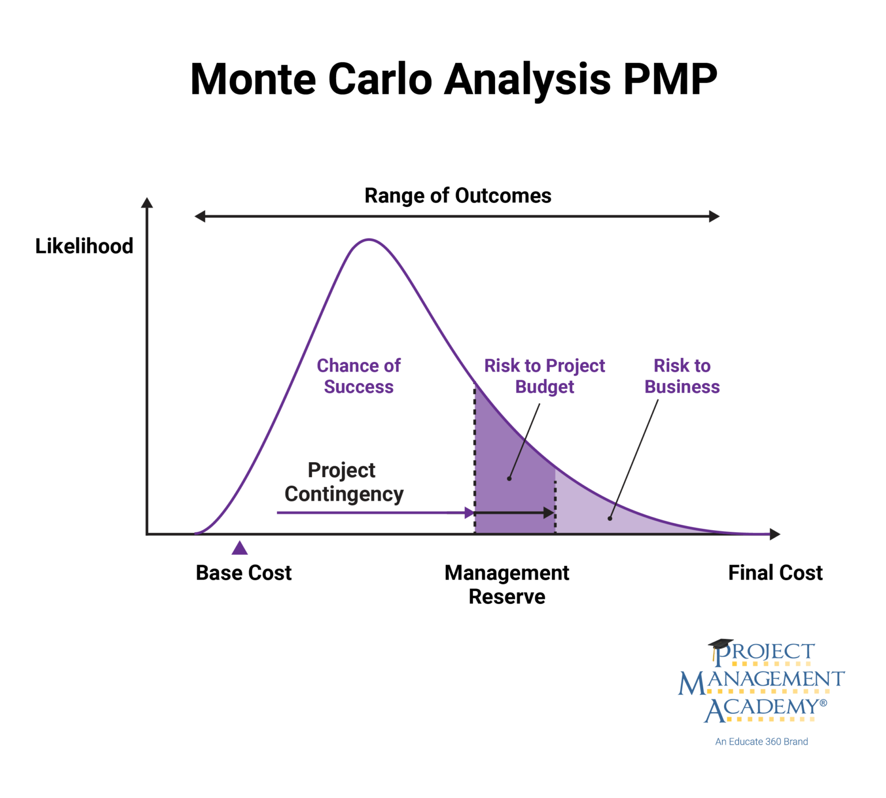

## Table of Contents

## What are Monte Carlo methods and how do they work?

Monte Carlo methods are a type of mathematical technique used to solve problems by simulating random events. Imagine you want to know the chances of something happening, like flipping a coin and getting heads. Instead of calculating it directly, you could flip a coin many times and see how often you get heads. That's the basic idea behind Monte Carlo methods: using randomness and lots of trials to estimate an answer.

These methods are very useful when the problem is too complex to solve with regular math. For example, they can help predict how a stock market might behave or how a new medicine might spread through a population. By running many simulations with random inputs, Monte Carlo methods can give a good estimate of what might happen in real life. It's like playing out many possible futures and seeing what usually happens, which helps in making better decisions.

## How are Monte Carlo methods applied in financial execution?

Monte Carlo methods are used in financial execution to help people make better decisions about money. Imagine you're trying to figure out how much money you might have in the future if you invest it now. Instead of guessing, you can use a computer to run thousands of different scenarios where things like stock prices go up or down randomly. By looking at all these different outcomes, you can get a good idea of what might happen to your money. This helps investors plan better and understand the risks involved.

For example, if you want to know how a certain investment strategy might work, you can use Monte Carlo simulations to test it out. You set up the computer to change things like interest rates or stock prices randomly, and then see how your strategy performs over time in all these different situations. This way, you can see if your strategy is likely to make you money or if it's too risky. It's like playing out many possible futures to see which strategies are the best bets.

## What are the basic steps involved in implementing a Monte Carlo simulation?

To implement a Monte Carlo simulation, you start by defining the problem you want to solve. This means figuring out what you're trying to predict or estimate, like how much money you might have in the future if you invest it now. Next, you need to identify all the variables that could affect the outcome, such as stock prices or interest rates. You then decide how these variables might change randomly over time, which is called setting up the probability distributions. For example, you might assume that stock prices follow a normal distribution.

Once you have your variables and their probability distributions set up, you run the simulation. This means using a computer to generate lots of random scenarios based on those variables. Each scenario is like playing out one possible future, and you do this thousands of times to get a good sample. After running all these scenarios, you collect the results and analyze them to find patterns or averages. This gives you an estimate of what might happen in real life. For instance, you might find that in most of your scenarios, your investment grows to a certain amount, which helps you understand the potential outcomes and risks of your investment strategy.

## Can you explain the concept of random sampling in Monte Carlo methods?

Random sampling in Monte Carlo methods is like picking numbers out of a hat, but instead of numbers, you're picking possible outcomes for your problem. Imagine you want to know how much money you might have if you invest it. You can't predict the future, so you use a computer to randomly choose different ways the future might go. Each time, the computer picks new values for things like stock prices or interest rates, based on how likely they are to happen. This is called random sampling because the computer is randomly choosing from all the possible outcomes.

By doing this many times, you get a bunch of different scenarios, each one showing a different possible future. It's like flipping a coin many times to see how often you get heads. The more times you flip, the better you understand the chances of getting heads. In the same way, the more scenarios you run with random sampling, the better you understand what might happen with your money. This helps you make better decisions because you can see what usually happens in all those different futures.

## What types of problems can Monte Carlo methods solve in execution?

Monte Carlo methods can help solve many problems in financial execution by figuring out what might happen with money in the future. For example, if you want to know how much money you might have if you invest it, Monte Carlo methods can run lots of different scenarios where things like stock prices or interest rates change randomly. By looking at all these different outcomes, you can see what usually happens and understand the risks involved. This helps investors decide if an investment strategy is a good idea or if it's too risky.

These methods are also useful for planning how to manage money over time. If you're trying to figure out how to save for retirement or how to pay off a loan, Monte Carlo simulations can show you many different ways your plan might work out. By seeing what happens in all these different futures, you can make a better plan that takes into account the ups and downs of the market. This way, you can feel more confident about your financial decisions because you've seen how they might play out in many different situations.

## How do Monte Carlo methods help in risk assessment and management during execution?

Monte Carlo methods help in risk assessment and management by showing what might happen in many different situations. Imagine you're trying to figure out if an investment is safe or risky. Instead of guessing, you can use a computer to run thousands of different scenarios where things like stock prices go up or down randomly. By looking at all these different outcomes, you can see how often your investment does well and how often it doesn't. This helps you understand the risks better because you can see what usually happens, not just what could happen.

Using these methods, you can also plan how to manage risks better. If you're saving for retirement or paying off a loan, Monte Carlo simulations can show you many different ways your plan might work out. By seeing what happens in all these different futures, you can make a better plan that takes into account the ups and downs of the market. This way, you can feel more confident about your financial decisions because you've seen how they might play out in many different situations. It's like playing out many possible futures to see which strategies are the safest bets.

## What are the advantages of using Monte Carlo methods over traditional deterministic methods in execution?

Monte Carlo methods have some big advantages over traditional deterministic methods when it comes to figuring out what might happen with money. One big advantage is that they can handle situations where things are really uncertain. Traditional methods often need you to know exactly how things will go, but in real life, things like stock prices or interest rates can change in ways that are hard to predict. Monte Carlo methods let you run lots of different scenarios where these things change randomly, so you get a better idea of all the different ways the future might go.

Another advantage is that Monte Carlo methods help you see the whole range of possible outcomes, not just one specific answer. Traditional methods might give you one number, like how much money you'll have in the future, but they don't show you how often that might happen or what else could happen instead. With Monte Carlo methods, you can see how often you might end up with a lot of money, a little money, or something in between. This helps you understand the risks better and make smarter decisions about your money.

## What are some common challenges and limitations of Monte Carlo methods in practical execution scenarios?

One common challenge with Monte Carlo methods is that they can take a lot of time and computer power. Because these methods involve running thousands or even millions of different scenarios, they need a lot of calculations. This can make them slow, especially if you're trying to solve a big problem or if you don't have a powerful computer. Another challenge is that the results of a Monte Carlo simulation can be hard to understand. Instead of giving you one clear answer, these methods show you a bunch of different outcomes. This means you have to look at all the results and figure out what they mean, which can be tricky.

Another limitation is that Monte Carlo methods depend a lot on the assumptions you make about how things will change randomly. If you guess wrong about how stock prices or interest rates might move, your simulation might not give you a good picture of what could really happen. This means you need to be careful about the information you use and make sure it's as accurate as possible. Also, while Monte Carlo methods can help you understand risks, they can't tell you exactly what will happen in the future. They give you a range of possible outcomes, but there's always a chance that something unexpected could happen that your simulation didn't predict.

## How can the accuracy of Monte Carlo simulations be improved in execution contexts?

To make Monte Carlo simulations more accurate, you can start by using better information. The more you know about how things like stock prices or interest rates might change, the better your simulation will be. This means using the most up-to-date data and making sure your guesses about how things will move are as close to reality as possible. If you can, talk to experts or use data from similar situations in the past to help you make better predictions.

Another way to improve accuracy is to run more scenarios. The more times you play out different futures, the more likely you are to see all the different ways things could go. This gives you a better picture of what might happen and makes your results more reliable. But remember, running more scenarios can take more time and computer power, so you need to find a balance that works for you.

## What advanced techniques can be integrated with Monte Carlo methods to enhance execution strategies?

One advanced technique that can be used with Monte Carlo methods is called variance reduction. This technique helps make the results of your simulation more accurate without having to run as many scenarios. Imagine you're trying to guess how much money you might have in the future. Instead of flipping a coin many times to see how often you get heads, variance reduction is like using a special coin that helps you get a good guess with fewer flips. This can save time and computer power, making your simulations more efficient.

Another technique is called parallel processing. This means using more than one computer at the same time to run your simulations. If you think of each scenario as a different future you're trying to predict, parallel processing is like having many people working together to look at all those futures at once. This can make your simulations much faster, which is really helpful when you're dealing with big problems that need a lot of calculations. By using these advanced techniques, you can make your Monte Carlo simulations better and more useful for making decisions about money.

## How do Monte Carlo methods adapt to real-time data changes in dynamic execution environments?

Monte Carlo methods can adapt to real-time data changes by updating the scenarios they run based on new information. Imagine you're using these methods to predict how much money you might have if you invest it. If new data comes in, like a sudden change in stock prices, you can quickly adjust your simulation to include this new information. This means running new scenarios that take into account the latest data, so your predictions stay as accurate as possible. It's like getting new weather reports and updating your forecast to reflect what's happening right now.

By constantly updating the simulations with real-time data, Monte Carlo methods can help you make better decisions in fast-changing situations. For example, if you're managing a portfolio of stocks, you can use real-time data to see how different investment strategies might perform under the current market conditions. This helps you adjust your strategy on the fly, making sure you're always working with the most up-to-date information. It's like having a map that updates itself as you drive, helping you navigate through the twists and turns of the financial world.

## What are the latest research developments in applying Monte Carlo methods to complex execution problems?

Recent research in Monte Carlo methods has focused on making them better at solving really tough problems, like figuring out how to manage money in a world where things change all the time. One big development is using something called machine learning to help Monte Carlo simulations. Machine learning is like a computer getting smarter over time by learning from data. By combining it with Monte Carlo methods, researchers can make the simulations more accurate and faster. This means you can get better predictions about things like how much money you might have in the future, even when the world around you is changing quickly.

Another exciting area of research is using Monte Carlo methods to solve problems in areas like climate change and healthcare. For example, scientists are using these methods to predict how the weather might change in the future or how a new medicine might work on different people. By running lots of different scenarios, they can see what might happen and plan better. This is really helpful because it lets them make decisions based on a lot of different possibilities, not just one guess. It's like having a crystal ball that shows you many different futures, helping you prepare for whatever might come next.

## What is Monte Carlo Simulation?

Monte Carlo Simulation is a statistical method that utilizes random sampling techniques to generate probabilistic distributions and analyze potential outcomes. This approach is particularly valuable in finance, where it is employed to simulate the performance of trading strategies across a multitude of scenarios. By evaluating these multiple scenarios, financial practitioners can gain insights into risk and improve decision-making processes.

In the context of algorithmic trading, Monte Carlo Simulation assists in assessing the robustness of trading strategies amidst fluctuating market dynamics. This method allows traders to account for the inherent uncertainty of financial markets, which is critical for developing strategies that can withstand varying conditions. By simulating a broad spectrum of potential outcomes, traders can better anticipate variations in returns and acknowledge potential risks, ultimately leading to more informed and strategic decisions.

The core idea of Monte Carlo Simulation involves generating random samples from defined probabilistic models that represent the underlying financial processes. For instance, consider a trader who needs to evaluate a strategy's potential returns using a stock price model based on a geometric Brownian motion. By simulating paths of stock prices using the model:

$$
S(t) = S_0 \exp\left((\mu - \frac{\sigma^2}{2}) t + \sigma W(t)\right)
$$

where $S(t)$ is the stock price at time $t$, $S_0$ is the initial stock price, $\mu$ is the expected return, $\sigma$ is the volatility, and $W(t)$ is a Wiener process, traders can estimate the strategy's performance under numerous market conditions.

By adopting Monte Carlo Simulation in trading, practitioners can construct a probability distribution of outcomes reflecting different sequences of market events and price movements. This method enhances the ability to predict adverse scenarios and optimize strategies for greater resilience. Consequently, traders are better prepared to handle variability in returns and can manage potential risks with improved foresight, ultimately leading to more robust and adaptable trading strategies.

## References & Further Reading

[1]: Glasserman, P. (2004). ["Monte Carlo Methods in Financial Engineering"](https://link.springer.com/book/10.1007/978-0-387-21617-1). Springer.

[2]: Jansen, Stefan. ["Machine Learning for Algorithmic Trading"](https://github.com/stefan-jansen/machine-learning-for-trading). Packt Publishing.

[3]: Caflisch, R.E. (1998). ["Monte Carlo and Quasi-Monte Carlo Methods"](https://www.semanticscholar.org/paper/Monte-Carlo-and-quasi-Monte-Carlo-methods-Caflisch/85b597939f26a4f7a149887e00e83e2f5ba35c8f). Acta Numerica.

[4]: Chan, Ernest P. (2009). ["Quantitative Trading: How to Build Your Own Algorithmic Trading Business"](https://github.com/ftvision/quant_trading_echan_book). John Wiley & Sons.

[5]: Lopez de Prado, Marcos. ["Advances in Financial Machine Learning"](https://www.amazon.com/Advances-Financial-Machine-Learning-Marcos/dp/1119482089). Wiley.