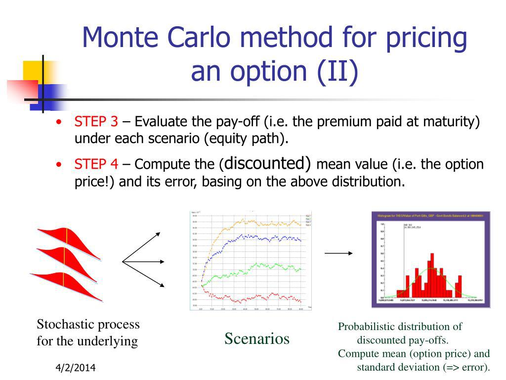

Monte Carlo methods play a pivotal role in algorithmic trading within the financial sector, serving as a powerful tool for managing risk and uncertainty. These stochastic techniques leverage randomness to simulate a range of possible outcomes for financial instruments, allowing traders to better understand potential risks and rewards. By generating thousands or even millions of potential scenarios, Monte Carlo simulations enable traders to model the probability distribution of an asset's future returns, providing insights into both best-case and worst-case trading performance.

The applications of Monte Carlo methods extend beyond simple forecasting. They are instrumental in assessing trading strategies and estimating key metrics such as Value at Risk (VaR), expected shortfall, and drawdowns. Through the injection of randomness, these simulations offer a robust framework for stress-testing strategies against a variety of market conditions, thus enhancing the reliability of backtested results.



This article will explore the multifaceted benefits of Monte Carlo simulations in financial markets. We'll investigate their implementation in algorithmic trading, evaluate the improvement in risk management, and demonstrate how they can lead to more resilient trading strategies. The discussion will include the methodological underpinnings of Monte Carlo simulations, their utility in understanding drawdowns, and their capacity to provide a statistical edge to traders. Ultimately, Monte Carlo methods transform uncertainties inherent in trading into quantifiable insights, fostering better decision-making and strategy refinement.

## Table of Contents

## What is Monte Carlo Simulation?

Monte Carlo Simulation is a statistical technique that utilizes random sampling to generate potential outcomes and assess the impact of risk and uncertainty in various fields. Fundamentally, this approach is based on the principle of utilizing probability to model complex systems. By injecting randomness into datasets, Monte Carlo simulations produce probability distributions that indicate the range of possible outcomes of a specific process. This is accomplished through iteratively sampling input variables from predefined probability distributions and recalculating the outcomes to build a comprehensive model of possibilities.

The core of Monte Carlo simulation lies in its ability to systematically and quantitatively estimate the effects of uncertainty. By conducting numerous random trials, it constructs a reliable statistical picture of the potential outcomes. A typical Monte Carlo simulation involves several key steps: defining a probability distribution for each uncertain input, generating random samples from these distributions, and synthesizing these samples to compute possible results. This process helps in creating a spectrum of outcomes that outline the probabilities of occurrence for various scenarios.

In fields like finance, where uncertainty is inherent due to factors such as market volatility, interest rates, or economic indicators, Monte Carlo simulations are particularly relevant. Financial professionals utilize these simulations to model the potential performance of assets, portfolios, or entire markets over a period. For instance, when evaluating the future performance of a stock portfolio, a Monte Carlo simulation can assess how variations in market conditions might affect portfolio returns, providing investors with insights into potential risks and helping in strategic decision-making. Consequently, the method aids in recognizing the probability of making or losing money, aiding risk assessment, and enhancing financial strategies.

Mathematically, if $x_1, x_2, \ldots, x_n$ are random variables representing uncertain parameters in a financial model, a Monte Carlo simulation estimates the output $f(x_1, x_2, \ldots, x_n)$ by calculating it over a large number of scenarios, each generated by sampling from the probability distributions of $x_1, x_2, \ldots, x_n$. By analyzing the resultant data, which often forms a probability distribution itself, stakeholders can make better-informed, data-driven financial decisions. Monte Carlo simulations, therefore, transform uncertainties into quantifiable insights, illustrating their robustness and versatility in financial analysis and risk management.

## Why Use Monte Carlo Simulations in Algorithmic Trading?

Monte Carlo simulations occupy a crucial role in [algorithmic trading](/wiki/algorithmic-trading) by offering a robust framework for assessing trading strategies. One of the primary benefits of utilizing Monte Carlo simulations is their capacity to handle the uncertainty and randomness that pervade financial markets.

When developing trading strategies, [backtesting](/wiki/backtesting) is a common method used to evaluate performance based on historical data. However, the reliability of a backtest can be questionable due to data-snooping bias, overfitting, and market changes. Monte Carlo simulations mitigate these risks by generating numerous hypothetical trading scenarios, preventing reliance on a single historical sequence. This involves injecting randomness and reshuffling trade sequences, thereby creating a distribution of potential outcomes rather than a single expected path. By doing so, traders gain insights into the variability of their strategies and the range of possible performance.

Another significant aspect of Monte Carlo simulations is their ability to provide more realistic estimates of drawdowns. A drawdown refers to the peak-to-trough decline in a portfolio's value, and understanding the potential severity of drawdowns is essential for risk management. Traditional backtesting often underestimates drawdowns as it merely observes past occurrences without accounting for future uncertainties. Monte Carlo simulations, however, can explicitly model drawdowns by simulating thousands of trading paths. This results in a distribution that highlights both typical and extreme scenarios, allowing traders to gauge the potential risk more accurately.

For instance, consider a simple trading strategy tested on a historical dataset. By applying Monte Carlo simulations, one can randomly reorder and sample the data to generate multiple possible equity curves. This approach helps in understanding how the strategy might behave under various market conditions that are not yet observed. Therefore, these simulations provide a probabilistic view of future performance, emphasizing the importance of robust strategy development and realistic risk assessment.

## How Monte Carlo Simulations Work

Monte Carlo simulations play a crucial role in evaluating trading strategies, particularly by injecting randomness into historical trade data to model potential future outcomes. The primary mechanism involves reshuffling and random sampling, which helps in overcoming biases present in historical data and addresses uncertainties in trading results.

### Reshuffling and Random Sampling

At its core, reshuffling refers to rearranging historical trade sequences to simulate various potential future outcomes, thereby providing a broad perspective on how a strategy might perform under different market conditions. This method aids in uncovering the potential variability in returns and understanding the risks involved without the noise of time-sequential dependencies.

Random sampling, on the other hand, involves selecting random trades from historical data to create new trade sequences. This process is repeated numerous times to build a distribution of possible outcomes. Through this technique, traders can gauge the probability of different performance levels and potential drawdowns, essentially quantifying uncertainty in trading strategies.

### Python Code Example

The practical application of these methods can be illustrated through a simple Python code snippet. The following example demonstrates how to implement a basic Monte Carlo simulation on a series of historical returns:

```python
import numpy as np
import matplotlib.pyplot as plt

# Simulated historical returns data
historical_returns = np.random.normal(0.001, 0.01, 252)  # 252 trading days

def monte_carlo_simulation(returns, num_simulations, num_days):
    simulation_results = np.zeros((num_simulations, num_days))

    for sim in range(num_simulations):
        # Reshuffling by drawing random samples from historical returns
        random_returns = np.random.choice(returns, num_days, replace=True)
        # Cumulative sum to simulate price path
        simulation_results[sim] = np.cumprod(1 + random_returns)

    return simulation_results

# Parameters
num_simulations = 1000
num_days = 252

# Run simulations
simulations = monte_carlo_simulation(historical_returns, num_simulations, num_days)

# Plotting simulation outcomes
plt.figure(figsize=(10, 6))
plt.plot(simulations.T, color='lightgray', linewidth=0.5)
plt.title('Monte Carlo Simulation of Trading Strategy Over 1 Year')
plt.xlabel('Days')
plt.ylabel('Cumulative Returns')
plt.show()
```

In this example, a set of historical returns is used to perform 1,000 Monte Carlo simulations over a one-year period, simulating the cumulative returns of a trading strategy. Each simulation is represented by a light gray line on the plot, providing a visual representation of the potential variability in strategy performance.

This approach highlights the effectiveness of Monte Carlo simulations in transforming historical data into a multitude of possible future outcomes, aiding traders in assessing strategy robustness and risk more comprehensively.

## Benefits of Monte Carlo Simulation in Trading

Monte Carlo simulations provide a powerful tool for enhancing an understanding of trading drawdowns and effectively managing risk. By allowing traders to model the impact of randomness and uncertainty on trading strategies, these simulations enable the early detection of unsustainable approaches, potentially saving significant resources. Through the use of randomized input values and repeated trials, Monte Carlo simulations construct a range of possible outcomes, thus quantifying predictive models' reliability and robustness.

One of the primary benefits of employing Monte Carlo simulations in trading is the improved comprehension of trading drawdowns. Drawdowns refer to the peak-to-trough decline during a specific period of an investment or trading strategy. By assessing the worst-case scenarios through numerous trial iterations, traders gain insight into the magnitude and frequency of potential drawdowns. This helps in setting realistic expectations and preparing for adverse market conditions.

Moreover, Monte Carlo methods aid in early detection of unsustainable trading strategies. By evaluating a strategy over a broad spectrum of market conditions, traders can identify weaknesses that might not be apparent through traditional backtesting methods alone. This predictive insight enables intervention before substantial losses occur, ensuring more sustainable and profitable trading approaches.

Monte Carlo simulations also facilitate the development of more resilient and robust trading strategies. By simulating a vast array of potential outcomes and considering the inherent randomness of the market, these methods assist traders in refining strategies to adapt to diverse conditions. This approach fosters the creation of strategies with a higher likelihood of performing consistently across a variety of future market scenarios.

Overall, Monte Carlo simulations translate trading uncertainties into actionable insights. They not only help in better understanding and managing risks but also empower traders to build strategies that withstand the test of time and market [volatility](/wiki/volatility-trading-strategies).

## Monte Carlo Methods in Trading

Monte Carlo methods are pivotal in trading for evaluating and strengthening strategy robustness. These methods introduce variability into datasets, allowing traders to assess risks and identify potential weaknesses in their strategies. Four commonly employed methodologies in this context are Reshuffle, Resample, Randomized, and Permutation.

**Reshuffle Method**: This method involves rearranging historical trade data to simulate various alternative trade sequences. By doing so, traders can evaluate the impact of different trade orders on strategy outcomes. The primary advantage of reshuffling is that it preserves the inherent statistical properties of original data, such as mean and variance, ensuring that any changes in results are due to the sequence alone. This technique helps in understanding the resilience of strategies to fluctuations in trade orders.

**Resample Method**: Resampling, often implemented through techniques like bootstrapping, involves drawing repeated samples from the original dataset with replacement. This approach is effective in estimating the distribution of a statistic, such as returns, without making strong parametric assumptions. Resampling can expose strategies to a wider range of market scenarios, providing insights into risk under varied conditions. It is especially useful for quantifying the variability of performance metrics and validating the robustness of a trading strategy.

**Randomized Method**: Randomization introduces controlled randomness into the dataset, allowing exploration of a broad spectrum of possible outcomes. By applying random changes, such as adjusting trade sizes or durations, traders can identify how sensitive their strategies are to small modifications. This method is advantageous for uncovering vulnerabilities that may not be apparent in deterministic backtesting, thus enhancing strategy evaluation.

**Permutation Method**: Permutation testing involves evaluating strategy performance by testing all possible orderings of trade results. It is a potent method for assessing the null hypothesis in statistical terms, effectively determining if observed differences in performance are significant. The permutation method's strength lies in its ability to provide a non-parametric test for the stability of trading strategies, contributing to more reliable forecasts and risk assessments.

These Monte Carlo methods are invaluable for diagnosing strategy performance and ensuring robustness, ultimately leading to more resilient trading outcomes. By simulating numerous scenarios through these techniques, traders can better prepare for market uncertainties and refine their strategies accordingly.

## Advanced Uses of Monte Carlo Simulations

Monte Carlo simulations have found advanced applications in algorithmic trading that enhance strategy evaluation and risk management. One notable innovation is the Monte Carlo Equity Curve Bands, which provide a probabilistic framework for assessing the potential outcomes of trading strategies. By simulating multiple equity curves, traders can generate a distribution of potential account balances over time, allowing them to identify where their actual performance might lie within a band of possible outcomes. This technique not only helps in understanding the variability and robustness of a trading strategy but also facilitates more informed decision-making regarding risk tolerance and capital allocation.

Another advanced application is the Drawdown Technique, which focuses on modeling the potential drawdowns of a trading strategy under various simulated market conditions. A drawdown is defined as the peak-to-trough decline during a specific period of an investment, which serves as a critical measure for understanding risk exposure. Through Monte Carlo simulations, it's possible to generate numerous scenarios of potential drawdowns, offering traders a clearer picture of what to expect under adverse conditions. This technique is essential for establishing realistic risk parameters and setting appropriate stop-loss levels, thus preventing severe capital erosion.

These advanced methods significantly improve strategy evaluation by providing a comprehensive analysis of risk and uncertainty. By incorporating a wide array of potential market movements and conditions, traders can better assess the likelihood of success of their strategies and identify weaknesses that may not be apparent through traditional backtesting alone. As a result, decision-making regarding strategy adoption and optimization is fundamentally enhanced, offering traders a competitive edge. 

For instance, the Monte Carlo Equity Curve Bands can be employed to test the robustness of a strategy under different volatility regimes, while the Drawdown Technique aids in protecting capital by simulating the worst-case loss scenarios. Implementing these advanced uses of Monte Carlo simulations can lead to the creation of more resilient and adaptable trading strategies that can withstand the inherent uncertainties of financial markets. These methods transform complex risks into actionable insights, guiding traders toward more sophisticated and effective strategy refinements.

## How Many Simulations Are Needed?

Running a large number of simulations is crucial in Monte Carlo methods to ensure that the results are statistically significant and provide a comprehensive view of potential outcomes. The reliability of Monte Carlo simulations improves as the number of iterations increases. This is because more simulations help to better capture the randomness and variability inherent in the modeled system, resulting in a more accurate probability distribution of possible outcomes.

To achieve robust outcomes, a common guideline is to run at least 10,000 simulations. However, the exact number may vary depending on the complexity of the trading strategy, the desired confidence level, and the computational resources available. The law of large numbers supports this approach, stating that as the number of trials increases, the simulated results converge towards the expected value.

Consider the following Python code example that demonstrates how to execute multiple simulations and analyze the results:

```python
import numpy as np
import matplotlib.pyplot as plt

# Define parameters for the simulation
n_simulations = 10000
n_trades = 252  # number of trades, typically a year's worth of trading days
initial_cash = 10000  # starting capital
mean_return = 0.001  # average daily return
std_dev = 0.02  # standard deviation of daily returns

# Run simulations
ending_values = np.zeros(n_simulations)  # array to store the ending account values

for i in range(n_simulations):
    daily_returns = np.random.normal(loc=mean_return, scale=std_dev, size=n_trades)
    account_value = initial_cash * np.exp(np.cumsum(daily_returns))
    ending_values[i] = account_value[-1]

# Analyzing the results
plt.hist(ending_values, bins=50, color='skyblue', edgecolor='black')
plt.title('Distribution of Ending Account Values')
plt.xlabel('Ending Account Value')
plt.ylabel('Frequency')
plt.axvline(initial_cash, color='red', linestyle='dashed', linewidth=2)
plt.show()

# Calculating statistics for analysis
mean_ending_value = np.mean(ending_values)
std_ending_value = np.std(ending_values)
print(f"Mean ending value: {mean_ending_value}")
print(f"Standard deviation of ending values: {std_ending_value}")
```

In this example, an initial capital of $10,000 is subject to daily returns drawn from a normal distribution with a mean of 0.1% and a standard deviation of 2%. By conducting 10,000 simulations, the code generates a distribution of potential ending account values, providing insights into the variability and potential risk associated with the trading strategy. Plotting the histogram of these ending values helps visualize the probability distribution, highlighting the range of possible outcomes.

This process underlines the necessity of running a sufficient number of simulations to achieve a reliable estimation of potential outcomes in algorithmic trading.

## Conclusion

Monte Carlo simulations have become an invaluable tool in algorithmic trading by providing a robust framework for dealing with uncertainty inherent in financial markets. These simulations offer a statistical methodology to transform unpredictable market conditions into quantifiable data, thus facilitating improved strategy refinement and comprehensive risk management. By modeling a wide array of potential scenarios, traders can better anticipate the range of outcomes their strategies might encounter, allowing them to adjust and optimize their approaches accordingly.

Monte Carlo methods excel at estimating risk factors, such as drawdowns and volatility, and enable traders to develop strategies that can withstand market fluctuations. The ability to quantitatively assess these risk elements allows traders to make informed decisions based on probabilistic insights rather than assumptions. This significantly reduces the reliance on historical data alone, addressing potential biases and overfitting issues that could arise from over-reliance on linear backtesting results.

Incorporating Monte Carlo simulations provides a statistical edge in trading by highlighting the strengths and vulnerabilities of trading models before they are employed in live markets. This proactive approach helps in identifying unsustainable strategies early on, thereby preserving capital and enhancing long-term profitability.

Traders and developers are encouraged to integrate Monte Carlo methods into their analytical toolkits to harness their full potential. These simulations not only uncover the statistical properties of trading strategies but also foster a deeper understanding of the dynamics at play in financial markets. Embracing this approach will undoubtedly equip traders with valuable insights and a competitive advantage, ultimately enhancing their decision-making processes and trading success.

## References & Further Reading

### References & Further Reading

To deepen your understanding of Monte Carlo methods and their applications in finance, the following resources provide comprehensive insights:

1. **Books:**
   - *"Monte Carlo Methods in Financial Engineering"* by Paul Glasserman - This book offers an in-depth exploration of the use of Monte Carlo simulation in financial models, including practical examples and theoretical underpinnings.
   - *"Options, Futures, and Other Derivatives"* by John C. Hull - Known for its comprehensive treatment of derivatives, this book also discusses the application of Monte Carlo methods in evaluating financial derivatives.
   - *"Monte Carlo Simulation and Finance"* by Don L. McLeish - A detailed introduction to the principles and practice of Monte Carlo simulation, focusing on financial applications.

2. **Articles and Papers:**
   - "Monte Carlo and Quasi-Monte Carlo Methods in Finance" by Benhamou, Eric, Del Moral, Pierre, and Reutenauer, Markus - This paper reviews the latest developments in Monte Carlo techniques used in financial contexts.
   - "Simulation and the Monte Carlo Method" by Rubinstein, R.Y. and Kroese, D.P. - An article addressing the theoretical framework of Monte Carlo simulations with applications across various fields, including finance.
   - "A Practitioner's Guide to Monte Carlo" by Reuven Y. Rubinstein - An indispensable article for practitioners looking to implement Monte Carlo methods in financial settings.

3. **Online Resources:**
   - [QuantStart's Monte Carlo Simulation](https://www.quantstart.com/articles/practical-monte-carlo-simulation-in-python/) - Provides a practical introduction to implementing Monte Carlo simulations using Python, with examples directly applicable to financial markets.
   - [Investopedia's Guide to Monte Carlo Simulation](https://www.investopedia.com/articles/07/montecarlo.asp) - A beginner-friendly guide explaining the basics of Monte Carlo simulations and their utility in finance.

These resources are essential for anyone looking to understand or leverage Monte Carlo simulations within financial markets. They offer theoretical insights, practical guidance, and a foundation for further exploration into the statistical and practical aspects of these methods.