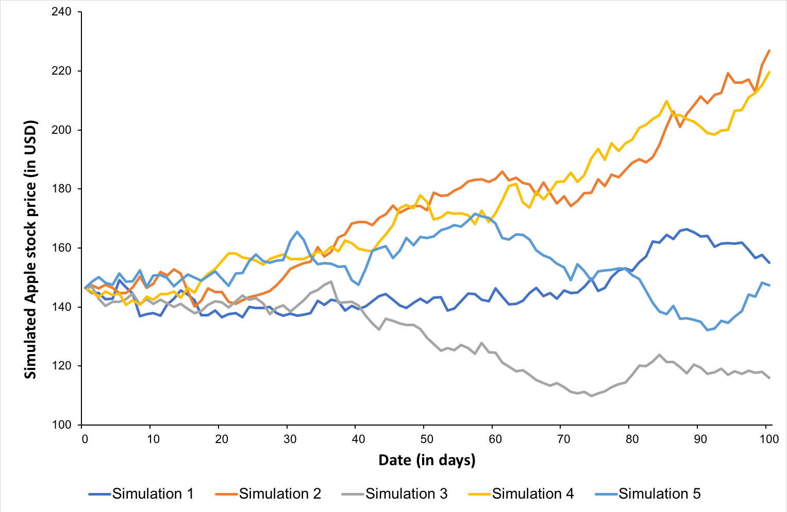

## Table of Contents

## What are Monte Carlo methods and how do they apply to trading?

Monte Carlo methods are a type of mathematical technique used to predict the future by running many simulations. Imagine you want to guess what might happen in the future, but there are too many possibilities to check them all. Instead, you use a computer to create a lot of different scenarios, each one a little different, and see what usually happens. This helps you understand what could happen, even if you can't be sure.

In trading, Monte Carlo methods help traders understand the risks and possible outcomes of their investments. For example, if a trader wants to know how a stock might perform over the next month, they can use Monte Carlo simulations to create many different scenarios based on past data. By looking at all these scenarios, the trader can see the most likely outcomes and make better decisions about whether to buy, sell, or hold the stock. This can help them manage their money more safely and effectively.

## How can Monte Carlo simulations help in assessing risk in trading?

Monte Carlo simulations help traders assess risk by showing them many different possible futures for their investments. Imagine you're trying to guess what might happen to a stock price. Instead of just guessing, you can use a computer to create thousands of different scenarios based on past data. Each scenario shows a different way the stock price might move. By looking at all these scenarios, you can see which outcomes are more likely and which ones are less likely. This helps you understand the risks better because you can see how often bad things might happen.

For example, if you're thinking about buying a stock, you can use Monte Carlo simulations to see how often the stock might lose value over the next month. If the simulations show that the stock loses value in a lot of the scenarios, that's a sign it might be risky. On the other hand, if most of the scenarios show the stock going up in value, it might be a safer bet. This way, traders can make more informed decisions about their investments and manage their money more carefully, knowing the risks they might face.

## What are the basic steps to perform a Monte Carlo simulation for trading?

To perform a Monte Carlo simulation for trading, you start by gathering historical data about the stock or asset you're interested in. This data includes past prices, returns, and any other relevant information. You use this data to understand how the stock has moved in the past. Next, you create a model that describes how the stock price might change. This model usually includes some randomness to account for the unpredictable nature of the market. You set up the model with certain assumptions about how likely different price changes are, based on the historical data.

Once you have your model, you run the simulation many times, each time using different random numbers to see how the stock price might evolve. Each run of the simulation gives you one possible future path for the stock price. You do this thousands or even millions of times to get a good picture of all the possible outcomes. After running all the simulations, you collect the results and analyze them. You look at things like the average return, the worst-case scenario, and how often the stock might lose value. This helps you understand the risks and potential rewards of the investment. By seeing all these different futures, you can make better decisions about whether to buy, sell, or hold the stock.

## Can you explain the concept of random walks in the context of Monte Carlo trading simulations?

In Monte Carlo trading simulations, a random walk is a way to model how stock prices might move over time. Imagine you're walking on a path, but each step you take is in a random direction. Sometimes you step forward, sometimes backward, and sometimes to the side. This is similar to how stock prices can go up, down, or stay the same from one day to the next. In a Monte Carlo simulation, we use this idea to create many different paths that a stock price might take, based on random changes that are similar to the ones we've seen in the past.

By using random walks, we can see a wide range of possible futures for a stock. Each time we run the simulation, we start with the current stock price and then let it take random steps based on our model. This helps us understand how likely it is for the stock to end up at different prices after a certain amount of time. By looking at all these different paths, we can get a better sense of the risks and rewards of investing in that stock. It's like looking at many different possible futures to see what might happen, even if we can't predict the future exactly.

## How do Monte Carlo methods help in optimizing trading strategies?

Monte Carlo methods help traders make their trading strategies better by testing them many times in different situations. Imagine you have a plan for buying and selling stocks, but you're not sure if it's the best way. With Monte Carlo simulations, you can run your plan through thousands of different scenarios, each one a little different. This helps you see how your strategy might work in the real world, where things don't always go as planned. By looking at all these different outcomes, you can see if your strategy usually makes money or if it's too risky. This way, you can tweak your plan to make it better and safer.

For example, if you want to know if your strategy works well in both good and bad markets, Monte Carlo simulations can show you that. They can create scenarios where the market goes up, down, or stays the same, and you can see how your strategy performs in each case. If your strategy loses money in too many of these scenarios, you know you need to change it. By trying out different changes and running the simulations again, you can find the best version of your strategy. This helps you feel more confident about your trading plan, knowing it's been tested in many different situations.

## What are the common statistical distributions used in Monte Carlo trading simulations?

In Monte Carlo trading simulations, the most common statistical distribution used is the normal distribution, also known as the bell curve. This distribution is popular because it often fits the way stock prices move over short periods. In a normal distribution, most of the changes in stock prices are small, with bigger changes happening less often. Traders use this distribution to model how stock prices might go up or down in their simulations, helping them understand the most likely outcomes.

Another common distribution is the lognormal distribution, which is used to model stock prices over longer periods. Unlike the normal distribution, the lognormal distribution ensures that stock prices can't go below zero, which makes sense because stock prices can't be negative. This distribution is useful for looking at how stock prices might grow over time, taking into account the compounding effect of returns. By using these distributions in Monte Carlo simulations, traders can get a better picture of the risks and rewards of their investments.

## How can Monte Carlo simulations be used to backtest trading strategies?

Monte Carlo simulations help traders test their trading strategies by running them through many different scenarios. Imagine you have a plan for buying and selling stocks, and you want to see if it works well. With Monte Carlo simulations, you can create thousands of different situations, each one a little different, and see how your strategy performs in each case. This is called [backtesting](/wiki/backtesting). By looking at all these different outcomes, you can see if your strategy usually makes money or if it's too risky. This helps you understand how well your plan might work in the real world, where things don't always go as planned.

For example, if you want to know if your strategy works well in both good and bad markets, Monte Carlo simulations can show you that. They can create scenarios where the market goes up, down, or stays the same, and you can see how your strategy performs in each case. If your strategy loses money in too many of these scenarios, you know you need to change it. By trying out different changes and running the simulations again, you can find the best version of your strategy. This helps you feel more confident about your trading plan, knowing it's been tested in many different situations.

## What are the limitations and potential pitfalls of using Monte Carlo methods in trading?

Monte Carlo methods are very useful, but they have some problems. One big problem is that they rely on past data to predict the future. If the past doesn't match the future, the simulations might be wrong. For example, if a stock used to be stable but suddenly becomes very unpredictable, the Monte Carlo simulation might not show that. Also, these simulations can take a long time to run because they need to do thousands or even millions of calculations. This can slow down the process of making decisions.

Another issue is that Monte Carlo methods can give a false sense of security. Just because a strategy works in many simulated scenarios doesn't mean it will work in real life. The real world can be full of surprises that the simulations can't predict. Traders might think their strategy is safe because it did well in the simulations, but they could still lose money. It's important to remember that Monte Carlo simulations are just tools, not crystal balls. They can help, but they can't guarantee success.

## How can one validate the results of a Monte Carlo simulation in trading?

To make sure the results of a Monte Carlo simulation in trading are trustworthy, you need to check them against real data. This means comparing the outcomes of your simulations with what actually happened in the market. For example, if your simulation says a stock should go up 70% of the time over the next month, you can look at the stock's past performance to see if it matches. If the real data doesn't match your simulations, you might need to change your model or the data you're using.

Another way to validate Monte Carlo simulation results is to use different models and see if they give similar outcomes. If you run the simulation with a few different ways of predicting stock prices and they all show similar results, it's a good sign that your simulation is reliable. It's also helpful to test your strategy in a real trading environment with a small amount of money first. This can show you if the simulation's predictions hold up in the real world. By doing these checks, you can feel more confident in using Monte Carlo simulations to guide your trading decisions.

## What advanced techniques can be applied to enhance the accuracy of Monte Carlo simulations in trading?

To make Monte Carlo simulations more accurate in trading, you can use something called variance reduction techniques. These techniques help make the results of the simulations more reliable by reducing the randomness in the outcomes. One common method is called antithetic variates, where you run two simulations at the same time, one with random numbers and another with the opposite random numbers. By averaging the results, you can get a more stable prediction. Another technique is called control variates, where you compare your simulation to a simpler model that you know is accurate. This helps you adjust your results to be more precise.

Another way to improve Monte Carlo simulations is by using more advanced models of how stock prices move. Instead of just using simple models like the normal or lognormal distribution, you can use more complex models that take into account things like market trends, [volatility](/wiki/volatility-trading-strategies) changes, and even news events. These models can be based on historical data and can be adjusted to fit the current market conditions better. By using these more detailed models, your simulations can give you a better picture of what might happen in the future, helping you make smarter trading decisions.

## How do Monte Carlo methods integrate with other quantitative trading techniques?

Monte Carlo methods can work well with other ways of trading that use math and numbers, like technical analysis and [machine learning](/wiki/machine-learning). Technical analysis looks at past prices and charts to find patterns that can help predict what might happen next. Monte Carlo simulations can be used to test these patterns by running them through many different scenarios. This helps traders see if the patterns they find really work in different market conditions. By combining Monte Carlo methods with technical analysis, traders can feel more confident that their strategies will hold up in the real world.

Machine learning is another tool that traders use to make smart decisions. It involves using computers to learn from data and find the best ways to trade. Monte Carlo simulations can help improve machine learning models by testing them in many different situations. This way, traders can see how well their machine learning strategies might work in the future. By using Monte Carlo methods alongside machine learning, traders can create more reliable and adaptable trading strategies that are better at handling the ups and downs of the market.

## What are some real-world examples of Monte Carlo methods being used successfully in trading?

One real-world example of Monte Carlo methods being used successfully in trading is by hedge funds. A famous [hedge fund](/wiki/hedge-fund-trading-strategies) called Renaissance Technologies uses Monte Carlo simulations to test and improve their trading strategies. They run thousands of simulations to see how their strategies might perform in different market conditions. This helps them find the best ways to make money and manage risk. By using Monte Carlo methods, Renaissance Technologies has been able to make very good returns for their investors, showing that these simulations can be a powerful tool in the real world.

Another example is in the field of options trading. Traders often use Monte Carlo simulations to price options and understand the risks involved. For instance, a trader might use these simulations to see how the price of an option might change over time under different scenarios. This helps them decide if buying or selling an option is a good idea. By running many simulations, traders can get a better sense of the potential outcomes and make more informed decisions. This has helped many traders manage their options portfolios more effectively and profitably.

## References & Further Reading

[1]: Glasserman, P. (2003). ["Monte Carlo Methods in Financial Engineering."](https://link.springer.com/book/10.1007/978-0-387-21617-1) Springer Science & Business Media.

[2]: Broadie, M., & Glasserman, P. (1998). ["Estimating security price derivatives using simulation."](https://pubsonline.informs.org/doi/abs/10.1287/mnsc.42.2.269) Management Science, 44(8), 1107-1152.

[3]: Boyle, P. P., Broadie, M., & Glasserman, P. (1997). ["Monte Carlo methods for security pricing."](https://www.sciencedirect.com/science/article/pii/S0165188997000286) Journal of Economic Dynamics and Control, 21(8-9), 1267-1321.

[4]: Higham, D. J. (2001). ["An Introduction to Financial Option Valuation: Mathematics, Stochastics and Computation."](https://assets.cambridge.org/052192/0825/full_version/0521920825_pub.pdf) Cambridge University Press.

[5]: Aswath Damodaran. (2008). ["Strategic Risk Taking: A Framework for Risk Management."](https://archive.org/details/strategicrisktak0000damo) Wharton School Publishing. 

[6]: Ernie Chan. (2013). ["Algorithmic Trading: Winning Strategies and Their Rationale."](https://www.amazon.com/Algorithmic-Trading-Winning-Strategies-Rationale/dp/1118460146) Wiley Trading.