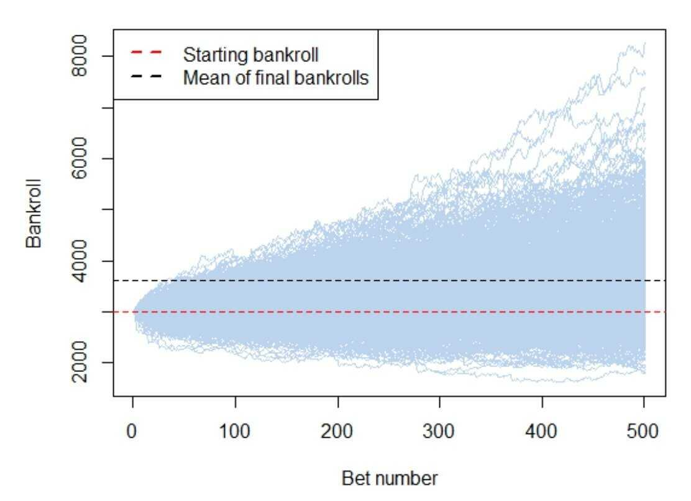

In today's financial world, uncertainty is a constant presence, challenging investors and traders as they strive to develop strategies that can reliably manage risk and enhance profitability. Navigating this uncertainty effectively requires powerful tools and methodologies capable of forecasting potential market behavior and evaluating strategy performance under varying conditions. One such tool gaining prominence in the field of finance is the Monte Carlo Simulation (MCS), a mathematical technique used extensively in probability modeling.

Monte Carlo Simulation is instrumental in dissecting the complexities of financial markets. By simulating a wide range of potential outcomes based on random sampling, MCS allows investors and traders to understand better the potential risks and rewards associated with different financial strategies. This methodology not only highlights probable outcomes but also brings into focus the less likely, yet possible, market scenarios that could significantly impact financial workflows.



The application of Monte Carlo Simulation in algorithmic trading provides a particularly insightful example of its transformative potential. By projecting millions of possible future trading paths, MCS offers traders a robust framework to assess the resilience and risk exposure of their trading algorithms. This probabilistic modeling enhances decision-making by providing a nuanced understanding of market dynamics, enabling traders to refine strategies according to projected outcomes.

In the betting industry, MCS similarly offers a strategic edge. By modeling the probability and variability of different betting outcomes, it aids in crafting strategies that improve predictability and maximize profitability. Monte Carlo techniques help bettors to devise risk management frameworks, potentially increasing returns in the face of uncertainty.

This article explores the multifaceted role of Monte Carlo Simulation in modern finance, providing insights on how it can be effectively employed to navigate uncertainty and optimize decision-making processes. The ensuing sections will offer a deeper understanding of the core principles of Monte Carlo Simulation, its practical applications, and the significant advantages it presents over traditional analytical models. By integrating Monte Carlo Simulation into their analytical toolkit, investors and traders can significantly enhance their strategic planning, bolstering their chances for financial success even amidst the inherent uncertainty of the financial markets.

## Table of Contents

## Understanding Monte Carlo Simulation

Monte Carlo Simulation (MCS) is a robust statistical technique used to model the uncertainty and variability inherent in complex systems. It is particularly valuable in financial contexts where future market movements and strategy outcomes are uncertain.

### Principle and Functioning of Monte Carlo Simulation

At its core, MCS functions by generating a broad spectrum of potential results through repeated random sampling. This approach helps assess the probability of various outcomes by simulating the input variables' random behavior. The simulation typically involves the following steps:

1. **Defining a Model**: An initial mathematical model of the system or process is established. This involves identifying key variables and relationships between them.

2. **Assigning Probability Distributions**: Each uncertain variable is assigned an appropriate probability distribution. Common distributions include normal, lognormal, and uniform, among others, depending on the nature of the data and the assumptions of the model.

3. **Generating Random Samples**: Multiple random values are generated for each variable based on their probability distributions. These values simulate different scenarios.

4. **Running Simulations**: The model is computed repeatedly, each time using different sets of random values for the variables. This might involve thousands or even millions of iterations.

5. **Analyzing Results**: The range of outcomes provides a probability distribution of possible results, from which key insights such as mean, variance, and confidence intervals can be derived.

### Converting Uncertainty into Insights

Monte Carlo Simulation converts uncertainties into quantified insights by illustrating the entire range of possible outcomes and their probabilities. This is particularly useful for:

- **Risk Assessment**: By analyzing the distribution of outcomes, MCS helps identify strategies that minimize risk and optimize returns under uncertain conditions.

- **Scenario Analysis**: Enables detailed what-if analysis to understand the impact of different assumptions and variables, aiding in informed decision-making.

- **Decision Support**: Provides a clear understanding of risks and expected outcomes, supporting confident and calculated financial decisions.

The effectiveness of MCS hinges on the accuracy of the input data and model assumptions. Misjudging the distribution or interdependencies of variables can lead to erroneous predictions. Therefore, it is crucial to complement MCS with professional judgment and external validation to ensure reliability in dynamic financial environments.

## Probability Distributions in Monte Carlo Simulation

Monte Carlo Simulation (MCS) is a robust statistical method widely employed for modeling uncertainty and predicting the probability of different outcomes. A pivotal aspect of MCS is the use of probability distributions to simulate random variables, reflecting real-world variability and uncertainty. In financial modeling and other applications, selecting the appropriate probability distribution is crucial for the accuracy and reliability of the MCS results.

### Key Probability Distributions

1. **Normal Distribution**: Also known as the Gaussian distribution, the normal distribution is symmetrical and describes a common pattern where most observed values cluster around the mean. It is characterized by its mean (µ) and standard deviation (σ). This distribution is frequently used to model stock prices and returns due to the central limit theorem, which suggests that the mean of many independent and identically distributed random variables will tend to be normally distributed, regardless of the original distribution.

2. **Lognormal Distribution**: A variable distributed log-normally is one whose logarithm is normally distributed. This is suitable for modeling stock prices and other financial assets because prices cannot be negative, and they tend to exhibit percentage changes rather than absolute changes. Lognormal distributions are defined by the parameters µ and σ, where µ and σ are the mean and standard deviation of the variable's natural logarithm.

3. **Triangular Distribution**: This distribution is defined by three parameters: the minimum value, the maximum value, and the peak mode value, where the distribution reaches its maximum frequency. It is often used when limited sample data is available, and the exact distribution is unknown, but estimates of the minimum, maximum, and most likely values can be made.

4. **Uniform Distribution**: The uniform distribution has constant probability and is defined by its minimum and maximum bounds. Every possible outcome is equally likely in a uniform distribution. It is useful in scenarios with limited predictability or when modeling random variability that does not favor any particular outcome.

5. **Exponential Distribution**: Known for modeling the time between independent events that happen at a constant average rate, the exponential distribution solely depends on a single parameter, the rate (λ), which is the inverse of the mean. It is particularly useful in modeling waiting times and the lifespan of financial products or equipment.

### Impact of Distribution Selection

The choice of a probability distribution has a profound impact on the output of a Monte Carlo Simulation. The chosen distribution determines the range and likelihood of possible outputs, significantly affecting decision-making and risk assessment in financial contexts.

For example, using a normal distribution in stock price modeling may provide insights into average movements, but the inherent assumption of symmetry might underestimate tail risks and extreme events. Conversely, the lognormal distribution accommodates for the compounding effect and non-negativity, providing a more accurate simulation of price changes over time.

### Examples in Financial Contexts

- **Risk Assessment**: Financial analysts often use the normal distribution to assess market risks by analyzing returns and volatility. However, the potential for extreme loss events often necessitates consideration of fat-tailed distributions.

- **Pricing Derivatives**: Lognormal distributions might be employed in pricing options where the variability of the underlying asset needs to be modeled realistically.

- **Asset Valuation**: Triangular distributions can be useful for valuing assets with limited data or when only estimates are available for price ranges.

In summary, the choice of distribution in Monte Carlo Simulation directly influences the model's effectiveness in capturing and predicting real-world uncertainties. As MCS is an essential tool in finance for risk assessment and strategic planning, understanding the nuances and applications of these distributions is critical for accurate and pragmatic financial modeling.

## Monte Carlo Simulation in Algorithmic Trading

Algorithmic trading has significantly transformed financial markets by utilizing automatic algorithms based on historical data and predictive models. A crucial component in this domain is the Monte Carlo Simulation (MCS), valued for its ability to evaluate and enhance trading strategies. By creating a multitude of potential future market paths, MCS provides insights into the distribution of potential trading outcomes, thus serving as a robust tool for assessing the viability of trading strategies.

One of the key advantages of applying MCS in [algorithmic trading](/wiki/algorithmic-trading) is its capacity to simulate vast numbers of hypothetical scenarios—often numbering in the millions. This is achieved by generating random variables based on historical data inputs, which align with the trading strategy under consideration. Each simulated path represents a possible future sequence of market conditions, allowing traders to visualize the range of outcomes. For instance, using Python, a trader might set up an MCS model to simulate one million potential outcomes using:

```python
import numpy as np

# Define parameters
np.random.seed(42)  # for reproducibility
num_simulations = 1000000
time_horizon = 252  # number of trading days in a year
initial_price = 100  # starting stock price
expected_return = 0.08  # annual expected return
volatility = 0.2  # annual volatility

# Simulate each path
simulated_paths = np.zeros((time_horizon, num_simulations))
simulated_paths[0] = initial_price
for t in range(1, time_horizon):
    rand = np.random.normal(0, 1, num_simulations)
    simulated_paths[t] = simulated_paths[t - 1] * (1 + expected_return/time_horizon + volatility * np.sqrt(1/time_horizon) * rand)

# Example of analyzing the result
final_prices = simulated_paths[-1]
expected_final_price = np.mean(final_prices)
std_dev_final_price = np.std(final_prices)
print(f"Expected final price: {expected_final_price}")
print(f"Standard deviation: {std_dev_final_price}")
```

In this example, each path simulates daily stock prices over one year, assuming a certain expected return and [volatility](/wiki/volatility-trading-strategies), reflecting common real-world conditions. Traders can assess how a strategy performs across various simulated markets, enabling them to understand the range and likelihood of different outcomes, thus gauging potential maximum losses or gains over a specified period.

This approach also allows traders to evaluate risk exposure comprehensively. By analyzing the output data, traders can calculate key risk metrics, such as Value at Risk (VaR) or Conditional Value at Risk (CVaR), which measure potential financial losses at different confidence levels. If the simulated paths reveal high levels of risk or volatility that fall outside acceptable thresholds, traders can adjust their strategies accordingly.

MCS also aids in making informed decisions under uncertainty by identifying anomalies or weaknesses in trading models. For example, if a significant number of simulations show adverse outcomes during particular market conditions, this can indicate a need for changes in the model or strategy diversification.

In conclusion, Monte Carlo Simulation offers algorithmic traders a concrete framework for testing and enhancing trading strategies, providing insights that encompass the variability and unpredictability inherent in financial markets. Through detailed simulation and analysis, MCS equips traders with the knowledge necessary to optimize their strategies and mitigate risks effectively.

## Developing Effective Betting Strategies with Monte Carlo Simulation

Monte Carlo Simulation (MCS) provides significant strategic advantages within the betting industry, primarily due to its capacity to model probability and variability precisely. By utilizing MCS, strategists can simulate thousands to millions of potential betting outcomes, offering a robust framework for predicting and enhancing profitability in betting scenarios.

Probabilistic modeling is at the heart of MCS. It enables the quantification of uncertainty by representing possible outcomes and their probabilities. In betting, this process involves generating a multitude of random variables that conform to predefined probability distributions. By doing so, MCS helps bettors understand the range of possible outcomes before actual wagers are placed. This predictive capability allows bettors to assess the risk associated with different bets systematically. For example, if one were betting on the outcome of a sports game, MCS can simulate various game scenarios based on player performance [statistics](/wiki/bayesian-statistics) and other relevant variables, estimating the likelihood and potential return of different bets.

Consider the following simplified Python example to illustrate how Monte Carlo Simulation might be employed for a betting strategy involving a single coin toss, where a win yields a double payout of the bet amount:

```python
import numpy as np

# Parameters
num_simulations = 1000000  # Number of simulations
bet_amount = 1.0  # Amount of money bet per simulation
probability_win = 0.5  # Probability of winning (assuming a fair coin)

# Simulation
results = np.random.binomial(n=1, p=probability_win, size=num_simulations)
payouts = np.where(results == 1, 2 * bet_amount, 0)

# Calculate expected value and probability of profit
expected_value = np.mean(payouts) - bet_amount
probability_of_profit = np.sum(payouts > bet_amount) / num_simulations

print(f"Expected Value per Bet: {expected_value}")
print(f"Probability of Making a Profit: {probability_of_profit}")
```

In this example, the simulation generates outcomes by simulating one million coin tosses. This method calculates the expected value per bet, informing the bettor whether, on average, they can expect to profit or lose money per wager.

Moreover, MCS is instrumental in developing comprehensive risk management frameworks in betting. By analyzing a multitude of simulated outcomes, bettors can gauge the variance and volatility of potential returns, which are critical metrics in risk assessment. Armed with this information, bettors can implement strategies to minimize risk exposure. For instance, they might decide to hedge bets or diversify their betting portfolio across various events to mitigate potential losses.

Maximizing returns in betting scenarios often involves aligning betting strategies with the insights derived from MCS analyses. For instance, bettors can use MCS to determine optimal bet sizes based on their confidence in outcomes, balancing potential returns against the risk of substantial losses. Advanced strategies might include adjusting bet amounts dynamically based on real-time data and simulated outcomes, thus optimizing the betting approach as new information becomes available.

In summary, Monte Carlo Simulation is a powerful tool within the betting industry. Its ability to model complex outcomes and inform decision-making processes significantly enhances the predictability and profitability of betting strategies. By leveraging MCS, bettors can develop sophisticated strategies that maximize returns while effectively managing risk through data-driven insights and probability calculations.

## Practical Implementation: A Step-by-Step Guide

Implementing Monte Carlo Simulation (MCS) in Python is a practical approach to model randomness and forecast potential outcomes in various contexts such as finance and betting strategies. This step-by-step guide aims to walk you through the process, from initial data importation to plotting results for insightful analysis.

### Step 1: Import Necessary Libraries

Before proceeding, ensure that you have Python installed, along with essential libraries like NumPy, Pandas, and Matplotlib. These libraries facilitate numerical computations, data manipulation, and data visualization, respectively.

```python
import numpy as np
import pandas as pd
import matplotlib.pyplot as plt
```

### Step 2: Data Importation 

The first step involves importing or generating the data. Data can be sourced from a CSV file or directly from an API. For demonstration, suppose you're dealing with stock price data:

```python
# Load data
data = pd.read_csv('stock_prices.csv')
prices = data['Close'].values
```

### Step 3: Simulating Random Walks

MCS involves simulating random paths using probability distributions. A common approach is to simulate stock prices using the Geometric Brownian Motion (GBM), which assumes that stock returns are normally distributed.

```python
# Parameters
num_simulations = 1000
days = 252
dt = 1/days
annual_return = np.mean(prices)
annual_volatility = np.std(prices)

# Monte Carlo Simulation
simulations = np.zeros((days, num_simulations))
simulations[0] = prices[-1]

for t in range(1, days):
    # Generate random standard normal numbers
    random_numbers = np.random.standard_normal(num_simulations)
    # Calculate price changes via GBM
    simulations[t] = simulations[t - 1] * np.exp((annual_return - 0.5 * annual_volatility ** 2) * dt + annual_volatility * np.sqrt(dt) * random_numbers)
```

### Step 4: Plotting Probability Curves

Visualizing the simulated outcomes helps in understanding the range and likelihood of possible scenarios. Here’s how you can plot the simulations to visualize the prospective trajectories of the stock prices:

```python
plt.figure(figsize=(10, 6))
plt.plot(simulations)
plt.title('Monte Carlo Simulations of Stock Prices')
plt.xlabel('Days')
plt.ylabel('Price')
plt.show()
```

### Step 5: Outcome Interpretation

Interpretation of the simulated results involves analyzing the spread and final distribution of the simulated price outcomes. For instance, you may want to evaluate risk metrics such as Value-at-Risk (VaR) based on the final day price distribution.

```python
# Extract the final simulated prices
final_prices = simulations[-1]
# Calculate VaR
VaR_95 = np.percentile(final_prices, 5)
print(f'Value at Risk (95% confidence): ${VaR_95:.2f}')
```

### Conclusion

Implementing Monte Carlo Simulation in Python enables thorough risk and outcome analysis through probabilistic models. This method is highly adaptable, allowing you to leverage various probability distributions and cater to different financial instruments or betting strategies. By iteratively refining your model parameters and inputs, you can enhance the robustness and reliability of your predictions.

## Advantages and Limitations of Monte Carlo Simulation

Monte Carlo Simulation (MCS) offers robust methodologies for understanding risk and uncertainty within financial systems. By using repeated random sampling to observe the impact of variability, MCS can provide precise estimations and a range of potential outcomes within complex probabilistic models. One primary advantage is its ability to model and quantify uncertainty, helping traders and investors make data-driven decisions. MCS can simulate numerous scenarios, effectively capturing the randomness and volatility inherent in financial markets, which allows for an accurate assessment of risk exposure and feedback on strategy performance.

However, despite these strengths, Monte Carlo Simulation is not without its limitations. A fundamental challenge lies in its dependency on input assumptions and the quality of the underlying data. For example, the chosen probability distribution, such as Normal or Lognormal, must closely reflect the real-world phenomenon being modeled. Incorrect assumptions can lead to misleading results, which may result in suboptimal decision-making. Additionally, MCS can be computationally intensive, especially when modeling highly complex systems that require a large number of simulations to achieve precision.

Sampling errors also pose a significant concern within MCS, as they can skew the results if the sample size is insufficient or not properly randomized. This is particularly problematic in financial contexts where high-frequency trading or rapid market changes require immediate and reliable predictions. Lastly, since MCS generates probable scenarios rather than deterministic outcomes, the results can often be misunderstood or misinterpreted without rigorous professional judgment.

Professional judgment is crucial in the application of Monte Carlo Simulation. Analysts and traders must critically evaluate the limitations of their models and incorporate additional expertise to ensure the results are not only accurate but actionable. By acknowledging these limitations, professionals can harness the full potential of MCS to inform decisions, develop risk management strategies, and navigate the uncertainties of financial markets.

## Conclusion and Future Insights

Monte Carlo Simulation (MCS) plays a vital role in modern finance by providing a robust framework for understanding risk and uncertainty. This statistical method enables investors and traders to simulate a multitude of potential future outcomes, thereby gaining insights into the probability of various scenarios occurring. By doing so, MCS empowers decision-makers to make informed choices based on a comprehensive picture of possible risks and rewards. Its utility extends across various financial disciplines, including risk management, portfolio optimization, derivative pricing, and strategic planning, where uncertainty and the need for precise modeling are paramount.

As we look to the future, several trends are poised to enhance the capabilities and applications of Monte Carlo Simulation even further. One significant trend is the integration of MCS with [machine learning](/wiki/machine-learning) (ML) and [artificial intelligence](/wiki/ai-artificial-intelligence) (AI) technologies. By incorporating these advanced computational techniques, MCS can achieve greater predictive accuracy. Machine learning models can be trained on vast datasets to identify patterns and correlations that are not immediately obvious, thereby refining the probability distributions used in simulations. For instance, AI algorithms can optimize the simulation parameters dynamically, ensuring more realistic representations of market conditions and behavioral tendencies.

Moreover, the evolution of computational power and cloud computing resources makes complex MCS computations more accessible and faster. This allows for real-time simulations and on-the-fly adjustments to trading strategies, providing a competitive edge in rapidly changing financial markets. Python and other programming languages are becoming increasingly popular for implementing MCS models due to their extensive libraries and user-friendly interfaces. Tools such as NumPy and SciPy facilitate the simulation processes, while visualization libraries like Matplotlib help in interpreting results efficiently.

The financial landscape is continually evolving, with new challenges such as regulatory changes, technological disruptions, and novel financial instruments emerging regularly. Therefore, it is crucial for finance professionals to stay updated with the latest methodologies and technological advancements. Continued learning and adaptation are essential for leveraging Monte Carlo Simulation to its fullest potential in addressing these new realities. By fostering a mindset of innovation and agility, investors and traders can better navigate the complexities of financial markets and enhance their strategic planning processes.

In conclusion, Monte Carlo Simulation remains indispensable in the toolkit of modern finance professionals. Its integration with cutting-edge technologies such as ML and AI will undoubtedly expand its capabilities, offering even deeper insights into market dynamics. As the field progresses, embracing these changes and continuously enhancing one's skills will be key to thriving in the ever-changing financial environment.

## References & Further Reading

[1]: Glasserman, P. (2004). ["Monte Carlo Methods in Financial Engineering."](https://archive.org/details/montecarlomethod0000glas) Springer.

[2]: Boyle, P. P., Evnine, J., & Gibbs, K. (1989). ["Numerical Evaluation of Multivariate Contingent Claims Using Monte Carlo."](https://www.jstor.org/stable/2962049) The Review of Financial Studies, 2(2), 241–250.

[3]: Rubinstein, R. Y., & Kroese, D. P. (2008). ["Simulation and the Monte Carlo Method."](https://onlinelibrary.wiley.com/doi/book/10.1002/9781118631980) Wiley.

[4]: Haug, E. G. (2007). ["The Complete Guide to Option Pricing Formulas."](https://www.amazon.com/Complete-Guide-Option-Pricing-Formulas/dp/0786312408) McGraw-Hill.

[5]: Avellaneda, M., & Lee, J.-H. (2010). ["Statistical Arbitrage in the US Equities Market."](https://papers.ssrn.com/sol3/papers.cfm?abstract_id=1153505) Quantitative Finance, 10(7), 761–782.