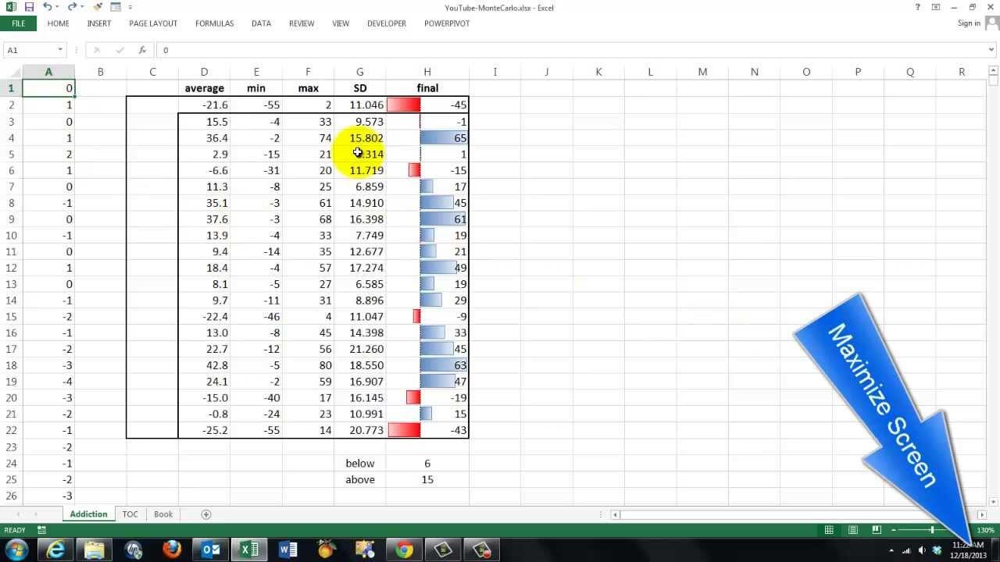

## Table of Contents

## What is a Monte Carlo Simulation?

A Monte Carlo Simulation is a way to predict what might happen in the future by using random numbers and trying out many different possibilities. Imagine you want to guess how long it will take to finish a project. Instead of just making one guess, you could use a computer to make thousands of guesses, each time using different numbers for how long each part of the project might take. By doing this many times, you can see all the different ways the project could finish and get a better idea of how long it might really take.

This method is useful because it helps us understand things that are hard to predict, like stock prices or weather patterns. Instead of relying on just one prediction, Monte Carlo Simulations show us a range of possible outcomes. This gives us a better picture of the risks and uncertainties involved. For example, if you are planning a trip and want to know if you should bring an umbrella, a Monte Carlo Simulation could show you how likely it is to rain based on many different weather scenarios.

## Why would someone use Monte Carlo Simulation in Excel?

Someone might use Monte Carlo Simulation in Excel because it's an easy way to see what could happen in the future without needing fancy software. Excel is a tool that many people already know how to use, so they can set up a simulation without learning something new. By using random numbers and formulas in Excel, you can run many different scenarios quickly. This helps you understand how likely certain outcomes are, like how much money you might make or lose in a business plan.

For example, if you're thinking about starting a small business, you could use Excel to see how different costs and sales might affect your profits. You could set up a spreadsheet where some numbers change randomly each time you run the simulation. After running it many times, you'll see a range of possible profits. This can help you decide if your business idea is worth trying or if you need to change your plans. Using Excel for this makes it simple and accessible for anyone to do their own Monte Carlo Simulation.

## How can I set up a basic Monte Carlo Simulation in Excel?

To set up a basic Monte Carlo Simulation in Excel, start by deciding what you want to predict. For example, let's say you want to guess how much money you might have in your savings account at the end of a year. First, make a list of all the things that can change, like how much money you earn each month or how much you spend. Next, pick a cell in Excel where you will put a random number that represents one of these changing things. You can use the `RAND()` function to get a random number between 0 and 1. For example, if you earn between $1,000 and $2,000 a month, you could use the formula `=RAND() * 1000 + 1000` to get a random number in that range.

Now, use these random numbers to calculate what might happen at the end of the year. In another cell, add up all the random numbers to see your total earnings and subtract your total spending to find out how much money you might have left. To run the simulation many times, you can press `F9` to refresh the random numbers and see a new result. Do this many times and write down the results. After running it hundreds or thousands of times, you'll see a range of possible outcomes. This will give you a good idea of what might happen with your savings account at the end of the year.

## What are the key components needed for a Monte Carlo Simulation in Excel?

To set up a Monte Carlo Simulation in Excel, you need a few key things. First, you need to decide what you want to predict, like how much money you might have at the end of the year. Then, you need to list all the things that can change, like your monthly earnings or spending. Each of these changing things needs a cell in Excel where you put a random number using the `RAND()` function. For example, if your earnings can be between $1,000 and $2,000, you can use a formula like `=RAND() * 1000 + 1000` to get a random number in that range.

Next, you need a way to calculate the outcome based on these random numbers. In another cell, you can add up all the random numbers to see your total earnings and subtract your total spending to find out how much money you might have left. To run the simulation many times, press `F9` to refresh the random numbers and see a new result. Keep doing this and write down the results. After running it hundreds or thousands of times, you'll see a range of possible outcomes, giving you a good idea of what might happen.

## How do I generate random numbers in Excel for Monte Carlo Simulation?

To generate random numbers in Excel for a Monte Carlo Simulation, you use the `RAND()` function. This function gives you a number between 0 and 1. If you want a number in a different range, you can change it. For example, if you want a random number between 1,000 and 2,000, you can use the formula `=RAND() * 1000 + 1000`. This takes the random number between 0 and 1, multiplies it by 1,000, and then adds 1,000 to get a number in your desired range.

Once you have these random numbers, you can use them to predict what might happen. For example, if you're trying to guess how much money you might have at the end of the year, you can use random numbers for things like your monthly earnings or spending. By pressing `F9`, you can refresh these random numbers and see a new result each time. Doing this many times helps you see all the different ways things could turn out, which is what a Monte Carlo Simulation is all about.

## What functions in Excel are useful for Monte Carlo Simulation?

The main function you'll use in Excel for a Monte Carlo Simulation is `RAND()`. This function gives you a random number between 0 and 1. If you want a number in a different range, you can change it. For example, if you want a random number between 1,000 and 2,000, you can use the formula `=RAND() * 1000 + 1000`. This takes the random number between 0 and 1, multiplies it by 1,000, and then adds 1,000 to get a number in your desired range. You can use these random numbers to guess what might happen in the future.

Another useful function is `F9`. When you press `F9`, Excel refreshes all the random numbers in your spreadsheet. This lets you see a new result each time. By pressing `F9` many times, you can run your Monte Carlo Simulation over and over again. This helps you see all the different ways things could turn out. For example, if you're trying to guess how much money you might have at the end of the year, you can use random numbers for things like your monthly earnings or spending, and pressing `F9` will show you different possibilities.

## How can I model uncertainty using Monte Carlo Simulation in Excel?

To model uncertainty using Monte Carlo Simulation in Excel, you start by figuring out what you want to predict and what things can change. For example, if you want to guess how much money you might have at the end of the year, you need to think about things like your monthly earnings and spending. These things can change, so you use random numbers to represent them. In Excel, you can use the `RAND()` function to get a random number between 0 and 1. If you need a number in a different range, like between $1,000 and $2,000, you can use a formula like `=RAND() * 1000 + 1000`. This way, you can make a guess about how much money you might have based on these random numbers.

Once you have set up your random numbers, you can calculate what might happen at the end of the year. In a cell, you add up all the random numbers to see your total earnings and subtract your total spending to find out how much money you might have left. To run the simulation many times, you press `F9` to refresh the random numbers and see a new result. By doing this many times and writing down the results, you'll see a range of possible outcomes. This helps you understand how likely different amounts of money are at the end of the year, showing you the uncertainty in your prediction.

## What are common pitfalls to avoid when running Monte Carlo Simulations in Excel?

One common pitfall when running Monte Carlo Simulations in Excel is not running the simulation enough times. If you only run it a few times, you won't see all the different ways things could turn out. You need to run it hundreds or thousands of times to get a good idea of what might happen. Another mistake is not using the right range for your random numbers. If you're guessing how much money you might earn, and you use numbers that are too high or too low, your predictions won't be accurate. Make sure your random numbers match the real possibilities.

Another issue is forgetting to save your results. When you press F9 to refresh the random numbers, the old results disappear unless you write them down or use another cell to keep track. It's easy to lose all your work if you don't save the outcomes of each run. Also, be careful not to make your spreadsheet too complicated. If you add too many formulas or random numbers, it can be hard to understand and might even slow down your computer. Keep it simple and clear so you can see what's going on and trust your results.

## How can I validate the results of a Monte Carlo Simulation in Excel?

To validate the results of a Monte Carlo Simulation in Excel, you need to check if your simulation makes sense. Start by comparing your results to what you already know or expect. For example, if you're guessing how much money you might have at the end of the year, see if the range of numbers you get from the simulation seems reasonable. If your results are way off from what you thought, there might be a problem with how you set up your random numbers or your formulas. You can also try running the simulation with different starting numbers to see if you get similar results. If the results change a lot every time, it might mean your simulation isn't reliable.

Another way to validate your results is to use other methods to check them. For example, you could use a simpler calculation or a different tool to predict the same thing. If both methods give you similar answers, it's a good sign that your Monte Carlo Simulation is working right. Also, make sure to run the simulation many times. The more times you run it, the more confident you can be in your results. If you only run it a few times, you might miss important possibilities. By doing these checks, you can feel more sure that your Monte Carlo Simulation in Excel is giving you good information.

## How can I optimize the performance of Monte Carlo Simulations in Excel?

To make your Monte Carlo Simulations run faster in Excel, start by keeping your spreadsheet simple. Too many formulas or random numbers can slow things down. Try to use only the formulas you really need and make sure they are not too complicated. Also, if you can, use Excel's built-in functions like `RAND()` instead of making your own random number formulas. These built-in functions are faster because they are made to work well with Excel.

Another way to speed up your simulations is to run them in smaller batches. Instead of running thousands of simulations all at once, you can break them into smaller groups. This can help your computer handle the work better. Also, if you have a lot of results to save, think about using another tool like a simple text file or a different program to keep track of them. This way, Excel won't get bogged down trying to do too many things at the same time. By keeping things simple and breaking the work into smaller parts, you can make your Monte Carlo Simulations run more smoothly in Excel.

## What advanced techniques can be applied to Monte Carlo Simulations in Excel?

To make your Monte Carlo Simulations in Excel even better, you can use a technique called "Latin Hypercube Sampling." Instead of just using the `RAND()` function to get random numbers, Latin Hypercube Sampling helps you spread out your random numbers more evenly. This way, you can get a better idea of all the different possibilities without running the simulation as many times. For example, if you want to guess how much money you might have at the end of the year, using Latin Hypercube Sampling can help you see a wider range of outcomes with fewer runs, making your simulation faster and more accurate.

Another advanced technique is to use "antithetic variates" to make your results more reliable. This means you run the simulation twice, once with the normal random numbers and once with the opposite numbers. By doing this, you can see if your results balance out, which can help reduce errors in your predictions. For instance, if you're trying to predict how long a project might take, using antithetic variates can give you a more stable estimate by showing you both the best and worst case scenarios at the same time. These techniques can make your Monte Carlo Simulations in Excel more powerful and give you better insights into what might happen in the future.

## How can Monte Carlo Simulation in Excel be used for risk analysis and decision making?

Monte Carlo Simulation in Excel can help you understand and manage risks by showing you all the different ways things could turn out. Imagine you're planning a project and want to know how long it might take. You can use random numbers in Excel to guess how long each part of the project will take, then run the simulation many times to see a range of possible outcomes. This way, you can see not just one guess, but many different guesses. By looking at all these possibilities, you can figure out how likely it is that your project will finish on time, or if you need to plan for delays.

This method also helps with decision making because it gives you a clearer picture of what might happen. For example, if you're thinking about starting a business, you can use Monte Carlo Simulation to see how different costs and sales might affect your profits. By running the simulation many times, you can see a range of possible profits and losses. This helps you understand the risks involved and make better decisions. Instead of just hoping for the best, you can plan for different scenarios and choose the best way forward based on what the simulation shows you.

## How can Monte Carlo Simulation be integrated into Excel for Algo Trading?

Integrating Monte Carlo simulations with [algorithmic trading](/wiki/algorithmic-trading) models in Excel allows analysts to perform comprehensive strategy testing that accounts for market [volatility](/wiki/volatility-trading-strategies) and uncertainty. This integration is pivotal for developing robust trading strategies by simulating a range of potential market conditions and assessing their impact on algorithmic trades.

To create effective simulations, analysts set up models that incorporate random number generation to mimic the stochastic nature of financial markets. In Excel, this can be achieved by utilizing functions such as `RAND()` or `NORM.INV()` for generating random variables that follow a specific distribution. These variables are then used to simulate the movements in asset prices over time, thereby enabling the evaluation of trading strategies under various hypothetical scenarios.

The process involves generating a substantial number of trade simulations to create a distribution of possible outcomes. For example, using Excel, one could simulate thousands of potential price paths for a stock by importing historical data and applying random shocks to price movements based on historical volatility. This is essential in evaluating how a trading algorithm might perform under different market conditions.

A basic implementation in Excel might involve setting the initial stock price in one cell (e.g., A1), using the `RAND()` function in subsequent cells to simulate daily price changes, and then calculating the new stock price using a simple formula, such as:

$$
\text{New Price}_{t} = \text{Price}_{t-1} \times (1 + \text{Random Change})
$$

Here, "Random Change" could be structured using:

$$
\text{Random Change} = \text{Mean Return} + \text{Volatility} \times \text{NORM.INV(RAND(), 0, 1)}
$$

where "Mean Return" is the expected return of the stock, and "Volatility" is derived from the historical standard deviation of returns.

In addition to manual setups in Excel, more complex analyses can be achieved by using Visual Basic for Applications (VBA) to automate simulations. VBA allows for the creation of more intricate algorithms and can handle larger datasets more efficiently. For instance, a VBA macro could loop over a set number of simulations, store the results in an array, and output a comprehensive statistical analysis of the trading strategy's performance.

This integration of Monte Carlo simulations within Excel's framework enables traders to quantify the probabilities of various outcomes and refine their algorithms to better hedge against potential risks. A solid grasp of Excel functions and financial market dynamics is crucial for interpreting simulation results accurately and making informed decisions based on data-driven insights.

## References & Further Reading

[1]: Brandimarte, P. (2014). ["Handbook in Monte Carlo Simulation: Applications in Financial Engineering, Risk Management, and Economics."](https://onlinelibrary.wiley.com/doi/book/10.1002/9781118593264) Wiley.

[2]: Glasserman, P. (2003). ["Monte Carlo Methods in Financial Engineering."](https://link.springer.com/book/10.1007/978-0-387-21617-1) Springer.

[3]: Hull, J.C. (2018). ["Options, Futures, and Other Derivatives."](https://www.semanticscholar.org/paper/Options%2C-Futures%2C-and-Other-Derivatives-Hull/89bdee500c8623864fc9eb7a471546aa713acc44) Pearson.

[4]: Chan, E. (2013). ["Algorithmic Trading: Winning Strategies and Their Rationale."](https://github.com/leoncuhk/awesome-quant-ai) Wiley.

[5]: Eddelbuettel, D. (2013). ["Seamless R and C++ Integration with Rcpp."](https://link.springer.com/book/10.1007/978-1-4614-6868-4) Springer.