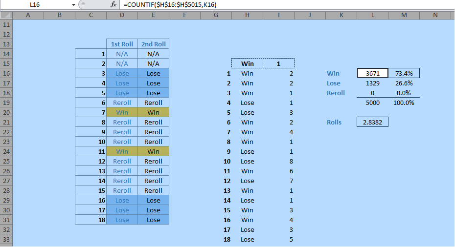

Excel modeling and simulation techniques serve as indispensable tools in finance and analytics, offering robust capabilities for decision-making and risk management. Within this framework, Monte Carlo simulation and algorithmic trading stand out as sophisticated applications that have the potential to significantly elevate strategic planning and financial forecasting. Monte Carlo simulation is a computational approach that leverages randomness to model the probability of various outcomes in processes complicated by intrinsic uncertainties, such as those found in financial markets. Algorithmic trading, meanwhile, employs precise computer algorithms to execute trades at speeds and frequencies that far outstrip human capabilities, allowing for the automated processing of vast datasets to identify and capitalize on fleeting market opportunities.

This article focuses on the methodologies, applications, and benefits of utilizing Excel for these powerful techniques. Excel's vast array of functions, coupled with its accessibility, makes it a valuable platform for developing and testing models ranging from basic financial calculations to complex simulations. By understanding Monte Carlo methods and developing algorithmic strategies within Excel, professionals can harness data-driven insights to enhance performance and profit margins.



The knowledge of using Excel in these scenarios is essential for professionals aspiring to elevate their analytical capabilities. Whether one is a novice seeking to understand the basics or a seasoned analyst aiming to refine sophisticated models, the integration of Monte Carlo simulations and algorithmic trading strategies in Excel provides a comprehensive guide to boosting proficiency and achieving accurate predictive analytics. Through real-world examples and practical applications, the potential of Excel as a versatile tool for modern finance and analytics becomes evident, offering a framework for those willing to explore its capabilities further.

## Table of Contents

## Understanding Excel Modeling

Excel modeling is an essential skill for financial analysts, offering a user-friendly and versatile tool for constructing detailed financial models. With Excel, users can input, organize, and manipulate data effortlessly, allowing for efficient data processing and analysis. The platform simplifies complex calculations through a multitude of built-in functions and the ability to create custom formulas tailored to specific analytical needs. 

One of Excel's primary strengths lies in its capability to visualize data through charts, graphs, and pivot tables. These features allow analysts to identify trends, patterns, and correlations within datasets, facilitating a deeper understanding and robust interpretation of financial data. For instance, pivot tables enable dynamic data summarization, letting users manipulate datasets to uncover insights quickly.

Excel's flexibility extends to its ability to implement various simulation techniques, crucial for sophisticated financial analyses such as Monte Carlo simulations and algorithmic trading. Its array of functions and the ability to automate tasks using Macros or Visual Basic for Applications (VBA) make it a powerful tool for prototyping and testing financial models.

Incorporating these simulations in Excel involves using functions like `RAND()` or `NORMINV()` for random number generation, which are integral parts of Monte Carlo simulations. For example, one can simulate the future price of a stock by implementing the stochastic differential equation in Excel using these functions.

Overall, understanding Excel's vast capabilities provides a solid foundation for more specialized roles in finance. It sets the stage for advanced applications, enabling analysts to perform complex tasks with enhanced efficiency and accuracy.

## What is Monte Carlo Simulation?

Monte Carlo simulation is a computational technique that models the probability of various outcomes in processes influenced by random variables. Key to this method is the performance of a large number of simulations to produce a distribution of potential outcomes. Rather than providing a single result, Monte Carlo simulations offer a range of possible results and the probabilities associated with them.

To perform Monte Carlo simulations in Excel, one can utilize built-in functions such as `RAND()` for random number generation. These functions assist in creating datasets that represent possible scenarios, which can be analyzed statistically to make informed predictions. For instance, when assessing the risk of a financial portfolio, Excel can simulate numerous market conditions and measure their effects on asset values.

In finance, Monte Carlo methods are notably applied in areas such as risk assessment and option pricing. For example, the valuation of options can benefit from these simulations by modeling the random fluctuations of the underlying asset's price over time, thereby determining a fair value for the option based on potential future market conditions.

Setting up a Monte Carlo simulation in Excel typically involves defining the model's variables and equations, generating random inputs to simulate uncertainties, and iterating the simulation process numerous times to build a comprehensive outcome probability distribution. This methodology enables analysts to visualize risk and make strategic decisions based on a thorough understanding of possible future states. Understanding and implementing these simulations in Excel is crucial for professionals aiming to model and predict scenarios with inherent uncertainty accurately.

## Algorithmic Trading and Excel

Algorithmic trading employs computer algorithms to execute trading orders at speeds and frequencies beyond human capabilities. It leverages quantitative models to determine the timing, price, and quantity of trades, with the ultimate goal of maximizing profits while minimizing risks. Excel, despite its limitations compared to specialized trading platforms, offers a flexible environment for building and testing trading algorithms. Its widespread availability and user-friendly interface make it an attractive choice for analysts and traders at the prototyping stage.

Excel stands out for its ability to analyze historical price data, a critical step in developing trading strategies. By harnessing its data manipulation and visualization tools, traders can sift through vast datasets to identify trends, correlations, and anomalies essential for strategy formulation. For instance, a moving average crossover strategy, a common trading tactic, can be implemented in Excel by calculating moving averages across different time periods and analyzing their intersections.

Moreover, Excel's simulation capabilities allow traders to backtest their strategies. Backtesting involves applying a trading strategy to historical data to evaluate its effectiveness over a specified period. Excel enables this through its function set, including logical and statistical functions, which can be used to replicate trading conditions and evaluate strategy performance. Consider the following MATLAB-style pseudocode that outlines a simple moving average crossover test:

```python
# Pseudocode illustrating a moving average crossover strategy in Excel-style logic
prices = [list of historical prices]
short_window = 50
long_window = 200
signals = []

for i in range(long_window, len(prices)):
    short_ma = sum(prices[i-short_window:i]) / short_window
    long_ma = sum(prices[i-long_window:i]) / long_window

    if short_ma > long_ma:
        signals.append("Buy")
    elif short_ma < long_ma:
        signals.append("Sell")
    else:
        signals.append("Hold")
```

While Excel might not be suitable for executing live trading, its role in prototyping and strategy refinement is invaluable. Traders can iteratively test and fine-tune their models in Excel before migrating to more robust platforms for execution. This is crucial for validating strategies under different market conditions and ensuring they are resilient to [volatility](/wiki/volatility-trading-strategies).

The use of VBA (Visual Basic for Applications) in Excel further enhances [algorithmic trading](/wiki/algorithmic-trading) models by automating repetitive tasks and enabling more complex analyses. VBA allows users to create custom functions, automate data imports, and integrate Excel with external data sources, thus increasing the depth and efficiency of trading models. For example, a VBA script can automatically refresh data feeds, execute calculations, and update charts, providing real-time insights essential for decision-making.

In summary, Excel serves as a versatile and cost-effective tool for developing and refining trading strategies during the initial stages of algorithmic trading. Its integration of data analysis, visualization, and basic automation functionalities makes it a formidable ally for traders working on strategy development and [backtesting](/wiki/backtesting). As strategies mature and require more sophisticated execution, transitioning to dedicated trading platforms may be necessary, but Excel remains an essential part of the development toolkit.

## Integrating Monte Carlo Simulation in Excel for Algo Trading

Integrating Monte Carlo simulations with algorithmic trading models in Excel allows analysts to perform comprehensive strategy testing that accounts for market volatility and uncertainty. This integration is pivotal for developing robust trading strategies by simulating a range of potential market conditions and assessing their impact on algorithmic trades.

To create effective simulations, analysts set up models that incorporate random number generation to mimic the stochastic nature of financial markets. In Excel, this can be achieved by utilizing functions such as `RAND()` or `NORM.INV()` for generating random variables that follow a specific distribution. These variables are then used to simulate the movements in asset prices over time, thereby enabling the evaluation of trading strategies under various hypothetical scenarios.

The process involves generating a substantial number of trade simulations to create a distribution of possible outcomes. For example, using Excel, one could simulate thousands of potential price paths for a stock by importing historical data and applying random shocks to price movements based on historical volatility. This is essential in evaluating how a trading algorithm might perform under different market conditions.

A basic implementation in Excel might involve setting the initial stock price in one cell (e.g., A1), using the `RAND()` function in subsequent cells to simulate daily price changes, and then calculating the new stock price using a simple formula, such as:

$$
\text{New Price}_{t} = \text{Price}_{t-1} \times (1 + \text{Random Change})
$$

Here, "Random Change" could be structured using:

$$
\text{Random Change} = \text{Mean Return} + \text{Volatility} \times \text{NORM.INV(RAND(), 0, 1)}
$$

where "Mean Return" is the expected return of the stock, and "Volatility" is derived from the historical standard deviation of returns.

In addition to manual setups in Excel, more complex analyses can be achieved by using Visual Basic for Applications (VBA) to automate simulations. VBA allows for the creation of more intricate algorithms and can handle larger datasets more efficiently. For instance, a VBA macro could loop over a set number of simulations, store the results in an array, and output a comprehensive statistical analysis of the trading strategy's performance.

This integration of Monte Carlo simulations within Excel's framework enables traders to quantify the probabilities of various outcomes and refine their algorithms to better hedge against potential risks. A solid grasp of Excel functions and financial market dynamics is crucial for interpreting simulation results accurately and making informed decisions based on data-driven insights.

## Benefits and Challenges

Using Excel for Monte Carlo simulations and algorithmic trading presents numerous benefits alongside some inherent challenges. One of the most significant advantages is the cost-effectiveness and accessibility of Excel. Unlike specialized software, which can be expensive and require specific training to operate, Excel is widely available and familiar to most analysts and traders. This accessibility makes it a popular choice for firms and individuals who need effective analytical tools without substantial financial outlays.

Excel’s user-friendly interface is another advantage, serving as an approachable platform for those learning to conduct more complex data analyses. The ability to manipulate data, create charts, and employ formulas with relative ease makes Excel an ideal starting point for analysts branching into quantitative finance. Its learning curve is less steep compared to dedicated statistical software packages, allowing users to gradually build their data-handling skills.

However, Excel does have limitations, particularly in terms of performance and scalability. For instance, when dealing with high-frequency trading or large datasets, Excel may struggle with speed and efficiency. Its computational capabilities, while robust for small to medium-sized datasets and models, may not be sufficient for more demanding applications that require rapid processing and analysis of enormous volumes of data. This limitation is crucial to consider for applications requiring real-time data processing.

To mitigate some of these limitations, users can employ macros and advanced Excel functions. Macros, programmed using Visual Basic for Applications (VBA), automate repetitive tasks and enhance Excel’s functionality. Complex formulas and data analysis tools available in Excel can also help to some extent. Nonetheless, users aiming for professional-grade simulations might eventually need to transition to more specialized platforms like R or Python, which offer better performance and scalability.

Navigating these challenges requires a commitment to continuous learning and the ability to adapt to new tools and methods. Whether it’s enhancing Excel knowledge through advanced courses or learning new programming languages to complement Excel’s capabilities, ongoing education is vital. Analysts and traders must stay updated with evolving technologies and tools to maintain a competitive edge in quantitative and algorithmic trading scenarios.

In summary, while Excel offers a cost-effective, accessible starting point for Monte Carlo simulations and algorithmic trading, users must be cognizant of its limitations. A willingness to adapt and learn new technologies will enable professionals to effectively leverage data insights for enhanced decision-making and strategic planning.

## Conclusion

Excel modeling, Monte Carlo simulations, and algorithmic trading form a triad of powerful tools in finance and analytics. These techniques allow professionals to extract meaningful insights from data, facilitate informed decision-making, and generate optimized strategies that address the complexities and uncertainties inherent in financial markets. Excel serves as a robust platform for these purposes, especially suited for beginners and those looking to prototype various financial models and algorithms due to its wide accessibility and user-friendly interface.

One critical advantage of mastering these tools is the enhanced capacity to anticipate market changes and react proactively. For instance, Monte Carlo simulations enable analysts to quantify and visualize the probability distributions of myriad financial outcomes, thus offering deeper insights into risk management and financial forecasting. Similarly, algorithmic trading, facilitated by Excel, provides a structured approach to developing and testing trading strategies, which is invaluable in a competitive trading environment.

However, while Excel is instrumental for foundational learning and preliminary modeling, it is important to remain aware of its limitations related to performance and scalability. Advanced applications—particularly those involving high-frequency data analysis or large datasets—may surpass Excel's capabilities. This necessitates a strategic progression to more sophisticated software that can handle such complexities without compromising speed or accuracy.

Continuous learning and adaptation are crucial for maximizing the potential benefits of these techniques. As technology evolves and financial markets continue to grow in complexity, staying abreast of new tools and methodologies is imperative. Engaging in ongoing education and practical application ensures that financial professionals remain agile, able to implement the most effective strategies, and keep pace with innovations in data analytics.

In sum, integrating simulation techniques within Excel is an invaluable practice that supports modern analytics and trading strategies. The foundational knowledge gained through Excel allows professionals to make data-driven decisions and pave the way for scalable, innovative solutions in finance and analytics.

## References & Further Reading

[1]: Brandimarte, P. (2014). ["Handbook in Monte Carlo Simulation: Applications in Financial Engineering, Risk Management, and Economics."](https://onlinelibrary.wiley.com/doi/book/10.1002/9781118593264) Wiley.

[2]: Glasserman, P. (2003). ["Monte Carlo Methods in Financial Engineering."](https://link.springer.com/book/10.1007/978-0-387-21617-1) Springer.

[3]: Hull, J.C. (2018). ["Options, Futures, and Other Derivatives."](https://www.semanticscholar.org/paper/Options%2C-Futures%2C-and-Other-Derivatives-Hull/89bdee500c8623864fc9eb7a471546aa713acc44) Pearson.

[4]: Chan, E. (2013). ["Algorithmic Trading: Winning Strategies and Their Rationale."](https://github.com/leoncuhk/awesome-quant-ai) Wiley.

[5]: Eddelbuettel, D. (2013). ["Seamless R and C++ Integration with Rcpp."](https://link.springer.com/book/10.1007/978-1-4614-6868-4) Springer.