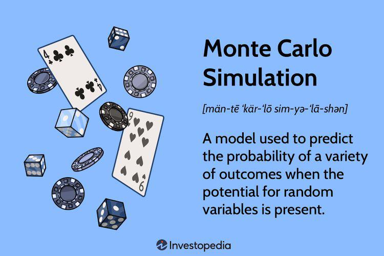

In the world of finance, predicting the movement of asset prices is crucial for traders and investors. Price forecasting enables market participants to make informed decisions regarding buying, selling, or holding financial assets, impacting portfolio optimization and risk management strategies. Among the numerous models developed for such predictions, Geometric Brownian Motion (GBM) stands out as a popular choice for simulating the evolution of stock prices and other financial assets over time. GBM models the random nature of asset prices, incorporating both a deterministic trend and stochastic volatility, thus capturing the inherent uncertainties in financial markets.

Monte Carlo simulation, on the other hand, is a powerful computational tool that employs random sampling to estimate the probability of various outcomes. By generating a multitude of possible scenarios, Monte Carlo methods help in assessing the range of potential future states an asset might reach, despite the unpredictability introduced by random variables. This probabilistic approach endows financial analysts and traders with the ability to quantify risk and uncertainty associated with various financial strategies and investments.



Combining GBM with Monte Carlo simulations yields a potent method for generating extensive potential future price paths for assets, enhancing decision-making and risk management processes. Through this integration, practitioners can better forecast the range of possible price movements and prepare for various financial contingencies. This is particularly advantageous in modern algorithmic trading, where automated systems rely on predefined conditions to execute trades. By leveraging simulations like GBM complemented by Monte Carlo, traders can devise sophisticated algorithms that anticipate market movements, optimize trading strategies, and adapt to dynamic market conditions.

Algorithmic trading systems benefit significantly from these simulations as they provide a robust platform for back-testing strategies under different market scenarios. This trial-and-error approach allows traders to refine their strategies based on historical data before deploying them in the live market environment, ultimately aiming for enhanced performance and reduced exposure to unforeseen market events. As a result, Geometric Brownian Motion and Monte Carlo simulations have become indispensable tools in the arsenal of quantitative finance, offering a structured method to navigate the complexities of global financial markets.

## Table of Contents

## Understanding Geometric Brownian Motion

Geometric Brownian Motion (GBM) is a mathematical model widely used in finance to represent the random fluctuations in the prices of financial assets such as stocks. As a stochastic process, it captures the inherent uncertainty and variability in asset prices over time. The GBM model is defined by its distinct characteristics of constant drift and volatility, both of which significantly influence price movements.

The core formula governing GBM is expressed as:
$$

dS = \mu S \, dt + \sigma S \, dW
$$
In this equation, $dS$ represents the infinitesimal change in the asset price $S$, $\mu$ denotes the drift rate, and $\sigma$ stands for the [volatility](/wiki/volatility-trading-strategies) of the asset. The term $dW$ corresponds to a Wiener process, which is essentially a standard Brownian motion or random shock component that introduces randomness into the model.

A fundamental assumption underlying the GBM is that the natural logarithm of stock prices is normally distributed. This premise aligns with the empirical observation that stock price returns often exhibit a pattern resembling a normal distribution when logarithmic changes are considered. This assumption makes GBM particularly suited for modeling financial time series data. By assuming that the logarithm of asset prices follows a normal distribution, GBM effectively captures the compound returns, which are crucial in financial calculations.

In practical applications, the GBM framework allows analysts and traders to simulate and predict future stock prices by considering both the deterministic component ($\mu S \, dt$) and the stochastic element ($\sigma S \, dW$). The drift $\mu$ reflects the expected rate of return on the asset, while the volatility $\sigma$ accounts for the uncertainty or risk associated with price changes. This balance between deterministic trends and randomness forms the basis of many financial models used in risk management and option pricing.

Python can be used to simulate Geometric Brownian Motion, providing a practical demonstration of the model's application:

```python
import numpy as np
import matplotlib.pyplot as plt

# Parameters
S0 = 100     # Initial stock price
mu = 0.05    # Drift rate
sigma = 0.2  # Volatility
T = 1.0      # Time horizon in years
dt = 0.01    # Time step
N = int(T/dt)  # Number of steps
np.random.seed(42)

# Simulate Geometric Brownian Motion
t = np.linspace(0, T, N)
W = np.random.standard_normal(size=N) 
W = np.cumsum(W) * np.sqrt(dt) 
X = (mu - 0.5 * sigma**2) * t + sigma * W 
S = S0 * np.exp(X)  # GBM formula

# Plot the simulation
plt.plot(t, S)
plt.title("Simulated Geometric Brownian Motion")
plt.xlabel("Time")
plt.ylabel("Stock Price")
plt.show()
```

This code demonstrates how to implement a simple simulation of GBM with discrete time steps, allowing visualization of the potential trajectories an asset price can follow under the GBM model. By adjusting the parameters, such as drift, volatility, time horizon, and step size, traders and financial analysts can explore different scenarios and better understand the dynamics of asset pricing.

## Monte Carlo Simulation in Financial Modeling

Monte Carlo simulation is an indispensable technique in financial modeling that estimates the probability of various outcomes in processes affected by random variables. By leveraging random sampling, this approach generates a multitude of scenarios, which, in turn, provide a comprehensive view of how a financial system may evolve. The inherent randomness in financial markets, due to numerous influencing factors such as economic indicators, investor behavior, and geopolitical events, makes exact predictions difficult. Monte Carlo simulation aids in bridging this gap by offering probabilistic insights.

In financial contexts, Monte Carlo simulation is employed to forecast the possible returns or price levels of investments over defined periods. This is achieved by creating multiple simulations where each follows a potential path an investment could take under varying conditions. For instance, to model the price of a stock using Monte Carlo simulation, the process involves developing a mathematical model that incorporates necessary financial metrics like expected returns and volatility, often represented as drift ($\mu$) and standard deviation ($\sigma$), respectively.

The simulation executes a series of iterations, each representing a potential future state of the stock price. Often, a geometric Brownian motion model forms the backbone of these simulations, characterized by the stochastic differential equation:

$$
dS_t = \mu S_t dt + \sigma S_t dW_t
$$

where:
- $S_t$ is the stock price at time $t$
- $\mu$ is the expected return (drift)
- $\sigma$ is the volatility
- $dW_t$ denotes the Wiener process, representing the random component

In practice, simulations are implemented by discretizing this equation over a given time horizon, using numerical methods to project price paths. Here’s a simple demonstration using Python:

```python
import numpy as np

# Parameters
S0 = 100     # Initial stock price
mu = 0.1     # Drift (expected return)
sigma = 0.2  # Volatility
T = 1.0      # Time horizon (1 year)
N = 252      # Number of time steps (trading days)
M = 10000    # Number of simulations

# Time steps
dt = T / N

# Simulate M paths with N steps
np.random.seed(42)  # For reproducibility
price_paths = np.zeros((M, N + 1))
price_paths[:, 0] = S0

for t in range(1, N + 1):
    z = np.random.standard_normal(M)  # Standard normal random variables
    price_paths[:, t] = price_paths[:, t - 1] * np.exp((mu - 0.5 * sigma ** 2) * dt + sigma * np.sqrt(dt) * z)

# Calculate expected ends and visualize paths
expected_price = np.mean(price_paths[:, -1])
print(f"Expected price at T={T} is {expected_price}")
```

Monte Carlo simulations are invaluable for evaluating the risk and uncertainty connected with diverse financial strategies and investment portfolios. By analyzing the simulated distribution of outcomes, financial analysts can determine the probability of an investment achieving certain levels or failing to meet specified benchmarks. This information is crucial for constructing strategies aimed at maximizing returns while minimizing potential risks. Additionally, Monte Carlo methods enable stress testing of portfolios under extreme market conditions, offering a robust framework for risk management and strategic planning in finance.

## Implementing Monte Carlo Simulation with GBM

To implement a Monte Carlo simulation using Geometric Brownian Motion (GBM), the first step involves setting up the necessary parameters. These parameters include the initial stock price (S₀), the drift (μ), the volatility (σ), the time horizon (T), and the number of simulations (N). Each of these variables plays a crucial role in defining the behavior and output of the simulation.

The random variable generation is typically done through the Box-Muller transform or other methods to produce standard Gaussian random numbers. These numbers are essential for simulating the shock component in the GBM model, which follows a Wiener process (W). The GBM formula is expressed as:

$$
dS = \mu S dt + \sigma S dW
$$

where:

- $dS$ is the change in stock price,
- $\mu$ is the drift rate,
- $\sigma$ is the volatility, and
- $dW$ represents a standard Wiener process, characterized by randomly generated Gaussian variables.

In practice, the continuous process is discretized to facilitate simulation. The discrete approximation of the GBM model over a small time step ($\Delta t$) is given by:

$$
S_{t+\Delta t} = S_t \exp\left(\left(\mu - \frac{\sigma^2}{2}\right) \Delta t + \sigma \epsilon \sqrt{\Delta t}\right)
$$

where $\epsilon$ is a standard normal random variable.

Here is a simple Python implementation for simulating GBM using Monte Carlo:

```python
import numpy as np

def simulate_gbm(S0, mu, sigma, T, dt=1/252, num_simulations=10000):
    np.random.seed(42)  # For reproducibility
    num_steps = int(T / dt)
    paths = np.zeros((num_steps, num_simulations))
    paths[0] = S0

    for t in range(1, num_steps):
        z = np.random.standard_normal(num_simulations)  # Generate random shocks
        paths[t] = paths[t - 1] * np.exp((mu - 0.5 * sigma**2) * dt + sigma * z * np.sqrt(dt))

    return paths

# Example parameters
S0 = 100  # Initial stock price
mu = 0.05  # Drift
sigma = 0.2  # Volatility
T = 1  # 1 year

paths = simulate_gbm(S0, mu, sigma, T)
```

By simulating multiple paths, this method produces a range of potential future prices. Analysts can evaluate these paths to calculate the probabilities of various outcomes, such as the asset price falling below a specified level. This probabilistic insight is invaluable for risk management and strategic decision-making in financial markets. Understanding these potential outcomes can, for example, help investors and traders evaluate the risk of investments or develop strategies to hedge against possible adverse scenarios.

## Applications in Algorithmic Trading

In [algorithmic trading](/wiki/algorithmic-trading), Geometric Brownian Motion (GBM) with Monte Carlo simulations provides a structured methodology for developing automated trading strategies. These strategies are built upon predefined conditions and enhanced with simulations to forecast possible future price movements. By employing these techniques, traders can simulate thousands of potential price paths over specific trading periods, enhancing insight into probable price dynamics.

Algorithmic trading systems can significantly leverage GBM simulations in back-testing scenarios. By analyzing how a trading strategy would perform against historical data, traders can optimize these strategies, ensuring robustness before deploying them in live markets. Performing back-tests involves running simulations on past price data to evaluate the strategy's performance metrics, such as return on investment, Sharpe ratio, and maximum drawdown. This data-driven approach helps refine strategies, reducing the likelihood of unfavorable outcomes when applied in real-time trading.

In terms of risk management, Monte Carlo simulations empower traders to simulate extreme market conditions and assess the resilience of their strategies. These simulations allow the exploration of rare but plausible scenarios, preparing traders for potential market disruptions. By modeling a wide range of possible market movements, traders can identify vulnerabilities in their strategies and implement risk mitigation measures proactively.

For example, a Python implementation might look like this for a simple GBM-based Monte Carlo simulation:

```python
import numpy as np

# Parameters
S0 = 100  # initial stock price
mu = 0.05  # annual drift
sigma = 0.2  # annual volatility
T = 1.0  # time horizon in years
dt = 0.01  # time step
N = int(T/dt)  # number of time steps
simulations = 1000  # number of simulation paths

# Simulation
np.random.seed(42)
S_paths = np.zeros((simulations, N+1))
S_paths[:, 0] = S0

for t in range(1, N+1):
    Z = np.random.standard_normal(simulations)  # Generate random samples
    S_paths[:, t] = S_paths[:, t-1] * np.exp((mu - 0.5 * sigma**2) * dt + sigma * np.sqrt(dt) * Z)

# Analyze results
mean_final_price = np.mean(S_paths[:, -1])
print(f"Expected final stock price: {mean_final_price:.2f}")
```

This code generates simulated future price paths for a stock where the initial price is 100, using 1000 simulations. After performing these simulations, traders can analyze the distribution of final prices to inform decisions regarding strategy adjustments or risk mitigation. This approach underscores the potent combination of GBM and Monte Carlo simulations in deriving actionable insights that drive algorithmic trading success. As such, understanding and utilizing these simulations can provide a competitive edge in financial markets.

## Conclusion

Geometric Brownian Motion (GBM) integrated with Monte Carlo simulation offers a potent framework for financial modeling by providing a structured method for predicting possible future states of asset prices. These tools are indispensable in contemporary algorithmic trading, serving not only to enhance the accuracy of predictions regarding market movements but also to facilitate efficient risk management. They allow traders to devise robust strategies grounded in the potential paths simulated under various market conditions.

The continuous advancements in computing power and the increasing accessibility of comprehensive data sets are driving the growing prominence and applicability of GBM and Monte Carlo simulations within quantitative finance. These factors enable more accurate and faster simulations, which are crucial in making timely trading decisions. Furthermore, as computational costs decrease, the scope of applications broadens, making it feasible to perform highly complex simulations that were previously unattainable.

Understanding and deploying GBM with Monte Carlo simulations are particularly advantageous for traders aiming to gain a competitive edge in financial markets. By analyzing the diverse range of simulated price paths, traders can anticipate potential future price distributions and respond more strategically to market changes. This predictive capability not only aids operational planning but also enhances responsiveness to unforeseen events, thereby bolstering the robustness of financial strategies deployed in volatile markets. These models and methods are invaluable for navigating the complexities of financial markets.

## References & Further Reading

[1]: Hull, J. C. (2018). ["Options, Futures, and Other Derivatives"](https://www.semanticscholar.org/paper/Options%2C-Futures%2C-and-Other-Derivatives-Hull/89bdee500c8623864fc9eb7a471546aa713acc44). Pearson.

[2]: Glasserman, P. (2004). ["Monte Carlo Methods in Financial Engineering"](https://link.springer.com/book/10.1007/978-0-387-21617-1). Springer.

[3]: Wilmott, P. (2006). ["Paul Wilmott Introduces Quantitative Finance"](https://www.amazon.com/Paul-Wilmott-Quantitative-Finance-Set/dp/0470018704). Wiley.

[4]: Shreve, S. E. (2004). ["Stochastic Calculus for Finance I: The Binomial Asset Pricing Model"](https://www.amazon.com/Stochastic-Calculus-Finance-Binomial-Springer/dp/0387249680). Springer.

[5]: Taleb, N. N. (2008). ["The Black Swan: The Impact of the Highly Improbable"](https://www.jstor.org/stable/23045073). Random House Trade Paperbacks.

[6]: Jorion, P. (2007). ["Value at Risk: The New Benchmark for Managing Financial Risk"](https://link.springer.com/article/10.1007/s11408-007-0057-3). McGraw-Hill.