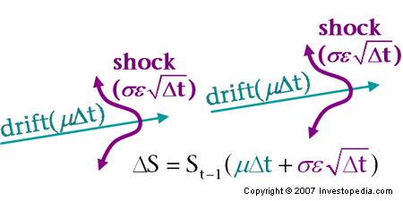

## Table of Contents

## What is a Monte Carlo simulation?

A Monte Carlo simulation is a way to solve problems using random numbers and lots of tries. Imagine you want to know how likely it is that it will rain tomorrow. Instead of just guessing, you could use a computer to pretend it's tomorrow many, many times. Each time, the computer would use random numbers to decide if it rains or not. After doing this thousands of times, you can see how often it rained and use that to guess the chance of rain.

This method is useful because it can handle problems that are too hard to solve exactly. For example, figuring out how much money you might have in the future can be tricky because there are so many things that could happen, like getting a raise or losing your job. A Monte Carlo simulation can help by running many different scenarios with random events. By looking at all these scenarios, you can get a good idea of what might happen, even if you can't predict the future perfectly.

## What is Geometric Brownian Motion (GBM)?

Geometric Brownian Motion (GBM) is a way to model how things like stock prices might change over time. Imagine you have a stock, and its price goes up and down every day. GBM says that the stock price changes in a special way: it grows or shrinks by a little bit each day, but the change is random. The amount it changes depends on two things: a steady growth rate (like how much the stock usually grows each year) and a random part that can make the price jump up or down.

This model is useful because it's simple but can still show how stock prices can be unpredictable. People use GBM to guess what might happen to stock prices in the future. They run the model many times with different random changes to see all the possible ways the stock price could go. This helps them understand the risks and make better decisions about buying or selling stocks.

## How can Monte Carlo simulations be applied to Geometric Brownian Motion?

Monte Carlo simulations can be used with Geometric Brownian Motion (GBM) to predict how things like stock prices might change in the future. Imagine you want to guess what a stock's price will be in a year. You can use GBM to model how the stock price grows or shrinks each day, with some steady growth and some random changes. By running a Monte Carlo simulation, you can do this many times, each time using different random changes. This lets you see many different possible futures for the stock price.

After running the simulation thousands of times, you end up with a bunch of different paths the stock price could take. You can then look at all these paths to see things like the average price, the highest and lowest prices, and how likely it is that the price will be above or below certain levels. This helps you understand the risks and make better decisions about whether to buy or sell the stock. It's like looking into a crystal ball, but instead of magic, you're using math and random numbers to see what might happen.

## Why is GBM commonly used in financial modeling?

GBM is commonly used in financial modeling because it's a good way to predict how stock prices might change over time. It says that stock prices grow or shrink a little bit each day, with some steady growth and some random changes. This matches how stocks actually behave in the real world, where prices go up and down but usually grow over time. By using GBM, people can make models that are simple but still show how unpredictable stock prices can be.

Another reason GBM is popular is that it's easy to work with in math and computers. It lets people run lots of different scenarios to see what might happen to stock prices in the future. This is really helpful for making decisions about buying or selling stocks. By running many simulations with GBM, people can get a good idea of the risks and rewards, which is important for making smart choices in finance.

## What are the key parameters of a GBM model?

The key parameters of a Geometric Brownian Motion (GBM) model are the initial value, the drift rate, and the [volatility](/wiki/volatility-trading-strategies). The initial value is just the starting price of whatever you're modeling, like a stock. The drift rate is how much the price usually grows each year, kind of like a steady push upwards. Volatility is how much the price jumps around randomly each day. These three things together help the model guess how the price might change over time.

These parameters are important because they let the model mimic how stock prices move in real life. The drift rate and volatility work together to show that prices usually grow but can also go up and down a lot. By tweaking these numbers, people can make the model fit different stocks or other things they want to predict. This makes GBM a flexible tool for figuring out what might happen in the future.

## How do you generate random paths using GBM in a Monte Carlo simulation?

To generate random paths using Geometric Brownian Motion (GBM) in a Monte Carlo simulation, you start with the initial price of the stock or whatever you're modeling. Then, you use a computer to pretend time is moving forward in small steps, like days or hours. For each step, you calculate a new price based on the current price, the drift rate, and some random changes. The drift rate is like a steady push upwards, showing how much the price usually grows each year. The random changes come from the volatility, which shows how much the price can jump around. You use a random number generator to pick these changes, making sure they match the volatility.

You repeat this process many times, each time starting over from the initial price. Each run gives you a different path that the price could take, because the random changes are different each time. After doing this thousands of times, you end up with a bunch of different paths. By looking at all these paths together, you can see things like the average price, the highest and lowest prices, and how likely it is that the price will be above or below certain levels. This helps you understand the risks and make better decisions about whether to buy or sell the stock.

## What are the steps to implement a Monte Carlo simulation using GBM in a programming language?

To implement a Monte Carlo simulation using Geometric Brownian Motion (GBM) in a programming language, you start by setting up the parameters you need. These include the initial price of the stock, the drift rate which shows how much the price usually grows each year, and the volatility which shows how much the price can jump around. You also decide how many time steps to use, like days or hours, and how many paths or simulations to run. Then, you set up a loop to run the simulation many times. For each run, you start with the initial price and use a random number generator to create the random changes based on the volatility.

In each time step of the simulation, you calculate a new price using the current price, the drift rate, and the random change. You keep track of these new prices over all the time steps to create one path of how the price could change. After finishing one path, you start over and do it again, creating many different paths. Once you've run all the simulations, you collect all the paths together and can analyze them to find things like the average price at the end, the highest and lowest prices, and the chances of the price being above or below certain levels. This helps you understand the risks and make better decisions about the stock.

## How can you estimate the expected value and variance of a stock price using Monte Carlo simulation with GBM?

To estimate the expected value and variance of a stock price using Monte Carlo simulation with Geometric Brownian Motion (GBM), you start by setting up the simulation with the initial price of the stock, the drift rate which shows how much the price usually grows each year, and the volatility which shows how much the price can jump around. You then run the simulation many times, each time starting with the initial price and using random numbers to calculate how the price changes over time. Each run gives you one path of how the price could change, and after running the simulation thousands of times, you end up with many different paths.

Once you have all these paths, you can find the expected value of the stock price at the end of the simulation by taking the average of the final prices from all the paths. This gives you a good guess of what the stock price might be in the future. To find the variance, you look at how much the final prices spread out from the average. You do this by calculating the difference between each final price and the average, squaring those differences, and then finding the average of those squared differences. This tells you how much risk there is, because a high variance means the stock price could end up very different from what you expect.

## What are common applications of Monte Carlo simulations using GBM in finance?

Monte Carlo simulations using Geometric Brownian Motion (GBM) are commonly used in finance to help people make decisions about stocks and other investments. One big use is for pricing options, which are contracts that give you the right to buy or sell a stock at a certain price. By running many different scenarios with GBM, you can see all the possible ways the stock price could go and figure out how much the option might be worth. This helps people decide if it's a good deal to buy or sell the option.

Another use is for risk management, where people want to understand how risky their investments are. By running a Monte Carlo simulation, you can see all the different ways the stock prices could move and how much money you might make or lose. This helps you plan for the worst-case scenarios and make sure you're not taking too much risk. It's like looking into the future in many different ways to be ready for whatever might happen.

Lastly, Monte Carlo simulations with GBM are used for portfolio optimization, where people want to figure out the best way to mix different investments to get the highest return for the least risk. By running simulations, you can see how different mixes of stocks might perform and choose the one that gives you the best chance of making money while keeping the risk low. This helps you build a strong investment plan that can handle the ups and downs of the market.

## How can you improve the accuracy of a Monte Carlo simulation using GBM?

To make a Monte Carlo simulation using Geometric Brownian Motion (GBM) more accurate, you can run more simulations. The more paths you generate, the better your guess will be about what might happen to the stock price. It's like flipping a coin: if you flip it 10 times, you might not get a good idea of how often it lands on heads, but if you flip it 10,000 times, you'll have a much better idea. So, running more simulations gives you a clearer picture of all the different ways the stock price could go.

Another way to improve accuracy is to use better numbers for the drift rate and volatility. If you can find more accurate numbers for how much the stock usually grows each year and how much it jumps around, your model will be closer to what really happens. You can get these better numbers by looking at past data or using more advanced ways to guess them. Also, using smaller time steps in your simulation can help. Instead of looking at how the price changes every day, you could look at how it changes every hour or even every minute. Smaller steps can make your model more detailed and more accurate.

## What are the limitations and potential pitfalls of using GBM in Monte Carlo simulations?

Using Geometric Brownian Motion (GBM) in Monte Carlo simulations has some limitations. One big problem is that GBM assumes stock prices always grow at a steady rate, but in real life, stock prices can jump around a lot more than GBM expects. This means GBM might not be good at predicting big sudden changes in stock prices, like when a company gets bad news and its stock price drops a lot. Also, GBM assumes that the ups and downs of stock prices happen in a certain way, but real stock prices can behave differently. If you use GBM without thinking about these differences, your predictions might be off.

Another potential pitfall is that Monte Carlo simulations with GBM can take a lot of time and computer power, especially if you want to make them more accurate by running more simulations or using smaller time steps. If you don't have enough computer power, you might have to run fewer simulations, which could make your results less reliable. Also, if you use the wrong numbers for the drift rate and volatility, your model won't match what really happens in the market. So, it's important to make sure you have good numbers for these parameters, or your predictions might not be very useful.

## How can advanced techniques like variance reduction be applied to Monte Carlo simulations using GBM?

To make Monte Carlo simulations using Geometric Brownian Motion (GBM) more accurate without running more simulations, you can use something called variance reduction. One way to do this is by using a technique called antithetic variates. Imagine you're flipping a coin to guess the chance of heads. Instead of flipping it many times, you can flip it once and use the opposite result as another guess. So if you get heads, you also count a tails. This helps balance out the random ups and downs, making your guess more accurate with fewer flips. In GBM, you can do something similar by running the simulation with one set of random numbers and then running it again with the opposite set of random numbers. This can help you get a better idea of what might happen to the stock price without needing to run as many simulations.

Another way to reduce variance is by using control variates. This is like using a simpler model that you know a lot about to help you with a harder model. For example, if you're trying to guess the price of a stock, you might use a simpler model that's easier to predict. By comparing the results of the simpler model with your GBM simulation, you can adjust your guesses to be more accurate. This technique helps because it uses what you already know about the simpler model to make your predictions with GBM better. Both antithetic variates and control variates can help make your Monte Carlo simulations with GBM more accurate and efficient, which is really helpful when you're trying to make smart decisions about stocks.

## What is Monte Carlo Simulation in Financial Modeling?

Monte Carlo simulation is an indispensable technique in financial modeling that estimates the probability of various outcomes in processes affected by random variables. By leveraging random sampling, this approach generates a multitude of scenarios, which, in turn, provide a comprehensive view of how a financial system may evolve. The inherent randomness in financial markets, due to numerous influencing factors such as economic indicators, investor behavior, and geopolitical events, makes exact predictions difficult. Monte Carlo simulation aids in bridging this gap by offering probabilistic insights.

In financial contexts, Monte Carlo simulation is employed to forecast the possible returns or price levels of investments over defined periods. This is achieved by creating multiple simulations where each follows a potential path an investment could take under varying conditions. For instance, to model the price of a stock using Monte Carlo simulation, the process involves developing a mathematical model that incorporates necessary financial metrics like expected returns and volatility, often represented as drift ($\mu$) and standard deviation ($\sigma$), respectively.

The simulation executes a series of iterations, each representing a potential future state of the stock price. Often, a geometric Brownian motion model forms the backbone of these simulations, characterized by the stochastic differential equation:

$$
dS_t = \mu S_t dt + \sigma S_t dW_t
$$

where:
- $S_t$ is the stock price at time $t$
- $\mu$ is the expected return (drift)
- $\sigma$ is the volatility
- $dW_t$ denotes the Wiener process, representing the random component

In practice, simulations are implemented by discretizing this equation over a given time horizon, using numerical methods to project price paths. Here’s a simple demonstration using Python:

```python
import numpy as np

# Parameters
S0 = 100     # Initial stock price
mu = 0.1     # Drift (expected return)
sigma = 0.2  # Volatility
T = 1.0      # Time horizon (1 year)
N = 252      # Number of time steps (trading days)
M = 10000    # Number of simulations

# Time steps
dt = T / N

# Simulate M paths with N steps
np.random.seed(42)  # For reproducibility
price_paths = np.zeros((M, N + 1))
price_paths[:, 0] = S0

for t in range(1, N + 1):
    z = np.random.standard_normal(M)  # Standard normal random variables
    price_paths[:, t] = price_paths[:, t - 1] * np.exp((mu - 0.5 * sigma ** 2) * dt + sigma * np.sqrt(dt) * z)

# Calculate expected ends and visualize paths
expected_price = np.mean(price_paths[:, -1])
print(f"Expected price at T={T} is {expected_price}")
```

Monte Carlo simulations are invaluable for evaluating the risk and uncertainty connected with diverse financial strategies and investment portfolios. By analyzing the simulated distribution of outcomes, financial analysts can determine the probability of an investment achieving certain levels or failing to meet specified benchmarks. This information is crucial for constructing strategies aimed at maximizing returns while minimizing potential risks. Additionally, Monte Carlo methods enable stress testing of portfolios under extreme market conditions, offering a robust framework for risk management and strategic planning in finance.

## How can one implement Monte Carlo Simulation with Geometric Brownian Motion (GBM)?

To implement a Monte Carlo simulation using Geometric Brownian Motion (GBM), the first step involves setting up the necessary parameters. These parameters include the initial stock price (S₀), the drift (μ), the volatility (σ), the time horizon (T), and the number of simulations (N). Each of these variables plays a crucial role in defining the behavior and output of the simulation.

The random variable generation is typically done through the Box-Muller transform or other methods to produce standard Gaussian random numbers. These numbers are essential for simulating the shock component in the GBM model, which follows a Wiener process (W). The GBM formula is expressed as:

$$
dS = \mu S dt + \sigma S dW
$$

where:

- $dS$ is the change in stock price,
- $\mu$ is the drift rate,
- $\sigma$ is the volatility, and
- $dW$ represents a standard Wiener process, characterized by randomly generated Gaussian variables.

In practice, the continuous process is discretized to facilitate simulation. The discrete approximation of the GBM model over a small time step ($\Delta t$) is given by:

$$
S_{t+\Delta t} = S_t \exp\left(\left(\mu - \frac{\sigma^2}{2}\right) \Delta t + \sigma \epsilon \sqrt{\Delta t}\right)
$$

where $\epsilon$ is a standard normal random variable.

Here is a simple Python implementation for simulating GBM using Monte Carlo:

```python
import numpy as np

def simulate_gbm(S0, mu, sigma, T, dt=1/252, num_simulations=10000):
    np.random.seed(42)  # For reproducibility
    num_steps = int(T / dt)
    paths = np.zeros((num_steps, num_simulations))
    paths[0] = S0

    for t in range(1, num_steps):
        z = np.random.standard_normal(num_simulations)  # Generate random shocks
        paths[t] = paths[t - 1] * np.exp((mu - 0.5 * sigma**2) * dt + sigma * z * np.sqrt(dt))

    return paths

# Example parameters
S0 = 100  # Initial stock price
mu = 0.05  # Drift
sigma = 0.2  # Volatility
T = 1  # 1 year

paths = simulate_gbm(S0, mu, sigma, T)
```

By simulating multiple paths, this method produces a range of potential future prices. Analysts can evaluate these paths to calculate the probabilities of various outcomes, such as the asset price falling below a specified level. This probabilistic insight is invaluable for risk management and strategic decision-making in financial markets. Understanding these potential outcomes can, for example, help investors and traders evaluate the risk of investments or develop strategies to hedge against possible adverse scenarios.

## References & Further Reading

[1]: Hull, J. C. (2018). ["Options, Futures, and Other Derivatives"](https://www.semanticscholar.org/paper/Options%2C-Futures%2C-and-Other-Derivatives-Hull/89bdee500c8623864fc9eb7a471546aa713acc44). Pearson.

[2]: Glasserman, P. (2004). ["Monte Carlo Methods in Financial Engineering"](https://link.springer.com/book/10.1007/978-0-387-21617-1). Springer.

[3]: Wilmott, P. (2006). ["Paul Wilmott Introduces Quantitative Finance"](https://www.amazon.com/Paul-Wilmott-Quantitative-Finance-Set/dp/0470018704). Wiley.

[4]: Shreve, S. E. (2004). ["Stochastic Calculus for Finance I: The Binomial Asset Pricing Model"](https://www.amazon.com/Stochastic-Calculus-Finance-Binomial-Springer/dp/0387249680). Springer.

[5]: Taleb, N. N. (2008). ["The Black Swan: The Impact of the Highly Improbable"](https://www.jstor.org/stable/23045073). Random House Trade Paperbacks.

[6]: Jorion, P. (2007). ["Value at Risk: The New Benchmark for Managing Financial Risk"](https://link.springer.com/article/10.1007/s11408-007-0057-3). McGraw-Hill.