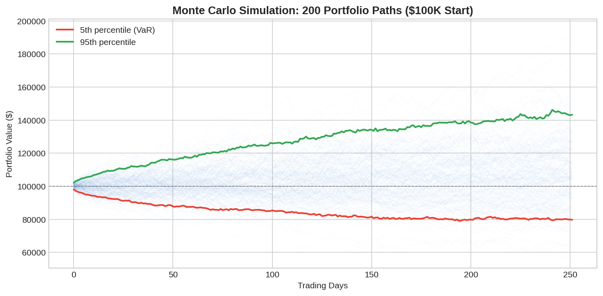

**Monte Carlo simulation** is a computational technique that estimates portfolio risk by generating thousands of random return scenarios and analyzing the distribution of outcomes. Instead of relying on closed-form formulas that assume normality, Monte Carlo methods can accommodate any return distribution, non-linear payoffs, and complex dependencies between assets. For algo traders, it is the workhorse method for computing Value at Risk (VaR), Conditional VaR (CVaR), drawdown distributions, and stress-test probabilities.

## How Monte Carlo Simulation Works

The core idea is straightforward: simulate many possible futures for your portfolio, then measure the statistical properties of the resulting distribution.

The process follows three steps:

$$\text{1. Model: } r_t \sim F(\mu, \Sigma) \quad \text{2. Simulate: } N \text{ paths} \quad \text{3. Measure: } \text{VaR}, \text{CVaR}, \text{max DD}$$

where $F$ is the assumed return distribution (Gaussian, Student-t, or empirically bootstrapped), $\mu$ is the expected return vector, and $\Sigma$ is the covariance matrix.

For a portfolio with weights $w$ and $K$ assets, each simulated path generates $T$ periods of returns:

$$R_{\text{portfolio},t}^{(n)} = \sum_{k=1}^{K} w_k \cdot r_{k,t}^{(n)}$$



## Python Implementation

```python
import numpy as np

def monte_carlo_portfolio_risk(
    weights, mu, cov, n_sims=10000, horizon=252, initial_value=100000
):
    """
    Monte Carlo simulation for portfolio risk estimation.
    Returns simulated terminal values and risk metrics.
    """
    n_assets = len(weights)
    weights = np.array(weights)
    
    # Simulate correlated returns using Cholesky decomposition
    L = np.linalg.cholesky(cov)
    
    terminal_values = np.zeros(n_sims)
    max_drawdowns = np.zeros(n_sims)
    
    for i in range(n_sims):
        # Generate correlated daily returns
        z = np.random.randn(horizon, n_assets)
        daily_returns = mu + z @ L.T
        
        # Portfolio returns
        port_returns = daily_returns @ weights
        
        # Cumulative equity curve
        equity = initial_value * np.cumprod(1 + port_returns)
        terminal_values[i] = equity[-1]
        
        # Maximum drawdown
        running_max = np.maximum.accumulate(equity)
        drawdowns = (equity - running_max) / running_max
        max_drawdowns[i] = drawdowns.min()
    
    # Risk metrics
    pnl = terminal_values - initial_value
    var_95 = np.percentile(pnl, 5)
    cvar_95 = pnl[pnl <= var_95].mean()
    
    return {
        "mean_return": pnl.mean(),
        "var_95": var_95,
        "cvar_95": cvar_95,
        "median_drawdown": np.median(max_drawdowns),
        "worst_drawdown": max_drawdowns.min(),
        "prob_loss": (pnl < 0).mean(),
    }

# Example: 60/40 stock-bond portfolio
weights = [0.6, 0.4]
mu = np.array([0.0003, 0.0001])  # Daily expected returns
cov = np.array([[0.0001, 0.00001],
                [0.00001, 0.00003]])  # Daily covariance

results = monte_carlo_portfolio_risk(weights, mu, cov)
for key, val in results.items():
    print(f"{key:>20}: {val:>12.2f}")
```

## Key Risk Metrics from Monte Carlo

| Metric | Definition | Use Case |
|--------|-----------|----------|
| VaR (95%) | 5th percentile of PnL distribution | Regulatory capital, risk limits |
| CVaR (95%) | Average loss beyond VaR | Tail risk management |
| Max Drawdown | Worst peak-to-trough decline | Strategy viability assessment |
| Probability of Loss | Fraction of paths ending negative | Client reporting |
| Sharpe Distribution | Distribution of realized Sharpe ratios | Strategy confidence intervals |

For a deeper treatment of VaR methodology, see the [VaR wiki page](https://paperswithbacktest.com/wiki/var-value-at-risk) and the [Excel VaR calculation guide](https://paperswithbacktest.com/wiki/calculation-of-value-at-risk-in-excel).

## Advanced Techniques

**Bootstrapping from historical returns**: Instead of assuming a parametric distribution, sample directly from historical returns with replacement. This captures fat tails, skewness, and empirical correlations naturally.

**Regime-conditional simulation**: Run separate Monte Carlo simulations for each market regime (bull, bear, crisis) and blend them according to the current regime probability.

**Copula-based simulation**: Model marginal distributions and dependence structure separately using copulas. This captures tail dependence — the tendency for assets to crash together — that Gaussian models miss.

## Limitations and Risks

Monte Carlo quality depends entirely on the input assumptions. If the return distribution is mis-specified (e.g., assuming normality when returns have fat tails), the risk estimates will be wrong. The method is computationally intensive for large portfolios and long horizons. Most importantly, Monte Carlo simulations cannot predict black swan events that are absent from the training distribution.

## Conclusion

Monte Carlo simulation is the most flexible tool in a risk manager's arsenal. By generating thousands of possible return paths, it estimates the full distribution of portfolio outcomes rather than a single point forecast. For algo traders, it provides robust estimates of VaR, drawdown risk, and strategy confidence intervals that inform position sizing and risk allocation.

---

**Explore further on PapersWithBacktest:**
- Browse [backtested risk-managed strategies](https://paperswithbacktest.com/strategies) with Python code and performance metrics
- Access [clean historical market data](https://paperswithbacktest.com/datasets) for equities, crypto, and futures
- Take the [algo trading course](https://paperswithbacktest.com/course) — 60+ video lessons and notebooks
- Related wiki pages: [Value at Risk (VaR)](https://paperswithbacktest.com/wiki/var-value-at-risk) · [Geometric Brownian Motion Simulation with Python](https://paperswithbacktest.com/wiki/geometric-brownian-motion-simulation-with-python) · [Kelly Criterion Position Sizing](https://paperswithbacktest.com/wiki/kelly-criterion-position-sizing)
