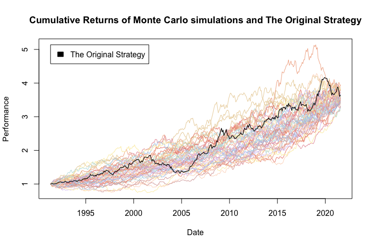

## Table of Contents

## What is a Monte Carlo simulation?

A Monte Carlo simulation is a way to predict what might happen in the future by using random numbers and trying out many different possibilities. Imagine you want to know how much money you might have in your savings account in a year. You could guess, but a Monte Carlo simulation lets you run thousands of scenarios with different amounts of money coming in and going out. By doing this many times, you can see all the possible outcomes and get a good idea of what is likely to happen.

This method is useful because it helps us understand things that are uncertain or hard to predict. For example, it can be used in finance to see how a stock might perform, or in engineering to check if a bridge can handle different kinds of traffic. The key is that it uses randomness to explore a wide range of possibilities, which gives us a better picture of what might happen than just making one guess.

## How can Monte Carlo simulations be applied to trading?

Monte Carlo simulations can be really helpful for trading because they let traders see what might happen to their investments in the future. Imagine you want to buy a stock. You can use a Monte Carlo simulation to run thousands of different scenarios where the stock price goes up, down, or stays the same. By doing this, you can see all the possible outcomes and figure out how likely it is that you'll make money or lose money. This can help you decide if the stock is a good investment or if it's too risky.

These simulations are also great for testing trading strategies. Let's say you have a plan for buying and selling stocks. You can use a Monte Carlo simulation to see how your strategy would have worked in the past with different market conditions. This can show you if your strategy is strong enough to handle big changes in the market or if it needs to be changed. By trying out many different scenarios, you can make your trading strategy better and more reliable.

In short, Monte Carlo simulations give traders a way to look into the future and prepare for different possibilities. They help traders understand the risks and rewards of their investments and strategies, making it easier to make smart choices. Whether you're a new trader or have been trading for a long time, using Monte Carlo simulations can help you make better decisions and hopefully be more successful in the market.

## What are the basic steps to perform a Monte Carlo simulation in trading?

To perform a Monte Carlo simulation in trading, you start by collecting historical data about the stocks or assets you want to analyze. This data includes things like daily price changes, trading volumes, and any other information that might affect the stock's performance. Once you have this data, you use it to create a model of how the stock might behave in the future. This model includes random elements to simulate different possible outcomes, like the stock going up or down on any given day.

Next, you run the simulation many times, usually thousands or even millions of times. Each time, the simulation uses random numbers to generate different paths that the stock price might take. By doing this over and over, you get a big picture of all the possible future scenarios for the stock. You can then look at this data to see things like the average return you might expect, the worst-case scenarios, and how likely it is that you'll make or lose money.

After running the simulations, you analyze the results to make decisions about your trading strategy. You might see that the stock has a high chance of going up, which could make you want to buy it. Or, you might see that it's too risky, and decide to avoid it. The key is that Monte Carlo simulations give you a way to look at many possible futures and make smarter choices based on what you see.

## What types of data are needed for a Monte Carlo simulation in trading?

For a Monte Carlo simulation in trading, you need historical data about the stocks or assets you're looking at. This includes things like daily price changes, which show how much the stock's price goes up or down each day. You also need data on trading volumes, which tell you how many shares of the stock are bought and sold. Other important information can include dividends, if the company pays them, and any news or events that might affect the stock's price, like earnings reports or big announcements.

Once you have this data, you use it to build a model that tries to guess how the stock might behave in the future. This model uses random numbers to simulate different possible outcomes, like the stock going up or down on any given day. The more data you have, the better your model can be at predicting what might happen. So, it's important to gather as much relevant information as you can to make your Monte Carlo simulation as accurate as possible.

## How does randomness play a role in Monte Carlo simulations for trading?

Randomness is a big part of Monte Carlo simulations for trading. It helps the simulation guess what might happen to a stock's price in the future. Imagine you're trying to predict if a stock will go up or down. You can't know for sure, so you use random numbers to make different guesses. Each time you run the simulation, it uses these random numbers to create a different path that the stock price might take. By doing this many times, you can see all the possible futures for the stock and understand how likely each one is.

This use of randomness helps traders see the risks and rewards of their investments. Instead of just making one guess about the future, Monte Carlo simulations let you look at thousands of different possibilities. This gives you a better idea of what might happen and helps you make smarter choices. Whether you're deciding if a stock is a good buy or testing a trading strategy, randomness in Monte Carlo simulations helps you prepare for whatever the market might do.

## What are common statistical distributions used in Monte Carlo simulations for trading?

In Monte Carlo simulations for trading, common statistical distributions help model how stock prices might change. One popular distribution is the normal distribution, often called the bell curve. It's used because it can show how stock prices tend to stay close to their average but can sometimes move a lot. Traders use this distribution to simulate small, everyday price changes that are likely to happen.

Another common distribution is the lognormal distribution, which is good for modeling stock prices because it can't show negative prices. This distribution is useful because it can capture the idea that stock prices usually grow over time but can also have big jumps or drops. By using the lognormal distribution, traders can simulate more realistic scenarios where the stock price might go up a lot or fall sharply.

Sometimes, traders also use the geometric Brownian motion model, which combines the normal and lognormal distributions. This model helps simulate how stock prices move over time, taking into account both small daily changes and larger trends. By using these distributions, traders can run many different scenarios in their Monte Carlo simulations to better understand the risks and rewards of their investments.

## How can Monte Carlo simulations help in risk management for trading?

Monte Carlo simulations are a great tool for managing risk in trading. They help traders see all the different ways their investments might go in the future. By running thousands of different scenarios, traders can see how likely it is that they'll lose money or make a big profit. This lets them understand the risks better and make smarter choices about which stocks to buy or sell. For example, if a simulation shows that a stock has a high chance of losing value, a trader might decide to avoid it or sell it before it goes down.

These simulations also help traders test their trading strategies to see if they can handle big changes in the market. By trying out many different scenarios, traders can see how their strategies would have worked in the past and make changes to improve them. This way, they can be more prepared for whatever the market might do. Using Monte Carlo simulations, traders can make better decisions and manage their risks more effectively, which can help them be more successful in the long run.

## What are the limitations and potential pitfalls of using Monte Carlo simulations in trading?

Monte Carlo simulations are really helpful for trading, but they have some limitations. One big problem is that they rely a lot on the data you use. If your data is not good or if it doesn't cover all the things that can affect a stock's price, your simulation might not be accurate. Also, these simulations assume that the future will be like the past, which isn't always true. Big events like economic crashes or new laws can change how the market works, and your simulation might not be ready for those surprises.

Another issue is that Monte Carlo simulations can be tricky to set up and run. You need to know a lot about math and computers to do them right. If you make a mistake in your model or in how you use the random numbers, your results could be wrong. Plus, running these simulations takes a lot of time and computer power, especially if you want to look at many different scenarios. So, while Monte Carlo simulations can give you a lot of useful information, you have to be careful and make sure you're using them the right way.

## How can Monte Carlo simulations be used to optimize trading strategies?

Monte Carlo simulations can help traders make their trading strategies better by trying out many different scenarios. Imagine you have a plan for buying and selling stocks. You can use a Monte Carlo simulation to see how your plan would have worked in the past with different market conditions. By running the simulation many times, you can see if your strategy can handle big changes in the market or if it needs to be changed. This way, you can make your strategy stronger and more reliable, helping you make better decisions and hopefully make more money.

These simulations also let traders see the risks and rewards of their strategies. By looking at thousands of different outcomes, traders can understand how likely it is that they'll lose money or make a big profit. If the simulation shows that a strategy has a high chance of losing money, traders can adjust it to lower the risk. On the other hand, if the strategy looks good in many scenarios, traders might feel more confident about using it. By using Monte Carlo simulations, traders can test and improve their strategies to be more successful in the market.

## What advanced techniques can enhance the accuracy of Monte Carlo simulations in trading?

To make Monte Carlo simulations more accurate for trading, traders can use something called variance reduction techniques. These techniques help make the results more reliable by reducing the randomness in the simulations. One way to do this is by using antithetic variates, which means running two simulations at the same time with opposite random numbers. This can help cancel out some of the randomness and give a clearer picture of what might happen. Another way is to use control variates, where you compare your simulation to a simpler model that you know well. This helps you adjust your results to be more accurate.

Another advanced technique is to use more detailed models of how stock prices move. Instead of just using simple models like the normal or lognormal distribution, traders can use models that take into account more factors, like how stocks are related to each other or how the overall market is doing. These more complex models can give a better idea of what might happen in the future. Also, using more data, like from different markets or time periods, can help make the simulations more accurate. By combining these techniques, traders can get a better understanding of the risks and rewards of their investments and make smarter trading decisions.

## How do practitioners validate the results of Monte Carlo simulations in trading?

Practitioners validate the results of Monte Carlo simulations in trading by comparing them to real data from the past. They run the simulation and then see if the results match what actually happened in the market. If the simulation's predictions are close to the real outcomes, it means the model is working well. They also use something called backtesting, where they test their trading strategy on historical data to see how it would have performed. This helps them check if the simulation's results make sense and if their strategy is likely to work in the future.

Another way to validate Monte Carlo simulations is by using different models and comparing their results. If several different models give similar predictions, it's a good sign that the results are reliable. Practitioners also look at how sensitive the results are to small changes in the model. If small changes don't make a big difference in the outcomes, it means the simulation is robust. By using these methods, traders can feel more confident that their Monte Carlo simulations are accurate and useful for making trading decisions.

## What are some real-world examples of Monte Carlo simulations impacting trading decisions?

One real-world example of Monte Carlo simulations impacting trading decisions is in the field of portfolio management. A fund manager might use these simulations to understand how different stocks in their portfolio could perform under various market conditions. By running thousands of scenarios, the manager can see how likely it is that the portfolio will meet its investment goals or if it might face big losses. This helps them decide which stocks to keep, sell, or buy more of, making their investment strategy more effective and less risky.

Another example is in options trading, where traders use Monte Carlo simulations to price options and assess their risk. Options give traders the right to buy or sell a stock at a certain price, and their value can be hard to predict. By running simulations, traders can see how the price of an option might change based on different factors like stock price movements, interest rates, and time until the option expires. This helps them make better decisions about whether to buy or sell an option, and at what price, leading to more profitable trades.

## What are the types of Monte Carlo methods used in trading?

Monte Carlo methods in trading offer traders various ways to simulate potential outcomes and stress-test their trading strategies. Each method manipulates historical trade data to foster robust strategy analysis through randomness. Here, we explore different types of Monte Carlo methods commonly used in trading:

1. **Reshuffle**: This method involves randomly rearranging historical data to generate alternate equity curves. By shuffling the sequence of trades, traders can assess how changes in trade order affect overall strategy performance. This approach helps traders evaluate the importance of trade sequencing on the strategy's success and assess its durability in different market conditions.
$$
    \text{Let } E = [e_1, e_2, \ldots, e_n] \text{ be the original equity curve. A reshuffled equity curve is } E' = \text{shuffle}(E)

$$

2. **Resample**: In resampling, trades are randomly selected with replacement to simulate new trade sequences. This technique empowers traders to create numerous hypothetical datasets from a single sample of historical trades, aiding sensitivity analysis regarding individual trades' impact on the strategy.

    ```python
    import numpy as np

    def resample_trades(trades, n_samples):
        return np.random.choice(trades, size=n_samples, replace=True)
    ```

3. **Randomized**: This method involves re-trading by incorporating varied exit strategies while maintaining the original strategic entry conditions. By applying different exit strategies to the same entry points, traders can analyze the effect of exit rules on performance, thereby fine-tuning their strategies for optimal results.

    ```python
    def randomized_exit_strategy(entry_point, exit_strategies):
        results = []
        for exit in exit_strategies:
            results.append(exit(entry_point))
        return results
    ```

4. **Permutation**: This method adjusts the statistical properties of historical data to test a strategy's robustness against variations in underlying data. Whilst maintaining the core characteristics of the dataset, permutations aim to observe how sensitive a strategy is to small perturbations in the data, providing insights into potential vulnerabilities.
$$
    \text{Permuted series } X' \text{ is constructed such that it maintains mean } \mu \text{ and variance } \sigma^2 \text{ of } X

$$

By employing these various Monte Carlo methods, traders are equipped to rigorously evaluate the strength and reliability of their trading strategies, ultimately fostering the creation of more resilient and effective [algorithmic trading](/wiki/algorithmic-trading) frameworks.

## References & Further Reading

[1]: Haug, E. G. (2007). ["The Complete Guide to Option Pricing Formulas."](https://www.amazon.com/Complete-Guide-Option-Pricing-Formulas/dp/0071389970) McGraw-Hill.

[2]: Glasserman, P. (2003). ["Monte Carlo Methods in Financial Engineering."](https://link.springer.com/book/10.1007/978-0-387-21617-1) Springer.

[3]: Boyle, P. P., Broadie, M., & Glasserman, P. (1997). ["Monte Carlo Methods for Security Pricing."](https://www.sciencedirect.com/science/article/pii/S0165188997000286) Operations Research, 44(6), 889-905.

[4]: Lopez de Prado, M. (2018). ["Advances in Financial Machine Learning."](https://books.google.com/books/about/Advances_in_Financial_Machine_Learning.html?id=oU9KDwAAQBAJ) Wiley.

[5]: Chan, E. P. (2009). ["Quantitative Trading: How to Build Your Own Algorithmic Trading Business."](https://github.com/ftvision/quant_trading_echan_book) Wiley.