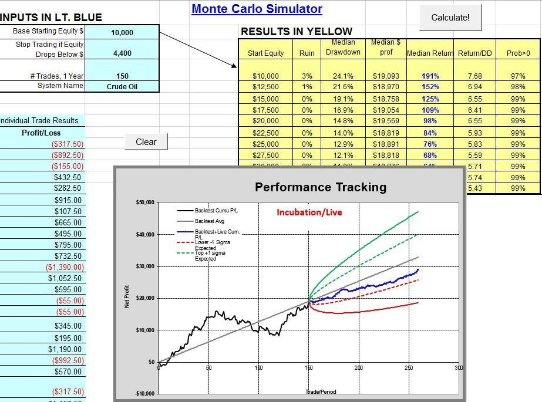

Monte Carlo simulations have become a cornerstone in algorithmic trading, providing traders with a statistical framework to evaluate and refine their strategies. These simulations employ random sampling techniques to model and analyze the behavior of financial markets, allowing traders to assess risk and performance effectively. Through simulating a multitude of possible market scenarios, traders can gain insights into potential outcomes of their trading strategies, helping them make data-driven decisions.

The application of Monte Carlo simulations in trading is primarily focused on risk assessment and performance evaluation. By running numerous iterations of potential market paths, traders can estimate the probabilities of various outcomes, including potential gains and losses. This statistical approach aids in identifying the robustness of trading strategies, determining the influence of randomness on past successes, and setting realistic expectations for future performance.



Monte Carlo simulations offer several benefits for traders. They provide a comprehensive view of potential drawdowns, allowing traders to adequately fund their strategies and maintain confidence during financially challenging periods. Moreover, this technique helps set realistic expectations for profit and loss variations, ensuring traders remain committed to their strategies even when actual results deviate from anticipated outcomes.

Understanding Monte Carlo simulations and their significance in trading is crucial for traders seeking to optimize and validate their strategies. By incorporating these simulations into the trading process, traders can enhance their decision-making capabilities and develop resilient and profitable algorithmic trading strategies.

## Table of Contents

## Understanding Monte Carlo Simulations

Monte Carlo simulations are a powerful tool used in algorithmic trading to introduce controlled randomness into datasets, facilitating the creation of probability distributions crucial for risk analysis and decision-making processes. This approach enables the assessment of potential outcomes by generating multiple scenarios based on historical trade data. Traders commonly apply Monte Carlo simulations to evaluate the robustness and effectiveness of their strategies by manipulating past data.

In practice, the process involves reshuffling historical trading data to simulate a wide variety of market conditions and outcomes. By doing so, traders can observe how their strategies would perform under different circumstances, thus obtaining a clearer picture of potential risks and rewards. The randomization inherent in Monte Carlo simulations helps traders distinguish between the successes attributable to strategic skill and those arising from sheer luck. This distinction is crucial for generating reliable insights into a strategy's future performance probabilities.

Monte Carlo methods calculate various statistical measures, such as expected return, variance, and [value at risk](/wiki/var-value-at-risk) (VaR), by running a large number of simulations. These outputs form a probability distribution that illustrates all possible results of a trading strategy, effectively quantifying the uncertainty and variability inherent in financial markets. As traders analyze these distributions, they gain invaluable insights into the potential success rate and risk profile of a given strategy, allowing for more informed decision-making and strategic adjustments.

## Why Use Monte Carlo Simulations in Trading?

Monte Carlo simulations are indispensable tools for traders as they navigate the inherent uncertainties of financial markets. By introducing elements of randomness, these simulations enable traders to gauge the range of potential outcomes associated with their strategies, offering insights into possible gains and losses. This predictive ability is crucial for estimating realistic drawdowns, thereby enhancing the overall risk management process.

Traders often face the challenge of determining whether their strategies are inherently robust or merely beneficiaries of favorable market conditions during the [backtesting](/wiki/backtesting) phase. Monte Carlo simulations address this by reshuffling historical trade data to generate a multitude of possible trading scenarios. By assessing these varied outcomes, traders can discern the resilience of their strategies against market [volatility](/wiki/volatility-trading-strategies) and avoid strategies that might fail under different conditions.

A key aspect of trading is preparing for adverse market scenarios. Monte Carlo simulations facilitate this by helping traders understand potential win and loss streaks. By simulating thousands of potential future paths, traders can set more realistic expectations for their strategy's performance. This understanding helps in reducing emotional decision-making induced by surprise losses and ensures better commitment to the strategy even when short-term results deviate from expectations.

Incorporating Monte Carlo methods in trading allows for a comprehensive evaluation of the likelihood and impact of different market events. This level of foresight is integral in developing robust trading strategies capable of withstanding the unpredictable nature of financial markets.

## Benefits of Monte Carlo Simulations in Algo Trading

Monte Carlo simulations offer significant advantages for algorithmic traders by providing more accurate estimates of potential drawdowns. This accuracy is vital for traders to appropriately fund their strategies, enabling them to maintain confidence even during losing periods. A primary benefit of Monte Carlo simulations is their ability to set realistic expectations for profit and loss variations, ensuring that traders remain committed to their strategies when actual outcomes deviate from anticipated results. This is achieved by running multiple simulations that take into account a range of market conditions and random variations, offering a comprehensive perspective on potential future outcomes.

Understanding risk and potential outcomes through these simulations can significantly enhance decision-making and improve strategy performance over time. By simulating various scenarios, traders can assess the likelihood of different performance paths and develop strategies that are more robust against market unpredictability. This includes the identification of potential profit and loss scenarios, allowing traders to adjust their risk management tactics accordingly.

For instance, a trader can use Python to implement a basic Monte Carlo simulation to model potential drawdowns. Here is a simple implementation:

```python
import numpy as np

# Define parameters
initial_capital = 100000
num_simulations = 1000
num_trades = 252  # Number of trading days in a year
mean_return = 0.001  # Example mean daily return
std_dev = 0.02  # Example daily return standard deviation

# Run simulations
simulated_drawdowns = []
for _ in range(num_simulations):
    daily_returns = np.random.normal(mean_return, std_dev, num_trades)
    price_series = initial_capital * (1 + daily_returns).cumprod()
    max_drawdown = (np.max(price_series) - np.min(price_series)) / np.max(price_series)
    simulated_drawdowns.append(max_drawdown)

# Analyze results
average_drawdown = np.mean(simulated_drawdowns)
max_drawdown = np.max(simulated_drawdowns)

print(f'Average Drawdown: {average_drawdown:.2%}')
print(f'Max Drawdown: {max_drawdown:.2%}')
```

In this example, the Monte Carlo simulation models daily market returns to evaluate potential drawdowns. The results offer traders a clearer picture of worst-case scenarios and help calibrate their strategies to withstand such conditions, reinforcing their ability to navigate real-world trading environments effectively. Through this rigorous assessment, traders can develop a robust framework for decision-making, ensuring their strategies are resilient and profitable over the long term.

## Types of Monte Carlo Methods in Trading

Monte Carlo methods in trading offer traders various ways to simulate potential outcomes and stress-test their trading strategies. Each method manipulates historical trade data to foster robust strategy analysis through randomness. Here, we explore different types of Monte Carlo methods commonly used in trading:

1. **Reshuffle**: This method involves randomly rearranging historical data to generate alternate equity curves. By shuffling the sequence of trades, traders can assess how changes in trade order affect overall strategy performance. This approach helps traders evaluate the importance of trade sequencing on the strategy's success and assess its durability in different market conditions.
$$
    \text{Let } E = [e_1, e_2, \ldots, e_n] \text{ be the original equity curve. A reshuffled equity curve is } E' = \text{shuffle}(E)

$$

2. **Resample**: In resampling, trades are randomly selected with replacement to simulate new trade sequences. This technique empowers traders to create numerous hypothetical datasets from a single sample of historical trades, aiding sensitivity analysis regarding individual trades' impact on the strategy.

    ```python
    import numpy as np

    def resample_trades(trades, n_samples):
        return np.random.choice(trades, size=n_samples, replace=True)
    ```

3. **Randomized**: This method involves re-trading by incorporating varied exit strategies while maintaining the original strategic entry conditions. By applying different exit strategies to the same entry points, traders can analyze the effect of exit rules on performance, thereby fine-tuning their strategies for optimal results.

    ```python
    def randomized_exit_strategy(entry_point, exit_strategies):
        results = []
        for exit in exit_strategies:
            results.append(exit(entry_point))
        return results
    ```

4. **Permutation**: This method adjusts the statistical properties of historical data to test a strategy's robustness against variations in underlying data. Whilst maintaining the core characteristics of the dataset, permutations aim to observe how sensitive a strategy is to small perturbations in the data, providing insights into potential vulnerabilities.
$$
    \text{Permuted series } X' \text{ is constructed such that it maintains mean } \mu \text{ and variance } \sigma^2 \text{ of } X

$$

By employing these various Monte Carlo methods, traders are equipped to rigorously evaluate the strength and reliability of their trading strategies, ultimately fostering the creation of more resilient and effective [algorithmic trading](/wiki/algorithmic-trading) frameworks.

## Advanced Applications of Monte Carlo Simulations

Monte Carlo simulations have evolved to provide advanced tools that enhance traders' ability to assess and refine their trading strategies. One such tool is the Monte Carlo Equity Curve Bands, which is instrumental in detecting early signs of a potentially flawed strategy. By simulating future trade outcomes based on past data, these bands create a visualization of possible equity paths that a trading strategy might take. This can help in identifying deviations from expected performance early on, thereby signaling when a reevaluation of the trading strategy is necessary.

Another critical application is the use of simulations to construct drawdown confidence intervals. Drawdowns represent the decline from a peak in the value of an investment portfolio, and understanding their potential extent is essential for effective risk management. Monte Carlo simulations can generate a range of potential drawdown scenarios, allowing traders to calculate confidence intervals for these drawdowns. This quantification of risk provides traders with a better understanding of the downside potential, enabling them to make more informed decisions, such as setting stop-loss levels and adjusting position sizing.

The insights gained from these advanced techniques are invaluable in evaluating strategy viability. By analyzing a simulated range of outcomes, traders can pressure test their strategies under various market conditions, ensuring robustness and adaptability. This iterative process of simulation and refinement is a powerful method by which traders can improve their methodologies, aiming for a balance between risk and reward.

Here is a basic Python code snippet illustrating how a trader might use Monte Carlo simulations to assess the equity curve of a trading strategy:

```python
import numpy as np
import matplotlib.pyplot as plt

# Example returns from a trading strategy
historical_returns = np.random.normal(0.001, 0.02, 252)

# Number of simulations
num_simulations = 1000
simulated_equity_curves = []

# Simulate equity curves
for _ in range(num_simulations):
    simulated_returns = np.random.choice(historical_returns, size=len(historical_returns), replace=True)
    equity_curve = np.cumsum(simulated_returns)
    simulated_equity_curves.append(equity_curve)

# Plotting the simulated equity curves
plt.figure(figsize=(10, 6))
plt.plot(np.transpose(simulated_equity_curves), color='grey', alpha=0.1)
plt.title('Monte Carlo Simulated Equity Curves')
plt.xlabel('Days')
plt.ylabel('Cumulative Returns')
plt.show()
```

This code demonstrates how a trader might simulate multiple equity curves based on historical returns to visualize the range of possible future outcomes. By examining such visualizations, traders can determine whether their strategies require adjustments to reduce the risk of significant drawdowns or capital loss.

## How Many Simulations Are Needed?

To ensure the reliability of Monte Carlo simulations in algorithmic trading, it is recommended to run a minimum of 1,000 simulations. This number is not arbitrary; rather, it is based on the need to capture a comprehensive probability distribution that reflects the potential range of outcomes for a given trading strategy. By conducting a large number of simulations, traders can account for the variability and randomness inherent in financial markets, thus obtaining a more accurate assessment of the strategy's effectiveness.

Running a sufficient number of simulations helps to minimize the risk of deriving conclusions that are heavily influenced by anomalies or outliers in the data. A larger sample size allows traders to smooth out the random noise and achieve a clearer picture of the true performance metrics of their strategies, such as expected return, volatility, and drawdown levels.

Code implementation can further illustrate this. In Python, for example, utilizing a Monte Carlo method to simulate trading strategy outcomes can be achieved as follows:

```python
import numpy as np

def monte_carlo_simulation(num_simulations, initial_capital, expected_return, volatility, num_periods):
    simulated_end_values = []
    for _ in range(num_simulations):
        returns = np.random.normal(expected_return, volatility, num_periods)
        end_value = initial_capital * np.prod(1 + returns)
        simulated_end_values.append(end_value)
    return simulated_end_values

# Parameters
num_simulations = 1000
initial_capital = 10000  # Starting capital
expected_return = 0.005  # Expected daily return
volatility = 0.02  # Daily volatility
num_periods = 252  # Trading days in a year

# Run simulation
simulation_results = monte_carlo_simulation(num_simulations, initial_capital, expected_return, volatility, num_periods)

# Analyzing results
expected_final_capital = np.mean(simulation_results)
risk_of_loss = np.mean([result < initial_capital for result in simulation_results])
```

In this Python example, 1,000 simulations are performed to project the end value of a trading strategy over one year (252 trading days), considering the expected daily return and market volatility. The resulting data offer insights into potential outcomes, indicating areas where traders might need to adjust their strategies to mitigate risk.

Ultimately, a well-conducted Monte Carlo simulation helps in making data-driven decisions by providing a statistically significant overview of possible financial outcomes. This robust approach assists traders in optimizing their methodologies and preparing for diverse market conditions.

## Conclusion

Monte Carlo simulations are invaluable tools for traders aiming to fine-tune and substantiate their trading strategies. These simulations enable a comprehensive analysis of risk, potential outcomes, and the true nature of past performance, thus supporting traders in making well-informed, [quantitative trading](/wiki/quantitative-trading) decisions. By generating a broad range of possible scenarios, traders can better understand the robustness and reliability of their strategies under varying market conditions.

The insights gained from Monte Carlo simulations assist traders in predicting realistic performance metrics, quantifying the reliability of their strategies, and identifying weaknesses that may lead to undesired results. This quantitative approach to assessing trading strategies aids in understanding the balance between skill and luck in past successes, thereby refining future expectations and preparations.

Incorporating Monte Carlo methodologies into the trading process is essential for the development of resilient and profitable algorithmic trading strategies. By factoring in randomness and uncertainty, traders can equip themselves with strategies capable of withstanding diverse market situations. This methodology not only aids in strategy optimization but also fortifies a trader's confidence during both profitable and challenging periods. Consequently, Monte Carlo simulations not only enhance the reliability of trading strategies but also transform the strategy validation process into a more precise and data-driven practice.

## References & Further Reading

[1]: Haug, E. G. (2007). ["The Complete Guide to Option Pricing Formulas."](https://www.amazon.com/Complete-Guide-Option-Pricing-Formulas/dp/0071389970) McGraw-Hill.

[2]: Glasserman, P. (2003). ["Monte Carlo Methods in Financial Engineering."](https://link.springer.com/book/10.1007/978-0-387-21617-1) Springer.

[3]: Boyle, P. P., Broadie, M., & Glasserman, P. (1997). ["Monte Carlo Methods for Security Pricing."](https://www.sciencedirect.com/science/article/pii/S0165188997000286) Operations Research, 44(6), 889-905.

[4]: Lopez de Prado, M. (2018). ["Advances in Financial Machine Learning."](https://books.google.com/books/about/Advances_in_Financial_Machine_Learning.html?id=oU9KDwAAQBAJ) Wiley.

[5]: Chan, E. P. (2009). ["Quantitative Trading: How to Build Your Own Algorithmic Trading Business."](https://github.com/ftvision/quant_trading_echan_book) Wiley.