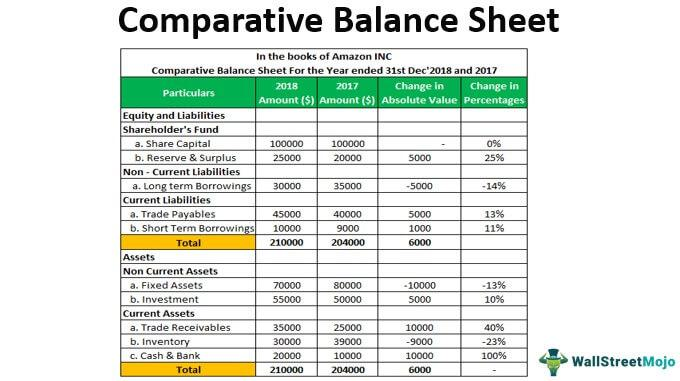

Understanding the intricate relationship between taxes, investments, and the generation of monthly income forms the bedrock of financial stability. As individuals increasingly seek ways to optimize their investment strategies, there is a marked turn towards algorithmic trading, which is redefining the parameters of modern financial planning. Algorithmic trading uses complex models and formulas to make high-speed decisions in the stock market, providing individuals with innovative solutions to enhance their investment portfolios.

The interplay of taxes, investments, and trading technology can be pivotal in constructing a sustainable financial plan. A comprehensive understanding of tax implications helps investors make informed decisions, allowing them to legally minimize their tax burdens and maximize returns on their investments. Meanwhile, the advent of algorithmic trading presents fresh opportunities and challenges, offering a competitive edge to those adept at leveraging this technology effectively.



This article outlines key strategies and methodologies to equip readers with the knowledge needed for effective investment planning. By analyzing the potential of algorithmic trading alongside traditional investment avenues, investors can craft robust, diversified portfolios capable of achieving consistent income streams. Emphasizing the importance of a holistic approach, we aim to shed light on the ways tax-efficient strategies married with advanced trading technologies can lead to enhanced income potential and long-term financial success.

## Table of Contents

## The Basics of Taxation on Investments

Taxes significantly impact investment returns, necessitating a thorough understanding of their application to various types of investment income. Investment income typically falls into two categories: ordinary income, which includes dividends and interest, and capital gains, derived from the sale of assets like stocks, bonds, or real estate.

### Understanding Capital Gains Tax

Capital gains tax is crucial in assessing the net returns from investments. It is levied on the profit made from selling an asset whose value has appreciated over time. Capital gains can be short-term or long-term, with taxation varying accordingly. Short-term capital gains result from assets held for one year or less and are taxed at ordinary income tax rates, which are generally higher. Conversely, long-term capital gains arise from assets held for over a year and benefit from reduced tax rates, which in the U.S., for instance, can be 0%, 15%, or 20%, depending on the taxpayer's income bracket.

### Tax-Advantaged Accounts and Strategies

Investors have tools at their disposal to reduce tax liabilities and optimize after-tax income, notably tax-advantaged accounts. These accounts, such as Roth IRAs, Traditional IRAs, and 401(k)s, offer substantial benefits. Contributions to Traditional IRAs and 401(k)s might be tax-deductible, lowering taxable income in the contribution year, with taxes deferred until withdrawal. On the other hand, Roth IRAs tax contributions upfront, allowing for tax-free growth and withdrawals in retirement, contingent on meeting specific conditions. 

Another strategy is tax-loss harvesting, which involves selling underperforming securities at a loss to offset capital gains from other investments, thus lowering taxable income. This strategy can minimize the impact of short-term gains, often taxed at a higher rate.

### Implications of Tax Laws on Investment Strategies

Tax laws heavily influence investment strategies, dictating optimal asset allocation, investment locations (taxable vs. tax-advantaged), and timing of transactions. Investors should strategically allocate assets with significant growth potential in tax-advantaged accounts to defer taxes. Conversely, assets generating regular income, such as mutual funds or high-dividend stocks, might be best held in accounts where income can be shielded from immediate taxation.

Investment timing is another strategic consideration influenced by tax laws, as end-of-year sales can trigger tax consequences the following fiscal year, allowing for strategic planning.

### Recent Changes in Tax Policies

Recent changes in tax policies continually affect investment strategies. In recent years, the Tax Cuts and Jobs Act of 2017 in the U.S. adjusted tax brackets, impacting capital gains taxes indirectly due to changes in overall income tax rates. Additionally, increasing interest in taxing digital currencies and changes affecting international taxation underscore the need for investors to stay informed about legislative modifications.

In conclusion, understanding the nuances of taxation on investment income is pivotal for maximizing returns. Whether through capital gains, the strategic use of tax-advantaged accounts, or aligning with evolving tax laws, the informed investor can craft a financial strategy that substantially reduces tax liability, bolstering net income and overall financial growth.

## Strategies for Generating Monthly Income Through Investments

To generate a sustainable monthly income through investments, it is essential to identify suitable investment vehicles that offer regular returns. Several options exist, each with unique characteristics, risk profiles, and income potential.

**Investment Vehicles for Regular Income**

1. **Dividends**: Individual stocks that pay dividends can provide a consistent income stream. Companies often distribute a portion of their profits to shareholders in the form of dividends. The dividend yield, calculated as the annual dividend per share divided by the stock price, can be an essential metric for evaluating dividend stocks. A diversified dividend portfolio can reduce risk and ensure a steady income flow. [Source: Investopedia - "Dividend Yield"](https://www.investopedia.com/terms/d/dividendyield.asp)

2. **Bonds**: Bonds are debt securities that pay periodic interest, known as coupon payments, until maturity, when the principal is repaid. Government and corporate bonds are common choices for income-focused investors. The yield on a bond is a crucial factor, defined as the annual interest payment divided by the bond's current price. Investors should balance between credit quality and yield to align with their risk tolerance.

3. **Rental Properties**: Real estate investments can generate monthly rental income. The potential for property appreciation adds another dimension to returns. Evaluating location, tenant stability, and property management are critical factors. Real estate investment trusts (REITs) offer another avenue, allowing investors to buy shares in a portfolio of properties without managing them directly. [Source: REIT.com - "What is a REIT"](https://www.reit.com/what-reit)

**Balancing Risk and Return**

Achieving consistent monthly payouts involves balancing risk and return. High-risk investments may offer higher yields but can also lead to significant [volatility](/wiki/volatility-trading-strategies). A balanced approach might involve combining low-risk bonds with higher-yield dividend stocks and rental properties. The goal is to create a portfolio that aligns with an investor's risk tolerance and income needs.

**Portfolio Diversification**

Diversification is a risk management strategy that mixes a wide variety of investments within a portfolio. It aims to limit exposure to any single asset, thereby reducing risk. For income generation, diversification might involve different asset classes (stocks, bonds, real estate) and sectors to optimize returns while minimizing the potential for loss. Using modern portfolio theory, investors can determine an optimal portfolio mix that maximizes returns for a given level of risk.

**Case Studies of Successful Plans**

Consider the case of an investor who, over five years, constructed a diversified income portfolio consisting of 40% dividend-paying stocks, 30% government and corporate bonds, and 30% REITs. This mix was adjusted annually based on market conditions and life changes. The strategy not only provided stable monthly income but also allowed growth, with dividends and property values increasing. Periodic rebalancing ensured that asset classes remained in line with risk tolerance and income goals. Such examples underscore the importance of strategy, flexibility, and diligence in investment planning.

In summary, by understanding the characteristics of different investment vehicles, balancing risk with potential returns, and maintaining a diversified portfolio, investors can create effective strategies for generating monthly income. Through regular reassessment and adjustment of investment choices, it is possible to sustain and potentially increase income levels while navigating the evolving financial landscape.

 to Algorithmic Trading

Algorithmic trading, commonly referred to as algo trading, is the use of computer programs to automate trading decisions in financial markets. Such trading strategies utilize pre-coded instructions and algorithms to analyze variables like timing, price, and [volume](/wiki/volume-trading-strategy). These lightweight yet powerful programs enable traders to execute orders at speeds and accuracies that surpass human capability.

**Automation of Decision-Making**

In the context of stock markets, where information and price movement can change within milliseconds, automation is crucial. Algo trading employs sophisticated mathematical models and algorithms to make split-second decisions about buying or selling securities. Python, with its extensive libraries like NumPy, pandas, and scikit-learn, provides an ideal ecosystem for developing these models. Here is a simple Python example to illustrate how an algorithm might automate trades based on moving averages:

```python
import pandas as pd

def moving_average_strategy(prices, short_window=40, long_window=100):
    signals = pd.DataFrame(index=prices.index)
    signals['signal'] = 0.0

    # Create short simple moving averages over the short window
    signals['short_mavg'] = prices['close'].rolling(window=short_window, min_periods=1, center=False).mean()

    # Create long simple moving averages over the long window
    signals['long_mavg'] = prices['close'].rolling(window=long_window, min_periods=1, center=False).mean()

    # Create signals
    signals['signal'][short_window:] = np.where(signals['short_mavg'][short_window:] > signals['long_mavg'][short_window:], 1.0, 0.0)   

    # Generate trading orders
    signals['positions'] = signals['signal'].diff()

    return signals
```

**Benefits and Risks**

The automation of trading provides various benefits: increased speed and accuracy in executing trades, reduced transaction costs, and the ability to back-test strategies on historical data. However, these advantages come with inherent risks. Over-reliance on automated systems can lead to significant losses, particularly in volatile markets or if the algorithms become outdated or lack comprehensive adaptive mechanisms.

**Technological Requirements and Skills**

Implementing successful algo trading strategies requires a blend of quantitative analysis proficiency and programming expertise. Traders need to be well-versed in programming languages like Python, R, or C++, and must understand statistical modeling and data analysis methods. Robust computational infrastructure, such as high-speed internet connections and servers, is also essential to ensure low-latency trading.

**Potential for Income Generation**

Algorithmic trading has the potential to generate substantial income through the capitalization of market inefficiencies. Its systematic approach in analyzing vast datasets allows traders to exploit minor pricing discrepancies. Combined with strategies such as [market making](/wiki/market-making), statistical [arbitrage](/wiki/arbitrage), and [trend following](/wiki/trend-following), algo trading can yield consistent returns if appropriately managed and monitored.

In summary, while algo trading presents significant opportunities for income generation within modern investment strategies, it demands a high level of expertise and technological investment. Proper implementation and risk management are critical to harness its potential effectively.

## Incorporating Algorithmic Trading in an Investment Plan

Integrating [algorithmic trading](/wiki/algorithmic-trading) into an investment plan involves aligning automated strategies with traditional investment practices. This integration allows for a harmonious combination of tried-and-true methods with innovative technology-driven approaches, enhancing potential returns and optimizing risk management.

### Methods to Integrate Algo Trading with Traditional Investment Practices

#### Suitability of Algo Trading for Different Types of Investors

Algorithmic trading is not a one-size-fits-all solution and must be assessed for its suitability across different investor profiles. Investors with a [high frequency](/wiki/high-frequency-trading) of trades, such as day traders, usually benefit the most due to the speed and efficiency of algorithms. Conversely, long-term investors need to evaluate algo trading's utility in terms of portfolio rebalancing and entry-[exit](/wiki/exit-strategy) timing for diversified assets.

For retail investors, understanding the underlying mechanisms of algorithms is crucial as these tools often require a degree of technical proficiency in coding and market analysis. Institutional investors typically have access to advanced infrastructure and can thus employ more sophisticated algorithms, making them better suited for exploiting minute market inefficiencies.

#### Building and Testing Algorithms

The process of building and testing algorithms is fundamental to aligning them with income goals and risk tolerance. Key parameters such as trade frequency, asset selection, and risk management rules must be encoded into the algorithms. A common approach involves [backtesting](/wiki/backtesting), where historical market data is used to simulate how a trading strategy would have performed in the past. The Python library `[backtrader](/wiki/backtrader)` is a prevalent tool for this purpose:

```python
import backtrader as bt

class MyStrategy(bt.Strategy):
    def __init__(self):
        self.sma = bt.indicators.SimpleMovingAverage(self.data)

    def next(self):
        if self.data.close > self.sma:
            self.buy()
        elif self.data.close < self.sma:
            self.sell()

if __name__ == '__main__':
    cerebro = bt.Cerebro()
    cerebro.addstrategy(MyStrategy)
    cerebro.run()
```

Algorithm refinement using methods like walk-forward analysis ensures that strategies are robust and adaptable to changing market conditions.

#### Managing Algorithmic Systems

Effective management of algorithmic systems is critical in responding to market changes. This involves continuous monitoring and dynamic adjustments of algorithms to account for shifts in volatility, [liquidity](/wiki/liquidity-risk-premium), and other market variables. Implementing a feedback loop for performance evaluation helps in iterating and improving the algo trading strategies.

Real-time data feeds, robust computational infrastructure, and risk management protocols are necessary for sustaining the efficiency of algorithmic systems. Advanced AI and [machine learning](/wiki/machine-learning) techniques can also be incorporated to enhance algorithm performance by predicting market trends and optimizing decision-making processes.

#### Success Stories of Investors

Several investors have successfully leveraged algorithmic trading for income generation. For instance, Renaissance Technologies, a known quantitative investment firm, employs complex algorithms that have consistently delivered high returns by exploiting small market inefficiencies with high-frequency trades. Similarly, retail traders using automated trading platforms like MetaTrader 5 have reported increased efficiency and profitability by executing predefined strategies without emotional biases.

These examples underscore the potential of algorithmic trading to enhance financial performance, provided that it is integrated thoughtfully within the broader investment strategy framework.

This section has explored how blending the innovative capabilities of algorithmic trading with traditional investment practices can lead to a robust and potentially lucrative investment strategy. Individual choices in algorithm design and implementation play a crucial role in realizing these benefits.

## Tax Implications of Algorithmic Trading

Algorithmic trading, or algo trading, is a method of executing orders using automated pre-programmed trading instructions. As with any form of trading, profits from algorithmic trading are subject to taxation. Understanding the tax implications is essential for optimizing financial outcomes and ensuring compliance with tax laws.

### Taxation of Algorithmic Trading Profits

Algorithmic trading profits are typically classified as capital gains. The classification of these gains into short-term or long-term is critical, as it affects the tax rates applied. 

- **Short-term capital gains**: These are gains from the sale of securities held for one year or less. In most jurisdictions, short-term capital gains are taxed at ordinary income tax rates, which can be significantly higher than rates for long-term gains.

- **Long-term capital gains**: Gains from the sale of securities held for more than one year are classified as long-term. These gains usually benefit from reduced tax rates. Therefore, understanding the holding period is crucial for algorithmic traders to optimize their tax liabilities.

### Strategies for Optimizing Tax Outcomes

Traders can employ several strategies to minimize their tax liabilities without compromising their trading activities:

1. **Tax Loss Harvesting**: This involves selling securities at a loss to offset gains from other investments, reducing overall taxable income. While this is a common strategy, traders must be aware of "wash sale rules," which may disallow losses if the same or a substantially identical security is purchased within 30 days before or after the sale.

    ```python
    def calculate_tax_loss_harvest(gains, losses):
        return gains - min(gains, losses)
    ```

2. **Holding Period Management**: By strategically managing the holding period of investments, traders can transition short-term gains into long-term gains, thereby benefiting from lower tax rates.

3. **Deferral through Retirement Accounts**: Utilizing tax-advantaged accounts like IRAs can defer taxes on investment income, allowing the portfolio to grow without immediate tax implications.

### Compliance and Reporting Requirements

Active traders must adhere to stringent compliance and reporting requirements. This includes accurate record-keeping of all transactions, especially when algorithms execute a high volume of trades. The IRS and other tax authorities may require detailed transaction logs to verify reported gains and losses.

- **Mark to Market Accounting**: Some traders may elect "mark to market" accounting, treating all unrealized gains and losses as if they were realized at year-end. This method simplifies reporting but may have different tax implications.

### International Considerations

For traders engaged in cross-border algorithmic trading, understanding international tax laws is paramount. Issues like double taxation, withholding taxes on dividends, and varying capital gains tax rates must be carefully navigated. Many countries have tax treaties to mitigate double taxation, which traders should leverage when applicable.

- **Foreign Tax Credits**: These can often offset taxes paid to a foreign government, preventing double taxation on the same income.

Algorithmic traders must stay informed about changes in tax laws and consider professional advice to ensure compliance and optimization of their tax obligations. By employing strategic planning and understanding the nuances of tax laws, traders can enhance their net returns from algorithmic trading activities.

## Building a Holistic Income Plan

Creating a holistic income plan involves integrating tax-efficient strategies with comprehensive investment plans to achieve sustainable monthly income. This approach requires a blend of traditional investments and algorithmic trading, along with a vigilant attitude toward maintaining and assessing financial plans.

### Synthesizing Tax-Efficient Strategies with Investment Plans

Tax efficiency is paramount in maximizing net income from investments. Investors should focus on utilizing tax-advantaged accounts, such as IRAs and 401(k)s in the U.S., which allow for tax-deferred or tax-free growth depending upon the account type. Similarly, using strategies like tax-loss harvesting, where investors sell securities at a loss to offset capital gains taxes, can effectively manage tax liabilities. Moreover, understanding the distinction between short-term and long-term capital gains is essential as long-term gains are typically taxed at a lower rate.

### Evaluating the Effectiveness of Combining Traditional Investments with Algorithmic Trading

Combining traditional investments like stocks, bonds, and real estate with algorithmic trading can potentially increase income generation efficiency. Traditional investments are generally stable and provide dividends or interest, whereas algorithmic trading offers the advantage of high-frequency, data-driven transactions, which can capture smaller, more frequent returns. 

To evaluate effectiveness, it's important to conduct simulations and back-tests. Simulations involve using historical data to assess the potential performance of different strategies. Python can be particularly effective for this analysis using libraries like pandas for data manipulation and backtrader for strategy back-testing:

```python
import pandas as pd
from backtrader import Cerebro, Strategy, Order

# Define the trading strategy
class MyStrategy(Strategy):
    def next(self):
        # Implement trading logic
        pass

# Set up the backtesting environment
cerebro = Cerebro()
cerebro.addstrategy(MyStrategy)

# Load the data
data = pd.read_csv('historical_data.csv')
cerebro.adddata(data)
cerebro.run()
```

### Best Practices for Maintaining and Reassessing Financial Plans

Financial plans should not be static. Regular reassessment is vital to ensure alignment with current financial goals, market conditions, and tax regulations. Investors should:

1. Conduct annual reviews of asset allocation to maintain optimal diversification.
2. Stay informed about changes in tax policy that could affect investment strategy.
3. Reassess risk tolerance periodically, especially after significant life changes (e.g., retirement, marriage).

### Tools and Resources for Designing Income Strategies

Several tools can assist investors in designing efficient income strategies:

- **Portfolio Management Software**: Tools like Personal Capital or Morningstar can help manage and analyze asset allocation.
- **Tax Planning Software**: Tools such as TurboTax provide guidance on minimizing tax liabilities.
- **Algorithmic Trading Platforms**: Platforms like QuantConnect or Alpaca offer ample resources for developing and testing automated trading strategies.

### Future Trends in Investment Planning, Tax Policy, and Trading Technologies

Looking ahead, the investment landscape is poised for significant transformations influenced by technological advancements and regulatory changes:

- **Robo-advisors and AI**: These technologies are becoming increasingly sophisticated, offering automated, low-cost investment management.
- **Blockchain and Cryptocurrencies**: As these technologies mature, they present new opportunities and challenges for tax and investment planning.
- **Environmental, Social, and Governance (ESG) Investing**: There's a growing trend toward sustainability in investments, influencing future tax incentives and investor preferences.
- **Dynamic Tax Policies**: As governments adapt to new economic realities, tax laws will continue evolving, affecting investment strategies.

Adapting to these trends while embracing a holistic income plan can significantly enhance an investor's ability to earn sustainable monthly income while navigating the complexities of an ever-evolving financial landscape.

## Conclusion

Understanding the interplay between taxes, investments, and trading technologies is fundamental for crafting a successful financial strategy. Investors are, therefore, urged to venture into diverse strategies that optimize their financial plans. An effective investment plan not only focuses on maximizing returns but also on minimizing tax liabilities. Incorporating algorithmic trading stands as a promising method to enhance monthly income sustainably. By automating trading processes, algorithmic strategies can potentially offer a competitive edge, improving decision-making speed and accuracy in the stock market.

However, as the financial landscape evolves, it becomes imperative for investors to engage in thorough research and seek professional advice. The complex nature of taxation and trading regulations requires a well-informed approach to avoid pitfalls and maximize benefits. Professional guidance can provide personalized insights, tailoring strategies to individual financial goals and risk tolerance.

Achieving long-term investment success hinges on informed planning. By continually reassessing and adjusting financial plans, integrating new technologies, and understanding tax implications, investors can position themselves for enduring financial stability. Tools and resources are readily available to aid in this endeavor, ensuring that investors remain adaptive and resilient in the face of future trends in investment planning, tax policy, and technological advancements.

## References & Further Reading

[1]: ["Dividend Yield"](https://www.investopedia.com/terms/d/dividendyield.asp) by Investopedia

[2]: ["What is a REIT"](https://www.investopedia.com/terms/r/reit.asp) by REIT.com

[3]: Bergstra, J., Bardenet, R., Bengio, Y., & Kégl, B. (2011). ["Algorithms for Hyper-Parameter Optimization."](https://proceedings.neurips.cc/paper/2011/file/86e8f7ab32cfd12577bc2619bc635690-Paper.pdf) Advances in Neural Information Processing Systems 24.

[4]: ["Advances in Financial Machine Learning"](https://www.amazon.com/Advances-Financial-Machine-Learning-Marcos/dp/1119482089) by Marcos Lopez de Prado

[5]: ["Evidence-Based Technical Analysis: Applying the Scientific Method and Statistical Inference to Trading Signals"](https://onlinelibrary.wiley.com/doi/book/10.1002/9781118268315) by David Aronson

[6]: ["Machine Learning for Algorithmic Trading"](https://github.com/stefan-jansen/machine-learning-for-trading) by Stefan Jansen

[7]: ["Quantitative Trading: How to Build Your Own Algorithmic Trading Business"](https://www.amazon.com/Quantitative-Trading-Build-Algorithmic-Business/dp/1119800064) by Ernest P. Chan