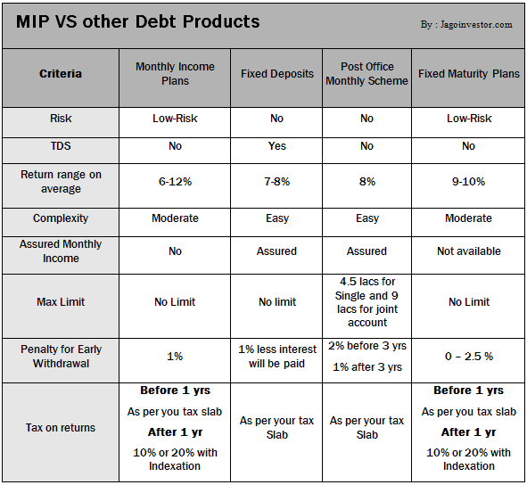

## Table of Contents

## What is a Monthly Income Plan (MIP)?

A Monthly Income Plan (MIP) is a type of investment plan that gives you money every month. It is popular among people who want a steady income, like retirees. MIPs usually invest in a mix of things like stocks, bonds, and real estate. This mix helps to balance the risk and make sure you get a regular income.

MIPs are good because they can give you a steady flow of money, which can help with monthly expenses. But, they also have some risks. The amount of money you get each month can change, and sometimes it might be less than you expect. It's important to understand these risks before you decide to invest in an MIP. Talking to a financial advisor can help you make a better decision.

## How does a Monthly Income Plan work?

A Monthly Income Plan (MIP) works by taking your money and investing it in different things like stocks, bonds, and real estate. The goal is to earn money from these investments and then give you some of that money every month. This way, you get a regular income without having to sell your investments. The mix of investments is important because it helps to spread out the risk, so if one investment does not do well, the others might make up for it.

The amount of money you get each month from an MIP can change. It depends on how well the investments are doing. Sometimes, you might get more money than you expected, and other times, you might get less. It's important to know that the income is not always the same. If you are thinking about investing in an MIP, it's a good idea to talk to a financial advisor. They can help you understand the risks and see if an MIP is right for you.

## What are the different types of investments available in Monthly Income Plans?

Monthly Income Plans (MIPs) usually invest in a mix of different things to help you get money every month. One common type of investment is bonds. Bonds are like loans you give to a company or the government, and they pay you back with interest over time. Another type of investment is stocks. Stocks are pieces of a company, and if the company does well, the value of the stocks can go up, and they might also give you dividends, which is a bit like getting a share of the company's profits.

MIPs can also invest in real estate. This means they might buy properties and rent them out, using the rent money to pay you every month. Some MIPs might also invest in other funds, like mutual funds or exchange-traded funds (ETFs), which are collections of different investments put together by professionals. By spreading the money across these different types of investments, MIPs try to balance the risk and make sure you get a steady income.

The exact mix of investments can change from one MIP to another. Some might focus more on bonds for a safer but lower return, while others might include more stocks or real estate for a chance at higher returns but with more risk. It's important to look at the details of each MIP to see what it invests in and how that fits with your own goals and how much risk you're okay with taking.

## What are the benefits of investing in a Monthly Income Plan?

One big benefit of investing in a Monthly Income Plan (MIP) is that it gives you a steady income every month. This can be really helpful if you need money regularly, like if you're retired and living off your savings. Instead of having to sell your investments to get cash, an MIP sends you money automatically. This makes it easier to plan your budget because you know how much money you'll get each month.

Another benefit is that MIPs usually invest in a mix of things like stocks, bonds, and real estate. This mix helps to spread out the risk. If one type of investment doesn't do well, the others might make up for it. This can make your investment safer overall. Plus, by investing in different things, you might have a chance to earn more money over time, which can help your savings grow.

However, it's important to remember that the amount of money you get from an MIP can change. If the investments don't do well, you might get less money than you expected. So, it's a good idea to talk to a financial advisor to see if an MIP is right for you and to understand the risks involved.

## What are the risks associated with Monthly Income Plans?

One risk with Monthly Income Plans (MIPs) is that the amount of money you get each month can change. If the investments don't do well, you might get less money than you expected. This can be a problem if you're counting on that money to pay your bills. It's not like a regular job where you know exactly how much you'll get paid every month.

Another risk is that MIPs invest in different things like stocks, bonds, and real estate. If the stock market goes down or if the real estate market has problems, it can affect your income. Even though MIPs try to spread out the risk by investing in different things, there's still a chance that all of them could go down at the same time. This means your investment could lose value, and you might not get as much money as you hoped.

It's also important to know that MIPs can have fees. These fees can eat into the money you get each month. If the fees are high, it can make the income you get from the MIP less than you thought it would be. So, it's a good idea to look at the fees and understand how they might affect your income before you decide to invest in an MIP.

## How is the income from Monthly Income Plans taxed?

The income you get from Monthly Income Plans (MIPs) can be taxed in different ways. If the MIP gives you dividends from stocks, those dividends are usually taxed as income. This means you'll have to pay tax on that money, and the tax rate depends on how much money you make in a year. If the MIP invests in bonds, the interest you get from those bonds is also taxed as income. So, you'll need to report that money on your taxes too.

Sometimes, MIPs invest in real estate and give you rental income. That rental income is taxed as well, but it might be taxed differently depending on where you live. You might be able to take some deductions for things like property taxes or maintenance costs, which can lower the amount of tax you have to pay. It's a good idea to talk to a tax advisor to understand exactly how your MIP income will be taxed and to make sure you're doing everything right on your tax return.

## What are the tax implications of capital gains in Monthly Income Plans?

When you invest in a Monthly Income Plan (MIP), you might make money not just from the monthly payments but also from selling the investments at a higher price than you bought them. This profit is called a capital gain. If you hold onto the investment for more than a year before selling it, the capital gain is usually taxed at a lower rate than if you sell it within a year. This is called a long-term capital gain. If you sell it within a year, it's a short-term capital gain, and it's taxed as regular income, which can be higher.

It's important to keep track of when you buy and sell investments in your MIP because it affects how much tax you'll have to pay. If your MIP sells investments and makes a profit, you might get some of that money as part of your monthly income. This part of your income could be taxed as a capital gain. Talking to a tax advisor can help you understand how these capital gains will affect your taxes and how you can plan to pay less tax on them.

## Can Monthly Income Plans be used for retirement planning?

Monthly Income Plans can be a good choice for retirement planning because they give you a steady income every month. This can be really helpful when you're retired and need money to pay for your everyday expenses. Instead of having to sell your investments to get cash, an MIP sends you money automatically. This makes it easier to plan your budget because you know how much money you'll get each month.

However, it's important to know that the amount of money you get from an MIP can change. If the investments don't do well, you might get less money than you expected. This can be a problem if you're counting on that money to live on. So, it's a good idea to talk to a financial advisor to see if an MIP is right for you and to understand the risks involved. They can help you make sure that an MIP fits well with your overall retirement plan.

## How do Monthly Income Plans compare to other income-generating investments?

Monthly Income Plans (MIPs) are one way to get money every month, but there are other investments that do this too. For example, dividend stocks are shares of companies that pay you part of their profits regularly. These dividends can be a good source of income, but they might not be as steady as an MIP because the amount can change a lot. Another option is bond funds, which invest in bonds and pay you interest. Bond funds can be safer than MIPs because they focus more on bonds, but the income might be lower.

Annuities are another type of investment that can give you money every month. An annuity is like a contract with an insurance company where you pay them money now, and they promise to pay you back over time. Annuities can be very steady because they guarantee a certain amount of income, but they might not grow as much as an MIP over time. Real estate investment trusts (REITs) are also popular for income. They invest in properties and pay out most of their income as dividends. REITs can offer good income, but they can be riskier than MIPs because real estate markets can go up and down a lot.

Choosing between an MIP and other income-generating investments depends on what you need. If you want a mix of different investments and are okay with some risk, an MIP might be good for you. But if you want something safer, like bonds, or something with a guaranteed income, like an annuity, you might look at those instead. It's always a good idea to talk to a financial advisor to see what fits best with your goals and how much risk you're comfortable with.

## What should be considered when selecting a Monthly Income Plan?

When [picking](/wiki/asset-class-picking) a Monthly Income Plan, think about how much risk you're okay with. MIPs invest in a mix of things like stocks, bonds, and real estate. If you want something safer, look for an MIP that focuses more on bonds because they are less risky. But if you're okay with more risk and want a chance to earn more money, an MIP with more stocks might be better. Also, consider the fees. Some MIPs charge a lot of fees, which can make the money you get each month less than you thought. So, it's important to check the fees and see how they affect your income.

Another thing to think about is how much money you need every month. If you need a steady amount to pay your bills, make sure the MIP can give you that. But remember, the amount of money you get from an MIP can change, so it's good to have some extra savings just in case. Also, think about your taxes. The money you get from an MIP might be taxed as income or capital gains, so talk to a tax advisor to understand how it will affect your taxes. Choosing the right MIP takes some time, so it's a good idea to talk to a financial advisor to make sure it fits with your plans and how much risk you're okay with.

## How can one optimize the tax efficiency of Monthly Income Plans?

To make your Monthly Income Plan more tax-efficient, think about where you keep your investments. If you put your MIP in a tax-advantaged account like an IRA or a 401(k), you might pay less in taxes. In these accounts, the money you get from your MIP might not be taxed right away, or it might be taxed at a lower rate when you take it out later. Also, think about the types of investments in your MIP. If it has a lot of bonds, the interest you get is taxed as income. But if it has stocks, the dividends might be taxed at a lower rate. So, choosing an MIP with more stocks could help you pay less in taxes.

Another way to optimize the tax efficiency of your MIP is to keep track of your capital gains. If your MIP sells investments and makes a profit, that profit is taxed as a capital gain. If you hold onto the investment for more than a year before selling it, the tax rate is usually lower. So, if you can, try to keep your investments in the MIP for a longer time. Also, think about tax-loss harvesting. This means selling investments that have lost value to offset the gains from other investments. This can lower your overall tax bill. Talking to a tax advisor can help you understand all these strategies and make sure you're doing everything you can to pay less in taxes.

## What advanced strategies can be employed to maximize returns from Monthly Income Plans?

To get the most out of your Monthly Income Plan, you can use a strategy called asset allocation. This means picking the right mix of investments like stocks, bonds, and real estate. If you want more money, you might choose an MIP with more stocks because they can grow a lot over time. But if you want something safer, you might pick one with more bonds. You can also change this mix over time. As you get closer to needing the money, you might switch to more bonds to keep your investment safer. This way, you can balance the risk and try to get more money.

Another strategy is to reinvest the money you get each month. Instead of spending it, you can put it back into the MIP or another investment. This can help your money grow faster because you're [earning](/wiki/earning-announcement) money on more money. Also, think about using a strategy called dollar-cost averaging. This means putting a little bit of money into your MIP regularly, no matter what the market is doing. Over time, this can help you buy more when prices are low and less when prices are high, which can make your investment grow better. Talking to a financial advisor can help you figure out the best way to use these strategies for your MIP.

## References & Further Reading

[1]: ["Dividend Yield"](https://www.investopedia.com/terms/d/dividendyield.asp) by Investopedia

[2]: ["What is a REIT"](https://www.investopedia.com/terms/r/reit.asp) by REIT.com

[3]: Bergstra, J., Bardenet, R., Bengio, Y., & Kégl, B. (2011). ["Algorithms for Hyper-Parameter Optimization."](https://proceedings.neurips.cc/paper/2011/file/86e8f7ab32cfd12577bc2619bc635690-Paper.pdf) Advances in Neural Information Processing Systems 24.

[4]: ["Advances in Financial Machine Learning"](https://www.amazon.com/Advances-Financial-Machine-Learning-Marcos/dp/1119482089) by Marcos Lopez de Prado

[5]: ["Evidence-Based Technical Analysis: Applying the Scientific Method and Statistical Inference to Trading Signals"](https://onlinelibrary.wiley.com/doi/book/10.1002/9781118268315) by David Aronson

[6]: ["Machine Learning for Algorithmic Trading"](https://github.com/stefan-jansen/machine-learning-for-trading) by Stefan Jansen

[7]: ["Quantitative Trading: How to Build Your Own Algorithmic Trading Business"](https://www.amazon.com/Quantitative-Trading-Build-Algorithmic-Business/dp/1119800064) by Ernest P. Chan